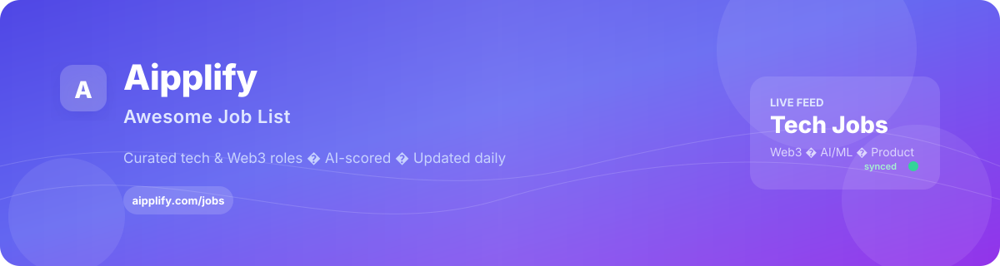

  

  
  
  
  

  <strong>Automatically curated</strong> from the <a href="https://aipplify.com/jobs">Aipplify job board</a>. 
  AI-scored roles across software, Web3, AI/ML, product, and more — synced from our aggregator. 
  Last updated: Tue, 23 Jun 2026 01:00:05 GMT

---

## Browse by category

| Category | Active roles |
| --- | ---: |
| 💻 [Software Engineering](#software-engineering) | **58** |
| ⛓️ [Web3 & Crypto](#web3-crypto) | **160** |
| 🤖 [AI & Machine Learning](#ai-machine-learning) | **62** |
| 📱 [Product & Project](#product-project) | **1** |
| 🔧 [DevOps & Security](#devops-security) | **1** |
| 💼 [Business & Marketing](#business-marketing) | **66** |
| 📋 [Other](#other) | **16** |

---

## Legend

| | |
| --- | --- |
| 🔒 | Inactive — older than 7 days or removed from the board |
| **Score** | Aipplify AI quality score (0–10) |
| **View →** | Open the role on [aipplify.com](https://aipplify.com/jobs) |

---

<h2 id="software-engineering">💻 Software Engineering</h2>

<a href="#top">↑ Back to top</a>

<table width="100%" cellpadding="0" cellspacing="0" style="border-collapse:collapse;border:1px solid #e2e8f0;border-radius:8px;overflow:hidden;">
<thead><tr>
<th style="padding:8px 10px;text-align:left;border-bottom:2px solid #e2e8f0;font-size:12px;color:#475569;background:#f8fafc;width:17%">Company</th><th style="padding:8px 10px;text-align:left;border-bottom:2px solid #e2e8f0;font-size:12px;color:#475569;background:#f8fafc;width:30%">Role</th><th style="padding:8px 10px;text-align:left;border-bottom:2px solid #e2e8f0;font-size:12px;color:#475569;background:#f8fafc;width:7%;text-align:center">Score</th><th style="padding:8px 10px;text-align:left;border-bottom:2px solid #e2e8f0;font-size:12px;color:#475569;background:#f8fafc;width:15%">Salary</th><th style="padding:8px 10px;text-align:left;border-bottom:2px solid #e2e8f0;font-size:12px;color:#475569;background:#f8fafc;width:17%">Location</th><th style="padding:8px 10px;text-align:left;border-bottom:2px solid #e2e8f0;font-size:12px;color:#475569;background:#f8fafc;width:7%;text-align:center">Age</th><th style="padding:8px 10px;text-align:left;border-bottom:2px solid #e2e8f0;font-size:12px;color:#475569;background:#f8fafc;width:7%;text-align:center">Link</th></tr></thead>
<tbody>
<tr><td style="padding:7px 10px;border-bottom:1px solid #eef2f7;font-size:12px;vertical-align:top;color:#0f172a;"><strong>Kalshi</strong></td><td style="padding:7px 10px;border-bottom:1px solid #eef2f7;font-size:12px;vertical-align:top;color:#0f172a;">Software Engineer, Frontend</td><td style="padding:7px 10px;border-bottom:1px solid #eef2f7;font-size:12px;vertical-align:top;color:#0f172a;text-align:center"><strong style="color:#059669">8.0</strong></td><td style="padding:7px 10px;border-bottom:1px solid #eef2f7;font-size:12px;vertical-align:top;color:#0f172a;">$150,000 – $220,000 USD</td><td style="padding:7px 10px;border-bottom:1px solid #eef2f7;font-size:12px;vertical-align:top;color:#0f172a;">

<strong>2 locations</strong>
Office / on-site OFFICE
</td><td style="padding:7px 10px;border-bottom:1px solid #eef2f7;font-size:12px;vertical-align:top;color:#0f172a;text-align:center">today</td><td style="padding:7px 10px;border-bottom:1px solid #eef2f7;font-size:12px;vertical-align:top;color:#0f172a;text-align:center"><a href="https://aipplify.com/jobs/software-engineer-frontend-at-kalshi" target="_blank" rel="noopener"><strong>View →</strong></a></td></tr>
<tr><td style="padding:7px 10px;border-bottom:1px solid #eef2f7;font-size:12px;vertical-align:top;color:#0f172a;"><strong>Mifort</strong></td><td style="padding:7px 10px;border-bottom:1px solid #eef2f7;font-size:12px;vertical-align:top;color:#0f172a;">Middle DevOps Engineer (AWS / GCP)</td><td style="padding:7px 10px;border-bottom:1px solid #eef2f7;font-size:12px;vertical-align:top;color:#0f172a;text-align:center"><strong style="color:#059669">8.0</strong></td><td style="padding:7px 10px;border-bottom:1px solid #eef2f7;font-size:12px;vertical-align:top;color:#0f172a;">$2,000 – $3,000 USD</td><td style="padding:7px 10px;border-bottom:1px solid #eef2f7;font-size:12px;vertical-align:top;color:#0f172a;">

<strong>2 locations</strong>
Remote REMOTE
</td><td style="padding:7px 10px;border-bottom:1px solid #eef2f7;font-size:12px;vertical-align:top;color:#0f172a;text-align:center">today</td><td style="padding:7px 10px;border-bottom:1px solid #eef2f7;font-size:12px;vertical-align:top;color:#0f172a;text-align:center"><a href="https://aipplify.com/jobs/middle-devops-engineer-aws-gcp-at-mifort" target="_blank" rel="noopener"><strong>View →</strong></a></td></tr>
<tr><td style="padding:7px 10px;border-bottom:1px solid #eef2f7;font-size:12px;vertical-align:top;color:#0f172a;"><strong>Gracia AI</strong></td><td style="padding:7px 10px;border-bottom:1px solid #eef2f7;font-size:12px;vertical-align:top;color:#0f172a;">Java Backend Developer (Middle+/Senior)</td><td style="padding:7px 10px;border-bottom:1px solid #eef2f7;font-size:12px;vertical-align:top;color:#0f172a;text-align:center"><strong style="color:#d97706">6.0</strong></td><td style="padding:7px 10px;border-bottom:1px solid #eef2f7;font-size:12px;vertical-align:top;color:#0f172a;">—</td><td style="padding:7px 10px;border-bottom:1px solid #eef2f7;font-size:12px;vertical-align:top;color:#0f172a;">

<strong>2 locations</strong>
Remote REMOTE
</td><td style="padding:7px 10px;border-bottom:1px solid #eef2f7;font-size:12px;vertical-align:top;color:#0f172a;text-align:center">today</td><td style="padding:7px 10px;border-bottom:1px solid #eef2f7;font-size:12px;vertical-align:top;color:#0f172a;text-align:center"><a href="https://aipplify.com/jobs/java-backend-developer-middle-senior-at-gracia-ai" target="_blank" rel="noopener"><strong>View →</strong></a></td></tr>
<tr><td style="padding:7px 10px;border-bottom:1px solid #eef2f7;font-size:12px;vertical-align:top;color:#0f172a;"><strong>Crytivo</strong></td><td style="padding:7px 10px;border-bottom:1px solid #eef2f7;font-size:12px;vertical-align:top;color:#0f172a;">Unity Environment Artist</td><td style="padding:7px 10px;border-bottom:1px solid #eef2f7;font-size:12px;vertical-align:top;color:#0f172a;text-align:center"><strong style="color:#d97706">6.0</strong></td><td style="padding:7px 10px;border-bottom:1px solid #eef2f7;font-size:12px;vertical-align:top;color:#0f172a;">—</td><td style="padding:7px 10px;border-bottom:1px solid #eef2f7;font-size:12px;vertical-align:top;color:#0f172a;">

<strong>2 locations</strong>
Remote REMOTE
</td><td style="padding:7px 10px;border-bottom:1px solid #eef2f7;font-size:12px;vertical-align:top;color:#0f172a;text-align:center">today</td><td style="padding:7px 10px;border-bottom:1px solid #eef2f7;font-size:12px;vertical-align:top;color:#0f172a;text-align:center"><a href="https://aipplify.com/jobs/unity-environment-artist-at-crytivo" target="_blank" rel="noopener"><strong>View →</strong></a></td></tr>
<tr><td style="padding:7px 10px;border-bottom:1px solid #eef2f7;font-size:12px;vertical-align:top;color:#0f172a;"><strong>Beeline</strong></td><td style="padding:7px 10px;border-bottom:1px solid #eef2f7;font-size:12px;vertical-align:top;color:#0f172a;">Senior Backend Developer</td><td style="padding:7px 10px;border-bottom:1px solid #eef2f7;font-size:12px;vertical-align:top;color:#0f172a;text-align:center"><strong style="color:#d97706">6.0</strong></td><td style="padding:7px 10px;border-bottom:1px solid #eef2f7;font-size:12px;vertical-align:top;color:#0f172a;">—</td><td style="padding:7px 10px;border-bottom:1px solid #eef2f7;font-size:12px;vertical-align:top;color:#0f172a;">

<strong>2 locations</strong>
Remote REMOTE
</td><td style="padding:7px 10px;border-bottom:1px solid #eef2f7;font-size:12px;vertical-align:top;color:#0f172a;text-align:center">today</td><td style="padding:7px 10px;border-bottom:1px solid #eef2f7;font-size:12px;vertical-align:top;color:#0f172a;text-align:center"><a href="https://aipplify.com/jobs/senior-backend-developer-at-beeline" target="_blank" rel="noopener"><strong>View →</strong></a></td></tr>
<tr><td style="padding:7px 10px;border-bottom:1px solid #eef2f7;font-size:12px;vertical-align:top;color:#0f172a;"><strong>Infomediji</strong></td><td style="padding:7px 10px;border-bottom:1px solid #eef2f7;font-size:12px;vertical-align:top;color:#0f172a;">Compositing Artist</td><td style="padding:7px 10px;border-bottom:1px solid #eef2f7;font-size:12px;vertical-align:top;color:#0f172a;text-align:center"><strong style="color:#059669">8.0</strong></td><td style="padding:7px 10px;border-bottom:1px solid #eef2f7;font-size:12px;vertical-align:top;color:#0f172a;">$74,750 – $120,750 USD</td><td style="padding:7px 10px;border-bottom:1px solid #eef2f7;font-size:12px;vertical-align:top;color:#0f172a;">

<strong>2 locations</strong>
Remote REMOTE
</td><td style="padding:7px 10px;border-bottom:1px solid #eef2f7;font-size:12px;vertical-align:top;color:#0f172a;text-align:center">today</td><td style="padding:7px 10px;border-bottom:1px solid #eef2f7;font-size:12px;vertical-align:top;color:#0f172a;text-align:center"><a href="https://aipplify.com/jobs/compositing-artist-at-infomediji" target="_blank" rel="noopener"><strong>View →</strong></a></td></tr>
<tr><td style="padding:7px 10px;border-bottom:1px solid #eef2f7;font-size:12px;vertical-align:top;color:#0f172a;"><strong>TradingView</strong></td><td style="padding:7px 10px;border-bottom:1px solid #eef2f7;font-size:12px;vertical-align:top;color:#0f172a;">Data Engineer</td><td style="padding:7px 10px;border-bottom:1px solid #eef2f7;font-size:12px;vertical-align:top;color:#0f172a;text-align:center"><strong style="color:#059669">8.0</strong></td><td style="padding:7px 10px;border-bottom:1px solid #eef2f7;font-size:12px;vertical-align:top;color:#0f172a;">$55,000 – $85,000 USD</td><td style="padding:7px 10px;border-bottom:1px solid #eef2f7;font-size:12px;vertical-align:top;color:#0f172a;">

<strong>2 locations</strong>
Remote REMOTE
</td><td style="padding:7px 10px;border-bottom:1px solid #eef2f7;font-size:12px;vertical-align:top;color:#0f172a;text-align:center">today</td><td style="padding:7px 10px;border-bottom:1px solid #eef2f7;font-size:12px;vertical-align:top;color:#0f172a;text-align:center"><a href="https://aipplify.com/jobs/data-engineer-at-tradingview" target="_blank" rel="noopener"><strong>View →</strong></a></td></tr>
<tr><td style="padding:7px 10px;border-bottom:1px solid #eef2f7;font-size:12px;vertical-align:top;color:#0f172a;"><strong>2GIS</strong></td><td style="padding:7px 10px;border-bottom:1px solid #eef2f7;font-size:12px;vertical-align:top;color:#0f172a;">1C Developer in ERP Team</td><td style="padding:7px 10px;border-bottom:1px solid #eef2f7;font-size:12px;vertical-align:top;color:#0f172a;text-align:center"><strong style="color:#d97706">6.0</strong></td><td style="padding:7px 10px;border-bottom:1px solid #eef2f7;font-size:12px;vertical-align:top;color:#0f172a;">—</td><td style="padding:7px 10px;border-bottom:1px solid #eef2f7;font-size:12px;vertical-align:top;color:#0f172a;">

<strong>2 locations</strong>
Remote REMOTE
</td><td style="padding:7px 10px;border-bottom:1px solid #eef2f7;font-size:12px;vertical-align:top;color:#0f172a;text-align:center">today</td><td style="padding:7px 10px;border-bottom:1px solid #eef2f7;font-size:12px;vertical-align:top;color:#0f172a;text-align:center"><a href="https://aipplify.com/jobs/1c-developer-erp-team-at-2gis" target="_blank" rel="noopener"><strong>View →</strong></a></td></tr>
<tr><td style="padding:7px 10px;border-bottom:1px solid #eef2f7;font-size:12px;vertical-align:top;color:#0f172a;"><strong>Ivi</strong></td><td style="padding:7px 10px;border-bottom:1px solid #eef2f7;font-size:12px;vertical-align:top;color:#0f172a;">Python Developer</td><td style="padding:7px 10px;border-bottom:1px solid #eef2f7;font-size:12px;vertical-align:top;color:#0f172a;text-align:center"><strong style="color:#059669">8.0</strong></td><td style="padding:7px 10px;border-bottom:1px solid #eef2f7;font-size:12px;vertical-align:top;color:#0f172a;">—</td><td style="padding:7px 10px;border-bottom:1px solid #eef2f7;font-size:12px;vertical-align:top;color:#0f172a;">

<strong>2 locations</strong>
Hybrid HYBRID
</td><td style="padding:7px 10px;border-bottom:1px solid #eef2f7;font-size:12px;vertical-align:top;color:#0f172a;text-align:center">today</td><td style="padding:7px 10px;border-bottom:1px solid #eef2f7;font-size:12px;vertical-align:top;color:#0f172a;text-align:center"><a href="https://aipplify.com/jobs/python-developer-at-ivi" target="_blank" rel="noopener"><strong>View →</strong></a></td></tr>
<tr><td style="padding:7px 10px;border-bottom:1px solid #eef2f7;font-size:12px;vertical-align:top;color:#0f172a;"><strong>Avito</strong></td><td style="padding:7px 10px;border-bottom:1px solid #eef2f7;font-size:12px;vertical-align:top;color:#0f172a;">Intern - Python Developer</td><td style="padding:7px 10px;border-bottom:1px solid #eef2f7;font-size:12px;vertical-align:top;color:#0f172a;text-align:center"><strong style="color:#d97706">6.0</strong></td><td style="padding:7px 10px;border-bottom:1px solid #eef2f7;font-size:12px;vertical-align:top;color:#0f172a;">—</td><td style="padding:7px 10px;border-bottom:1px solid #eef2f7;font-size:12px;vertical-align:top;color:#0f172a;">

<strong>2 locations</strong>
Remote REMOTE
</td><td style="padding:7px 10px;border-bottom:1px solid #eef2f7;font-size:12px;vertical-align:top;color:#0f172a;text-align:center">today</td><td style="padding:7px 10px;border-bottom:1px solid #eef2f7;font-size:12px;vertical-align:top;color:#0f172a;text-align:center"><a href="https://aipplify.com/jobs/intern-python-developer-at-avito" target="_blank" rel="noopener"><strong>View →</strong></a></td></tr>
<tr><td style="padding:7px 10px;border-bottom:1px solid #eef2f7;font-size:12px;vertical-align:top;color:#0f172a;"><strong>Bright Pattern Inc</strong></td><td style="padding:7px 10px;border-bottom:1px solid #eef2f7;font-size:12px;vertical-align:top;color:#0f172a;">Senior Golang Developer</td><td style="padding:7px 10px;border-bottom:1px solid #eef2f7;font-size:12px;vertical-align:top;color:#0f172a;text-align:center"><strong style="color:#d97706">6.0</strong></td><td style="padding:7px 10px;border-bottom:1px solid #eef2f7;font-size:12px;vertical-align:top;color:#0f172a;">—</td><td style="padding:7px 10px;border-bottom:1px solid #eef2f7;font-size:12px;vertical-align:top;color:#0f172a;">

<strong>2 locations</strong>
Remote REMOTE
</td><td style="padding:7px 10px;border-bottom:1px solid #eef2f7;font-size:12px;vertical-align:top;color:#0f172a;text-align:center">today</td><td style="padding:7px 10px;border-bottom:1px solid #eef2f7;font-size:12px;vertical-align:top;color:#0f172a;text-align:center"><a href="https://aipplify.com/jobs/senior-golang-developer-at-bright-pattern-inc" target="_blank" rel="noopener"><strong>View →</strong></a></td></tr>
<tr><td style="padding:7px 10px;border-bottom:1px solid #eef2f7;font-size:12px;vertical-align:top;color:#0f172a;"><strong>Okko</strong></td><td style="padding:7px 10px;border-bottom:1px solid #eef2f7;font-size:12px;vertical-align:top;color:#0f172a;">Product Analyst</td><td style="padding:7px 10px;border-bottom:1px solid #eef2f7;font-size:12px;vertical-align:top;color:#0f172a;text-align:center"><strong style="color:#d97706">6.0</strong></td><td style="padding:7px 10px;border-bottom:1px solid #eef2f7;font-size:12px;vertical-align:top;color:#0f172a;">—</td><td style="padding:7px 10px;border-bottom:1px solid #eef2f7;font-size:12px;vertical-align:top;color:#0f172a;">

<strong>2 locations</strong>
Remote REMOTE
</td><td style="padding:7px 10px;border-bottom:1px solid #eef2f7;font-size:12px;vertical-align:top;color:#0f172a;text-align:center">1d</td><td style="padding:7px 10px;border-bottom:1px solid #eef2f7;font-size:12px;vertical-align:top;color:#0f172a;text-align:center"><a href="https://aipplify.com/jobs/product-analyst-at-okko" target="_blank" rel="noopener"><strong>View →</strong></a></td></tr>
<tr><td style="padding:7px 10px;border-bottom:1px solid #eef2f7;font-size:12px;vertical-align:top;color:#0f172a;"><strong>Wildberries</strong></td><td style="padding:7px 10px;border-bottom:1px solid #eef2f7;font-size:12px;vertical-align:top;color:#0f172a;">Test Automation Engineer (API/Python)</td><td style="padding:7px 10px;border-bottom:1px solid #eef2f7;font-size:12px;vertical-align:top;color:#0f172a;text-align:center"><strong style="color:#d97706">6.0</strong></td><td style="padding:7px 10px;border-bottom:1px solid #eef2f7;font-size:12px;vertical-align:top;color:#0f172a;">—</td><td style="padding:7px 10px;border-bottom:1px solid #eef2f7;font-size:12px;vertical-align:top;color:#0f172a;">

<strong>2 locations</strong>
Remote REMOTE
</td><td style="padding:7px 10px;border-bottom:1px solid #eef2f7;font-size:12px;vertical-align:top;color:#0f172a;text-align:center">1d</td><td style="padding:7px 10px;border-bottom:1px solid #eef2f7;font-size:12px;vertical-align:top;color:#0f172a;text-align:center"><a href="https://aipplify.com/jobs/test-automation-engineer-api-python-at-wildberries" target="_blank" rel="noopener"><strong>View →</strong></a></td></tr>
<tr><td style="padding:7px 10px;border-bottom:1px solid #eef2f7;font-size:12px;vertical-align:top;color:#0f172a;"><strong>Yandex</strong></td><td style="padding:7px 10px;border-bottom:1px solid #eef2f7;font-size:12px;vertical-align:top;color:#0f172a;">C++ Developer in the Tablets Team</td><td style="padding:7px 10px;border-bottom:1px solid #eef2f7;font-size:12px;vertical-align:top;color:#0f172a;text-align:center"><strong style="color:#d97706">6.0</strong></td><td style="padding:7px 10px;border-bottom:1px solid #eef2f7;font-size:12px;vertical-align:top;color:#0f172a;">—</td><td style="padding:7px 10px;border-bottom:1px solid #eef2f7;font-size:12px;vertical-align:top;color:#0f172a;">

<strong>2 locations</strong>
Hybrid HYBRID
</td><td style="padding:7px 10px;border-bottom:1px solid #eef2f7;font-size:12px;vertical-align:top;color:#0f172a;text-align:center">1d</td><td style="padding:7px 10px;border-bottom:1px solid #eef2f7;font-size:12px;vertical-align:top;color:#0f172a;text-align:center"><a href="https://aipplify.com/jobs/c-developer-tablets-team-at-yandex" target="_blank" rel="noopener"><strong>View →</strong></a></td></tr>
<tr><td style="padding:7px 10px;border-bottom:1px solid #eef2f7;font-size:12px;vertical-align:top;color:#0f172a;"><strong>Beeline</strong></td><td style="padding:7px 10px;border-bottom:1px solid #eef2f7;font-size:12px;vertical-align:top;color:#0f172a;">Middle/Senior QA Engineer (Mobile)</td><td style="padding:7px 10px;border-bottom:1px solid #eef2f7;font-size:12px;vertical-align:top;color:#0f172a;text-align:center"><strong style="color:#d97706">6.0</strong></td><td style="padding:7px 10px;border-bottom:1px solid #eef2f7;font-size:12px;vertical-align:top;color:#0f172a;">—</td><td style="padding:7px 10px;border-bottom:1px solid #eef2f7;font-size:12px;vertical-align:top;color:#0f172a;">

<strong>2 locations</strong>
Remote REMOTE
</td><td style="padding:7px 10px;border-bottom:1px solid #eef2f7;font-size:12px;vertical-align:top;color:#0f172a;text-align:center">1d</td><td style="padding:7px 10px;border-bottom:1px solid #eef2f7;font-size:12px;vertical-align:top;color:#0f172a;text-align:center"><a href="https://aipplify.com/jobs/middle-senior-qa-engineer-mobile-at-beeline" target="_blank" rel="noopener"><strong>View →</strong></a></td></tr>
<tr><td style="padding:7px 10px;border-bottom:1px solid #eef2f7;font-size:12px;vertical-align:top;color:#0f172a;"><strong>Enfuce</strong></td><td style="padding:7px 10px;border-bottom:1px solid #eef2f7;font-size:12px;vertical-align:top;color:#0f172a;">Software Engineer</td><td style="padding:7px 10px;border-bottom:1px solid #eef2f7;font-size:12px;vertical-align:top;color:#0f172a;text-align:center"><strong style="color:#059669">9.0</strong></td><td style="padding:7px 10px;border-bottom:1px solid #eef2f7;font-size:12px;vertical-align:top;color:#0f172a;">$80,500 – $138,000 USD</td><td style="padding:7px 10px;border-bottom:1px solid #eef2f7;font-size:12px;vertical-align:top;color:#0f172a;">

<strong>2 locations</strong>
Remote REMOTE
</td><td style="padding:7px 10px;border-bottom:1px solid #eef2f7;font-size:12px;vertical-align:top;color:#0f172a;text-align:center">1d</td><td style="padding:7px 10px;border-bottom:1px solid #eef2f7;font-size:12px;vertical-align:top;color:#0f172a;text-align:center"><a href="https://aipplify.com/jobs/software-engineer-at-enfuce" target="_blank" rel="noopener"><strong>View →</strong></a></td></tr>
<tr><td style="padding:7px 10px;border-bottom:1px solid #eef2f7;font-size:12px;vertical-align:top;color:#0f172a;"><strong>Bending Spoons</strong></td><td style="padding:7px 10px;border-bottom:1px solid #eef2f7;font-size:12px;vertical-align:top;color:#0f172a;">IT Support Manager</td><td style="padding:7px 10px;border-bottom:1px solid #eef2f7;font-size:12px;vertical-align:top;color:#0f172a;text-align:center"><strong style="color:#d97706">7.0</strong></td><td style="padding:7px 10px;border-bottom:1px solid #eef2f7;font-size:12px;vertical-align:top;color:#0f172a;">$27,000 – $45,000 USD</td><td style="padding:7px 10px;border-bottom:1px solid #eef2f7;font-size:12px;vertical-align:top;color:#0f172a;">

<strong>2 locations</strong>
Remote REMOTE
</td><td style="padding:7px 10px;border-bottom:1px solid #eef2f7;font-size:12px;vertical-align:top;color:#0f172a;text-align:center">1d</td><td style="padding:7px 10px;border-bottom:1px solid #eef2f7;font-size:12px;vertical-align:top;color:#0f172a;text-align:center"><a href="https://aipplify.com/jobs/it-support-manager-at-bending-spoons" target="_blank" rel="noopener"><strong>View →</strong></a></td></tr>
<tr><td style="padding:7px 10px;border-bottom:1px solid #eef2f7;font-size:12px;vertical-align:top;color:#0f172a;"><strong>Golden Apple</strong></td><td style="padding:7px 10px;border-bottom:1px solid #eef2f7;font-size:12px;vertical-align:top;color:#0f172a;">1C Developer</td><td style="padding:7px 10px;border-bottom:1px solid #eef2f7;font-size:12px;vertical-align:top;color:#0f172a;text-align:center"><strong style="color:#d97706">6.0</strong></td><td style="padding:7px 10px;border-bottom:1px solid #eef2f7;font-size:12px;vertical-align:top;color:#0f172a;">—</td><td style="padding:7px 10px;border-bottom:1px solid #eef2f7;font-size:12px;vertical-align:top;color:#0f172a;">

<strong>2 locations</strong>
Remote REMOTE
</td><td style="padding:7px 10px;border-bottom:1px solid #eef2f7;font-size:12px;vertical-align:top;color:#0f172a;text-align:center">1d</td><td style="padding:7px 10px;border-bottom:1px solid #eef2f7;font-size:12px;vertical-align:top;color:#0f172a;text-align:center"><a href="https://aipplify.com/jobs/1c-developer-at-golden-apple" target="_blank" rel="noopener"><strong>View →</strong></a></td></tr>
<tr><td style="padding:7px 10px;border-bottom:1px solid #eef2f7;font-size:12px;vertical-align:top;color:#0f172a;"><strong>Yandex</strong></td><td style="padding:7px 10px;border-bottom:1px solid #eef2f7;font-size:12px;vertical-align:top;color:#0f172a;">DevOps Engineer</td><td style="padding:7px 10px;border-bottom:1px solid #eef2f7;font-size:12px;vertical-align:top;color:#0f172a;text-align:center"><strong style="color:#d97706">6.0</strong></td><td style="padding:7px 10px;border-bottom:1px solid #eef2f7;font-size:12px;vertical-align:top;color:#0f172a;">—</td><td style="padding:7px 10px;border-bottom:1px solid #eef2f7;font-size:12px;vertical-align:top;color:#0f172a;">

<strong>2 locations</strong>
Remote REMOTE
</td><td style="padding:7px 10px;border-bottom:1px solid #eef2f7;font-size:12px;vertical-align:top;color:#0f172a;text-align:center">2d</td><td style="padding:7px 10px;border-bottom:1px solid #eef2f7;font-size:12px;vertical-align:top;color:#0f172a;text-align:center"><a href="https://aipplify.com/jobs/devops-engineer-at-yandex-9053" target="_blank" rel="noopener"><strong>View →</strong></a></td></tr>
<tr><td style="padding:7px 10px;border-bottom:1px solid #eef2f7;font-size:12px;vertical-align:top;color:#0f172a;"><strong>Formlabs</strong></td><td style="padding:7px 10px;border-bottom:1px solid #eef2f7;font-size:12px;vertical-align:top;color:#0f172a;">Technical Sales Representative - Italian Speaking</td><td style="padding:7px 10px;border-bottom:1px solid #eef2f7;font-size:12px;vertical-align:top;color:#0f172a;text-align:center"><strong style="color:#d97706">7.0</strong></td><td style="padding:7px 10px;border-bottom:1px solid #eef2f7;font-size:12px;vertical-align:top;color:#0f172a;">$33,750 – $56,250 USD</td><td style="padding:7px 10px;border-bottom:1px solid #eef2f7;font-size:12px;vertical-align:top;color:#0f172a;">

<strong>2 locations</strong>
Remote REMOTE
</td><td style="padding:7px 10px;border-bottom:1px solid #eef2f7;font-size:12px;vertical-align:top;color:#0f172a;text-align:center">2d</td><td style="padding:7px 10px;border-bottom:1px solid #eef2f7;font-size:12px;vertical-align:top;color:#0f172a;text-align:center"><a href="https://aipplify.com/jobs/technical-sales-representative-italian-speaking-at-formlabs" target="_blank" rel="noopener"><strong>View →</strong></a></td></tr>
<tr><td style="padding:7px 10px;border-bottom:1px solid #eef2f7;font-size:12px;vertical-align:top;color:#0f172a;"><strong>Kolesa Group</strong></td><td style="padding:7px 10px;border-bottom:1px solid #eef2f7;font-size:12px;vertical-align:top;color:#0f172a;">Web QA (Manual + Automation)</td><td style="padding:7px 10px;border-bottom:1px solid #eef2f7;font-size:12px;vertical-align:top;color:#0f172a;text-align:center"><strong style="color:#059669">8.0</strong></td><td style="padding:7px 10px;border-bottom:1px solid #eef2f7;font-size:12px;vertical-align:top;color:#0f172a;">$9,000 – $15,000 USD</td><td style="padding:7px 10px;border-bottom:1px solid #eef2f7;font-size:12px;vertical-align:top;color:#0f172a;">

<strong>2 locations</strong>
Remote REMOTE
</td><td style="padding:7px 10px;border-bottom:1px solid #eef2f7;font-size:12px;vertical-align:top;color:#0f172a;text-align:center">2d</td><td style="padding:7px 10px;border-bottom:1px solid #eef2f7;font-size:12px;vertical-align:top;color:#0f172a;text-align:center"><a href="https://aipplify.com/jobs/web-qa-manual-automation-at-kolesa-group" target="_blank" rel="noopener"><strong>View →</strong></a></td></tr>
<tr><td style="padding:7px 10px;border-bottom:1px solid #eef2f7;font-size:12px;vertical-align:top;color:#0f172a;"><strong>Polymarket</strong></td><td style="padding:7px 10px;border-bottom:1px solid #eef2f7;font-size:12px;vertical-align:top;color:#0f172a;">Senior Backend Engineer, US Exchange</td><td style="padding:7px 10px;border-bottom:1px solid #eef2f7;font-size:12px;vertical-align:top;color:#0f172a;text-align:center"><strong style="color:#059669">8.0</strong></td><td style="padding:7px 10px;border-bottom:1px solid #eef2f7;font-size:12px;vertical-align:top;color:#0f172a;">—</td><td style="padding:7px 10px;border-bottom:1px solid #eef2f7;font-size:12px;vertical-align:top;color:#0f172a;">

<strong>2 locations</strong>
Office / on-site OFFICE
</td><td style="padding:7px 10px;border-bottom:1px solid #eef2f7;font-size:12px;vertical-align:top;color:#0f172a;text-align:center">3d</td><td style="padding:7px 10px;border-bottom:1px solid #eef2f7;font-size:12px;vertical-align:top;color:#0f172a;text-align:center"><a href="https://aipplify.com/jobs/senior-backend-engineer-us-exchange-at-polymarket" target="_blank" rel="noopener"><strong>View →</strong></a></td></tr>
<tr><td style="padding:7px 10px;border-bottom:1px solid #eef2f7;font-size:12px;vertical-align:top;color:#0f172a;"><strong>adjoe</strong></td><td style="padding:7px 10px;border-bottom:1px solid #eef2f7;font-size:12px;vertical-align:top;color:#0f172a;">(Senior) DevOps Engineer (f/m/d)</td><td style="padding:7px 10px;border-bottom:1px solid #eef2f7;font-size:12px;vertical-align:top;color:#0f172a;text-align:center"><strong style="color:#059669">9.0</strong></td><td style="padding:7px 10px;border-bottom:1px solid #eef2f7;font-size:12px;vertical-align:top;color:#0f172a;">$90,000 – $135,000 USD</td><td style="padding:7px 10px;border-bottom:1px solid #eef2f7;font-size:12px;vertical-align:top;color:#0f172a;">

<strong>2 locations</strong>
Remote REMOTE
</td><td style="padding:7px 10px;border-bottom:1px solid #eef2f7;font-size:12px;vertical-align:top;color:#0f172a;text-align:center">3d</td><td style="padding:7px 10px;border-bottom:1px solid #eef2f7;font-size:12px;vertical-align:top;color:#0f172a;text-align:center"><a href="https://aipplify.com/jobs/senior-devops-engineer-f-m-d-at-adjoe" target="_blank" rel="noopener"><strong>View →</strong></a></td></tr>
<tr><td style="padding:7px 10px;border-bottom:1px solid #eef2f7;font-size:12px;vertical-align:top;color:#0f172a;"><strong>TradingView</strong></td><td style="padding:7px 10px;border-bottom:1px solid #eef2f7;font-size:12px;vertical-align:top;color:#0f172a;">Senior DevOps Engineer</td><td style="padding:7px 10px;border-bottom:1px solid #eef2f7;font-size:12px;vertical-align:top;color:#0f172a;text-align:center"><strong style="color:#059669">8.0</strong></td><td style="padding:7px 10px;border-bottom:1px solid #eef2f7;font-size:12px;vertical-align:top;color:#0f172a;">$80,000 – $130,000 USD</td><td style="padding:7px 10px;border-bottom:1px solid #eef2f7;font-size:12px;vertical-align:top;color:#0f172a;">

<strong>2 locations</strong>
Remote REMOTE
</td><td style="padding:7px 10px;border-bottom:1px solid #eef2f7;font-size:12px;vertical-align:top;color:#0f172a;text-align:center">3d</td><td style="padding:7px 10px;border-bottom:1px solid #eef2f7;font-size:12px;vertical-align:top;color:#0f172a;text-align:center"><a href="https://aipplify.com/jobs/senior-devops-engineer-at-tradingview" target="_blank" rel="noopener"><strong>View →</strong></a></td></tr>
<tr><td style="padding:7px 10px;border-bottom:1px solid #eef2f7;font-size:12px;vertical-align:top;color:#0f172a;"><strong>Lightcore</strong></td><td style="padding:7px 10px;border-bottom:1px solid #eef2f7;font-size:12px;vertical-align:top;color:#0f172a;">QA Engineer</td><td style="padding:7px 10px;border-bottom:1px solid #eef2f7;font-size:12px;vertical-align:top;color:#0f172a;text-align:center"><strong style="color:#d97706">7.0</strong></td><td style="padding:7px 10px;border-bottom:1px solid #eef2f7;font-size:12px;vertical-align:top;color:#0f172a;">—</td><td style="padding:7px 10px;border-bottom:1px solid #eef2f7;font-size:12px;vertical-align:top;color:#0f172a;">

<strong>2 locations</strong>
Remote REMOTE
</td><td style="padding:7px 10px;border-bottom:1px solid #eef2f7;font-size:12px;vertical-align:top;color:#0f172a;text-align:center">3d</td><td style="padding:7px 10px;border-bottom:1px solid #eef2f7;font-size:12px;vertical-align:top;color:#0f172a;text-align:center"><a href="https://aipplify.com/jobs/qa-engineer-at-lightcore" target="_blank" rel="noopener"><strong>View →</strong></a></td></tr>
<tr><td style="padding:7px 10px;border-bottom:1px solid #eef2f7;font-size:12px;vertical-align:top;color:#0f172a;"><strong>Sber</strong></td><td style="padding:7px 10px;border-bottom:1px solid #eef2f7;font-size:12px;vertical-align:top;color:#0f172a;">Java Developer (Middle/Junior+)</td><td style="padding:7px 10px;border-bottom:1px solid #eef2f7;font-size:12px;vertical-align:top;color:#0f172a;text-align:center"><strong style="color:#d97706">6.0</strong></td><td style="padding:7px 10px;border-bottom:1px solid #eef2f7;font-size:12px;vertical-align:top;color:#0f172a;">—</td><td style="padding:7px 10px;border-bottom:1px solid #eef2f7;font-size:12px;vertical-align:top;color:#0f172a;">

<strong>2 locations</strong>
Office / on-site OFFICE
</td><td style="padding:7px 10px;border-bottom:1px solid #eef2f7;font-size:12px;vertical-align:top;color:#0f172a;text-align:center">3d</td><td style="padding:7px 10px;border-bottom:1px solid #eef2f7;font-size:12px;vertical-align:top;color:#0f172a;text-align:center"><a href="https://aipplify.com/jobs/java-developer-middle-junior-at-sber" target="_blank" rel="noopener"><strong>View →</strong></a></td></tr>
<tr><td style="padding:7px 10px;border-bottom:1px solid #eef2f7;font-size:12px;vertical-align:top;color:#0f172a;"><strong>Wildberries</strong></td><td style="padding:7px 10px;border-bottom:1px solid #eef2f7;font-size:12px;vertical-align:top;color:#0f172a;">Frontend Developer (Platform)</td><td style="padding:7px 10px;border-bottom:1px solid #eef2f7;font-size:12px;vertical-align:top;color:#0f172a;text-align:center"><strong style="color:#d97706">6.0</strong></td><td style="padding:7px 10px;border-bottom:1px solid #eef2f7;font-size:12px;vertical-align:top;color:#0f172a;">—</td><td style="padding:7px 10px;border-bottom:1px solid #eef2f7;font-size:12px;vertical-align:top;color:#0f172a;">

<strong>2 locations</strong>
Remote REMOTE
</td><td style="padding:7px 10px;border-bottom:1px solid #eef2f7;font-size:12px;vertical-align:top;color:#0f172a;text-align:center">3d</td><td style="padding:7px 10px;border-bottom:1px solid #eef2f7;font-size:12px;vertical-align:top;color:#0f172a;text-align:center"><a href="https://aipplify.com/jobs/frontend-developer-platform-at-wildberries" target="_blank" rel="noopener"><strong>View →</strong></a></td></tr>
<tr><td style="padding:7px 10px;border-bottom:1px solid #eef2f7;font-size:12px;vertical-align:top;color:#0f172a;"><strong>Bell Integrator</strong></td><td style="padding:7px 10px;border-bottom:1px solid #eef2f7;font-size:12px;vertical-align:top;color:#0f172a;">QA Engineer</td><td style="padding:7px 10px;border-bottom:1px solid #eef2f7;font-size:12px;vertical-align:top;color:#0f172a;text-align:center"><strong style="color:#d97706">7.0</strong></td><td style="padding:7px 10px;border-bottom:1px solid #eef2f7;font-size:12px;vertical-align:top;color:#0f172a;">—</td><td style="padding:7px 10px;border-bottom:1px solid #eef2f7;font-size:12px;vertical-align:top;color:#0f172a;">

<strong>2 locations</strong>
Remote REMOTE
</td><td style="padding:7px 10px;border-bottom:1px solid #eef2f7;font-size:12px;vertical-align:top;color:#0f172a;text-align:center">3d</td><td style="padding:7px 10px;border-bottom:1px solid #eef2f7;font-size:12px;vertical-align:top;color:#0f172a;text-align:center"><a href="https://aipplify.com/jobs/qa-engineer-at-bell-integrator-8966" target="_blank" rel="noopener"><strong>View →</strong></a></td></tr>
<tr><td style="padding:7px 10px;border-bottom:1px solid #eef2f7;font-size:12px;vertical-align:top;color:#0f172a;"><strong>VK</strong></td><td style="padding:7px 10px;border-bottom:1px solid #eef2f7;font-size:12px;vertical-align:top;color:#0f172a;">DevOps Engineer</td><td style="padding:7px 10px;border-bottom:1px solid #eef2f7;font-size:12px;vertical-align:top;color:#0f172a;text-align:center"><strong style="color:#d97706">6.0</strong></td><td style="padding:7px 10px;border-bottom:1px solid #eef2f7;font-size:12px;vertical-align:top;color:#0f172a;">—</td><td style="padding:7px 10px;border-bottom:1px solid #eef2f7;font-size:12px;vertical-align:top;color:#0f172a;">

<strong>2 locations</strong>
Remote REMOTE
</td><td style="padding:7px 10px;border-bottom:1px solid #eef2f7;font-size:12px;vertical-align:top;color:#0f172a;text-align:center">3d</td><td style="padding:7px 10px;border-bottom:1px solid #eef2f7;font-size:12px;vertical-align:top;color:#0f172a;text-align:center"><a href="https://aipplify.com/jobs/devops-engineer-at-vk" target="_blank" rel="noopener"><strong>View →</strong></a></td></tr>
<tr><td style="padding:7px 10px;border-bottom:1px solid #eef2f7;font-size:12px;vertical-align:top;color:#0f172a;"><strong>Золотое Яблоко</strong></td><td style="padding:7px 10px;border-bottom:1px solid #eef2f7;font-size:12px;vertical-align:top;color:#0f172a;">Python Developer (Digital Security)</td><td style="padding:7px 10px;border-bottom:1px solid #eef2f7;font-size:12px;vertical-align:top;color:#0f172a;text-align:center"><strong style="color:#d97706">6.0</strong></td><td style="padding:7px 10px;border-bottom:1px solid #eef2f7;font-size:12px;vertical-align:top;color:#0f172a;">—</td><td style="padding:7px 10px;border-bottom:1px solid #eef2f7;font-size:12px;vertical-align:top;color:#0f172a;">

<strong>2 locations</strong>
Office / on-site OFFICE
</td><td style="padding:7px 10px;border-bottom:1px solid #eef2f7;font-size:12px;vertical-align:top;color:#0f172a;text-align:center">3d</td><td style="padding:7px 10px;border-bottom:1px solid #eef2f7;font-size:12px;vertical-align:top;color:#0f172a;text-align:center"><a href="https://aipplify.com/jobs/python-developer-digital-security-at-zolotoe-yabloko" target="_blank" rel="noopener"><strong>View →</strong></a></td></tr>
<tr><td style="padding:7px 10px;border-bottom:1px solid #eef2f7;font-size:12px;vertical-align:top;color:#0f172a;"><strong>TrendTech</strong></td><td style="padding:7px 10px;border-bottom:1px solid #eef2f7;font-size:12px;vertical-align:top;color:#0f172a;">Product Manager</td><td style="padding:7px 10px;border-bottom:1px solid #eef2f7;font-size:12px;vertical-align:top;color:#0f172a;text-align:center"><strong style="color:#059669">8.0</strong></td><td style="padding:7px 10px;border-bottom:1px solid #eef2f7;font-size:12px;vertical-align:top;color:#0f172a;">$2,000 – $3,500 USD</td><td style="padding:7px 10px;border-bottom:1px solid #eef2f7;font-size:12px;vertical-align:top;color:#0f172a;">

<strong>2 locations</strong>
Remote REMOTE
</td><td style="padding:7px 10px;border-bottom:1px solid #eef2f7;font-size:12px;vertical-align:top;color:#0f172a;text-align:center">3d</td><td style="padding:7px 10px;border-bottom:1px solid #eef2f7;font-size:12px;vertical-align:top;color:#0f172a;text-align:center"><a href="https://aipplify.com/jobs/product-manager-at-trendtech" target="_blank" rel="noopener"><strong>View →</strong></a></td></tr>
<tr><td style="padding:7px 10px;border-bottom:1px solid #eef2f7;font-size:12px;vertical-align:top;color:#0f172a;"><strong>БЮРО 1440</strong></td><td style="padding:7px 10px;border-bottom:1px solid #eef2f7;font-size:12px;vertical-align:top;color:#0f172a;">Golang Developer</td><td style="padding:7px 10px;border-bottom:1px solid #eef2f7;font-size:12px;vertical-align:top;color:#0f172a;text-align:center"><strong style="color:#059669">8.0</strong></td><td style="padding:7px 10px;border-bottom:1px solid #eef2f7;font-size:12px;vertical-align:top;color:#0f172a;">—</td><td style="padding:7px 10px;border-bottom:1px solid #eef2f7;font-size:12px;vertical-align:top;color:#0f172a;">

<strong>2 locations</strong>
Hybrid HYBRID
</td><td style="padding:7px 10px;border-bottom:1px solid #eef2f7;font-size:12px;vertical-align:top;color:#0f172a;text-align:center">3d</td><td style="padding:7px 10px;border-bottom:1px solid #eef2f7;font-size:12px;vertical-align:top;color:#0f172a;text-align:center"><a href="https://aipplify.com/jobs/golang-developer-at-byuro-1440" target="_blank" rel="noopener"><strong>View →</strong></a></td></tr>
<tr><td style="padding:7px 10px;border-bottom:1px solid #eef2f7;font-size:12px;vertical-align:top;color:#0f172a;"><strong>Hut 8</strong></td><td style="padding:7px 10px;border-bottom:1px solid #eef2f7;font-size:12px;vertical-align:top;color:#0f172a;">Accounts Payable Analyst</td><td style="padding:7px 10px;border-bottom:1px solid #eef2f7;font-size:12px;vertical-align:top;color:#0f172a;text-align:center"><strong style="color:#d97706">6.0</strong></td><td style="padding:7px 10px;border-bottom:1px solid #eef2f7;font-size:12px;vertical-align:top;color:#0f172a;">—</td><td style="padding:7px 10px;border-bottom:1px solid #eef2f7;font-size:12px;vertical-align:top;color:#0f172a;">

<strong>2 locations</strong>
Office / on-site OFFICE
</td><td style="padding:7px 10px;border-bottom:1px solid #eef2f7;font-size:12px;vertical-align:top;color:#0f172a;text-align:center">4d</td><td style="padding:7px 10px;border-bottom:1px solid #eef2f7;font-size:12px;vertical-align:top;color:#0f172a;text-align:center"><a href="https://aipplify.com/jobs/accounts-payable-analyst-at-hut-8" target="_blank" rel="noopener"><strong>View →</strong></a></td></tr>
<tr><td style="padding:7px 10px;border-bottom:1px solid #eef2f7;font-size:12px;vertical-align:top;color:#0f172a;"><strong>DataArt</strong></td><td style="padding:7px 10px;border-bottom:1px solid #eef2f7;font-size:12px;vertical-align:top;color:#0f172a;">Senior Android Developer</td><td style="padding:7px 10px;border-bottom:1px solid #eef2f7;font-size:12px;vertical-align:top;color:#0f172a;text-align:center"><strong style="color:#059669">9.0</strong></td><td style="padding:7px 10px;border-bottom:1px solid #eef2f7;font-size:12px;vertical-align:top;color:#0f172a;">$80,000 – $130,000 USD</td><td style="padding:7px 10px;border-bottom:1px solid #eef2f7;font-size:12px;vertical-align:top;color:#0f172a;">

<strong>2 locations</strong>
Remote REMOTE
</td><td style="padding:7px 10px;border-bottom:1px solid #eef2f7;font-size:12px;vertical-align:top;color:#0f172a;text-align:center">4d</td><td style="padding:7px 10px;border-bottom:1px solid #eef2f7;font-size:12px;vertical-align:top;color:#0f172a;text-align:center"><a href="https://aipplify.com/jobs/senior-android-developer-at-dataart" target="_blank" rel="noopener"><strong>View →</strong></a></td></tr>
<tr><td style="padding:7px 10px;border-bottom:1px solid #eef2f7;font-size:12px;vertical-align:top;color:#0f172a;"><strong>Chess.com</strong></td><td style="padding:7px 10px;border-bottom:1px solid #eef2f7;font-size:12px;vertical-align:top;color:#0f172a;">Database Engineer</td><td style="padding:7px 10px;border-bottom:1px solid #eef2f7;font-size:12px;vertical-align:top;color:#0f172a;text-align:center"><strong style="color:#059669">9.0</strong></td><td style="padding:7px 10px;border-bottom:1px solid #eef2f7;font-size:12px;vertical-align:top;color:#0f172a;">$80,500 – $138,000 USD</td><td style="padding:7px 10px;border-bottom:1px solid #eef2f7;font-size:12px;vertical-align:top;color:#0f172a;">

<strong>2 locations</strong>
Remote REMOTE
</td><td style="padding:7px 10px;border-bottom:1px solid #eef2f7;font-size:12px;vertical-align:top;color:#0f172a;text-align:center">4d</td><td style="padding:7px 10px;border-bottom:1px solid #eef2f7;font-size:12px;vertical-align:top;color:#0f172a;text-align:center"><a href="https://aipplify.com/jobs/database-engineer-at-chess-com" target="_blank" rel="noopener"><strong>View →</strong></a></td></tr>
<tr><td style="padding:7px 10px;border-bottom:1px solid #eef2f7;font-size:12px;vertical-align:top;color:#0f172a;"><strong>Yandex</strong></td><td style="padding:7px 10px;border-bottom:1px solid #eef2f7;font-size:12px;vertical-align:top;color:#0f172a;">Data Engineer in Delivery</td><td style="padding:7px 10px;border-bottom:1px solid #eef2f7;font-size:12px;vertical-align:top;color:#0f172a;text-align:center"><strong style="color:#d97706">6.0</strong></td><td style="padding:7px 10px;border-bottom:1px solid #eef2f7;font-size:12px;vertical-align:top;color:#0f172a;">—</td><td style="padding:7px 10px;border-bottom:1px solid #eef2f7;font-size:12px;vertical-align:top;color:#0f172a;">

<strong>2 locations</strong>
Hybrid HYBRID
</td><td style="padding:7px 10px;border-bottom:1px solid #eef2f7;font-size:12px;vertical-align:top;color:#0f172a;text-align:center">4d</td><td style="padding:7px 10px;border-bottom:1px solid #eef2f7;font-size:12px;vertical-align:top;color:#0f172a;text-align:center"><a href="https://aipplify.com/jobs/data-engineer-delivery-at-yandex" target="_blank" rel="noopener"><strong>View →</strong></a></td></tr>
<tr><td style="padding:7px 10px;border-bottom:1px solid #eef2f7;font-size:12px;vertical-align:top;color:#0f172a;"><strong>AGIMA</strong></td><td style="padding:7px 10px;border-bottom:1px solid #eef2f7;font-size:12px;vertical-align:top;color:#0f172a;">QA Automation Engineer</td><td style="padding:7px 10px;border-bottom:1px solid #eef2f7;font-size:12px;vertical-align:top;color:#0f172a;text-align:center"><strong style="color:#d97706">6.0</strong></td><td style="padding:7px 10px;border-bottom:1px solid #eef2f7;font-size:12px;vertical-align:top;color:#0f172a;">—</td><td style="padding:7px 10px;border-bottom:1px solid #eef2f7;font-size:12px;vertical-align:top;color:#0f172a;">

<strong>2 locations</strong>
Hybrid HYBRID
</td><td style="padding:7px 10px;border-bottom:1px solid #eef2f7;font-size:12px;vertical-align:top;color:#0f172a;text-align:center">4d</td><td style="padding:7px 10px;border-bottom:1px solid #eef2f7;font-size:12px;vertical-align:top;color:#0f172a;text-align:center"><a href="https://aipplify.com/jobs/qa-automation-engineer-at-agima" target="_blank" rel="noopener"><strong>View →</strong></a></td></tr>
<tr><td style="padding:7px 10px;border-bottom:1px solid #eef2f7;font-size:12px;vertical-align:top;color:#0f172a;"><strong>Sber</strong></td><td style="padding:7px 10px;border-bottom:1px solid #eef2f7;font-size:12px;vertical-align:top;color:#0f172a;">DevOps/SRE (HOME Platform and OS)</td><td style="padding:7px 10px;border-bottom:1px solid #eef2f7;font-size:12px;vertical-align:top;color:#0f172a;text-align:center"><strong style="color:#d97706">6.0</strong></td><td style="padding:7px 10px;border-bottom:1px solid #eef2f7;font-size:12px;vertical-align:top;color:#0f172a;">—</td><td style="padding:7px 10px;border-bottom:1px solid #eef2f7;font-size:12px;vertical-align:top;color:#0f172a;">

<strong>2 locations</strong>
Office / on-site OFFICE
</td><td style="padding:7px 10px;border-bottom:1px solid #eef2f7;font-size:12px;vertical-align:top;color:#0f172a;text-align:center">4d</td><td style="padding:7px 10px;border-bottom:1px solid #eef2f7;font-size:12px;vertical-align:top;color:#0f172a;text-align:center"><a href="https://aipplify.com/jobs/devops-sre-home-platform-os-at-sber" target="_blank" rel="noopener"><strong>View →</strong></a></td></tr>
<tr><td style="padding:7px 10px;border-bottom:1px solid #eef2f7;font-size:12px;vertical-align:top;color:#0f172a;"><strong>VK</strong></td><td style="padding:7px 10px;border-bottom:1px solid #eef2f7;font-size:12px;vertical-align:top;color:#0f172a;">Python Developer for Social Projects</td><td style="padding:7px 10px;border-bottom:1px solid #eef2f7;font-size:12px;vertical-align:top;color:#0f172a;text-align:center"><strong style="color:#d97706">6.0</strong></td><td style="padding:7px 10px;border-bottom:1px solid #eef2f7;font-size:12px;vertical-align:top;color:#0f172a;">—</td><td style="padding:7px 10px;border-bottom:1px solid #eef2f7;font-size:12px;vertical-align:top;color:#0f172a;">

<strong>2 locations</strong>
Hybrid HYBRID
</td><td style="padding:7px 10px;border-bottom:1px solid #eef2f7;font-size:12px;vertical-align:top;color:#0f172a;text-align:center">4d</td><td style="padding:7px 10px;border-bottom:1px solid #eef2f7;font-size:12px;vertical-align:top;color:#0f172a;text-align:center"><a href="https://aipplify.com/jobs/python-developer-social-projects-at-vk" target="_blank" rel="noopener"><strong>View →</strong></a></td></tr>
<tr><td style="padding:7px 10px;border-bottom:1px solid #eef2f7;font-size:12px;vertical-align:top;color:#0f172a;"><strong>Web Design Sun</strong></td><td style="padding:7px 10px;border-bottom:1px solid #eef2f7;font-size:12px;vertical-align:top;color:#0f172a;">Flutter Developer</td><td style="padding:7px 10px;border-bottom:1px solid #eef2f7;font-size:12px;vertical-align:top;color:#0f172a;text-align:center"><strong style="color:#d97706">6.0</strong></td><td style="padding:7px 10px;border-bottom:1px solid #eef2f7;font-size:12px;vertical-align:top;color:#0f172a;">$1,200 – $1,600 USD</td><td style="padding:7px 10px;border-bottom:1px solid #eef2f7;font-size:12px;vertical-align:top;color:#0f172a;">

<strong>2 locations</strong>
Remote REMOTE
</td><td style="padding:7px 10px;border-bottom:1px solid #eef2f7;font-size:12px;vertical-align:top;color:#0f172a;text-align:center">4d</td><td style="padding:7px 10px;border-bottom:1px solid #eef2f7;font-size:12px;vertical-align:top;color:#0f172a;text-align:center"><a href="https://aipplify.com/jobs/flutter-developer-at-web-design-sun" target="_blank" rel="noopener"><strong>View →</strong></a></td></tr>
<tr><td style="padding:7px 10px;border-bottom:1px solid #eef2f7;font-size:12px;vertical-align:top;color:#0f172a;"><strong>Megapari</strong></td><td style="padding:7px 10px;border-bottom:1px solid #eef2f7;font-size:12px;vertical-align:top;color:#0f172a;">Expired Domains Specialist (SEO)</td><td style="padding:7px 10px;border-bottom:1px solid #eef2f7;font-size:12px;vertical-align:top;color:#0f172a;text-align:center"><strong style="color:#d97706">7.0</strong></td><td style="padding:7px 10px;border-bottom:1px solid #eef2f7;font-size:12px;vertical-align:top;color:#0f172a;">—</td><td style="padding:7px 10px;border-bottom:1px solid #eef2f7;font-size:12px;vertical-align:top;color:#0f172a;">

<strong>2 locations</strong>
Remote REMOTE
</td><td style="padding:7px 10px;border-bottom:1px solid #eef2f7;font-size:12px;vertical-align:top;color:#0f172a;text-align:center">4d</td><td style="padding:7px 10px;border-bottom:1px solid #eef2f7;font-size:12px;vertical-align:top;color:#0f172a;text-align:center"><a href="https://aipplify.com/jobs/expired-domains-specialist-seo-at-megapari" target="_blank" rel="noopener"><strong>View →</strong></a></td></tr>
<tr><td style="padding:7px 10px;border-bottom:1px solid #eef2f7;font-size:12px;vertical-align:top;color:#0f172a;"><strong>OldYachtStudio</strong></td><td style="padding:7px 10px;border-bottom:1px solid #eef2f7;font-size:12px;vertical-align:top;color:#0f172a;">UE Open World Level Designer</td><td style="padding:7px 10px;border-bottom:1px solid #eef2f7;font-size:12px;vertical-align:top;color:#0f172a;text-align:center"><strong style="color:#059669">8.0</strong></td><td style="padding:7px 10px;border-bottom:1px solid #eef2f7;font-size:12px;vertical-align:top;color:#0f172a;">$1,900 – $2,200 USD</td><td style="padding:7px 10px;border-bottom:1px solid #eef2f7;font-size:12px;vertical-align:top;color:#0f172a;">

<strong>2 locations</strong>
Remote REMOTE
</td><td style="padding:7px 10px;border-bottom:1px solid #eef2f7;font-size:12px;vertical-align:top;color:#0f172a;text-align:center">5d</td><td style="padding:7px 10px;border-bottom:1px solid #eef2f7;font-size:12px;vertical-align:top;color:#0f172a;text-align:center"><a href="https://aipplify.com/jobs/ue-open-world-level-designer-at-oldyachtstudio" target="_blank" rel="noopener"><strong>View →</strong></a></td></tr>
<tr><td style="padding:7px 10px;border-bottom:1px solid #eef2f7;font-size:12px;vertical-align:top;color:#0f172a;"><strong>Manychat</strong></td><td style="padding:7px 10px;border-bottom:1px solid #eef2f7;font-size:12px;vertical-align:top;color:#0f172a;">Cyber Security Lead</td><td style="padding:7px 10px;border-bottom:1px solid #eef2f7;font-size:12px;vertical-align:top;color:#0f172a;text-align:center"><strong style="color:#059669">9.0</strong></td><td style="padding:7px 10px;border-bottom:1px solid #eef2f7;font-size:12px;vertical-align:top;color:#0f172a;">$44,000 – $71,500 USD</td><td style="padding:7px 10px;border-bottom:1px solid #eef2f7;font-size:12px;vertical-align:top;color:#0f172a;">

<strong>2 locations</strong>
Remote REMOTE
</td><td style="padding:7px 10px;border-bottom:1px solid #eef2f7;font-size:12px;vertical-align:top;color:#0f172a;text-align:center">5d</td><td style="padding:7px 10px;border-bottom:1px solid #eef2f7;font-size:12px;vertical-align:top;color:#0f172a;text-align:center"><a href="https://aipplify.com/jobs/cyber-security-lead-at-manychat" target="_blank" rel="noopener"><strong>View →</strong></a></td></tr>
<tr><td style="padding:7px 10px;border-bottom:1px solid #eef2f7;font-size:12px;vertical-align:top;color:#0f172a;"><strong>Puzzle Point</strong></td><td style="padding:7px 10px;border-bottom:1px solid #eef2f7;font-size:12px;vertical-align:top;color:#0f172a;">Senior Unity Developer</td><td style="padding:7px 10px;border-bottom:1px solid #eef2f7;font-size:12px;vertical-align:top;color:#0f172a;text-align:center"><strong style="color:#059669">8.0</strong></td><td style="padding:7px 10px;border-bottom:1px solid #eef2f7;font-size:12px;vertical-align:top;color:#0f172a;">—</td><td style="padding:7px 10px;border-bottom:1px solid #eef2f7;font-size:12px;vertical-align:top;color:#0f172a;">

<strong>2 locations</strong>
Remote REMOTE
</td><td style="padding:7px 10px;border-bottom:1px solid #eef2f7;font-size:12px;vertical-align:top;color:#0f172a;text-align:center">5d</td><td style="padding:7px 10px;border-bottom:1px solid #eef2f7;font-size:12px;vertical-align:top;color:#0f172a;text-align:center"><a href="https://aipplify.com/jobs/senior-unity-developer-at-puzzle-point" target="_blank" rel="noopener"><strong>View →</strong></a></td></tr>
<tr><td style="padding:7px 10px;border-bottom:1px solid #eef2f7;font-size:12px;vertical-align:top;color:#0f172a;"><strong>deeplay</strong></td><td style="padding:7px 10px;border-bottom:1px solid #eef2f7;font-size:12px;vertical-align:top;color:#0f172a;">Data Engineer</td><td style="padding:7px 10px;border-bottom:1px solid #eef2f7;font-size:12px;vertical-align:top;color:#0f172a;text-align:center"><strong style="color:#d97706">6.0</strong></td><td style="padding:7px 10px;border-bottom:1px solid #eef2f7;font-size:12px;vertical-align:top;color:#0f172a;">—</td><td style="padding:7px 10px;border-bottom:1px solid #eef2f7;font-size:12px;vertical-align:top;color:#0f172a;">

<strong>2 locations</strong>
Remote REMOTE
</td><td style="padding:7px 10px;border-bottom:1px solid #eef2f7;font-size:12px;vertical-align:top;color:#0f172a;text-align:center">5d</td><td style="padding:7px 10px;border-bottom:1px solid #eef2f7;font-size:12px;vertical-align:top;color:#0f172a;text-align:center"><a href="https://aipplify.com/jobs/data-engineer-at-deeplay-8747" target="_blank" rel="noopener"><strong>View →</strong></a></td></tr>
<tr><td style="padding:7px 10px;border-bottom:1px solid #eef2f7;font-size:12px;vertical-align:top;color:#0f172a;"><strong>Sber</strong></td><td style="padding:7px 10px;border-bottom:1px solid #eef2f7;font-size:12px;vertical-align:top;color:#0f172a;">Golang Developer</td><td style="padding:7px 10px;border-bottom:1px solid #eef2f7;font-size:12px;vertical-align:top;color:#0f172a;text-align:center"><strong style="color:#d97706">6.0</strong></td><td style="padding:7px 10px;border-bottom:1px solid #eef2f7;font-size:12px;vertical-align:top;color:#0f172a;">—</td><td style="padding:7px 10px;border-bottom:1px solid #eef2f7;font-size:12px;vertical-align:top;color:#0f172a;">

<strong>2 locations</strong>
Hybrid HYBRID
</td><td style="padding:7px 10px;border-bottom:1px solid #eef2f7;font-size:12px;vertical-align:top;color:#0f172a;text-align:center">5d</td><td style="padding:7px 10px;border-bottom:1px solid #eef2f7;font-size:12px;vertical-align:top;color:#0f172a;text-align:center"><a href="https://aipplify.com/jobs/golang-developer-at-sber" target="_blank" rel="noopener"><strong>View →</strong></a></td></tr>
<tr><td style="padding:7px 10px;border-bottom:1px solid #eef2f7;font-size:12px;vertical-align:top;color:#0f172a;"><strong>Actimind</strong></td><td style="padding:7px 10px;border-bottom:1px solid #eef2f7;font-size:12px;vertical-align:top;color:#0f172a;">QA Engineer</td><td style="padding:7px 10px;border-bottom:1px solid #eef2f7;font-size:12px;vertical-align:top;color:#0f172a;text-align:center"><strong style="color:#059669">8.0</strong></td><td style="padding:7px 10px;border-bottom:1px solid #eef2f7;font-size:12px;vertical-align:top;color:#0f172a;">From $2,200 USD</td><td style="padding:7px 10px;border-bottom:1px solid #eef2f7;font-size:12px;vertical-align:top;color:#0f172a;">

<strong>2 locations</strong>
Remote REMOTE
</td><td style="padding:7px 10px;border-bottom:1px solid #eef2f7;font-size:12px;vertical-align:top;color:#0f172a;text-align:center">5d</td><td style="padding:7px 10px;border-bottom:1px solid #eef2f7;font-size:12px;vertical-align:top;color:#0f172a;text-align:center"><a href="https://aipplify.com/jobs/qa-engineer-at-actimind" target="_blank" rel="noopener"><strong>View →</strong></a></td></tr>
<tr><td style="padding:7px 10px;border-bottom:1px solid #eef2f7;font-size:12px;vertical-align:top;color:#0f172a;"><strong>Лига Цифровой Экономики</strong></td><td style="padding:7px 10px;border-bottom:1px solid #eef2f7;font-size:12px;vertical-align:top;color:#0f172a;">Senior Java Developer (Integration)</td><td style="padding:7px 10px;border-bottom:1px solid #eef2f7;font-size:12px;vertical-align:top;color:#0f172a;text-align:center"><strong style="color:#d97706">6.0</strong></td><td style="padding:7px 10px;border-bottom:1px solid #eef2f7;font-size:12px;vertical-align:top;color:#0f172a;">—</td><td style="padding:7px 10px;border-bottom:1px solid #eef2f7;font-size:12px;vertical-align:top;color:#0f172a;">

<strong>2 locations</strong>
Hybrid HYBRID
</td><td style="padding:7px 10px;border-bottom:1px solid #eef2f7;font-size:12px;vertical-align:top;color:#0f172a;text-align:center">5d</td><td style="padding:7px 10px;border-bottom:1px solid #eef2f7;font-size:12px;vertical-align:top;color:#0f172a;text-align:center"><a href="https://aipplify.com/jobs/senior-java-developer-integration-at-liga-tsifrovoy-ekonomiki" target="_blank" rel="noopener"><strong>View →</strong></a></td></tr>
<tr><td style="padding:7px 10px;border-bottom:1px solid #eef2f7;font-size:12px;vertical-align:top;color:#0f172a;"><strong>Sportmenu</strong></td><td style="padding:7px 10px;border-bottom:1px solid #eef2f7;font-size:12px;vertical-align:top;color:#0f172a;">PHP Yii2 Developer</td><td style="padding:7px 10px;border-bottom:1px solid #eef2f7;font-size:12px;vertical-align:top;color:#0f172a;text-align:center"><strong style="color:#059669">8.0</strong></td><td style="padding:7px 10px;border-bottom:1px solid #eef2f7;font-size:12px;vertical-align:top;color:#0f172a;">$2,000 – $2,880 USD</td><td style="padding:7px 10px;border-bottom:1px solid #eef2f7;font-size:12px;vertical-align:top;color:#0f172a;">

<strong>2 locations</strong>
Remote REMOTE
</td><td style="padding:7px 10px;border-bottom:1px solid #eef2f7;font-size:12px;vertical-align:top;color:#0f172a;text-align:center">5d</td><td style="padding:7px 10px;border-bottom:1px solid #eef2f7;font-size:12px;vertical-align:top;color:#0f172a;text-align:center"><a href="https://aipplify.com/jobs/php-yii2-developer-at-sportmenu" target="_blank" rel="noopener"><strong>View →</strong></a></td></tr>
<tr><td style="padding:7px 10px;border-bottom:1px solid #eef2f7;font-size:12px;vertical-align:top;color:#0f172a;"><strong>Yandex</strong></td><td style="padding:7px 10px;border-bottom:1px solid #eef2f7;font-size:12px;vertical-align:top;color:#0f172a;">Project Manager (Intern) at BareMetal</td><td style="padding:7px 10px;border-bottom:1px solid #eef2f7;font-size:12px;vertical-align:top;color:#0f172a;text-align:center"><strong style="color:#d97706">6.0</strong></td><td style="padding:7px 10px;border-bottom:1px solid #eef2f7;font-size:12px;vertical-align:top;color:#0f172a;">—</td><td style="padding:7px 10px;border-bottom:1px solid #eef2f7;font-size:12px;vertical-align:top;color:#0f172a;">

<strong>2 locations</strong>
Hybrid HYBRID
</td><td style="padding:7px 10px;border-bottom:1px solid #eef2f7;font-size:12px;vertical-align:top;color:#0f172a;text-align:center">5d</td><td style="padding:7px 10px;border-bottom:1px solid #eef2f7;font-size:12px;vertical-align:top;color:#0f172a;text-align:center"><a href="https://aipplify.com/jobs/project-manager-intern-at-baremetal-at-yandex" target="_blank" rel="noopener"><strong>View →</strong></a></td></tr>
<tr><td style="padding:7px 10px;border-bottom:1px solid #eef2f7;font-size:12px;vertical-align:top;color:#0f172a;"><strong>Akuna Capital</strong></td><td style="padding:7px 10px;border-bottom:1px solid #eef2f7;font-size:12px;vertical-align:top;color:#0f172a;">Platform Engineer</td><td style="padding:7px 10px;border-bottom:1px solid #eef2f7;font-size:12px;vertical-align:top;color:#0f172a;text-align:center"><strong style="color:#059669">8.0</strong></td><td style="padding:7px 10px;border-bottom:1px solid #eef2f7;font-size:12px;vertical-align:top;color:#0f172a;">$145,000 – $145,000 USD</td><td style="padding:7px 10px;border-bottom:1px solid #eef2f7;font-size:12px;vertical-align:top;color:#0f172a;">

<strong>2 locations</strong>
Office / on-site OFFICE
</td><td style="padding:7px 10px;border-bottom:1px solid #eef2f7;font-size:12px;vertical-align:top;color:#0f172a;text-align:center">6d</td><td style="padding:7px 10px;border-bottom:1px solid #eef2f7;font-size:12px;vertical-align:top;color:#0f172a;text-align:center"><a href="https://aipplify.com/jobs/platform-engineer-at-akuna-capital" target="_blank" rel="noopener"><strong>View →</strong></a></td></tr>
<tr><td style="padding:7px 10px;border-bottom:1px solid #eef2f7;font-size:12px;vertical-align:top;color:#0f172a;"><strong>MoonPay</strong></td><td style="padding:7px 10px;border-bottom:1px solid #eef2f7;font-size:12px;vertical-align:top;color:#0f172a;">Senior Infrastructure Engineer</td><td style="padding:7px 10px;border-bottom:1px solid #eef2f7;font-size:12px;vertical-align:top;color:#0f172a;text-align:center"><strong style="color:#059669">8.0</strong></td><td style="padding:7px 10px;border-bottom:1px solid #eef2f7;font-size:12px;vertical-align:top;color:#0f172a;">$170,000 – $220,000 USD</td><td style="padding:7px 10px;border-bottom:1px solid #eef2f7;font-size:12px;vertical-align:top;color:#0f172a;">

<strong>2 locations</strong>
Remote REMOTE
</td><td style="padding:7px 10px;border-bottom:1px solid #eef2f7;font-size:12px;vertical-align:top;color:#0f172a;text-align:center">6d</td><td style="padding:7px 10px;border-bottom:1px solid #eef2f7;font-size:12px;vertical-align:top;color:#0f172a;text-align:center"><a href="https://aipplify.com/jobs/senior-infrastructure-engineer-at-moonpay-8676" target="_blank" rel="noopener"><strong>View →</strong></a></td></tr>
<tr><td style="padding:7px 10px;border-bottom:1px solid #eef2f7;font-size:12px;vertical-align:top;color:#0f172a;"><strong>PlaysDev</strong></td><td style="padding:7px 10px;border-bottom:1px solid #eef2f7;font-size:12px;vertical-align:top;color:#0f172a;">Middle DevOps</td><td style="padding:7px 10px;border-bottom:1px solid #eef2f7;font-size:12px;vertical-align:top;color:#0f172a;text-align:center"><strong style="color:#d97706">6.0</strong></td><td style="padding:7px 10px;border-bottom:1px solid #eef2f7;font-size:12px;vertical-align:top;color:#0f172a;">—</td><td style="padding:7px 10px;border-bottom:1px solid #eef2f7;font-size:12px;vertical-align:top;color:#0f172a;">

<strong>2 locations</strong>
Remote REMOTE
</td><td style="padding:7px 10px;border-bottom:1px solid #eef2f7;font-size:12px;vertical-align:top;color:#0f172a;text-align:center">6d</td><td style="padding:7px 10px;border-bottom:1px solid #eef2f7;font-size:12px;vertical-align:top;color:#0f172a;text-align:center"><a href="https://aipplify.com/jobs/middle-devops-at-playsdev" target="_blank" rel="noopener"><strong>View →</strong></a></td></tr>
<tr><td style="padding:7px 10px;border-bottom:1px solid #eef2f7;font-size:12px;vertical-align:top;color:#0f172a;"><strong>Vivid</strong></td><td style="padding:7px 10px;border-bottom:1px solid #eef2f7;font-size:12px;vertical-align:top;color:#0f172a;">Senior DevOps</td><td style="padding:7px 10px;border-bottom:1px solid #eef2f7;font-size:12px;vertical-align:top;color:#0f172a;text-align:center"><strong style="color:#d97706">7.0</strong></td><td style="padding:7px 10px;border-bottom:1px solid #eef2f7;font-size:12px;vertical-align:top;color:#0f172a;">—</td><td style="padding:7px 10px;border-bottom:1px solid #eef2f7;font-size:12px;vertical-align:top;color:#0f172a;">

<strong>2 locations</strong>
Remote REMOTE
</td><td style="padding:7px 10px;border-bottom:1px solid #eef2f7;font-size:12px;vertical-align:top;color:#0f172a;text-align:center">6d</td><td style="padding:7px 10px;border-bottom:1px solid #eef2f7;font-size:12px;vertical-align:top;color:#0f172a;text-align:center"><a href="https://aipplify.com/jobs/senior-devops-at-vivid" target="_blank" rel="noopener"><strong>View →</strong></a></td></tr>
<tr><td style="padding:7px 10px;border-bottom:1px solid #eef2f7;font-size:12px;vertical-align:top;color:#0f172a;"><strong>СИНТОКС</strong></td><td style="padding:7px 10px;border-bottom:1px solid #eef2f7;font-size:12px;vertical-align:top;color:#0f172a;">DevOps (part-time)</td><td style="padding:7px 10px;border-bottom:1px solid #eef2f7;font-size:12px;vertical-align:top;color:#0f172a;text-align:center"><strong style="color:#059669">8.0</strong></td><td style="padding:7px 10px;border-bottom:1px solid #eef2f7;font-size:12px;vertical-align:top;color:#0f172a;">$0 – $0 USD</td><td style="padding:7px 10px;border-bottom:1px solid #eef2f7;font-size:12px;vertical-align:top;color:#0f172a;">

<strong>2 locations</strong>
Remote REMOTE
</td><td style="padding:7px 10px;border-bottom:1px solid #eef2f7;font-size:12px;vertical-align:top;color:#0f172a;text-align:center">6d</td><td style="padding:7px 10px;border-bottom:1px solid #eef2f7;font-size:12px;vertical-align:top;color:#0f172a;text-align:center"><a href="https://aipplify.com/jobs/devops-part-time-at-sintoks" target="_blank" rel="noopener"><strong>View →</strong></a></td></tr>
<tr><td style="padding:7px 10px;border-bottom:1px solid #eef2f7;font-size:12px;vertical-align:top;color:#0f172a;"><strong>ТТК Диджитал</strong></td><td style="padding:7px 10px;border-bottom:1px solid #eef2f7;font-size:12px;vertical-align:top;color:#0f172a;">Backend Developer PHP (Yii2)</td><td style="padding:7px 10px;border-bottom:1px solid #eef2f7;font-size:12px;vertical-align:top;color:#0f172a;text-align:center"><strong style="color:#059669">8.0</strong></td><td style="padding:7px 10px;border-bottom:1px solid #eef2f7;font-size:12px;vertical-align:top;color:#0f172a;">—</td><td style="padding:7px 10px;border-bottom:1px solid #eef2f7;font-size:12px;vertical-align:top;color:#0f172a;">

<strong>2 locations</strong>
Hybrid HYBRID
</td><td style="padding:7px 10px;border-bottom:1px solid #eef2f7;font-size:12px;vertical-align:top;color:#0f172a;text-align:center">6d</td><td style="padding:7px 10px;border-bottom:1px solid #eef2f7;font-size:12px;vertical-align:top;color:#0f172a;text-align:center"><a href="https://aipplify.com/jobs/backend-developer-php-yii2-at-ttk-didzhital" target="_blank" rel="noopener"><strong>View →</strong></a></td></tr>
<tr><td style="padding:7px 10px;border-bottom:1px solid #eef2f7;font-size:12px;vertical-align:top;color:#0f172a;"><strong>Bell Integrator</strong></td><td style="padding:7px 10px;border-bottom:1px solid #eef2f7;font-size:12px;vertical-align:top;color:#0f172a;">Java Developer</td><td style="padding:7px 10px;border-bottom:1px solid #eef2f7;font-size:12px;vertical-align:top;color:#0f172a;text-align:center"><strong style="color:#059669">8.0</strong></td><td style="padding:7px 10px;border-bottom:1px solid #eef2f7;font-size:12px;vertical-align:top;color:#0f172a;">—</td><td style="padding:7px 10px;border-bottom:1px solid #eef2f7;font-size:12px;vertical-align:top;color:#0f172a;">

<strong>2 locations</strong>
Remote REMOTE
</td><td style="padding:7px 10px;border-bottom:1px solid #eef2f7;font-size:12px;vertical-align:top;color:#0f172a;text-align:center">6d</td><td style="padding:7px 10px;border-bottom:1px solid #eef2f7;font-size:12px;vertical-align:top;color:#0f172a;text-align:center"><a href="https://aipplify.com/jobs/java-developer-at-bell-integrator" target="_blank" rel="noopener"><strong>View →</strong></a></td></tr>
<tr><td style="padding:7px 10px;border-bottom:1px solid #eef2f7;font-size:12px;vertical-align:top;color:#0f172a;"><strong>Reaktiv</strong></td><td style="padding:7px 10px;border-bottom:1px solid #eef2f7;font-size:12px;vertical-align:top;color:#0f172a;">PHP Developer</td><td style="padding:7px 10px;border-bottom:1px solid #eef2f7;font-size:12px;vertical-align:top;color:#0f172a;text-align:center"><strong style="color:#d97706">6.0</strong></td><td style="padding:7px 10px;border-bottom:1px solid #eef2f7;font-size:12px;vertical-align:top;color:#0f172a;">—</td><td style="padding:7px 10px;border-bottom:1px solid #eef2f7;font-size:12px;vertical-align:top;color:#0f172a;">

<strong>2 locations</strong>
Hybrid HYBRID
</td><td style="padding:7px 10px;border-bottom:1px solid #eef2f7;font-size:12px;vertical-align:top;color:#0f172a;text-align:center">6d</td><td style="padding:7px 10px;border-bottom:1px solid #eef2f7;font-size:12px;vertical-align:top;color:#0f172a;text-align:center"><a href="https://aipplify.com/jobs/php-developer-at-reaktiv" target="_blank" rel="noopener"><strong>View →</strong></a></td></tr>
</tbody></table>

<h2 id="web3-crypto">⛓️ Web3 & Crypto</h2>

<a href="#top">↑ Back to top</a>

<table width="100%" cellpadding="0" cellspacing="0" style="border-collapse:collapse;border:1px solid #e2e8f0;border-radius:8px;overflow:hidden;">
<thead><tr>
<th style="padding:8px 10px;text-align:left;border-bottom:2px solid #e2e8f0;font-size:12px;color:#475569;background:#f8fafc;width:17%">Company</th><th style="padding:8px 10px;text-align:left;border-bottom:2px solid #e2e8f0;font-size:12px;color:#475569;background:#f8fafc;width:30%">Role</th><th style="padding:8px 10px;text-align:left;border-bottom:2px solid #e2e8f0;font-size:12px;color:#475569;background:#f8fafc;width:7%;text-align:center">Score</th><th style="padding:8px 10px;text-align:left;border-bottom:2px solid #e2e8f0;font-size:12px;color:#475569;background:#f8fafc;width:15%">Salary</th><th style="padding:8px 10px;text-align:left;border-bottom:2px solid #e2e8f0;font-size:12px;color:#475569;background:#f8fafc;width:17%">Location</th><th style="padding:8px 10px;text-align:left;border-bottom:2px solid #e2e8f0;font-size:12px;color:#475569;background:#f8fafc;width:7%;text-align:center">Age</th><th style="padding:8px 10px;text-align:left;border-bottom:2px solid #e2e8f0;font-size:12px;color:#475569;background:#f8fafc;width:7%;text-align:center">Link</th></tr></thead>
<tbody>
<tr><td style="padding:7px 10px;border-bottom:1px solid #eef2f7;font-size:12px;vertical-align:top;color:#0f172a;"><strong>Bitpanda</strong></td><td style="padding:7px 10px;border-bottom:1px solid #eef2f7;font-size:12px;vertical-align:top;color:#0f172a;">Specialist, Financial Controlling &amp; ESG Reporting</td><td style="padding:7px 10px;border-bottom:1px solid #eef2f7;font-size:12px;vertical-align:top;color:#0f172a;text-align:center"><strong style="color:#d97706">7.0</strong></td><td style="padding:7px 10px;border-bottom:1px solid #eef2f7;font-size:12px;vertical-align:top;color:#0f172a;">—</td><td style="padding:7px 10px;border-bottom:1px solid #eef2f7;font-size:12px;vertical-align:top;color:#0f172a;">

<strong>2 locations</strong>
Remote REMOTE
</td><td style="padding:7px 10px;border-bottom:1px solid #eef2f7;font-size:12px;vertical-align:top;color:#0f172a;text-align:center">today</td><td style="padding:7px 10px;border-bottom:1px solid #eef2f7;font-size:12px;vertical-align:top;color:#0f172a;text-align:center"><a href="https://aipplify.com/jobs/specialist-financial-controlling-esg-reporting-at-bitpanda" target="_blank" rel="noopener"><strong>View →</strong></a></td></tr>
<tr><td style="padding:7px 10px;border-bottom:1px solid #eef2f7;font-size:12px;vertical-align:top;color:#0f172a;"><strong>Kraken</strong></td><td style="padding:7px 10px;border-bottom:1px solid #eef2f7;font-size:12px;vertical-align:top;color:#0f172a;">Backend Crypto Engineer - L1</td><td style="padding:7px 10px;border-bottom:1px solid #eef2f7;font-size:12px;vertical-align:top;color:#0f172a;text-align:center"><strong style="color:#d97706">6.0</strong></td><td style="padding:7px 10px;border-bottom:1px solid #eef2f7;font-size:12px;vertical-align:top;color:#0f172a;">—</td><td style="padding:7px 10px;border-bottom:1px solid #eef2f7;font-size:12px;vertical-align:top;color:#0f172a;">

<strong>2 locations</strong>
Remote REMOTE
</td><td style="padding:7px 10px;border-bottom:1px solid #eef2f7;font-size:12px;vertical-align:top;color:#0f172a;text-align:center">today</td><td style="padding:7px 10px;border-bottom:1px solid #eef2f7;font-size:12px;vertical-align:top;color:#0f172a;text-align:center"><a href="https://aipplify.com/jobs/backend-crypto-engineer-l1-at-kraken" target="_blank" rel="noopener"><strong>View →</strong></a></td></tr>
<tr><td style="padding:7px 10px;border-bottom:1px solid #eef2f7;font-size:12px;vertical-align:top;color:#0f172a;"><strong>Coinbase</strong></td><td style="padding:7px 10px;border-bottom:1px solid #eef2f7;font-size:12px;vertical-align:top;color:#0f172a;">Associate Manager, Billing Operations &amp; Strategy</td><td style="padding:7px 10px;border-bottom:1px solid #eef2f7;font-size:12px;vertical-align:top;color:#0f172a;text-align:center"><strong style="color:#059669">8.0</strong></td><td style="padding:7px 10px;border-bottom:1px solid #eef2f7;font-size:12px;vertical-align:top;color:#0f172a;">$130,900 – $154,000 USD</td><td style="padding:7px 10px;border-bottom:1px solid #eef2f7;font-size:12px;vertical-align:top;color:#0f172a;">

<strong>2 locations</strong>
Remote REMOTE
</td><td style="padding:7px 10px;border-bottom:1px solid #eef2f7;font-size:12px;vertical-align:top;color:#0f172a;text-align:center">today</td><td style="padding:7px 10px;border-bottom:1px solid #eef2f7;font-size:12px;vertical-align:top;color:#0f172a;text-align:center"><a href="https://aipplify.com/jobs/associate-manager-billing-operations-strategy-at-coinbase" target="_blank" rel="noopener"><strong>View →</strong></a></td></tr>
<tr><td style="padding:7px 10px;border-bottom:1px solid #eef2f7;font-size:12px;vertical-align:top;color:#0f172a;"><strong>PrimeXBT</strong></td><td style="padding:7px 10px;border-bottom:1px solid #eef2f7;font-size:12px;vertical-align:top;color:#0f172a;">Python Developer (CFD Product)</td><td style="padding:7px 10px;border-bottom:1px solid #eef2f7;font-size:12px;vertical-align:top;color:#0f172a;text-align:center"><strong style="color:#d97706">6.0</strong></td><td style="padding:7px 10px;border-bottom:1px solid #eef2f7;font-size:12px;vertical-align:top;color:#0f172a;">—</td><td style="padding:7px 10px;border-bottom:1px solid #eef2f7;font-size:12px;vertical-align:top;color:#0f172a;">

<strong>2 locations</strong>
Remote REMOTE
</td><td style="padding:7px 10px;border-bottom:1px solid #eef2f7;font-size:12px;vertical-align:top;color:#0f172a;text-align:center">today</td><td style="padding:7px 10px;border-bottom:1px solid #eef2f7;font-size:12px;vertical-align:top;color:#0f172a;text-align:center"><a href="https://aipplify.com/jobs/python-developer-cfd-product-at-primexbt" target="_blank" rel="noopener"><strong>View →</strong></a></td></tr>
<tr><td style="padding:7px 10px;border-bottom:1px solid #eef2f7;font-size:12px;vertical-align:top;color:#0f172a;"><strong>Polymarket</strong></td><td style="padding:7px 10px;border-bottom:1px solid #eef2f7;font-size:12px;vertical-align:top;color:#0f172a;">Integration Engineer</td><td style="padding:7px 10px;border-bottom:1px solid #eef2f7;font-size:12px;vertical-align:top;color:#0f172a;text-align:center"><strong style="color:#059669">8.0</strong></td><td style="padding:7px 10px;border-bottom:1px solid #eef2f7;font-size:12px;vertical-align:top;color:#0f172a;">—</td><td style="padding:7px 10px;border-bottom:1px solid #eef2f7;font-size:12px;vertical-align:top;color:#0f172a;">

<strong>2 locations</strong>
Office / on-site OFFICE
</td><td style="padding:7px 10px;border-bottom:1px solid #eef2f7;font-size:12px;vertical-align:top;color:#0f172a;text-align:center">today</td><td style="padding:7px 10px;border-bottom:1px solid #eef2f7;font-size:12px;vertical-align:top;color:#0f172a;text-align:center"><a href="https://aipplify.com/jobs/integration-engineer-at-polymarket" target="_blank" rel="noopener"><strong>View →</strong></a></td></tr>
<tr><td style="padding:7px 10px;border-bottom:1px solid #eef2f7;font-size:12px;vertical-align:top;color:#0f172a;"><strong>Bastion</strong></td><td style="padding:7px 10px;border-bottom:1px solid #eef2f7;font-size:12px;vertical-align:top;color:#0f172a;">Senior Software Engineer - Bastion</td><td style="padding:7px 10px;border-bottom:1px solid #eef2f7;font-size:12px;vertical-align:top;color:#0f172a;text-align:center"><strong style="color:#d97706">6.0</strong></td><td style="padding:7px 10px;border-bottom:1px solid #eef2f7;font-size:12px;vertical-align:top;color:#0f172a;">—</td><td style="padding:7px 10px;border-bottom:1px solid #eef2f7;font-size:12px;vertical-align:top;color:#0f172a;">

<strong>2 locations</strong>
Remote REMOTE
</td><td style="padding:7px 10px;border-bottom:1px solid #eef2f7;font-size:12px;vertical-align:top;color:#0f172a;text-align:center">today</td><td style="padding:7px 10px;border-bottom:1px solid #eef2f7;font-size:12px;vertical-align:top;color:#0f172a;text-align:center"><a href="https://aipplify.com/jobs/senior-software-engineer-bastion-at-bastion" target="_blank" rel="noopener"><strong>View →</strong></a></td></tr>
<tr><td style="padding:7px 10px;border-bottom:1px solid #eef2f7;font-size:12px;vertical-align:top;color:#0f172a;"><strong>B2C2</strong></td><td style="padding:7px 10px;border-bottom:1px solid #eef2f7;font-size:12px;vertical-align:top;color:#0f172a;">Quant Trader (Junior/Mid Level)</td><td style="padding:7px 10px;border-bottom:1px solid #eef2f7;font-size:12px;vertical-align:top;color:#0f172a;text-align:center"><strong style="color:#d97706">6.0</strong></td><td style="padding:7px 10px;border-bottom:1px solid #eef2f7;font-size:12px;vertical-align:top;color:#0f172a;">—</td><td style="padding:7px 10px;border-bottom:1px solid #eef2f7;font-size:12px;vertical-align:top;color:#0f172a;">

<strong>2 locations</strong>
Remote REMOTE
</td><td style="padding:7px 10px;border-bottom:1px solid #eef2f7;font-size:12px;vertical-align:top;color:#0f172a;text-align:center">today</td><td style="padding:7px 10px;border-bottom:1px solid #eef2f7;font-size:12px;vertical-align:top;color:#0f172a;text-align:center"><a href="https://aipplify.com/jobs/quant-trader-junior-mid-level-at-b2c2" target="_blank" rel="noopener"><strong>View →</strong></a></td></tr>
<tr><td style="padding:7px 10px;border-bottom:1px solid #eef2f7;font-size:12px;vertical-align:top;color:#0f172a;"><strong>Polymarket</strong></td><td style="padding:7px 10px;border-bottom:1px solid #eef2f7;font-size:12px;vertical-align:top;color:#0f172a;">Advanced Customer Product Engineer</td><td style="padding:7px 10px;border-bottom:1px solid #eef2f7;font-size:12px;vertical-align:top;color:#0f172a;text-align:center"><strong style="color:#d97706">7.0</strong></td><td style="padding:7px 10px;border-bottom:1px solid #eef2f7;font-size:12px;vertical-align:top;color:#0f172a;">—</td><td style="padding:7px 10px;border-bottom:1px solid #eef2f7;font-size:12px;vertical-align:top;color:#0f172a;">

<strong>2 locations</strong>
Office / on-site OFFICE
</td><td style="padding:7px 10px;border-bottom:1px solid #eef2f7;font-size:12px;vertical-align:top;color:#0f172a;text-align:center">today</td><td style="padding:7px 10px;border-bottom:1px solid #eef2f7;font-size:12px;vertical-align:top;color:#0f172a;text-align:center"><a href="https://aipplify.com/jobs/advanced-customer-product-engineer-at-polymarket" target="_blank" rel="noopener"><strong>View →</strong></a></td></tr>
<tr><td style="padding:7px 10px;border-bottom:1px solid #eef2f7;font-size:12px;vertical-align:top;color:#0f172a;"><strong>Okx</strong></td><td style="padding:7px 10px;border-bottom:1px solid #eef2f7;font-size:12px;vertical-align:top;color:#0f172a;">Software Engineer, Mobile, Web3</td><td style="padding:7px 10px;border-bottom:1px solid #eef2f7;font-size:12px;vertical-align:top;color:#0f172a;text-align:center"><strong style="color:#059669">8.0</strong></td><td style="padding:7px 10px;border-bottom:1px solid #eef2f7;font-size:12px;vertical-align:top;color:#0f172a;">$112,000 – $188,000 USD</td><td style="padding:7px 10px;border-bottom:1px solid #eef2f7;font-size:12px;vertical-align:top;color:#0f172a;">

<strong>2 locations</strong>
Office / on-site OFFICE
</td><td style="padding:7px 10px;border-bottom:1px solid #eef2f7;font-size:12px;vertical-align:top;color:#0f172a;text-align:center">today</td><td style="padding:7px 10px;border-bottom:1px solid #eef2f7;font-size:12px;vertical-align:top;color:#0f172a;text-align:center"><a href="https://aipplify.com/jobs/software-engineer-mobile-web3-at-okx" target="_blank" rel="noopener"><strong>View →</strong></a></td></tr>
<tr><td style="padding:7px 10px;border-bottom:1px solid #eef2f7;font-size:12px;vertical-align:top;color:#0f172a;"><strong>Incode</strong></td><td style="padding:7px 10px;border-bottom:1px solid #eef2f7;font-size:12px;vertical-align:top;color:#0f172a;">Senior Technical Account Manager</td><td style="padding:7px 10px;border-bottom:1px solid #eef2f7;font-size:12px;vertical-align:top;color:#0f172a;text-align:center"><strong style="color:#059669">8.0</strong></td><td style="padding:7px 10px;border-bottom:1px solid #eef2f7;font-size:12px;vertical-align:top;color:#0f172a;">$90,000 – $150,000 USD</td><td style="padding:7px 10px;border-bottom:1px solid #eef2f7;font-size:12px;vertical-align:top;color:#0f172a;">

<strong>2 locations</strong>
Remote REMOTE
</td><td style="padding:7px 10px;border-bottom:1px solid #eef2f7;font-size:12px;vertical-align:top;color:#0f172a;text-align:center">today</td><td style="padding:7px 10px;border-bottom:1px solid #eef2f7;font-size:12px;vertical-align:top;color:#0f172a;text-align:center"><a href="https://aipplify.com/jobs/senior-technical-account-manager-at-incode" target="_blank" rel="noopener"><strong>View →</strong></a></td></tr>
<tr><td style="padding:7px 10px;border-bottom:1px solid #eef2f7;font-size:12px;vertical-align:top;color:#0f172a;"><strong>Fireblocks</strong></td><td style="padding:7px 10px;border-bottom:1px solid #eef2f7;font-size:12px;vertical-align:top;color:#0f172a;">Software Engineer - Solana</td><td style="padding:7px 10px;border-bottom:1px solid #eef2f7;font-size:12px;vertical-align:top;color:#0f172a;text-align:center"><strong style="color:#059669">8.0</strong></td><td style="padding:7px 10px;border-bottom:1px solid #eef2f7;font-size:12px;vertical-align:top;color:#0f172a;">$98,000 – $162,000 USD</td><td style="padding:7px 10px;border-bottom:1px solid #eef2f7;font-size:12px;vertical-align:top;color:#0f172a;">

<strong>2 locations</strong>
Office / on-site OFFICE
</td><td style="padding:7px 10px;border-bottom:1px solid #eef2f7;font-size:12px;vertical-align:top;color:#0f172a;text-align:center">today</td><td style="padding:7px 10px;border-bottom:1px solid #eef2f7;font-size:12px;vertical-align:top;color:#0f172a;text-align:center"><a href="https://aipplify.com/jobs/software-engineer-solana-at-fireblocks-9203" target="_blank" rel="noopener"><strong>View →</strong></a></td></tr>
<tr><td style="padding:7px 10px;border-bottom:1px solid #eef2f7;font-size:12px;vertical-align:top;color:#0f172a;"><strong>Fireblocks</strong></td><td style="padding:7px 10px;border-bottom:1px solid #eef2f7;font-size:12px;vertical-align:top;color:#0f172a;">Sales Director, Payments</td><td style="padding:7px 10px;border-bottom:1px solid #eef2f7;font-size:12px;vertical-align:top;color:#0f172a;text-align:center"><strong style="color:#059669">8.0</strong></td><td style="padding:7px 10px;border-bottom:1px solid #eef2f7;font-size:12px;vertical-align:top;color:#0f172a;">$105,000 – $175,000 USD</td><td style="padding:7px 10px;border-bottom:1px solid #eef2f7;font-size:12px;vertical-align:top;color:#0f172a;">

<strong>2 locations</strong>
Office / on-site OFFICE
</td><td style="padding:7px 10px;border-bottom:1px solid #eef2f7;font-size:12px;vertical-align:top;color:#0f172a;text-align:center">today</td><td style="padding:7px 10px;border-bottom:1px solid #eef2f7;font-size:12px;vertical-align:top;color:#0f172a;text-align:center"><a href="https://aipplify.com/jobs/sales-director-payments-at-fireblocks" target="_blank" rel="noopener"><strong>View →</strong></a></td></tr>
<tr><td style="padding:7px 10px;border-bottom:1px solid #eef2f7;font-size:12px;vertical-align:top;color:#0f172a;"><strong>Fireblocks</strong></td><td style="padding:7px 10px;border-bottom:1px solid #eef2f7;font-size:12px;vertical-align:top;color:#0f172a;">Sales Director</td><td style="padding:7px 10px;border-bottom:1px solid #eef2f7;font-size:12px;vertical-align:top;color:#0f172a;text-align:center"><strong style="color:#059669">8.0</strong></td><td style="padding:7px 10px;border-bottom:1px solid #eef2f7;font-size:12px;vertical-align:top;color:#0f172a;">$105,000 – $175,000 USD</td><td style="padding:7px 10px;border-bottom:1px solid #eef2f7;font-size:12px;vertical-align:top;color:#0f172a;">

<strong>2 locations</strong>
Office / on-site OFFICE
</td><td style="padding:7px 10px;border-bottom:1px solid #eef2f7;font-size:12px;vertical-align:top;color:#0f172a;text-align:center">today</td><td style="padding:7px 10px;border-bottom:1px solid #eef2f7;font-size:12px;vertical-align:top;color:#0f172a;text-align:center"><a href="https://aipplify.com/jobs/sales-director-at-fireblocks-9201" target="_blank" rel="noopener"><strong>View →</strong></a></td></tr>
<tr><td style="padding:7px 10px;border-bottom:1px solid #eef2f7;font-size:12px;vertical-align:top;color:#0f172a;"><strong>Coinbase</strong></td><td style="padding:7px 10px;border-bottom:1px solid #eef2f7;font-size:12px;vertical-align:top;color:#0f172a;">Senior Executive Protection Agent</td><td style="padding:7px 10px;border-bottom:1px solid #eef2f7;font-size:12px;vertical-align:top;color:#0f172a;text-align:center"><strong style="color:#059669">8.0</strong></td><td style="padding:7px 10px;border-bottom:1px solid #eef2f7;font-size:12px;vertical-align:top;color:#0f172a;">$130,900 – $154,000 USD</td><td style="padding:7px 10px;border-bottom:1px solid #eef2f7;font-size:12px;vertical-align:top;color:#0f172a;">

<strong>2 locations</strong>
Remote REMOTE
</td><td style="padding:7px 10px;border-bottom:1px solid #eef2f7;font-size:12px;vertical-align:top;color:#0f172a;text-align:center">today</td><td style="padding:7px 10px;border-bottom:1px solid #eef2f7;font-size:12px;vertical-align:top;color:#0f172a;text-align:center"><a href="https://aipplify.com/jobs/senior-executive-protection-agent-at-coinbase-9200" target="_blank" rel="noopener"><strong>View →</strong></a></td></tr>
<tr><td style="padding:7px 10px;border-bottom:1px solid #eef2f7;font-size:12px;vertical-align:top;color:#0f172a;"><strong>Binance</strong></td><td style="padding:7px 10px;border-bottom:1px solid #eef2f7;font-size:12px;vertical-align:top;color:#0f172a;">Senior Software Development Engineer in Test (Automation, Python)</td><td style="padding:7px 10px;border-bottom:1px solid #eef2f7;font-size:12px;vertical-align:top;color:#0f172a;text-align:center"><strong style="color:#059669">8.0</strong></td><td style="padding:7px 10px;border-bottom:1px solid #eef2f7;font-size:12px;vertical-align:top;color:#0f172a;">$98,000 – $162,000 USD</td><td style="padding:7px 10px;border-bottom:1px solid #eef2f7;font-size:12px;vertical-align:top;color:#0f172a;">

<strong>2 locations</strong>
Remote REMOTE
</td><td style="padding:7px 10px;border-bottom:1px solid #eef2f7;font-size:12px;vertical-align:top;color:#0f172a;text-align:center">today</td><td style="padding:7px 10px;border-bottom:1px solid #eef2f7;font-size:12px;vertical-align:top;color:#0f172a;text-align:center"><a href="https://aipplify.com/jobs/senior-software-development-engineer-test-automation-at-binance" target="_blank" rel="noopener"><strong>View →</strong></a></td></tr>
<tr><td style="padding:7px 10px;border-bottom:1px solid #eef2f7;font-size:12px;vertical-align:top;color:#0f172a;"><strong>Reown</strong></td><td style="padding:7px 10px;border-bottom:1px solid #eef2f7;font-size:12px;vertical-align:top;color:#0f172a;">AI-Native Global SDR</td><td style="padding:7px 10px;border-bottom:1px solid #eef2f7;font-size:12px;vertical-align:top;color:#0f172a;text-align:center"><strong style="color:#d97706">7.0</strong></td><td style="padding:7px 10px;border-bottom:1px solid #eef2f7;font-size:12px;vertical-align:top;color:#0f172a;">—</td><td style="padding:7px 10px;border-bottom:1px solid #eef2f7;font-size:12px;vertical-align:top;color:#0f172a;">

<strong>2 locations</strong>
Remote REMOTE
</td><td style="padding:7px 10px;border-bottom:1px solid #eef2f7;font-size:12px;vertical-align:top;color:#0f172a;text-align:center">today</td><td style="padding:7px 10px;border-bottom:1px solid #eef2f7;font-size:12px;vertical-align:top;color:#0f172a;text-align:center"><a href="https://aipplify.com/jobs/ai-native-global-sdr-at-reown" target="_blank" rel="noopener"><strong>View →</strong></a></td></tr>
<tr><td style="padding:7px 10px;border-bottom:1px solid #eef2f7;font-size:12px;vertical-align:top;color:#0f172a;"><strong>Fireblocks</strong></td><td style="padding:7px 10px;border-bottom:1px solid #eef2f7;font-size:12px;vertical-align:top;color:#0f172a;">Software Engineer - Solana</td><td style="padding:7px 10px;border-bottom:1px solid #eef2f7;font-size:12px;vertical-align:top;color:#0f172a;text-align:center"><strong style="color:#059669">8.0</strong></td><td style="padding:7px 10px;border-bottom:1px solid #eef2f7;font-size:12px;vertical-align:top;color:#0f172a;">$60,000 – $82,000 USD</td><td style="padding:7px 10px;border-bottom:1px solid #eef2f7;font-size:12px;vertical-align:top;color:#0f172a;">

<strong>2 locations</strong>
Office / on-site OFFICE
</td><td style="padding:7px 10px;border-bottom:1px solid #eef2f7;font-size:12px;vertical-align:top;color:#0f172a;text-align:center">today</td><td style="padding:7px 10px;border-bottom:1px solid #eef2f7;font-size:12px;vertical-align:top;color:#0f172a;text-align:center"><a href="https://aipplify.com/jobs/software-engineer-solana-at-fireblocks" target="_blank" rel="noopener"><strong>View →</strong></a></td></tr>
<tr><td style="padding:7px 10px;border-bottom:1px solid #eef2f7;font-size:12px;vertical-align:top;color:#0f172a;"><strong>OKX</strong></td><td style="padding:7px 10px;border-bottom:1px solid #eef2f7;font-size:12px;vertical-align:top;color:#0f172a;">Finance Director - Group Consolidation</td><td style="padding:7px 10px;border-bottom:1px solid #eef2f7;font-size:12px;vertical-align:top;color:#0f172a;text-align:center"><strong style="color:#d97706">6.0</strong></td><td style="padding:7px 10px;border-bottom:1px solid #eef2f7;font-size:12px;vertical-align:top;color:#0f172a;">—</td><td style="padding:7px 10px;border-bottom:1px solid #eef2f7;font-size:12px;vertical-align:top;color:#0f172a;">

<strong>2 locations</strong>
Office / on-site OFFICE
</td><td style="padding:7px 10px;border-bottom:1px solid #eef2f7;font-size:12px;vertical-align:top;color:#0f172a;text-align:center">today</td><td style="padding:7px 10px;border-bottom:1px solid #eef2f7;font-size:12px;vertical-align:top;color:#0f172a;text-align:center"><a href="https://aipplify.com/jobs/finance-director-group-consolidation-at-okx" target="_blank" rel="noopener"><strong>View →</strong></a></td></tr>
<tr><td style="padding:7px 10px;border-bottom:1px solid #eef2f7;font-size:12px;vertical-align:top;color:#0f172a;"><strong>Crypto Network</strong></td><td style="padding:7px 10px;border-bottom:1px solid #eef2f7;font-size:12px;vertical-align:top;color:#0f172a;">Affiliate Manager / Business Development Manager</td><td style="padding:7px 10px;border-bottom:1px solid #eef2f7;font-size:12px;vertical-align:top;color:#0f172a;text-align:center"><strong style="color:#d97706">6.0</strong></td><td style="padding:7px 10px;border-bottom:1px solid #eef2f7;font-size:12px;vertical-align:top;color:#0f172a;">—</td><td style="padding:7px 10px;border-bottom:1px solid #eef2f7;font-size:12px;vertical-align:top;color:#0f172a;">

<strong>2 locations</strong>
Remote REMOTE
</td><td style="padding:7px 10px;border-bottom:1px solid #eef2f7;font-size:12px;vertical-align:top;color:#0f172a;text-align:center">today</td><td style="padding:7px 10px;border-bottom:1px solid #eef2f7;font-size:12px;vertical-align:top;color:#0f172a;text-align:center"><a href="https://aipplify.com/jobs/affiliate-manager-business-development-manager-at-crypto-network" target="_blank" rel="noopener"><strong>View →</strong></a></td></tr>
<tr><td style="padding:7px 10px;border-bottom:1px solid #eef2f7;font-size:12px;vertical-align:top;color:#0f172a;"><strong>OKX</strong></td><td style="padding:7px 10px;border-bottom:1px solid #eef2f7;font-size:12px;vertical-align:top;color:#0f172a;">Deputy General Counsel, Product</td><td style="padding:7px 10px;border-bottom:1px solid #eef2f7;font-size:12px;vertical-align:top;color:#0f172a;text-align:center"><strong style="color:#059669">8.0</strong></td><td style="padding:7px 10px;border-bottom:1px solid #eef2f7;font-size:12px;vertical-align:top;color:#0f172a;">$200,000 – $300,000 USD</td><td style="padding:7px 10px;border-bottom:1px solid #eef2f7;font-size:12px;vertical-align:top;color:#0f172a;">

<strong>2 locations</strong>
Remote REMOTE
</td><td style="padding:7px 10px;border-bottom:1px solid #eef2f7;font-size:12px;vertical-align:top;color:#0f172a;text-align:center">1d</td><td style="padding:7px 10px;border-bottom:1px solid #eef2f7;font-size:12px;vertical-align:top;color:#0f172a;text-align:center"><a href="https://aipplify.com/jobs/deputy-general-counsel-product-at-okx" target="_blank" rel="noopener"><strong>View →</strong></a></td></tr>
<tr><td style="padding:7px 10px;border-bottom:1px solid #eef2f7;font-size:12px;vertical-align:top;color:#0f172a;"><strong>INEXIS GAMES</strong></td><td style="padding:7px 10px;border-bottom:1px solid #eef2f7;font-size:12px;vertical-align:top;color:#0f172a;">Level Designer</td><td style="padding:7px 10px;border-bottom:1px solid #eef2f7;font-size:12px;vertical-align:top;color:#0f172a;text-align:center"><strong style="color:#d97706">6.0</strong></td><td style="padding:7px 10px;border-bottom:1px solid #eef2f7;font-size:12px;vertical-align:top;color:#0f172a;">—</td><td style="padding:7px 10px;border-bottom:1px solid #eef2f7;font-size:12px;vertical-align:top;color:#0f172a;">

<strong>2 locations</strong>
Remote REMOTE
</td><td style="padding:7px 10px;border-bottom:1px solid #eef2f7;font-size:12px;vertical-align:top;color:#0f172a;text-align:center">2d</td><td style="padding:7px 10px;border-bottom:1px solid #eef2f7;font-size:12px;vertical-align:top;color:#0f172a;text-align:center"><a href="https://aipplify.com/jobs/level-designer-at-inexis-games" target="_blank" rel="noopener"><strong>View →</strong></a></td></tr>
<tr><td style="padding:7px 10px;border-bottom:1px solid #eef2f7;font-size:12px;vertical-align:top;color:#0f172a;"><strong>Tangem</strong></td><td style="padding:7px 10px;border-bottom:1px solid #eef2f7;font-size:12px;vertical-align:top;color:#0f172a;">Content &amp; Creative Lead</td><td style="padding:7px 10px;border-bottom:1px solid #eef2f7;font-size:12px;vertical-align:top;color:#0f172a;text-align:center"><strong style="color:#059669">8.0</strong></td><td style="padding:7px 10px;border-bottom:1px solid #eef2f7;font-size:12px;vertical-align:top;color:#0f172a;">$86,250 – $138,000 USD</td><td style="padding:7px 10px;border-bottom:1px solid #eef2f7;font-size:12px;vertical-align:top;color:#0f172a;">

<strong>2 locations</strong>
Remote REMOTE
</td><td style="padding:7px 10px;border-bottom:1px solid #eef2f7;font-size:12px;vertical-align:top;color:#0f172a;text-align:center">2d</td><td style="padding:7px 10px;border-bottom:1px solid #eef2f7;font-size:12px;vertical-align:top;color:#0f172a;text-align:center"><a href="https://aipplify.com/jobs/content-creative-lead-at-tangem" target="_blank" rel="noopener"><strong>View →</strong></a></td></tr>
<tr><td style="padding:7px 10px;border-bottom:1px solid #eef2f7;font-size:12px;vertical-align:top;color:#0f172a;"><strong>deBridge</strong></td><td style="padding:7px 10px;border-bottom:1px solid #eef2f7;font-size:12px;vertical-align:top;color:#0f172a;">Senior Backend Engineer (Node.js / Web3 / Distributed Systems)</td><td style="padding:7px 10px;border-bottom:1px solid #eef2f7;font-size:12px;vertical-align:top;color:#0f172a;text-align:center"><strong style="color:#d97706">7.0</strong></td><td style="padding:7px 10px;border-bottom:1px solid #eef2f7;font-size:12px;vertical-align:top;color:#0f172a;">—</td><td style="padding:7px 10px;border-bottom:1px solid #eef2f7;font-size:12px;vertical-align:top;color:#0f172a;">

<strong>2 locations</strong>
Remote REMOTE
</td><td style="padding:7px 10px;border-bottom:1px solid #eef2f7;font-size:12px;vertical-align:top;color:#0f172a;text-align:center">2d</td><td style="padding:7px 10px;border-bottom:1px solid #eef2f7;font-size:12px;vertical-align:top;color:#0f172a;text-align:center"><a href="https://aipplify.com/jobs/senior-backend-engineer-node-js-web3-distributed-at-debridge" target="_blank" rel="noopener"><strong>View →</strong></a></td></tr>
<tr><td style="padding:7px 10px;border-bottom:1px solid #eef2f7;font-size:12px;vertical-align:top;color:#0f172a;"><strong>Dakota</strong></td><td style="padding:7px 10px;border-bottom:1px solid #eef2f7;font-size:12px;vertical-align:top;color:#0f172a;">Chief Compliance Officer</td><td style="padding:7px 10px;border-bottom:1px solid #eef2f7;font-size:12px;vertical-align:top;color:#0f172a;text-align:center"><strong style="color:#059669">8.0</strong></td><td style="padding:7px 10px;border-bottom:1px solid #eef2f7;font-size:12px;vertical-align:top;color:#0f172a;">—</td><td style="padding:7px 10px;border-bottom:1px solid #eef2f7;font-size:12px;vertical-align:top;color:#0f172a;">

<strong>2 locations</strong>
Remote REMOTE
</td><td style="padding:7px 10px;border-bottom:1px solid #eef2f7;font-size:12px;vertical-align:top;color:#0f172a;text-align:center">2d</td><td style="padding:7px 10px;border-bottom:1px solid #eef2f7;font-size:12px;vertical-align:top;color:#0f172a;text-align:center"><a href="https://aipplify.com/jobs/chief-compliance-officer-at-dakota" target="_blank" rel="noopener"><strong>View →</strong></a></td></tr>
<tr><td style="padding:7px 10px;border-bottom:1px solid #eef2f7;font-size:12px;vertical-align:top;color:#0f172a;"><strong>LayerZero Labs</strong></td><td style="padding:7px 10px;border-bottom:1px solid #eef2f7;font-size:12px;vertical-align:top;color:#0f172a;">Site Reliability Engineer</td><td style="padding:7px 10px;border-bottom:1px solid #eef2f7;font-size:12px;vertical-align:top;color:#0f172a;text-align:center"><strong style="color:#059669">8.0</strong></td><td style="padding:7px 10px;border-bottom:1px solid #eef2f7;font-size:12px;vertical-align:top;color:#0f172a;">$120,000 – $200,000 USD</td><td style="padding:7px 10px;border-bottom:1px solid #eef2f7;font-size:12px;vertical-align:top;color:#0f172a;">

<strong>2 locations</strong>
Office / on-site OFFICE
</td><td style="padding:7px 10px;border-bottom:1px solid #eef2f7;font-size:12px;vertical-align:top;color:#0f172a;text-align:center">3d</td><td style="padding:7px 10px;border-bottom:1px solid #eef2f7;font-size:12px;vertical-align:top;color:#0f172a;text-align:center"><a href="https://aipplify.com/jobs/site-reliability-engineer-at-layerzero-labs" target="_blank" rel="noopener"><strong>View →</strong></a></td></tr>
<tr><td style="padding:7px 10px;border-bottom:1px solid #eef2f7;font-size:12px;vertical-align:top;color:#0f172a;"><strong>Coinbase</strong></td><td style="padding:7px 10px;border-bottom:1px solid #eef2f7;font-size:12px;vertical-align:top;color:#0f172a;">Senior Executive Protection Agent</td><td style="padding:7px 10px;border-bottom:1px solid #eef2f7;font-size:12px;vertical-align:top;color:#0f172a;text-align:center"><strong style="color:#059669">8.0</strong></td><td style="padding:7px 10px;border-bottom:1px solid #eef2f7;font-size:12px;vertical-align:top;color:#0f172a;">$130,900 – $154,000 USD</td><td style="padding:7px 10px;border-bottom:1px solid #eef2f7;font-size:12px;vertical-align:top;color:#0f172a;">

<strong>2 locations</strong>
Remote REMOTE
</td><td style="padding:7px 10px;border-bottom:1px solid #eef2f7;font-size:12px;vertical-align:top;color:#0f172a;text-align:center">3d</td><td style="padding:7px 10px;border-bottom:1px solid #eef2f7;font-size:12px;vertical-align:top;color:#0f172a;text-align:center"><a href="https://aipplify.com/jobs/senior-executive-protection-agent-at-coinbase" target="_blank" rel="noopener"><strong>View →</strong></a></td></tr>
<tr><td style="padding:7px 10px;border-bottom:1px solid #eef2f7;font-size:12px;vertical-align:top;color:#0f172a;"><strong>Polymarket</strong></td><td style="padding:7px 10px;border-bottom:1px solid #eef2f7;font-size:12px;vertical-align:top;color:#0f172a;">Software Engineer, Mission Control</td><td style="padding:7px 10px;border-bottom:1px solid #eef2f7;font-size:12px;vertical-align:top;color:#0f172a;text-align:center"><strong style="color:#d97706">7.0</strong></td><td style="padding:7px 10px;border-bottom:1px solid #eef2f7;font-size:12px;vertical-align:top;color:#0f172a;">—</td><td style="padding:7px 10px;border-bottom:1px solid #eef2f7;font-size:12px;vertical-align:top;color:#0f172a;">

<strong>2 locations</strong>
Office / on-site OFFICE
</td><td style="padding:7px 10px;border-bottom:1px solid #eef2f7;font-size:12px;vertical-align:top;color:#0f172a;text-align:center">3d</td><td style="padding:7px 10px;border-bottom:1px solid #eef2f7;font-size:12px;vertical-align:top;color:#0f172a;text-align:center"><a href="https://aipplify.com/jobs/software-engineer-mission-control-at-polymarket" target="_blank" rel="noopener"><strong>View →</strong></a></td></tr>
<tr><td style="padding:7px 10px;border-bottom:1px solid #eef2f7;font-size:12px;vertical-align:top;color:#0f172a;"><strong>Polymarket</strong></td><td style="padding:7px 10px;border-bottom:1px solid #eef2f7;font-size:12px;vertical-align:top;color:#0f172a;">Senior C/C++ Engineer, US Exchange</td><td style="padding:7px 10px;border-bottom:1px solid #eef2f7;font-size:12px;vertical-align:top;color:#0f172a;text-align:center"><strong style="color:#059669">8.0</strong></td><td style="padding:7px 10px;border-bottom:1px solid #eef2f7;font-size:12px;vertical-align:top;color:#0f172a;">—</td><td style="padding:7px 10px;border-bottom:1px solid #eef2f7;font-size:12px;vertical-align:top;color:#0f172a;">

<strong>2 locations</strong>
Office / on-site OFFICE
</td><td style="padding:7px 10px;border-bottom:1px solid #eef2f7;font-size:12px;vertical-align:top;color:#0f172a;text-align:center">3d</td><td style="padding:7px 10px;border-bottom:1px solid #eef2f7;font-size:12px;vertical-align:top;color:#0f172a;text-align:center"><a href="https://aipplify.com/jobs/senior-c-c-engineer-us-exchange-at-polymarket" target="_blank" rel="noopener"><strong>View →</strong></a></td></tr>
<tr><td style="padding:7px 10px;border-bottom:1px solid #eef2f7;font-size:12px;vertical-align:top;color:#0f172a;"><strong>Fireblocks</strong></td><td style="padding:7px 10px;border-bottom:1px solid #eef2f7;font-size:12px;vertical-align:top;color:#0f172a;">Staff Full Stack Engineer</td><td style="padding:7px 10px;border-bottom:1px solid #eef2f7;font-size:12px;vertical-align:top;color:#0f172a;text-align:center"><strong style="color:#059669">8.0</strong></td><td style="padding:7px 10px;border-bottom:1px solid #eef2f7;font-size:12px;vertical-align:top;color:#0f172a;">$82,000 – $138,000 USD</td><td style="padding:7px 10px;border-bottom:1px solid #eef2f7;font-size:12px;vertical-align:top;color:#0f172a;">

<strong>2 locations</strong>
Office / on-site OFFICE
</td><td style="padding:7px 10px;border-bottom:1px solid #eef2f7;font-size:12px;vertical-align:top;color:#0f172a;text-align:center">3d</td><td style="padding:7px 10px;border-bottom:1px solid #eef2f7;font-size:12px;vertical-align:top;color:#0f172a;text-align:center"><a href="https://aipplify.com/jobs/staff-full-stack-engineer-at-fireblocks" target="_blank" rel="noopener"><strong>View →</strong></a></td></tr>
<tr><td style="padding:7px 10px;border-bottom:1px solid #eef2f7;font-size:12px;vertical-align:top;color:#0f172a;"><strong>Coinbase</strong></td><td style="padding:7px 10px;border-bottom:1px solid #eef2f7;font-size:12px;vertical-align:top;color:#0f172a;">Manager of Compliance Testing and Assurance</td><td style="padding:7px 10px;border-bottom:1px solid #eef2f7;font-size:12px;vertical-align:top;color:#0f172a;text-align:center"><strong style="color:#059669">8.0</strong></td><td style="padding:7px 10px;border-bottom:1px solid #eef2f7;font-size:12px;vertical-align:top;color:#0f172a;">$98,000 – $162,000 USD</td><td style="padding:7px 10px;border-bottom:1px solid #eef2f7;font-size:12px;vertical-align:top;color:#0f172a;">

<strong>2 locations</strong>
Hybrid HYBRID
</td><td style="padding:7px 10px;border-bottom:1px solid #eef2f7;font-size:12px;vertical-align:top;color:#0f172a;text-align:center">3d</td><td style="padding:7px 10px;border-bottom:1px solid #eef2f7;font-size:12px;vertical-align:top;color:#0f172a;text-align:center"><a href="https://aipplify.com/jobs/manager-compliance-testing-assurance-at-coinbase" target="_blank" rel="noopener"><strong>View →</strong></a></td></tr>
<tr><td style="padding:7px 10px;border-bottom:1px solid #eef2f7;font-size:12px;vertical-align:top;color:#0f172a;"><strong>Bee-talents</strong></td><td style="padding:7px 10px;border-bottom:1px solid #eef2f7;font-size:12px;vertical-align:top;color:#0f172a;">Construction Manager</td><td style="padding:7px 10px;border-bottom:1px solid #eef2f7;font-size:12px;vertical-align:top;color:#0f172a;text-align:center"><strong style="color:#059669">8.0</strong></td><td style="padding:7px 10px;border-bottom:1px solid #eef2f7;font-size:12px;vertical-align:top;color:#0f172a;">$90,000 – $150,000 USD</td><td style="padding:7px 10px;border-bottom:1px solid #eef2f7;font-size:12px;vertical-align:top;color:#0f172a;">

<strong>2 locations</strong>
Office / on-site OFFICE
</td><td style="padding:7px 10px;border-bottom:1px solid #eef2f7;font-size:12px;vertical-align:top;color:#0f172a;text-align:center">3d</td><td style="padding:7px 10px;border-bottom:1px solid #eef2f7;font-size:12px;vertical-align:top;color:#0f172a;text-align:center"><a href="https://aipplify.com/jobs/construction-manager-at-bee-talents" target="_blank" rel="noopener"><strong>View →</strong></a></td></tr>
<tr><td style="padding:7px 10px;border-bottom:1px solid #eef2f7;font-size:12px;vertical-align:top;color:#0f172a;"><strong>Improbable</strong></td><td style="padding:7px 10px;border-bottom:1px solid #eef2f7;font-size:12px;vertical-align:top;color:#0f172a;">Finance Operations Manager</td><td style="padding:7px 10px;border-bottom:1px solid #eef2f7;font-size:12px;vertical-align:top;color:#0f172a;text-align:center"><strong style="color:#d97706">6.0</strong></td><td style="padding:7px 10px;border-bottom:1px solid #eef2f7;font-size:12px;vertical-align:top;color:#0f172a;">—</td><td style="padding:7px 10px;border-bottom:1px solid #eef2f7;font-size:12px;vertical-align:top;color:#0f172a;">

<strong>2 locations</strong>
Office / on-site OFFICE
</td><td style="padding:7px 10px;border-bottom:1px solid #eef2f7;font-size:12px;vertical-align:top;color:#0f172a;text-align:center">3d</td><td style="padding:7px 10px;border-bottom:1px solid #eef2f7;font-size:12px;vertical-align:top;color:#0f172a;text-align:center"><a href="https://aipplify.com/jobs/finance-operations-manager-at-improbable" target="_blank" rel="noopener"><strong>View →</strong></a></td></tr>
<tr><td style="padding:7px 10px;border-bottom:1px solid #eef2f7;font-size:12px;vertical-align:top;color:#0f172a;"><strong>OKX</strong></td><td style="padding:7px 10px;border-bottom:1px solid #eef2f7;font-size:12px;vertical-align:top;color:#0f172a;">Engineering Director, Mobile (iOS/Android)</td><td style="padding:7px 10px;border-bottom:1px solid #eef2f7;font-size:12px;vertical-align:top;color:#0f172a;text-align:center"><strong style="color:#d97706">7.0</strong></td><td style="padding:7px 10px;border-bottom:1px solid #eef2f7;font-size:12px;vertical-align:top;color:#0f172a;">—</td><td style="padding:7px 10px;border-bottom:1px solid #eef2f7;font-size:12px;vertical-align:top;color:#0f172a;">

<strong>2 locations</strong>
Office / on-site OFFICE
</td><td style="padding:7px 10px;border-bottom:1px solid #eef2f7;font-size:12px;vertical-align:top;color:#0f172a;text-align:center">3d</td><td style="padding:7px 10px;border-bottom:1px solid #eef2f7;font-size:12px;vertical-align:top;color:#0f172a;text-align:center"><a href="https://aipplify.com/jobs/engineering-director-mobile-ios-android-at-okx" target="_blank" rel="noopener"><strong>View →</strong></a></td></tr>
<tr><td style="padding:7px 10px;border-bottom:1px solid #eef2f7;font-size:12px;vertical-align:top;color:#0f172a;"><strong>OKX</strong></td><td style="padding:7px 10px;border-bottom:1px solid #eef2f7;font-size:12px;vertical-align:top;color:#0f172a;">Senior Staff Software Engineer, Mobile</td><td style="padding:7px 10px;border-bottom:1px solid #eef2f7;font-size:12px;vertical-align:top;color:#0f172a;text-align:center"><strong style="color:#059669">8.0</strong></td><td style="padding:7px 10px;border-bottom:1px solid #eef2f7;font-size:12px;vertical-align:top;color:#0f172a;">—</td><td style="padding:7px 10px;border-bottom:1px solid #eef2f7;font-size:12px;vertical-align:top;color:#0f172a;">

<strong>2 locations</strong>
Office / on-site OFFICE
</td><td style="padding:7px 10px;border-bottom:1px solid #eef2f7;font-size:12px;vertical-align:top;color:#0f172a;text-align:center">3d</td><td style="padding:7px 10px;border-bottom:1px solid #eef2f7;font-size:12px;vertical-align:top;color:#0f172a;text-align:center"><a href="https://aipplify.com/jobs/senior-staff-software-engineer-mobile-at-okx" target="_blank" rel="noopener"><strong>View →</strong></a></td></tr>
<tr><td style="padding:7px 10px;border-bottom:1px solid #eef2f7;font-size:12px;vertical-align:top;color:#0f172a;"><strong>MoonPay</strong></td><td style="padding:7px 10px;border-bottom:1px solid #eef2f7;font-size:12px;vertical-align:top;color:#0f172a;">Senior People Partner</td><td style="padding:7px 10px;border-bottom:1px solid #eef2f7;font-size:12px;vertical-align:top;color:#0f172a;text-align:center"><strong style="color:#059669">8.0</strong></td><td style="padding:7px 10px;border-bottom:1px solid #eef2f7;font-size:12px;vertical-align:top;color:#0f172a;">$130,000 – $160,000 USD</td><td style="padding:7px 10px;border-bottom:1px solid #eef2f7;font-size:12px;vertical-align:top;color:#0f172a;">

<strong>2 locations</strong>
Remote REMOTE
</td><td style="padding:7px 10px;border-bottom:1px solid #eef2f7;font-size:12px;vertical-align:top;color:#0f172a;text-align:center">3d</td><td style="padding:7px 10px;border-bottom:1px solid #eef2f7;font-size:12px;vertical-align:top;color:#0f172a;text-align:center"><a href="https://aipplify.com/jobs/senior-people-partner-at-moonpay" target="_blank" rel="noopener"><strong>View →</strong></a></td></tr>
<tr><td style="padding:7px 10px;border-bottom:1px solid #eef2f7;font-size:12px;vertical-align:top;color:#0f172a;"><strong>Lycoris Games</strong></td><td style="padding:7px 10px;border-bottom:1px solid #eef2f7;font-size:12px;vertical-align:top;color:#0f172a;">VFX Artist</td><td style="padding:7px 10px;border-bottom:1px solid #eef2f7;font-size:12px;vertical-align:top;color:#0f172a;text-align:center"><strong style="color:#d97706">7.0</strong></td><td style="padding:7px 10px;border-bottom:1px solid #eef2f7;font-size:12px;vertical-align:top;color:#0f172a;">—</td><td style="padding:7px 10px;border-bottom:1px solid #eef2f7;font-size:12px;vertical-align:top;color:#0f172a;">

<strong>2 locations</strong>
Remote REMOTE
</td><td style="padding:7px 10px;border-bottom:1px solid #eef2f7;font-size:12px;vertical-align:top;color:#0f172a;text-align:center">3d</td><td style="padding:7px 10px;border-bottom:1px solid #eef2f7;font-size:12px;vertical-align:top;color:#0f172a;text-align:center"><a href="https://aipplify.com/jobs/vfx-artist-at-lycoris-games" target="_blank" rel="noopener"><strong>View →</strong></a></td></tr>
<tr><td style="padding:7px 10px;border-bottom:1px solid #eef2f7;font-size:12px;vertical-align:top;color:#0f172a;"><strong>GoMining</strong></td><td style="padding:7px 10px;border-bottom:1px solid #eef2f7;font-size:12px;vertical-align:top;color:#0f172a;">Financial Manager (EU)</td><td style="padding:7px 10px;border-bottom:1px solid #eef2f7;font-size:12px;vertical-align:top;color:#0f172a;text-align:center"><strong style="color:#059669">8.0</strong></td><td style="padding:7px 10px;border-bottom:1px solid #eef2f7;font-size:12px;vertical-align:top;color:#0f172a;">$63,250 – $109,250 USD</td><td style="padding:7px 10px;border-bottom:1px solid #eef2f7;font-size:12px;vertical-align:top;color:#0f172a;">

<strong>2 locations</strong>
Remote REMOTE
</td><td style="padding:7px 10px;border-bottom:1px solid #eef2f7;font-size:12px;vertical-align:top;color:#0f172a;text-align:center">3d</td><td style="padding:7px 10px;border-bottom:1px solid #eef2f7;font-size:12px;vertical-align:top;color:#0f172a;text-align:center"><a href="https://aipplify.com/jobs/financial-manager-eu-at-gomining" target="_blank" rel="noopener"><strong>View →</strong></a></td></tr>
<tr><td style="padding:7px 10px;border-bottom:1px solid #eef2f7;font-size:12px;vertical-align:top;color:#0f172a;"><strong>FUNCORP</strong></td><td style="padding:7px 10px;border-bottom:1px solid #eef2f7;font-size:12px;vertical-align:top;color:#0f172a;">Middle 2D Artist</td><td style="padding:7px 10px;border-bottom:1px solid #eef2f7;font-size:12px;vertical-align:top;color:#0f172a;text-align:center"><strong style="color:#d97706">7.0</strong></td><td style="padding:7px 10px;border-bottom:1px solid #eef2f7;font-size:12px;vertical-align:top;color:#0f172a;">Up to $2,000 USD</td><td style="padding:7px 10px;border-bottom:1px solid #eef2f7;font-size:12px;vertical-align:top;color:#0f172a;">

<strong>2 locations</strong>
Remote REMOTE
</td><td style="padding:7px 10px;border-bottom:1px solid #eef2f7;font-size:12px;vertical-align:top;color:#0f172a;text-align:center">3d</td><td style="padding:7px 10px;border-bottom:1px solid #eef2f7;font-size:12px;vertical-align:top;color:#0f172a;text-align:center"><a href="https://aipplify.com/jobs/middle-2d-artist-at-funcorp" target="_blank" rel="noopener"><strong>View →</strong></a></td></tr>
<tr><td style="padding:7px 10px;border-bottom:1px solid #eef2f7;font-size:12px;vertical-align:top;color:#0f172a;"><strong>STB-Studio</strong></td><td style="padding:7px 10px;border-bottom:1px solid #eef2f7;font-size:12px;vertical-align:top;color:#0f172a;">3D Artist</td><td style="padding:7px 10px;border-bottom:1px solid #eef2f7;font-size:12px;vertical-align:top;color:#0f172a;text-align:center"><strong style="color:#d97706">6.0</strong></td><td style="padding:7px 10px;border-bottom:1px solid #eef2f7;font-size:12px;vertical-align:top;color:#0f172a;">—</td><td style="padding:7px 10px;border-bottom:1px solid #eef2f7;font-size:12px;vertical-align:top;color:#0f172a;">

<strong>2 locations</strong>
Remote REMOTE
</td><td style="padding:7px 10px;border-bottom:1px solid #eef2f7;font-size:12px;vertical-align:top;color:#0f172a;text-align:center">3d</td><td style="padding:7px 10px;border-bottom:1px solid #eef2f7;font-size:12px;vertical-align:top;color:#0f172a;text-align:center"><a href="https://aipplify.com/jobs/3d-artist-at-stb-studio" target="_blank" rel="noopener"><strong>View →</strong></a></td></tr>
<tr><td style="padding:7px 10px;border-bottom:1px solid #eef2f7;font-size:12px;vertical-align:top;color:#0f172a;"><strong>spinbattles</strong></td><td style="padding:7px 10px;border-bottom:1px solid #eef2f7;font-size:12px;vertical-align:top;color:#0f172a;">Web3 DApp Developer (Remote)</td><td style="padding:7px 10px;border-bottom:1px solid #eef2f7;font-size:12px;vertical-align:top;color:#0f172a;text-align:center"><strong style="color:#059669">9.0</strong></td><td style="padding:7px 10px;border-bottom:1px solid #eef2f7;font-size:12px;vertical-align:top;color:#0f172a;">$18,000 – $18,000 USD</td><td style="padding:7px 10px;border-bottom:1px solid #eef2f7;font-size:12px;vertical-align:top;color:#0f172a;">

<strong>2 locations</strong>
Remote REMOTE
</td><td style="padding:7px 10px;border-bottom:1px solid #eef2f7;font-size:12px;vertical-align:top;color:#0f172a;text-align:center">3d</td><td style="padding:7px 10px;border-bottom:1px solid #eef2f7;font-size:12px;vertical-align:top;color:#0f172a;text-align:center"><a href="https://aipplify.com/jobs/web3-dapp-developer-remote-at-spinbattles" target="_blank" rel="noopener"><strong>View →</strong></a></td></tr>
<tr><td style="padding:7px 10px;border-bottom:1px solid #eef2f7;font-size:12px;vertical-align:top;color:#0f172a;"><strong>Crytivo</strong></td><td style="padding:7px 10px;border-bottom:1px solid #eef2f7;font-size:12px;vertical-align:top;color:#0f172a;">Pixel Art Artist</td><td style="padding:7px 10px;border-bottom:1px solid #eef2f7;font-size:12px;vertical-align:top;color:#0f172a;text-align:center"><strong style="color:#d97706">6.0</strong></td><td style="padding:7px 10px;border-bottom:1px solid #eef2f7;font-size:12px;vertical-align:top;color:#0f172a;">—</td><td style="padding:7px 10px;border-bottom:1px solid #eef2f7;font-size:12px;vertical-align:top;color:#0f172a;">

<strong>2 locations</strong>
Remote REMOTE
</td><td style="padding:7px 10px;border-bottom:1px solid #eef2f7;font-size:12px;vertical-align:top;color:#0f172a;text-align:center">3d</td><td style="padding:7px 10px;border-bottom:1px solid #eef2f7;font-size:12px;vertical-align:top;color:#0f172a;text-align:center"><a href="https://aipplify.com/jobs/pixel-art-artist-at-crytivo" target="_blank" rel="noopener"><strong>View →</strong></a></td></tr>
<tr><td style="padding:7px 10px;border-bottom:1px solid #eef2f7;font-size:12px;vertical-align:top;color:#0f172a;"><strong>Gems Villa</strong></td><td style="padding:7px 10px;border-bottom:1px solid #eef2f7;font-size:12px;vertical-align:top;color:#0f172a;">Product Owner (GameDev)</td><td style="padding:7px 10px;border-bottom:1px solid #eef2f7;font-size:12px;vertical-align:top;color:#0f172a;text-align:center"><strong style="color:#d97706">7.0</strong></td><td style="padding:7px 10px;border-bottom:1px solid #eef2f7;font-size:12px;vertical-align:top;color:#0f172a;">$1,800 – $2,500 USD</td><td style="padding:7px 10px;border-bottom:1px solid #eef2f7;font-size:12px;vertical-align:top;color:#0f172a;">

<strong>2 locations</strong>
Hybrid HYBRID
</td><td style="padding:7px 10px;border-bottom:1px solid #eef2f7;font-size:12px;vertical-align:top;color:#0f172a;text-align:center">3d</td><td style="padding:7px 10px;border-bottom:1px solid #eef2f7;font-size:12px;vertical-align:top;color:#0f172a;text-align:center"><a href="https://aipplify.com/jobs/product-owner-gamedev-at-gems-villa-8978" target="_blank" rel="noopener"><strong>View →</strong></a></td></tr>
<tr><td style="padding:7px 10px;border-bottom:1px solid #eef2f7;font-size:12px;vertical-align:top;color:#0f172a;"><strong>GRT</strong></td><td style="padding:7px 10px;border-bottom:1px solid #eef2f7;font-size:12px;vertical-align:top;color:#0f172a;">Quantitative Options Trader (Junior / Mid-Level)</td><td style="padding:7px 10px;border-bottom:1px solid #eef2f7;font-size:12px;vertical-align:top;color:#0f172a;text-align:center"><strong style="color:#d97706">7.0</strong></td><td style="padding:7px 10px;border-bottom:1px solid #eef2f7;font-size:12px;vertical-align:top;color:#0f172a;">—</td><td style="padding:7px 10px;border-bottom:1px solid #eef2f7;font-size:12px;vertical-align:top;color:#0f172a;">

<strong>2 locations</strong>
Remote REMOTE
</td><td style="padding:7px 10px;border-bottom:1px solid #eef2f7;font-size:12px;vertical-align:top;color:#0f172a;text-align:center">3d</td><td style="padding:7px 10px;border-bottom:1px solid #eef2f7;font-size:12px;vertical-align:top;color:#0f172a;text-align:center"><a href="https://aipplify.com/jobs/quantitative-options-trader-junior-mid-level-at-grt-8954" target="_blank" rel="noopener"><strong>View →</strong></a></td></tr>
<tr><td style="padding:7px 10px;border-bottom:1px solid #eef2f7;font-size:12px;vertical-align:top;color:#0f172a;"><strong>Ctrl Alt</strong></td><td style="padding:7px 10px;border-bottom:1px solid #eef2f7;font-size:12px;vertical-align:top;color:#0f172a;">Blockchain Engineer</td><td style="padding:7px 10px;border-bottom:1px solid #eef2f7;font-size:12px;vertical-align:top;color:#0f172a;text-align:center"><strong style="color:#059669">8.0</strong></td><td style="padding:7px 10px;border-bottom:1px solid #eef2f7;font-size:12px;vertical-align:top;color:#0f172a;">—</td><td style="padding:7px 10px;border-bottom:1px solid #eef2f7;font-size:12px;vertical-align:top;color:#0f172a;">

<strong>2 locations</strong>
Remote REMOTE
</td><td style="padding:7px 10px;border-bottom:1px solid #eef2f7;font-size:12px;vertical-align:top;color:#0f172a;text-align:center">3d</td><td style="padding:7px 10px;border-bottom:1px solid #eef2f7;font-size:12px;vertical-align:top;color:#0f172a;text-align:center"><a href="https://aipplify.com/jobs/blockchain-engineer-at-ctrl-alt" target="_blank" rel="noopener"><strong>View →</strong></a></td></tr>
<tr><td style="padding:7px 10px;border-bottom:1px solid #eef2f7;font-size:12px;vertical-align:top;color:#0f172a;"><strong>FalconX</strong></td><td style="padding:7px 10px;border-bottom:1px solid #eef2f7;font-size:12px;vertical-align:top;color:#0f172a;">Senior Manager, Financial Reporting &amp; Technical Accounting</td><td style="padding:7px 10px;border-bottom:1px solid #eef2f7;font-size:12px;vertical-align:top;color:#0f172a;text-align:center"><strong style="color:#059669">8.0</strong></td><td style="padding:7px 10px;border-bottom:1px solid #eef2f7;font-size:12px;vertical-align:top;color:#0f172a;">$191,000 – $242,000 USD</td><td style="padding:7px 10px;border-bottom:1px solid #eef2f7;font-size:12px;vertical-align:top;color:#0f172a;">

<strong>2 locations</strong>
Office / on-site OFFICE
</td><td style="padding:7px 10px;border-bottom:1px solid #eef2f7;font-size:12px;vertical-align:top;color:#0f172a;text-align:center">3d</td><td style="padding:7px 10px;border-bottom:1px solid #eef2f7;font-size:12px;vertical-align:top;color:#0f172a;text-align:center"><a href="https://aipplify.com/jobs/senior-manager-financial-reporting-technical-at-falconx" target="_blank" rel="noopener"><strong>View →</strong></a></td></tr>
<tr><td style="padding:7px 10px;border-bottom:1px solid #eef2f7;font-size:12px;vertical-align:top;color:#0f172a;"><strong>Worldcoin</strong></td><td style="padding:7px 10px;border-bottom:1px solid #eef2f7;font-size:12px;vertical-align:top;color:#0f172a;">Staff Product Manager, World ID</td><td style="padding:7px 10px;border-bottom:1px solid #eef2f7;font-size:12px;vertical-align:top;color:#0f172a;text-align:center"><strong style="color:#059669">8.0</strong></td><td style="padding:7px 10px;border-bottom:1px solid #eef2f7;font-size:12px;vertical-align:top;color:#0f172a;">$285,000 – $335,000 USD</td><td style="padding:7px 10px;border-bottom:1px solid #eef2f7;font-size:12px;vertical-align:top;color:#0f172a;">

<strong>2 locations</strong>
Office / on-site OFFICE
</td><td style="padding:7px 10px;border-bottom:1px solid #eef2f7;font-size:12px;vertical-align:top;color:#0f172a;text-align:center">3d</td><td style="padding:7px 10px;border-bottom:1px solid #eef2f7;font-size:12px;vertical-align:top;color:#0f172a;text-align:center"><a href="https://aipplify.com/jobs/staff-product-manager-world-id-at-worldcoin" target="_blank" rel="noopener"><strong>View →</strong></a></td></tr>
<tr><td style="padding:7px 10px;border-bottom:1px solid #eef2f7;font-size:12px;vertical-align:top;color:#0f172a;"><strong>Fireblocks</strong></td><td style="padding:7px 10px;border-bottom:1px solid #eef2f7;font-size:12px;vertical-align:top;color:#0f172a;">Staff Full Stack Engineer - Fireblocks</td><td style="padding:7px 10px;border-bottom:1px solid #eef2f7;font-size:12px;vertical-align:top;color:#0f172a;text-align:center"><strong style="color:#059669">8.0</strong></td><td style="padding:7px 10px;border-bottom:1px solid #eef2f7;font-size:12px;vertical-align:top;color:#0f172a;">$177,000 – $230,000 USD</td><td style="padding:7px 10px;border-bottom:1px solid #eef2f7;font-size:12px;vertical-align:top;color:#0f172a;">

<strong>2 locations</strong>
Office / on-site OFFICE
</td><td style="padding:7px 10px;border-bottom:1px solid #eef2f7;font-size:12px;vertical-align:top;color:#0f172a;text-align:center">3d</td><td style="padding:7px 10px;border-bottom:1px solid #eef2f7;font-size:12px;vertical-align:top;color:#0f172a;text-align:center"><a href="https://aipplify.com/jobs/staff-full-stack-engineer-fireblocks-at-fireblocks" target="_blank" rel="noopener"><strong>View →</strong></a></td></tr>
<tr><td style="padding:7px 10px;border-bottom:1px solid #eef2f7;font-size:12px;vertical-align:top;color:#0f172a;"><strong>Halliday</strong></td><td style="padding:7px 10px;border-bottom:1px solid #eef2f7;font-size:12px;vertical-align:top;color:#0f172a;">Senior Frontend Engineer</td><td style="padding:7px 10px;border-bottom:1px solid #eef2f7;font-size:12px;vertical-align:top;color:#0f172a;text-align:center"><strong style="color:#059669">9.0</strong></td><td style="padding:7px 10px;border-bottom:1px solid #eef2f7;font-size:12px;vertical-align:top;color:#0f172a;">$150,000 – $250,000 USD</td><td style="padding:7px 10px;border-bottom:1px solid #eef2f7;font-size:12px;vertical-align:top;color:#0f172a;">

<strong>2 locations</strong>
Office / on-site OFFICE
</td><td style="padding:7px 10px;border-bottom:1px solid #eef2f7;font-size:12px;vertical-align:top;color:#0f172a;text-align:center">3d</td><td style="padding:7px 10px;border-bottom:1px solid #eef2f7;font-size:12px;vertical-align:top;color:#0f172a;text-align:center"><a href="https://aipplify.com/jobs/senior-frontend-engineer-at-halliday" target="_blank" rel="noopener"><strong>View →</strong></a></td></tr>
<tr><td style="padding:7px 10px;border-bottom:1px solid #eef2f7;font-size:12px;vertical-align:top;color:#0f172a;"><strong>Gauntle</strong></td><td style="padding:7px 10px;border-bottom:1px solid #eef2f7;font-size:12px;vertical-align:top;color:#0f172a;">Accountant</td><td style="padding:7px 10px;border-bottom:1px solid #eef2f7;font-size:12px;vertical-align:top;color:#0f172a;text-align:center"><strong style="color:#d97706">7.0</strong></td><td style="padding:7px 10px;border-bottom:1px solid #eef2f7;font-size:12px;vertical-align:top;color:#0f172a;">$100,000 – $110,000 USD</td><td style="padding:7px 10px;border-bottom:1px solid #eef2f7;font-size:12px;vertical-align:top;color:#0f172a;">

<strong>2 locations</strong>
Remote REMOTE
</td><td style="padding:7px 10px;border-bottom:1px solid #eef2f7;font-size:12px;vertical-align:top;color:#0f172a;text-align:center">3d</td><td style="padding:7px 10px;border-bottom:1px solid #eef2f7;font-size:12px;vertical-align:top;color:#0f172a;text-align:center"><a href="https://aipplify.com/jobs/accountant-at-gauntle" target="_blank" rel="noopener"><strong>View →</strong></a></td></tr>
<tr><td style="padding:7px 10px;border-bottom:1px solid #eef2f7;font-size:12px;vertical-align:top;color:#0f172a;"><strong>Bitso</strong></td><td style="padding:7px 10px;border-bottom:1px solid #eef2f7;font-size:12px;vertical-align:top;color:#0f172a;">Software Engineer - Bitso</td><td style="padding:7px 10px;border-bottom:1px solid #eef2f7;font-size:12px;vertical-align:top;color:#0f172a;text-align:center"><strong style="color:#059669">8.0</strong></td><td style="padding:7px 10px;border-bottom:1px solid #eef2f7;font-size:12px;vertical-align:top;color:#0f172a;">—</td><td style="padding:7px 10px;border-bottom:1px solid #eef2f7;font-size:12px;vertical-align:top;color:#0f172a;">

<strong>2 locations</strong>
Remote REMOTE
</td><td style="padding:7px 10px;border-bottom:1px solid #eef2f7;font-size:12px;vertical-align:top;color:#0f172a;text-align:center">4d</td><td style="padding:7px 10px;border-bottom:1px solid #eef2f7;font-size:12px;vertical-align:top;color:#0f172a;text-align:center"><a href="https://aipplify.com/jobs/software-engineer-bitso-at-bitso" target="_blank" rel="noopener"><strong>View →</strong></a></td></tr>
<tr><td style="padding:7px 10px;border-bottom:1px solid #eef2f7;font-size:12px;vertical-align:top;color:#0f172a;"><strong>Polymarket</strong></td><td style="padding:7px 10px;border-bottom:1px solid #eef2f7;font-size:12px;vertical-align:top;color:#0f172a;">Growth Engineer</td><td style="padding:7px 10px;border-bottom:1px solid #eef2f7;font-size:12px;vertical-align:top;color:#0f172a;text-align:center"><strong style="color:#d97706">7.0</strong></td><td style="padding:7px 10px;border-bottom:1px solid #eef2f7;font-size:12px;vertical-align:top;color:#0f172a;">—</td><td style="padding:7px 10px;border-bottom:1px solid #eef2f7;font-size:12px;vertical-align:top;color:#0f172a;">

<strong>2 locations</strong>
Office / on-site OFFICE
</td><td style="padding:7px 10px;border-bottom:1px solid #eef2f7;font-size:12px;vertical-align:top;color:#0f172a;text-align:center">4d</td><td style="padding:7px 10px;border-bottom:1px solid #eef2f7;font-size:12px;vertical-align:top;color:#0f172a;text-align:center"><a href="https://aipplify.com/jobs/growth-engineer-at-polymarket" target="_blank" rel="noopener"><strong>View →</strong></a></td></tr>
<tr><td style="padding:7px 10px;border-bottom:1px solid #eef2f7;font-size:12px;vertical-align:top;color:#0f172a;"><strong>Blockstream</strong></td><td style="padding:7px 10px;border-bottom:1px solid #eef2f7;font-size:12px;vertical-align:top;color:#0f172a;">Accounts Payable &amp; Staff Accountant</td><td style="padding:7px 10px;border-bottom:1px solid #eef2f7;font-size:12px;vertical-align:top;color:#0f172a;text-align:center"><strong style="color:#d97706">6.0</strong></td><td style="padding:7px 10px;border-bottom:1px solid #eef2f7;font-size:12px;vertical-align:top;color:#0f172a;">—</td><td style="padding:7px 10px;border-bottom:1px solid #eef2f7;font-size:12px;vertical-align:top;color:#0f172a;">

<strong>2 locations</strong>
Remote REMOTE
</td><td style="padding:7px 10px;border-bottom:1px solid #eef2f7;font-size:12px;vertical-align:top;color:#0f172a;text-align:center">4d</td><td style="padding:7px 10px;border-bottom:1px solid #eef2f7;font-size:12px;vertical-align:top;color:#0f172a;text-align:center"><a href="https://aipplify.com/jobs/accounts-payable-staff-accountant-at-blockstream" target="_blank" rel="noopener"><strong>View →</strong></a></td></tr>
<tr><td style="padding:7px 10px;border-bottom:1px solid #eef2f7;font-size:12px;vertical-align:top;color:#0f172a;"><strong>Fireblocks</strong></td><td style="padding:7px 10px;border-bottom:1px solid #eef2f7;font-size:12px;vertical-align:top;color:#0f172a;">VP, Customer Success</td><td style="padding:7px 10px;border-bottom:1px solid #eef2f7;font-size:12px;vertical-align:top;color:#0f172a;text-align:center"><strong style="color:#059669">8.0</strong></td><td style="padding:7px 10px;border-bottom:1px solid #eef2f7;font-size:12px;vertical-align:top;color:#0f172a;">$250,000 – $300,000 USD</td><td style="padding:7px 10px;border-bottom:1px solid #eef2f7;font-size:12px;vertical-align:top;color:#0f172a;">

<strong>2 locations</strong>
Remote REMOTE
</td><td style="padding:7px 10px;border-bottom:1px solid #eef2f7;font-size:12px;vertical-align:top;color:#0f172a;text-align:center">4d</td><td style="padding:7px 10px;border-bottom:1px solid #eef2f7;font-size:12px;vertical-align:top;color:#0f172a;text-align:center"><a href="https://aipplify.com/jobs/vp-customer-success-at-fireblocks" target="_blank" rel="noopener"><strong>View →</strong></a></td></tr>
<tr><td style="padding:7px 10px;border-bottom:1px solid #eef2f7;font-size:12px;vertical-align:top;color:#0f172a;"><strong>Category Labs</strong></td><td style="padding:7px 10px;border-bottom:1px solid #eef2f7;font-size:12px;vertical-align:top;color:#0f172a;">Senior Researcher, Systems</td><td style="padding:7px 10px;border-bottom:1px solid #eef2f7;font-size:12px;vertical-align:top;color:#0f172a;text-align:center"><strong style="color:#059669">8.0</strong></td><td style="padding:7px 10px;border-bottom:1px solid #eef2f7;font-size:12px;vertical-align:top;color:#0f172a;">$180,000 – $250,000 USD</td><td style="padding:7px 10px;border-bottom:1px solid #eef2f7;font-size:12px;vertical-align:top;color:#0f172a;">

<strong>2 locations</strong>
Remote REMOTE
</td><td style="padding:7px 10px;border-bottom:1px solid #eef2f7;font-size:12px;vertical-align:top;color:#0f172a;text-align:center">4d</td><td style="padding:7px 10px;border-bottom:1px solid #eef2f7;font-size:12px;vertical-align:top;color:#0f172a;text-align:center"><a href="https://aipplify.com/jobs/senior-researcher-systems-at-category-labs" target="_blank" rel="noopener"><strong>View →</strong></a></td></tr>
<tr><td style="padding:7px 10px;border-bottom:1px solid #eef2f7;font-size:12px;vertical-align:top;color:#0f172a;"><strong>Gauntlet</strong></td><td style="padding:7px 10px;border-bottom:1px solid #eef2f7;font-size:12px;vertical-align:top;color:#0f172a;">Accountant</td><td style="padding:7px 10px;border-bottom:1px solid #eef2f7;font-size:12px;vertical-align:top;color:#0f172a;text-align:center"><strong style="color:#059669">8.0</strong></td><td style="padding:7px 10px;border-bottom:1px solid #eef2f7;font-size:12px;vertical-align:top;color:#0f172a;">$52,000 – $88,000 USD</td><td style="padding:7px 10px;border-bottom:1px solid #eef2f7;font-size:12px;vertical-align:top;color:#0f172a;">

<strong>2 locations</strong>
Remote REMOTE
</td><td style="padding:7px 10px;border-bottom:1px solid #eef2f7;font-size:12px;vertical-align:top;color:#0f172a;text-align:center">4d</td><td style="padding:7px 10px;border-bottom:1px solid #eef2f7;font-size:12px;vertical-align:top;color:#0f172a;text-align:center"><a href="https://aipplify.com/jobs/accountant-at-gauntlet-8932" target="_blank" rel="noopener"><strong>View →</strong></a></td></tr>
<tr><td style="padding:7px 10px;border-bottom:1px solid #eef2f7;font-size:12px;vertical-align:top;color:#0f172a;"><strong>Fireblocks</strong></td><td style="padding:7px 10px;border-bottom:1px solid #eef2f7;font-size:12px;vertical-align:top;color:#0f172a;">Sales Director</td><td style="padding:7px 10px;border-bottom:1px solid #eef2f7;font-size:12px;vertical-align:top;color:#0f172a;text-align:center"><strong style="color:#059669">8.0</strong></td><td style="padding:7px 10px;border-bottom:1px solid #eef2f7;font-size:12px;vertical-align:top;color:#0f172a;">$105,000 – $175,000 USD</td><td style="padding:7px 10px;border-bottom:1px solid #eef2f7;font-size:12px;vertical-align:top;color:#0f172a;">

<strong>2 locations</strong>
Office / on-site OFFICE
</td><td style="padding:7px 10px;border-bottom:1px solid #eef2f7;font-size:12px;vertical-align:top;color:#0f172a;text-align:center">4d</td><td style="padding:7px 10px;border-bottom:1px solid #eef2f7;font-size:12px;vertical-align:top;color:#0f172a;text-align:center"><a href="https://aipplify.com/jobs/sales-director-at-fireblocks-8931" target="_blank" rel="noopener"><strong>View →</strong></a></td></tr>
<tr><td style="padding:7px 10px;border-bottom:1px solid #eef2f7;font-size:12px;vertical-align:top;color:#0f172a;"><strong>Fireblocks</strong></td><td style="padding:7px 10px;border-bottom:1px solid #eef2f7;font-size:12px;vertical-align:top;color:#0f172a;">Sales Director</td><td style="padding:7px 10px;border-bottom:1px solid #eef2f7;font-size:12px;vertical-align:top;color:#0f172a;text-align:center"><strong style="color:#059669">8.0</strong></td><td style="padding:7px 10px;border-bottom:1px solid #eef2f7;font-size:12px;vertical-align:top;color:#0f172a;">$105,000 – $175,000 USD</td><td style="padding:7px 10px;border-bottom:1px solid #eef2f7;font-size:12px;vertical-align:top;color:#0f172a;">

<strong>2 locations</strong>
Office / on-site OFFICE
</td><td style="padding:7px 10px;border-bottom:1px solid #eef2f7;font-size:12px;vertical-align:top;color:#0f172a;text-align:center">4d</td><td style="padding:7px 10px;border-bottom:1px solid #eef2f7;font-size:12px;vertical-align:top;color:#0f172a;text-align:center"><a href="https://aipplify.com/jobs/sales-director-at-fireblocks-8930" target="_blank" rel="noopener"><strong>View →</strong></a></td></tr>
<tr><td style="padding:7px 10px;border-bottom:1px solid #eef2f7;font-size:12px;vertical-align:top;color:#0f172a;"><strong>Fireblocks</strong></td><td style="padding:7px 10px;border-bottom:1px solid #eef2f7;font-size:12px;vertical-align:top;color:#0f172a;">Project Manager (Japanese Speaking)</td><td style="padding:7px 10px;border-bottom:1px solid #eef2f7;font-size:12px;vertical-align:top;color:#0f172a;text-align:center"><strong style="color:#059669">8.0</strong></td><td style="padding:7px 10px;border-bottom:1px solid #eef2f7;font-size:12px;vertical-align:top;color:#0f172a;">$60,000 – $100,000 USD</td><td style="padding:7px 10px;border-bottom:1px solid #eef2f7;font-size:12px;vertical-align:top;color:#0f172a;">

<strong>2 locations</strong>
Hybrid HYBRID
</td><td style="padding:7px 10px;border-bottom:1px solid #eef2f7;font-size:12px;vertical-align:top;color:#0f172a;text-align:center">4d</td><td style="padding:7px 10px;border-bottom:1px solid #eef2f7;font-size:12px;vertical-align:top;color:#0f172a;text-align:center"><a href="https://aipplify.com/jobs/project-manager-japanese-speaking-at-fireblocks-8929" target="_blank" rel="noopener"><strong>View →</strong></a></td></tr>
<tr><td style="padding:7px 10px;border-bottom:1px solid #eef2f7;font-size:12px;vertical-align:top;color:#0f172a;"><strong>Copperco</strong></td><td style="padding:7px 10px;border-bottom:1px solid #eef2f7;font-size:12px;vertical-align:top;color:#0f172a;">Principal Site Reliability Engineer</td><td style="padding:7px 10px;border-bottom:1px solid #eef2f7;font-size:12px;vertical-align:top;color:#0f172a;text-align:center"><strong style="color:#059669">8.0</strong></td><td style="padding:7px 10px;border-bottom:1px solid #eef2f7;font-size:12px;vertical-align:top;color:#0f172a;">$120,000 – $200,000 USD</td><td style="padding:7px 10px;border-bottom:1px solid #eef2f7;font-size:12px;vertical-align:top;color:#0f172a;">

<strong>2 locations</strong>
Remote REMOTE
</td><td style="padding:7px 10px;border-bottom:1px solid #eef2f7;font-size:12px;vertical-align:top;color:#0f172a;text-align:center">4d</td><td style="padding:7px 10px;border-bottom:1px solid #eef2f7;font-size:12px;vertical-align:top;color:#0f172a;text-align:center"><a href="https://aipplify.com/jobs/principal-site-reliability-engineer-at-copperco-8928" target="_blank" rel="noopener"><strong>View →</strong></a></td></tr>
<tr><td style="padding:7px 10px;border-bottom:1px solid #eef2f7;font-size:12px;vertical-align:top;color:#0f172a;"><strong>Coinbase</strong></td><td style="padding:7px 10px;border-bottom:1px solid #eef2f7;font-size:12px;vertical-align:top;color:#0f172a;">Senior Software Engineer - Blockchain Network</td><td style="padding:7px 10px;border-bottom:1px solid #eef2f7;font-size:12px;vertical-align:top;color:#0f172a;text-align:center"><strong style="color:#059669">8.0</strong></td><td style="padding:7px 10px;border-bottom:1px solid #eef2f7;font-size:12px;vertical-align:top;color:#0f172a;">$98,000 – $162,000 USD</td><td style="padding:7px 10px;border-bottom:1px solid #eef2f7;font-size:12px;vertical-align:top;color:#0f172a;">

<strong>2 locations</strong>
Remote REMOTE
</td><td style="padding:7px 10px;border-bottom:1px solid #eef2f7;font-size:12px;vertical-align:top;color:#0f172a;text-align:center">4d</td><td style="padding:7px 10px;border-bottom:1px solid #eef2f7;font-size:12px;vertical-align:top;color:#0f172a;text-align:center"><a href="https://aipplify.com/jobs/senior-software-engineer-blockchain-network-at-coinbase" target="_blank" rel="noopener"><strong>View →</strong></a></td></tr>
<tr><td style="padding:7px 10px;border-bottom:1px solid #eef2f7;font-size:12px;vertical-align:top;color:#0f172a;"><strong>Coinbase</strong></td><td style="padding:7px 10px;border-bottom:1px solid #eef2f7;font-size:12px;vertical-align:top;color:#0f172a;">Prime Sales Trader</td><td style="padding:7px 10px;border-bottom:1px solid #eef2f7;font-size:12px;vertical-align:top;color:#0f172a;text-align:center"><strong style="color:#059669">8.0</strong></td><td style="padding:7px 10px;border-bottom:1px solid #eef2f7;font-size:12px;vertical-align:top;color:#0f172a;">$150,000 – $250,000 USD</td><td style="padding:7px 10px;border-bottom:1px solid #eef2f7;font-size:12px;vertical-align:top;color:#0f172a;">

<strong>2 locations</strong>
Remote REMOTE
</td><td style="padding:7px 10px;border-bottom:1px solid #eef2f7;font-size:12px;vertical-align:top;color:#0f172a;text-align:center">4d</td><td style="padding:7px 10px;border-bottom:1px solid #eef2f7;font-size:12px;vertical-align:top;color:#0f172a;text-align:center"><a href="https://aipplify.com/jobs/prime-sales-trader-at-coinbase-8926" target="_blank" rel="noopener"><strong>View →</strong></a></td></tr>
<tr><td style="padding:7px 10px;border-bottom:1px solid #eef2f7;font-size:12px;vertical-align:top;color:#0f172a;"><strong>Coinbase</strong></td><td style="padding:7px 10px;border-bottom:1px solid #eef2f7;font-size:12px;vertical-align:top;color:#0f172a;">Operations Senior Associate</td><td style="padding:7px 10px;border-bottom:1px solid #eef2f7;font-size:12px;vertical-align:top;color:#0f172a;text-align:center"><strong style="color:#059669">8.0</strong></td><td style="padding:7px 10px;border-bottom:1px solid #eef2f7;font-size:12px;vertical-align:top;color:#0f172a;">$68,000 – $112,000 USD</td><td style="padding:7px 10px;border-bottom:1px solid #eef2f7;font-size:12px;vertical-align:top;color:#0f172a;">

<strong>2 locations</strong>
Remote REMOTE
</td><td style="padding:7px 10px;border-bottom:1px solid #eef2f7;font-size:12px;vertical-align:top;color:#0f172a;text-align:center">4d</td><td style="padding:7px 10px;border-bottom:1px solid #eef2f7;font-size:12px;vertical-align:top;color:#0f172a;text-align:center"><a href="https://aipplify.com/jobs/operations-senior-associate-at-coinbase-8925" target="_blank" rel="noopener"><strong>View →</strong></a></td></tr>
<tr><td style="padding:7px 10px;border-bottom:1px solid #eef2f7;font-size:12px;vertical-align:top;color:#0f172a;"><strong>Bpmcpa</strong></td><td style="padding:7px 10px;border-bottom:1px solid #eef2f7;font-size:12px;vertical-align:top;color:#0f172a;">Support Analyst I</td><td style="padding:7px 10px;border-bottom:1px solid #eef2f7;font-size:12px;vertical-align:top;color:#0f172a;text-align:center"><strong style="color:#059669">8.0</strong></td><td style="padding:7px 10px;border-bottom:1px solid #eef2f7;font-size:12px;vertical-align:top;color:#0f172a;">$75,000 – $125,000 USD</td><td style="padding:7px 10px;border-bottom:1px solid #eef2f7;font-size:12px;vertical-align:top;color:#0f172a;">

<strong>2 locations</strong>
Hybrid HYBRID
</td><td style="padding:7px 10px;border-bottom:1px solid #eef2f7;font-size:12px;vertical-align:top;color:#0f172a;text-align:center">4d</td><td style="padding:7px 10px;border-bottom:1px solid #eef2f7;font-size:12px;vertical-align:top;color:#0f172a;text-align:center"><a href="https://aipplify.com/jobs/support-analyst-i-at-bpmcpa" target="_blank" rel="noopener"><strong>View →</strong></a></td></tr>
<tr><td style="padding:7px 10px;border-bottom:1px solid #eef2f7;font-size:12px;vertical-align:top;color:#0f172a;"><strong>Bitso</strong></td><td style="padding:7px 10px;border-bottom:1px solid #eef2f7;font-size:12px;vertical-align:top;color:#0f172a;">Software Engineer - Latam or Europe</td><td style="padding:7px 10px;border-bottom:1px solid #eef2f7;font-size:12px;vertical-align:top;color:#0f172a;text-align:center"><strong style="color:#059669">9.0</strong></td><td style="padding:7px 10px;border-bottom:1px solid #eef2f7;font-size:12px;vertical-align:top;color:#0f172a;">$90,000 – $150,000 USD</td><td style="padding:7px 10px;border-bottom:1px solid #eef2f7;font-size:12px;vertical-align:top;color:#0f172a;">

<strong>2 locations</strong>
Remote REMOTE
</td><td style="padding:7px 10px;border-bottom:1px solid #eef2f7;font-size:12px;vertical-align:top;color:#0f172a;text-align:center">4d</td><td style="padding:7px 10px;border-bottom:1px solid #eef2f7;font-size:12px;vertical-align:top;color:#0f172a;text-align:center"><a href="https://aipplify.com/jobs/software-engineer-latam-europe-at-bitso" target="_blank" rel="noopener"><strong>View →</strong></a></td></tr>
<tr><td style="padding:7px 10px;border-bottom:1px solid #eef2f7;font-size:12px;vertical-align:top;color:#0f172a;"><strong>Bitmex</strong></td><td style="padding:7px 10px;border-bottom:1px solid #eef2f7;font-size:12px;vertical-align:top;color:#0f172a;">Talent Community</td><td style="padding:7px 10px;border-bottom:1px solid #eef2f7;font-size:12px;vertical-align:top;color:#0f172a;text-align:center"><strong style="color:#d97706">6.0</strong></td><td style="padding:7px 10px;border-bottom:1px solid #eef2f7;font-size:12px;vertical-align:top;color:#0f172a;">$60,000 – $100,000 USD</td><td style="padding:7px 10px;border-bottom:1px solid #eef2f7;font-size:12px;vertical-align:top;color:#0f172a;">

<strong>2 locations</strong>
Remote REMOTE
</td><td style="padding:7px 10px;border-bottom:1px solid #eef2f7;font-size:12px;vertical-align:top;color:#0f172a;text-align:center">4d</td><td style="padding:7px 10px;border-bottom:1px solid #eef2f7;font-size:12px;vertical-align:top;color:#0f172a;text-align:center"><a href="https://aipplify.com/jobs/talent-community-at-bitmex" target="_blank" rel="noopener"><strong>View →</strong></a></td></tr>
<tr><td style="padding:7px 10px;border-bottom:1px solid #eef2f7;font-size:12px;vertical-align:top;color:#0f172a;"><strong>Binance</strong></td><td style="padding:7px 10px;border-bottom:1px solid #eef2f7;font-size:12px;vertical-align:top;color:#0f172a;">Content Designer (6-months Contract)</td><td style="padding:7px 10px;border-bottom:1px solid #eef2f7;font-size:12px;vertical-align:top;color:#0f172a;text-align:center"><strong style="color:#059669">8.0</strong></td><td style="padding:7px 10px;border-bottom:1px solid #eef2f7;font-size:12px;vertical-align:top;color:#0f172a;">$128,000 – $212,000 USD</td><td style="padding:7px 10px;border-bottom:1px solid #eef2f7;font-size:12px;vertical-align:top;color:#0f172a;">

<strong>2 locations</strong>
Remote REMOTE
</td><td style="padding:7px 10px;border-bottom:1px solid #eef2f7;font-size:12px;vertical-align:top;color:#0f172a;text-align:center">4d</td><td style="padding:7px 10px;border-bottom:1px solid #eef2f7;font-size:12px;vertical-align:top;color:#0f172a;text-align:center"><a href="https://aipplify.com/jobs/content-designer-6-months-contract-at-binance" target="_blank" rel="noopener"><strong>View →</strong></a></td></tr>
<tr><td style="padding:7px 10px;border-bottom:1px solid #eef2f7;font-size:12px;vertical-align:top;color:#0f172a;"><strong>Binance</strong></td><td style="padding:7px 10px;border-bottom:1px solid #eef2f7;font-size:12px;vertical-align:top;color:#0f172a;">Strategy &amp; Operations Manager</td><td style="padding:7px 10px;border-bottom:1px solid #eef2f7;font-size:12px;vertical-align:top;color:#0f172a;text-align:center"><strong style="color:#d97706">7.0</strong></td><td style="padding:7px 10px;border-bottom:1px solid #eef2f7;font-size:12px;vertical-align:top;color:#0f172a;">$75,000 – $125,000 USD</td><td style="padding:7px 10px;border-bottom:1px solid #eef2f7;font-size:12px;vertical-align:top;color:#0f172a;">

<strong>2 locations</strong>
Remote REMOTE
</td><td style="padding:7px 10px;border-bottom:1px solid #eef2f7;font-size:12px;vertical-align:top;color:#0f172a;text-align:center">4d</td><td style="padding:7px 10px;border-bottom:1px solid #eef2f7;font-size:12px;vertical-align:top;color:#0f172a;text-align:center"><a href="https://aipplify.com/jobs/strategy-operations-manager-at-binance" target="_blank" rel="noopener"><strong>View →</strong></a></td></tr>
<tr><td style="padding:7px 10px;border-bottom:1px solid #eef2f7;font-size:12px;vertical-align:top;color:#0f172a;"><strong>Binance</strong></td><td style="padding:7px 10px;border-bottom:1px solid #eef2f7;font-size:12px;vertical-align:top;color:#0f172a;">Binance Accelerator Program - Paid Ads (Greater China)</td><td style="padding:7px 10px;border-bottom:1px solid #eef2f7;font-size:12px;vertical-align:top;color:#0f172a;text-align:center"><strong style="color:#059669">8.0</strong></td><td style="padding:7px 10px;border-bottom:1px solid #eef2f7;font-size:12px;vertical-align:top;color:#0f172a;">$142,000 – $238,000 USD</td><td style="padding:7px 10px;border-bottom:1px solid #eef2f7;font-size:12px;vertical-align:top;color:#0f172a;">

<strong>2 locations</strong>
Remote REMOTE
</td><td style="padding:7px 10px;border-bottom:1px solid #eef2f7;font-size:12px;vertical-align:top;color:#0f172a;text-align:center">4d</td><td style="padding:7px 10px;border-bottom:1px solid #eef2f7;font-size:12px;vertical-align:top;color:#0f172a;text-align:center"><a href="https://aipplify.com/jobs/binance-accelerator-program-paid-ads-greater-china-at-binance" target="_blank" rel="noopener"><strong>View →</strong></a></td></tr>
<tr><td style="padding:7px 10px;border-bottom:1px solid #eef2f7;font-size:12px;vertical-align:top;color:#0f172a;"><strong>Binance</strong></td><td style="padding:7px 10px;border-bottom:1px solid #eef2f7;font-size:12px;vertical-align:top;color:#0f172a;">Regulatory Counsel - South Korea</td><td style="padding:7px 10px;border-bottom:1px solid #eef2f7;font-size:12px;vertical-align:top;color:#0f172a;text-align:center"><strong style="color:#059669">8.0</strong></td><td style="padding:7px 10px;border-bottom:1px solid #eef2f7;font-size:12px;vertical-align:top;color:#0f172a;">$30,000 – $50,000 USD</td><td style="padding:7px 10px;border-bottom:1px solid #eef2f7;font-size:12px;vertical-align:top;color:#0f172a;">

<strong>2 locations</strong>
Remote REMOTE
</td><td style="padding:7px 10px;border-bottom:1px solid #eef2f7;font-size:12px;vertical-align:top;color:#0f172a;text-align:center">4d</td><td style="padding:7px 10px;border-bottom:1px solid #eef2f7;font-size:12px;vertical-align:top;color:#0f172a;text-align:center"><a href="https://aipplify.com/jobs/regulatory-counsel-south-korea-at-binance" target="_blank" rel="noopener"><strong>View →</strong></a></td></tr>
<tr><td style="padding:7px 10px;border-bottom:1px solid #eef2f7;font-size:12px;vertical-align:top;color:#0f172a;"><strong>Binance</strong></td><td style="padding:7px 10px;border-bottom:1px solid #eef2f7;font-size:12px;vertical-align:top;color:#0f172a;">Compliance EDD &amp; High Risk Client Team Lead</td><td style="padding:7px 10px;border-bottom:1px solid #eef2f7;font-size:12px;vertical-align:top;color:#0f172a;text-align:center"><strong style="color:#059669">8.0</strong></td><td style="padding:7px 10px;border-bottom:1px solid #eef2f7;font-size:12px;vertical-align:top;color:#0f172a;">$90,000 – $150,000 USD</td><td style="padding:7px 10px;border-bottom:1px solid #eef2f7;font-size:12px;vertical-align:top;color:#0f172a;">

<strong>2 locations</strong>
Remote REMOTE
</td><td style="padding:7px 10px;border-bottom:1px solid #eef2f7;font-size:12px;vertical-align:top;color:#0f172a;text-align:center">4d</td><td style="padding:7px 10px;border-bottom:1px solid #eef2f7;font-size:12px;vertical-align:top;color:#0f172a;text-align:center"><a href="https://aipplify.com/jobs/compliance-edd-high-risk-client-team-lead-at-binance" target="_blank" rel="noopener"><strong>View →</strong></a></td></tr>
<tr><td style="padding:7px 10px;border-bottom:1px solid #eef2f7;font-size:12px;vertical-align:top;color:#0f172a;"><strong>Alpaca</strong></td><td style="padding:7px 10px;border-bottom:1px solid #eef2f7;font-size:12px;vertical-align:top;color:#0f172a;">Crypto Operations Associate - APAC</td><td style="padding:7px 10px;border-bottom:1px solid #eef2f7;font-size:12px;vertical-align:top;color:#0f172a;text-align:center"><strong style="color:#059669">8.0</strong></td><td style="padding:7px 10px;border-bottom:1px solid #eef2f7;font-size:12px;vertical-align:top;color:#0f172a;">$112,000 – $188,000 USD</td><td style="padding:7px 10px;border-bottom:1px solid #eef2f7;font-size:12px;vertical-align:top;color:#0f172a;">

<strong>2 locations</strong>
Remote REMOTE
</td><td style="padding:7px 10px;border-bottom:1px solid #eef2f7;font-size:12px;vertical-align:top;color:#0f172a;text-align:center">4d</td><td style="padding:7px 10px;border-bottom:1px solid #eef2f7;font-size:12px;vertical-align:top;color:#0f172a;text-align:center"><a href="https://aipplify.com/jobs/crypto-operations-associate-apac-at-alpaca" target="_blank" rel="noopener"><strong>View →</strong></a></td></tr>
<tr><td style="padding:7px 10px;border-bottom:1px solid #eef2f7;font-size:12px;vertical-align:top;color:#0f172a;"><strong>VOICE</strong></td><td style="padding:7px 10px;border-bottom:1px solid #eef2f7;font-size:12px;vertical-align:top;color:#0f172a;">Marketing Lead</td><td style="padding:7px 10px;border-bottom:1px solid #eef2f7;font-size:12px;vertical-align:top;color:#0f172a;text-align:center"><strong style="color:#d97706">6.0</strong></td><td style="padding:7px 10px;border-bottom:1px solid #eef2f7;font-size:12px;vertical-align:top;color:#0f172a;">—</td><td style="padding:7px 10px;border-bottom:1px solid #eef2f7;font-size:12px;vertical-align:top;color:#0f172a;">

<strong>2 locations</strong>
Remote REMOTE
</td><td style="padding:7px 10px;border-bottom:1px solid #eef2f7;font-size:12px;vertical-align:top;color:#0f172a;text-align:center">4d</td><td style="padding:7px 10px;border-bottom:1px solid #eef2f7;font-size:12px;vertical-align:top;color:#0f172a;text-align:center"><a href="https://aipplify.com/jobs/marketing-lead-at-voice" target="_blank" rel="noopener"><strong>View →</strong></a></td></tr>
<tr><td style="padding:7px 10px;border-bottom:1px solid #eef2f7;font-size:12px;vertical-align:top;color:#0f172a;"><strong>VOICE</strong></td><td style="padding:7px 10px;border-bottom:1px solid #eef2f7;font-size:12px;vertical-align:top;color:#0f172a;">Marketing Lead</td><td style="padding:7px 10px;border-bottom:1px solid #eef2f7;font-size:12px;vertical-align:top;color:#0f172a;text-align:center"><strong style="color:#d97706">6.0</strong></td><td style="padding:7px 10px;border-bottom:1px solid #eef2f7;font-size:12px;vertical-align:top;color:#0f172a;">—</td><td style="padding:7px 10px;border-bottom:1px solid #eef2f7;font-size:12px;vertical-align:top;color:#0f172a;">

<strong>2 locations</strong>
Remote REMOTE
</td><td style="padding:7px 10px;border-bottom:1px solid #eef2f7;font-size:12px;vertical-align:top;color:#0f172a;text-align:center">4d</td><td style="padding:7px 10px;border-bottom:1px solid #eef2f7;font-size:12px;vertical-align:top;color:#0f172a;text-align:center"><a href="https://aipplify.com/jobs/marketing-lead-at-voice-8914" target="_blank" rel="noopener"><strong>View →</strong></a></td></tr>
<tr><td style="padding:7px 10px;border-bottom:1px solid #eef2f7;font-size:12px;vertical-align:top;color:#0f172a;"><strong>Polymarket</strong></td><td style="padding:7px 10px;border-bottom:1px solid #eef2f7;font-size:12px;vertical-align:top;color:#0f172a;">Product Lead, Perps</td><td style="padding:7px 10px;border-bottom:1px solid #eef2f7;font-size:12px;vertical-align:top;color:#0f172a;text-align:center"><strong style="color:#d97706">6.0</strong></td><td style="padding:7px 10px;border-bottom:1px solid #eef2f7;font-size:12px;vertical-align:top;color:#0f172a;">—</td><td style="padding:7px 10px;border-bottom:1px solid #eef2f7;font-size:12px;vertical-align:top;color:#0f172a;">

<strong>2 locations</strong>
Office / on-site OFFICE
</td><td style="padding:7px 10px;border-bottom:1px solid #eef2f7;font-size:12px;vertical-align:top;color:#0f172a;text-align:center">4d</td><td style="padding:7px 10px;border-bottom:1px solid #eef2f7;font-size:12px;vertical-align:top;color:#0f172a;text-align:center"><a href="https://aipplify.com/jobs/product-lead-perps-at-polymarket" target="_blank" rel="noopener"><strong>View →</strong></a></td></tr>
<tr><td style="padding:7px 10px;border-bottom:1px solid #eef2f7;font-size:12px;vertical-align:top;color:#0f172a;"><strong>Gate.io</strong></td><td style="padding:7px 10px;border-bottom:1px solid #eef2f7;font-size:12px;vertical-align:top;color:#0f172a;">Mid-Senior Product Manager, US Stocks</td><td style="padding:7px 10px;border-bottom:1px solid #eef2f7;font-size:12px;vertical-align:top;color:#0f172a;text-align:center"><strong style="color:#d97706">6.0</strong></td><td style="padding:7px 10px;border-bottom:1px solid #eef2f7;font-size:12px;vertical-align:top;color:#0f172a;">—</td><td style="padding:7px 10px;border-bottom:1px solid #eef2f7;font-size:12px;vertical-align:top;color:#0f172a;">

<strong>2 locations</strong>
Remote REMOTE
</td><td style="padding:7px 10px;border-bottom:1px solid #eef2f7;font-size:12px;vertical-align:top;color:#0f172a;text-align:center">4d</td><td style="padding:7px 10px;border-bottom:1px solid #eef2f7;font-size:12px;vertical-align:top;color:#0f172a;text-align:center"><a href="https://aipplify.com/jobs/mid-senior-product-manager-us-stocks-at-gate-io" target="_blank" rel="noopener"><strong>View →</strong></a></td></tr>
<tr><td style="padding:7px 10px;border-bottom:1px solid #eef2f7;font-size:12px;vertical-align:top;color:#0f172a;"><strong>Coins.ph</strong></td><td style="padding:7px 10px;border-bottom:1px solid #eef2f7;font-size:12px;vertical-align:top;color:#0f172a;">Data Engineer</td><td style="padding:7px 10px;border-bottom:1px solid #eef2f7;font-size:12px;vertical-align:top;color:#0f172a;text-align:center"><strong style="color:#d97706">6.0</strong></td><td style="padding:7px 10px;border-bottom:1px solid #eef2f7;font-size:12px;vertical-align:top;color:#0f172a;">—</td><td style="padding:7px 10px;border-bottom:1px solid #eef2f7;font-size:12px;vertical-align:top;color:#0f172a;">

<strong>2 locations</strong>
Office / on-site OFFICE
</td><td style="padding:7px 10px;border-bottom:1px solid #eef2f7;font-size:12px;vertical-align:top;color:#0f172a;text-align:center">4d</td><td style="padding:7px 10px;border-bottom:1px solid #eef2f7;font-size:12px;vertical-align:top;color:#0f172a;text-align:center"><a href="https://aipplify.com/jobs/data-engineer-at-coins-ph" target="_blank" rel="noopener"><strong>View →</strong></a></td></tr>
<tr><td style="padding:7px 10px;border-bottom:1px solid #eef2f7;font-size:12px;vertical-align:top;color:#0f172a;"><strong>B2C2</strong></td><td style="padding:7px 10px;border-bottom:1px solid #eef2f7;font-size:12px;vertical-align:top;color:#0f172a;">Options Trader</td><td style="padding:7px 10px;border-bottom:1px solid #eef2f7;font-size:12px;vertical-align:top;color:#0f172a;text-align:center"><strong style="color:#d97706">6.0</strong></td><td style="padding:7px 10px;border-bottom:1px solid #eef2f7;font-size:12px;vertical-align:top;color:#0f172a;">—</td><td style="padding:7px 10px;border-bottom:1px solid #eef2f7;font-size:12px;vertical-align:top;color:#0f172a;">

<strong>2 locations</strong>
Remote REMOTE
</td><td style="padding:7px 10px;border-bottom:1px solid #eef2f7;font-size:12px;vertical-align:top;color:#0f172a;text-align:center">4d</td><td style="padding:7px 10px;border-bottom:1px solid #eef2f7;font-size:12px;vertical-align:top;color:#0f172a;text-align:center"><a href="https://aipplify.com/jobs/options-trader-at-b2c2" target="_blank" rel="noopener"><strong>View →</strong></a></td></tr>
<tr><td style="padding:7px 10px;border-bottom:1px solid #eef2f7;font-size:12px;vertical-align:top;color:#0f172a;"><strong>Bvnk</strong></td><td style="padding:7px 10px;border-bottom:1px solid #eef2f7;font-size:12px;vertical-align:top;color:#0f172a;">Senior Financial Crime Intelligence Analyst</td><td style="padding:7px 10px;border-bottom:1px solid #eef2f7;font-size:12px;vertical-align:top;color:#0f172a;text-align:center"><strong style="color:#059669">8.0</strong></td><td style="padding:7px 10px;border-bottom:1px solid #eef2f7;font-size:12px;vertical-align:top;color:#0f172a;">$42,600 – $63,900 USD</td><td style="padding:7px 10px;border-bottom:1px solid #eef2f7;font-size:12px;vertical-align:top;color:#0f172a;">

<strong>2 locations</strong>
Remote REMOTE
</td><td style="padding:7px 10px;border-bottom:1px solid #eef2f7;font-size:12px;vertical-align:top;color:#0f172a;text-align:center">4d</td><td style="padding:7px 10px;border-bottom:1px solid #eef2f7;font-size:12px;vertical-align:top;color:#0f172a;text-align:center"><a href="https://aipplify.com/jobs/senior-financial-crime-intelligence-analyst-at-bvnk" target="_blank" rel="noopener"><strong>View →</strong></a></td></tr>
<tr><td style="padding:7px 10px;border-bottom:1px solid #eef2f7;font-size:12px;vertical-align:top;color:#0f172a;"><strong>New Game Studio</strong></td><td style="padding:7px 10px;border-bottom:1px solid #eef2f7;font-size:12px;vertical-align:top;color:#0f172a;">Pixel Art Artist (Middle)</td><td style="padding:7px 10px;border-bottom:1px solid #eef2f7;font-size:12px;vertical-align:top;color:#0f172a;text-align:center"><strong style="color:#d97706">7.0</strong></td><td style="padding:7px 10px;border-bottom:1px solid #eef2f7;font-size:12px;vertical-align:top;color:#0f172a;">—</td><td style="padding:7px 10px;border-bottom:1px solid #eef2f7;font-size:12px;vertical-align:top;color:#0f172a;">

<strong>2 locations</strong>
Remote REMOTE
</td><td style="padding:7px 10px;border-bottom:1px solid #eef2f7;font-size:12px;vertical-align:top;color:#0f172a;text-align:center">4d</td><td style="padding:7px 10px;border-bottom:1px solid #eef2f7;font-size:12px;vertical-align:top;color:#0f172a;text-align:center"><a href="https://aipplify.com/jobs/pixel-art-artist-middle-at-new-game-studio" target="_blank" rel="noopener"><strong>View →</strong></a></td></tr>
<tr><td style="padding:7px 10px;border-bottom:1px solid #eef2f7;font-size:12px;vertical-align:top;color:#0f172a;"><strong>Speend</strong></td><td style="padding:7px 10px;border-bottom:1px solid #eef2f7;font-size:12px;vertical-align:top;color:#0f172a;">Account Manager / Sales Manager — Crypto B2B</td><td style="padding:7px 10px;border-bottom:1px solid #eef2f7;font-size:12px;vertical-align:top;color:#0f172a;text-align:center"><strong style="color:#d97706">6.0</strong></td><td style="padding:7px 10px;border-bottom:1px solid #eef2f7;font-size:12px;vertical-align:top;color:#0f172a;">—</td><td style="padding:7px 10px;border-bottom:1px solid #eef2f7;font-size:12px;vertical-align:top;color:#0f172a;">

<strong>2 locations</strong>
Remote REMOTE
</td><td style="padding:7px 10px;border-bottom:1px solid #eef2f7;font-size:12px;vertical-align:top;color:#0f172a;text-align:center">4d</td><td style="padding:7px 10px;border-bottom:1px solid #eef2f7;font-size:12px;vertical-align:top;color:#0f172a;text-align:center"><a href="https://aipplify.com/jobs/account-manager-sales-manager-crypto-b2b-at-speend" target="_blank" rel="noopener"><strong>View →</strong></a></td></tr>
<tr><td style="padding:7px 10px;border-bottom:1px solid #eef2f7;font-size:12px;vertical-align:top;color:#0f172a;"><strong>KA DevHunt</strong></td><td style="padding:7px 10px;border-bottom:1px solid #eef2f7;font-size:12px;vertical-align:top;color:#0f172a;">Community Manager</td><td style="padding:7px 10px;border-bottom:1px solid #eef2f7;font-size:12px;vertical-align:top;color:#0f172a;text-align:center"><strong style="color:#d97706">6.0</strong></td><td style="padding:7px 10px;border-bottom:1px solid #eef2f7;font-size:12px;vertical-align:top;color:#0f172a;">—</td><td style="padding:7px 10px;border-bottom:1px solid #eef2f7;font-size:12px;vertical-align:top;color:#0f172a;">

<strong>2 locations</strong>
Remote REMOTE
</td><td style="padding:7px 10px;border-bottom:1px solid #eef2f7;font-size:12px;vertical-align:top;color:#0f172a;text-align:center">4d</td><td style="padding:7px 10px;border-bottom:1px solid #eef2f7;font-size:12px;vertical-align:top;color:#0f172a;text-align:center"><a href="https://aipplify.com/jobs/community-manager-at-ka-devhunt" target="_blank" rel="noopener"><strong>View →</strong></a></td></tr>
<tr><td style="padding:7px 10px;border-bottom:1px solid #eef2f7;font-size:12px;vertical-align:top;color:#0f172a;"><strong>Speend</strong></td><td style="padding:7px 10px;border-bottom:1px solid #eef2f7;font-size:12px;vertical-align:top;color:#0f172a;">Technical Support Specialist (Middle)</td><td style="padding:7px 10px;border-bottom:1px solid #eef2f7;font-size:12px;vertical-align:top;color:#0f172a;text-align:center"><strong style="color:#d97706">6.0</strong></td><td style="padding:7px 10px;border-bottom:1px solid #eef2f7;font-size:12px;vertical-align:top;color:#0f172a;">—</td><td style="padding:7px 10px;border-bottom:1px solid #eef2f7;font-size:12px;vertical-align:top;color:#0f172a;">

<strong>2 locations</strong>
Remote REMOTE
</td><td style="padding:7px 10px;border-bottom:1px solid #eef2f7;font-size:12px;vertical-align:top;color:#0f172a;text-align:center">4d</td><td style="padding:7px 10px;border-bottom:1px solid #eef2f7;font-size:12px;vertical-align:top;color:#0f172a;text-align:center"><a href="https://aipplify.com/jobs/technical-support-specialist-middle-at-speend" target="_blank" rel="noopener"><strong>View →</strong></a></td></tr>
<tr><td style="padding:7px 10px;border-bottom:1px solid #eef2f7;font-size:12px;vertical-align:top;color:#0f172a;"><strong>Apliteni</strong></td><td style="padding:7px 10px;border-bottom:1px solid #eef2f7;font-size:12px;vertical-align:top;color:#0f172a;">Legal&amp;Regulatory Counsel</td><td style="padding:7px 10px;border-bottom:1px solid #eef2f7;font-size:12px;vertical-align:top;color:#0f172a;text-align:center"><strong style="color:#059669">8.0</strong></td><td style="padding:7px 10px;border-bottom:1px solid #eef2f7;font-size:12px;vertical-align:top;color:#0f172a;">—</td><td style="padding:7px 10px;border-bottom:1px solid #eef2f7;font-size:12px;vertical-align:top;color:#0f172a;">

<strong>2 locations</strong>
Remote REMOTE
</td><td style="padding:7px 10px;border-bottom:1px solid #eef2f7;font-size:12px;vertical-align:top;color:#0f172a;text-align:center">4d</td><td style="padding:7px 10px;border-bottom:1px solid #eef2f7;font-size:12px;vertical-align:top;color:#0f172a;text-align:center"><a href="https://aipplify.com/jobs/legal-regulatory-counsel-at-apliteni" target="_blank" rel="noopener"><strong>View →</strong></a></td></tr>
<tr><td style="padding:7px 10px;border-bottom:1px solid #eef2f7;font-size:12px;vertical-align:top;color:#0f172a;"><strong>Coinbase</strong></td><td style="padding:7px 10px;border-bottom:1px solid #eef2f7;font-size:12px;vertical-align:top;color:#0f172a;">Senior Program Manager, Contracts &amp; Analytics</td><td style="padding:7px 10px;border-bottom:1px solid #eef2f7;font-size:12px;vertical-align:top;color:#0f172a;text-align:center"><strong style="color:#059669">9.0</strong></td><td style="padding:7px 10px;border-bottom:1px solid #eef2f7;font-size:12px;vertical-align:top;color:#0f172a;">$148,835 – $175,100 USD</td><td style="padding:7px 10px;border-bottom:1px solid #eef2f7;font-size:12px;vertical-align:top;color:#0f172a;">

<strong>2 locations</strong>
Remote REMOTE
</td><td style="padding:7px 10px;border-bottom:1px solid #eef2f7;font-size:12px;vertical-align:top;color:#0f172a;text-align:center">4d</td><td style="padding:7px 10px;border-bottom:1px solid #eef2f7;font-size:12px;vertical-align:top;color:#0f172a;text-align:center"><a href="https://aipplify.com/jobs/senior-program-manager-contracts-analytics-at-coinbase" target="_blank" rel="noopener"><strong>View →</strong></a></td></tr>
<tr><td style="padding:7px 10px;border-bottom:1px solid #eef2f7;font-size:12px;vertical-align:top;color:#0f172a;"><strong>Binance</strong></td><td style="padding:7px 10px;border-bottom:1px solid #eef2f7;font-size:12px;vertical-align:top;color:#0f172a;">Product Marketing Senior Manager</td><td style="padding:7px 10px;border-bottom:1px solid #eef2f7;font-size:12px;vertical-align:top;color:#0f172a;text-align:center"><strong style="color:#d97706">6.0</strong></td><td style="padding:7px 10px;border-bottom:1px solid #eef2f7;font-size:12px;vertical-align:top;color:#0f172a;">—</td><td style="padding:7px 10px;border-bottom:1px solid #eef2f7;font-size:12px;vertical-align:top;color:#0f172a;">

<strong>2 locations</strong>
Remote REMOTE
</td><td style="padding:7px 10px;border-bottom:1px solid #eef2f7;font-size:12px;vertical-align:top;color:#0f172a;text-align:center">4d</td><td style="padding:7px 10px;border-bottom:1px solid #eef2f7;font-size:12px;vertical-align:top;color:#0f172a;text-align:center"><a href="https://aipplify.com/jobs/product-marketing-senior-manager-at-binance" target="_blank" rel="noopener"><strong>View →</strong></a></td></tr>
<tr><td style="padding:7px 10px;border-bottom:1px solid #eef2f7;font-size:12px;vertical-align:top;color:#0f172a;"><strong>Binance</strong></td><td style="padding:7px 10px;border-bottom:1px solid #eef2f7;font-size:12px;vertical-align:top;color:#0f172a;">Manager, Card Business Development &amp; Operations</td><td style="padding:7px 10px;border-bottom:1px solid #eef2f7;font-size:12px;vertical-align:top;color:#0f172a;text-align:center"><strong style="color:#d97706">6.0</strong></td><td style="padding:7px 10px;border-bottom:1px solid #eef2f7;font-size:12px;vertical-align:top;color:#0f172a;">—</td><td style="padding:7px 10px;border-bottom:1px solid #eef2f7;font-size:12px;vertical-align:top;color:#0f172a;">

<strong>2 locations</strong>
Remote REMOTE
</td><td style="padding:7px 10px;border-bottom:1px solid #eef2f7;font-size:12px;vertical-align:top;color:#0f172a;text-align:center">4d</td><td style="padding:7px 10px;border-bottom:1px solid #eef2f7;font-size:12px;vertical-align:top;color:#0f172a;text-align:center"><a href="https://aipplify.com/jobs/manager-card-business-development-operations-at-binance" target="_blank" rel="noopener"><strong>View →</strong></a></td></tr>
<tr><td style="padding:7px 10px;border-bottom:1px solid #eef2f7;font-size:12px;vertical-align:top;color:#0f172a;"><strong>OKX</strong></td><td style="padding:7px 10px;border-bottom:1px solid #eef2f7;font-size:12px;vertical-align:top;color:#0f172a;">Principal/Senior Product Manager, Web3 Wallet</td><td style="padding:7px 10px;border-bottom:1px solid #eef2f7;font-size:12px;vertical-align:top;color:#0f172a;text-align:center"><strong style="color:#d97706">7.0</strong></td><td style="padding:7px 10px;border-bottom:1px solid #eef2f7;font-size:12px;vertical-align:top;color:#0f172a;">—</td><td style="padding:7px 10px;border-bottom:1px solid #eef2f7;font-size:12px;vertical-align:top;color:#0f172a;">

<strong>2 locations</strong>
Office / on-site OFFICE
</td><td style="padding:7px 10px;border-bottom:1px solid #eef2f7;font-size:12px;vertical-align:top;color:#0f172a;text-align:center">4d</td><td style="padding:7px 10px;border-bottom:1px solid #eef2f7;font-size:12px;vertical-align:top;color:#0f172a;text-align:center"><a href="https://aipplify.com/jobs/principal-senior-product-manager-web3-wallet-at-okx" target="_blank" rel="noopener"><strong>View →</strong></a></td></tr>
<tr><td style="padding:7px 10px;border-bottom:1px solid #eef2f7;font-size:12px;vertical-align:top;color:#0f172a;"><strong>OKX</strong></td><td style="padding:7px 10px;border-bottom:1px solid #eef2f7;font-size:12px;vertical-align:top;color:#0f172a;">Senior HR Manager</td><td style="padding:7px 10px;border-bottom:1px solid #eef2f7;font-size:12px;vertical-align:top;color:#0f172a;text-align:center"><strong style="color:#d97706">7.0</strong></td><td style="padding:7px 10px;border-bottom:1px solid #eef2f7;font-size:12px;vertical-align:top;color:#0f172a;">—</td><td style="padding:7px 10px;border-bottom:1px solid #eef2f7;font-size:12px;vertical-align:top;color:#0f172a;">

<strong>2 locations</strong>
Remote REMOTE
</td><td style="padding:7px 10px;border-bottom:1px solid #eef2f7;font-size:12px;vertical-align:top;color:#0f172a;text-align:center">4d</td><td style="padding:7px 10px;border-bottom:1px solid #eef2f7;font-size:12px;vertical-align:top;color:#0f172a;text-align:center"><a href="https://aipplify.com/jobs/senior-hr-manager-at-okx" target="_blank" rel="noopener"><strong>View →</strong></a></td></tr>
<tr><td style="padding:7px 10px;border-bottom:1px solid #eef2f7;font-size:12px;vertical-align:top;color:#0f172a;"><strong>Fireblocks</strong></td><td style="padding:7px 10px;border-bottom:1px solid #eef2f7;font-size:12px;vertical-align:top;color:#0f172a;">Project Manager (Japanese Speaking)</td><td style="padding:7px 10px;border-bottom:1px solid #eef2f7;font-size:12px;vertical-align:top;color:#0f172a;text-align:center"><strong style="color:#d97706">6.0</strong></td><td style="padding:7px 10px;border-bottom:1px solid #eef2f7;font-size:12px;vertical-align:top;color:#0f172a;">—</td><td style="padding:7px 10px;border-bottom:1px solid #eef2f7;font-size:12px;vertical-align:top;color:#0f172a;">

<strong>2 locations</strong>
Remote REMOTE
</td><td style="padding:7px 10px;border-bottom:1px solid #eef2f7;font-size:12px;vertical-align:top;color:#0f172a;text-align:center">4d</td><td style="padding:7px 10px;border-bottom:1px solid #eef2f7;font-size:12px;vertical-align:top;color:#0f172a;text-align:center"><a href="https://aipplify.com/jobs/project-manager-japanese-speaking-at-fireblocks" target="_blank" rel="noopener"><strong>View →</strong></a></td></tr>
<tr><td style="padding:7px 10px;border-bottom:1px solid #eef2f7;font-size:12px;vertical-align:top;color:#0f172a;"><strong>BCB Group</strong></td><td style="padding:7px 10px;border-bottom:1px solid #eef2f7;font-size:12px;vertical-align:top;color:#0f172a;">Senior Full Stack Engineer</td><td style="padding:7px 10px;border-bottom:1px solid #eef2f7;font-size:12px;vertical-align:top;color:#0f172a;text-align:center"><strong style="color:#d97706">6.0</strong></td><td style="padding:7px 10px;border-bottom:1px solid #eef2f7;font-size:12px;vertical-align:top;color:#0f172a;">—</td><td style="padding:7px 10px;border-bottom:1px solid #eef2f7;font-size:12px;vertical-align:top;color:#0f172a;">

<strong>2 locations</strong>
Remote REMOTE
</td><td style="padding:7px 10px;border-bottom:1px solid #eef2f7;font-size:12px;vertical-align:top;color:#0f172a;text-align:center">4d</td><td style="padding:7px 10px;border-bottom:1px solid #eef2f7;font-size:12px;vertical-align:top;color:#0f172a;text-align:center"><a href="https://aipplify.com/jobs/senior-full-stack-engineer-at-bcb-group-8871" target="_blank" rel="noopener"><strong>View →</strong></a></td></tr>
<tr><td style="padding:7px 10px;border-bottom:1px solid #eef2f7;font-size:12px;vertical-align:top;color:#0f172a;"><strong>Crypto.com</strong></td><td style="padding:7px 10px;border-bottom:1px solid #eef2f7;font-size:12px;vertical-align:top;color:#0f172a;">SOC Lead (Security Operations Center)</td><td style="padding:7px 10px;border-bottom:1px solid #eef2f7;font-size:12px;vertical-align:top;color:#0f172a;text-align:center"><strong style="color:#d97706">6.0</strong></td><td style="padding:7px 10px;border-bottom:1px solid #eef2f7;font-size:12px;vertical-align:top;color:#0f172a;">—</td><td style="padding:7px 10px;border-bottom:1px solid #eef2f7;font-size:12px;vertical-align:top;color:#0f172a;">

<strong>2 locations</strong>
Remote REMOTE
</td><td style="padding:7px 10px;border-bottom:1px solid #eef2f7;font-size:12px;vertical-align:top;color:#0f172a;text-align:center">4d</td><td style="padding:7px 10px;border-bottom:1px solid #eef2f7;font-size:12px;vertical-align:top;color:#0f172a;text-align:center"><a href="https://aipplify.com/jobs/soc-lead-security-operations-center-at-crypto-com" target="_blank" rel="noopener"><strong>View →</strong></a></td></tr>
<tr><td style="padding:7px 10px;border-bottom:1px solid #eef2f7;font-size:12px;vertical-align:top;color:#0f172a;"><strong>TopHouse</strong></td><td style="padding:7px 10px;border-bottom:1px solid #eef2f7;font-size:12px;vertical-align:top;color:#0f172a;">Game Designer (Midcore / Feature Owner)</td><td style="padding:7px 10px;border-bottom:1px solid #eef2f7;font-size:12px;vertical-align:top;color:#0f172a;text-align:center"><strong style="color:#d97706">6.0</strong></td><td style="padding:7px 10px;border-bottom:1px solid #eef2f7;font-size:12px;vertical-align:top;color:#0f172a;">—</td><td style="padding:7px 10px;border-bottom:1px solid #eef2f7;font-size:12px;vertical-align:top;color:#0f172a;">

<strong>2 locations</strong>
Remote REMOTE
</td><td style="padding:7px 10px;border-bottom:1px solid #eef2f7;font-size:12px;vertical-align:top;color:#0f172a;text-align:center">4d</td><td style="padding:7px 10px;border-bottom:1px solid #eef2f7;font-size:12px;vertical-align:top;color:#0f172a;text-align:center"><a href="https://aipplify.com/jobs/game-designer-midcore-feature-owner-at-tophouse" target="_blank" rel="noopener"><strong>View →</strong></a></td></tr>
<tr><td style="padding:7px 10px;border-bottom:1px solid #eef2f7;font-size:12px;vertical-align:top;color:#0f172a;"><strong>Coinbase</strong></td><td style="padding:7px 10px;border-bottom:1px solid #eef2f7;font-size:12px;vertical-align:top;color:#0f172a;">Senior Staff Software Engineer - Blockchain Platform</td><td style="padding:7px 10px;border-bottom:1px solid #eef2f7;font-size:12px;vertical-align:top;color:#0f172a;text-align:center"><strong style="color:#059669">8.0</strong></td><td style="padding:7px 10px;border-bottom:1px solid #eef2f7;font-size:12px;vertical-align:top;color:#0f172a;">$253,895 – $298,700 USD</td><td style="padding:7px 10px;border-bottom:1px solid #eef2f7;font-size:12px;vertical-align:top;color:#0f172a;">

<strong>2 locations</strong>
Remote REMOTE
</td><td style="padding:7px 10px;border-bottom:1px solid #eef2f7;font-size:12px;vertical-align:top;color:#0f172a;text-align:center">4d</td><td style="padding:7px 10px;border-bottom:1px solid #eef2f7;font-size:12px;vertical-align:top;color:#0f172a;text-align:center"><a href="https://aipplify.com/jobs/senior-staff-software-engineer-blockchain-platform-at-coinbase" target="_blank" rel="noopener"><strong>View →</strong></a></td></tr>
<tr><td style="padding:7px 10px;border-bottom:1px solid #eef2f7;font-size:12px;vertical-align:top;color:#0f172a;"><strong>Luxor Technology</strong></td><td style="padding:7px 10px;border-bottom:1px solid #eef2f7;font-size:12px;vertical-align:top;color:#0f172a;">Business Development, China</td><td style="padding:7px 10px;border-bottom:1px solid #eef2f7;font-size:12px;vertical-align:top;color:#0f172a;text-align:center"><strong style="color:#d97706">6.0</strong></td><td style="padding:7px 10px;border-bottom:1px solid #eef2f7;font-size:12px;vertical-align:top;color:#0f172a;">—</td><td style="padding:7px 10px;border-bottom:1px solid #eef2f7;font-size:12px;vertical-align:top;color:#0f172a;">

<strong>2 locations</strong>
Remote REMOTE
</td><td style="padding:7px 10px;border-bottom:1px solid #eef2f7;font-size:12px;vertical-align:top;color:#0f172a;text-align:center">5d</td><td style="padding:7px 10px;border-bottom:1px solid #eef2f7;font-size:12px;vertical-align:top;color:#0f172a;text-align:center"><a href="https://aipplify.com/jobs/business-development-china-at-luxor-technology" target="_blank" rel="noopener"><strong>View →</strong></a></td></tr>
<tr><td style="padding:7px 10px;border-bottom:1px solid #eef2f7;font-size:12px;vertical-align:top;color:#0f172a;"><strong>Polymarket</strong></td><td style="padding:7px 10px;border-bottom:1px solid #eef2f7;font-size:12px;vertical-align:top;color:#0f172a;">Senior Clearing Analyst</td><td style="padding:7px 10px;border-bottom:1px solid #eef2f7;font-size:12px;vertical-align:top;color:#0f172a;text-align:center"><strong style="color:#d97706">7.0</strong></td><td style="padding:7px 10px;border-bottom:1px solid #eef2f7;font-size:12px;vertical-align:top;color:#0f172a;">—</td><td style="padding:7px 10px;border-bottom:1px solid #eef2f7;font-size:12px;vertical-align:top;color:#0f172a;">

<strong>2 locations</strong>
Remote REMOTE
</td><td style="padding:7px 10px;border-bottom:1px solid #eef2f7;font-size:12px;vertical-align:top;color:#0f172a;text-align:center">5d</td><td style="padding:7px 10px;border-bottom:1px solid #eef2f7;font-size:12px;vertical-align:top;color:#0f172a;text-align:center"><a href="https://aipplify.com/jobs/senior-clearing-analyst-at-polymarket" target="_blank" rel="noopener"><strong>View →</strong></a></td></tr>
<tr><td style="padding:7px 10px;border-bottom:1px solid #eef2f7;font-size:12px;vertical-align:top;color:#0f172a;"><strong>Gauntlet</strong></td><td style="padding:7px 10px;border-bottom:1px solid #eef2f7;font-size:12px;vertical-align:top;color:#0f172a;">Accountant</td><td style="padding:7px 10px;border-bottom:1px solid #eef2f7;font-size:12px;vertical-align:top;color:#0f172a;text-align:center"><strong style="color:#059669">8.0</strong></td><td style="padding:7px 10px;border-bottom:1px solid #eef2f7;font-size:12px;vertical-align:top;color:#0f172a;">$100,000 – $110,000 USD</td><td style="padding:7px 10px;border-bottom:1px solid #eef2f7;font-size:12px;vertical-align:top;color:#0f172a;">

<strong>2 locations</strong>
Remote REMOTE
</td><td style="padding:7px 10px;border-bottom:1px solid #eef2f7;font-size:12px;vertical-align:top;color:#0f172a;text-align:center">5d</td><td style="padding:7px 10px;border-bottom:1px solid #eef2f7;font-size:12px;vertical-align:top;color:#0f172a;text-align:center"><a href="https://aipplify.com/jobs/accountant-at-gauntlet" target="_blank" rel="noopener"><strong>View →</strong></a></td></tr>
<tr><td style="padding:7px 10px;border-bottom:1px solid #eef2f7;font-size:12px;vertical-align:top;color:#0f172a;"><strong>Brale</strong></td><td style="padding:7px 10px;border-bottom:1px solid #eef2f7;font-size:12px;vertical-align:top;color:#0f172a;">Customer Experience Intern</td><td style="padding:7px 10px;border-bottom:1px solid #eef2f7;font-size:12px;vertical-align:top;color:#0f172a;text-align:center"><strong style="color:#d97706">6.0</strong></td><td style="padding:7px 10px;border-bottom:1px solid #eef2f7;font-size:12px;vertical-align:top;color:#0f172a;">—</td><td style="padding:7px 10px;border-bottom:1px solid #eef2f7;font-size:12px;vertical-align:top;color:#0f172a;">

<strong>2 locations</strong>
Remote REMOTE
</td><td style="padding:7px 10px;border-bottom:1px solid #eef2f7;font-size:12px;vertical-align:top;color:#0f172a;text-align:center">5d</td><td style="padding:7px 10px;border-bottom:1px solid #eef2f7;font-size:12px;vertical-align:top;color:#0f172a;text-align:center"><a href="https://aipplify.com/jobs/customer-experience-intern-at-brale" target="_blank" rel="noopener"><strong>View →</strong></a></td></tr>
<tr><td style="padding:7px 10px;border-bottom:1px solid #eef2f7;font-size:12px;vertical-align:top;color:#0f172a;"><strong>Coinbase</strong></td><td style="padding:7px 10px;border-bottom:1px solid #eef2f7;font-size:12px;vertical-align:top;color:#0f172a;">Technical Program Manager, Knowledge Systems</td><td style="padding:7px 10px;border-bottom:1px solid #eef2f7;font-size:12px;vertical-align:top;color:#0f172a;text-align:center"><strong style="color:#059669">9.0</strong></td><td style="padding:7px 10px;border-bottom:1px solid #eef2f7;font-size:12px;vertical-align:top;color:#0f172a;">$148,835 – $175,100 USD</td><td style="padding:7px 10px;border-bottom:1px solid #eef2f7;font-size:12px;vertical-align:top;color:#0f172a;">

<strong>2 locations</strong>
Remote REMOTE
</td><td style="padding:7px 10px;border-bottom:1px solid #eef2f7;font-size:12px;vertical-align:top;color:#0f172a;text-align:center">5d</td><td style="padding:7px 10px;border-bottom:1px solid #eef2f7;font-size:12px;vertical-align:top;color:#0f172a;text-align:center"><a href="https://aipplify.com/jobs/technical-program-manager-knowledge-systems-at-coinbase" target="_blank" rel="noopener"><strong>View →</strong></a></td></tr>
<tr><td style="padding:7px 10px;border-bottom:1px solid #eef2f7;font-size:12px;vertical-align:top;color:#0f172a;"><strong>Coinbase</strong></td><td style="padding:7px 10px;border-bottom:1px solid #eef2f7;font-size:12px;vertical-align:top;color:#0f172a;">Operations Senior Associate</td><td style="padding:7px 10px;border-bottom:1px solid #eef2f7;font-size:12px;vertical-align:top;color:#0f172a;text-align:center"><strong style="color:#059669">9.0</strong></td><td style="padding:7px 10px;border-bottom:1px solid #eef2f7;font-size:12px;vertical-align:top;color:#0f172a;">$111,500 – $111,500 USD</td><td style="padding:7px 10px;border-bottom:1px solid #eef2f7;font-size:12px;vertical-align:top;color:#0f172a;">

<strong>2 locations</strong>
Remote REMOTE
</td><td style="padding:7px 10px;border-bottom:1px solid #eef2f7;font-size:12px;vertical-align:top;color:#0f172a;text-align:center">5d</td><td style="padding:7px 10px;border-bottom:1px solid #eef2f7;font-size:12px;vertical-align:top;color:#0f172a;text-align:center"><a href="https://aipplify.com/jobs/operations-senior-associate-at-coinbase" target="_blank" rel="noopener"><strong>View →</strong></a></td></tr>
<tr><td style="padding:7px 10px;border-bottom:1px solid #eef2f7;font-size:12px;vertical-align:top;color:#0f172a;"><strong>Coinbase</strong></td><td style="padding:7px 10px;border-bottom:1px solid #eef2f7;font-size:12px;vertical-align:top;color:#0f172a;">Senior Software Engineer, CDP - Money Movement</td><td style="padding:7px 10px;border-bottom:1px solid #eef2f7;font-size:12px;vertical-align:top;color:#0f172a;text-align:center"><strong style="color:#059669">9.0</strong></td><td style="padding:7px 10px;border-bottom:1px solid #eef2f7;font-size:12px;vertical-align:top;color:#0f172a;">$141,000 – $141,000 USD</td><td style="padding:7px 10px;border-bottom:1px solid #eef2f7;font-size:12px;vertical-align:top;color:#0f172a;">

<strong>2 locations</strong>
Remote REMOTE
</td><td style="padding:7px 10px;border-bottom:1px solid #eef2f7;font-size:12px;vertical-align:top;color:#0f172a;text-align:center">5d</td><td style="padding:7px 10px;border-bottom:1px solid #eef2f7;font-size:12px;vertical-align:top;color:#0f172a;text-align:center"><a href="https://aipplify.com/jobs/senior-software-engineer-cdp-money-movement-at-coinbase" target="_blank" rel="noopener"><strong>View →</strong></a></td></tr>
<tr><td style="padding:7px 10px;border-bottom:1px solid #eef2f7;font-size:12px;vertical-align:top;color:#0f172a;"><strong>Coinbase</strong></td><td style="padding:7px 10px;border-bottom:1px solid #eef2f7;font-size:12px;vertical-align:top;color:#0f172a;">Prime Sales Trader</td><td style="padding:7px 10px;border-bottom:1px solid #eef2f7;font-size:12px;vertical-align:top;color:#0f172a;text-align:center"><strong style="color:#059669">8.0</strong></td><td style="padding:7px 10px;border-bottom:1px solid #eef2f7;font-size:12px;vertical-align:top;color:#0f172a;">$157,590 – $185,400 USD</td><td style="padding:7px 10px;border-bottom:1px solid #eef2f7;font-size:12px;vertical-align:top;color:#0f172a;">

<strong>2 locations</strong>
Remote REMOTE
</td><td style="padding:7px 10px;border-bottom:1px solid #eef2f7;font-size:12px;vertical-align:top;color:#0f172a;text-align:center">5d</td><td style="padding:7px 10px;border-bottom:1px solid #eef2f7;font-size:12px;vertical-align:top;color:#0f172a;text-align:center"><a href="https://aipplify.com/jobs/prime-sales-trader-at-coinbase" target="_blank" rel="noopener"><strong>View →</strong></a></td></tr>
<tr><td style="padding:7px 10px;border-bottom:1px solid #eef2f7;font-size:12px;vertical-align:top;color:#0f172a;"><strong>Polymarket</strong></td><td style="padding:7px 10px;border-bottom:1px solid #eef2f7;font-size:12px;vertical-align:top;color:#0f172a;">Senior Infrastructure Engineer</td><td style="padding:7px 10px;border-bottom:1px solid #eef2f7;font-size:12px;vertical-align:top;color:#0f172a;text-align:center"><strong style="color:#d97706">6.0</strong></td><td style="padding:7px 10px;border-bottom:1px solid #eef2f7;font-size:12px;vertical-align:top;color:#0f172a;">—</td><td style="padding:7px 10px;border-bottom:1px solid #eef2f7;font-size:12px;vertical-align:top;color:#0f172a;">

<strong>2 locations</strong>
Remote REMOTE
</td><td style="padding:7px 10px;border-bottom:1px solid #eef2f7;font-size:12px;vertical-align:top;color:#0f172a;text-align:center">5d</td><td style="padding:7px 10px;border-bottom:1px solid #eef2f7;font-size:12px;vertical-align:top;color:#0f172a;text-align:center"><a href="https://aipplify.com/jobs/senior-infrastructure-engineer-at-polymarket" target="_blank" rel="noopener"><strong>View →</strong></a></td></tr>
<tr><td style="padding:7px 10px;border-bottom:1px solid #eef2f7;font-size:12px;vertical-align:top;color:#0f172a;"><strong>Polymarket</strong></td><td style="padding:7px 10px;border-bottom:1px solid #eef2f7;font-size:12px;vertical-align:top;color:#0f172a;">Design Engineer</td><td style="padding:7px 10px;border-bottom:1px solid #eef2f7;font-size:12px;vertical-align:top;color:#0f172a;text-align:center"><strong style="color:#059669">8.0</strong></td><td style="padding:7px 10px;border-bottom:1px solid #eef2f7;font-size:12px;vertical-align:top;color:#0f172a;">$200,000 – $280,000 USD</td><td style="padding:7px 10px;border-bottom:1px solid #eef2f7;font-size:12px;vertical-align:top;color:#0f172a;">

<strong>2 locations</strong>
Remote REMOTE
</td><td style="padding:7px 10px;border-bottom:1px solid #eef2f7;font-size:12px;vertical-align:top;color:#0f172a;text-align:center">5d</td><td style="padding:7px 10px;border-bottom:1px solid #eef2f7;font-size:12px;vertical-align:top;color:#0f172a;text-align:center"><a href="https://aipplify.com/jobs/design-engineer-at-polymarket" target="_blank" rel="noopener"><strong>View →</strong></a></td></tr>
<tr><td style="padding:7px 10px;border-bottom:1px solid #eef2f7;font-size:12px;vertical-align:top;color:#0f172a;"><strong>Polymarket</strong></td><td style="padding:7px 10px;border-bottom:1px solid #eef2f7;font-size:12px;vertical-align:top;color:#0f172a;">Escalation Engineer, CX</td><td style="padding:7px 10px;border-bottom:1px solid #eef2f7;font-size:12px;vertical-align:top;color:#0f172a;text-align:center"><strong style="color:#d97706">6.0</strong></td><td style="padding:7px 10px;border-bottom:1px solid #eef2f7;font-size:12px;vertical-align:top;color:#0f172a;">—</td><td style="padding:7px 10px;border-bottom:1px solid #eef2f7;font-size:12px;vertical-align:top;color:#0f172a;">

<strong>2 locations</strong>
Remote REMOTE
</td><td style="padding:7px 10px;border-bottom:1px solid #eef2f7;font-size:12px;vertical-align:top;color:#0f172a;text-align:center">5d</td><td style="padding:7px 10px;border-bottom:1px solid #eef2f7;font-size:12px;vertical-align:top;color:#0f172a;text-align:center"><a href="https://aipplify.com/jobs/escalation-engineer-cx-at-polymarket" target="_blank" rel="noopener"><strong>View →</strong></a></td></tr>
<tr><td style="padding:7px 10px;border-bottom:1px solid #eef2f7;font-size:12px;vertical-align:top;color:#0f172a;"><strong>Moonpay</strong></td><td style="padding:7px 10px;border-bottom:1px solid #eef2f7;font-size:12px;vertical-align:top;color:#0f172a;">Senior Application Security Engineer</td><td style="padding:7px 10px;border-bottom:1px solid #eef2f7;font-size:12px;vertical-align:top;color:#0f172a;text-align:center"><strong style="color:#059669">8.0</strong></td><td style="padding:7px 10px;border-bottom:1px solid #eef2f7;font-size:12px;vertical-align:top;color:#0f172a;">$90,000 – $150,000 USD</td><td style="padding:7px 10px;border-bottom:1px solid #eef2f7;font-size:12px;vertical-align:top;color:#0f172a;">

<strong>2 locations</strong>
Remote REMOTE
</td><td style="padding:7px 10px;border-bottom:1px solid #eef2f7;font-size:12px;vertical-align:top;color:#0f172a;text-align:center">5d</td><td style="padding:7px 10px;border-bottom:1px solid #eef2f7;font-size:12px;vertical-align:top;color:#0f172a;text-align:center"><a href="https://aipplify.com/jobs/senior-application-security-engineer-at-moonpay-8807" target="_blank" rel="noopener"><strong>View →</strong></a></td></tr>
<tr><td style="padding:7px 10px;border-bottom:1px solid #eef2f7;font-size:12px;vertical-align:top;color:#0f172a;"><strong>Luno</strong></td><td style="padding:7px 10px;border-bottom:1px solid #eef2f7;font-size:12px;vertical-align:top;color:#0f172a;">Senior Group Treasury Manager</td><td style="padding:7px 10px;border-bottom:1px solid #eef2f7;font-size:12px;vertical-align:top;color:#0f172a;text-align:center"><strong style="color:#059669">8.0</strong></td><td style="padding:7px 10px;border-bottom:1px solid #eef2f7;font-size:12px;vertical-align:top;color:#0f172a;">$120,000 – $200,000 USD</td><td style="padding:7px 10px;border-bottom:1px solid #eef2f7;font-size:12px;vertical-align:top;color:#0f172a;">

<strong>2 locations</strong>
Hybrid HYBRID
</td><td style="padding:7px 10px;border-bottom:1px solid #eef2f7;font-size:12px;vertical-align:top;color:#0f172a;text-align:center">5d</td><td style="padding:7px 10px;border-bottom:1px solid #eef2f7;font-size:12px;vertical-align:top;color:#0f172a;text-align:center"><a href="https://aipplify.com/jobs/senior-group-treasury-manager-at-luno" target="_blank" rel="noopener"><strong>View →</strong></a></td></tr>
<tr><td style="padding:7px 10px;border-bottom:1px solid #eef2f7;font-size:12px;vertical-align:top;color:#0f172a;"><strong>Fireblocks</strong></td><td style="padding:7px 10px;border-bottom:1px solid #eef2f7;font-size:12px;vertical-align:top;color:#0f172a;">Sales Director, Australia</td><td style="padding:7px 10px;border-bottom:1px solid #eef2f7;font-size:12px;vertical-align:top;color:#0f172a;text-align:center"><strong style="color:#059669">8.0</strong></td><td style="padding:7px 10px;border-bottom:1px solid #eef2f7;font-size:12px;vertical-align:top;color:#0f172a;">$105,000 – $175,000 USD</td><td style="padding:7px 10px;border-bottom:1px solid #eef2f7;font-size:12px;vertical-align:top;color:#0f172a;">

<strong>2 locations</strong>
Office / on-site OFFICE
</td><td style="padding:7px 10px;border-bottom:1px solid #eef2f7;font-size:12px;vertical-align:top;color:#0f172a;text-align:center">5d</td><td style="padding:7px 10px;border-bottom:1px solid #eef2f7;font-size:12px;vertical-align:top;color:#0f172a;text-align:center"><a href="https://aipplify.com/jobs/sales-director-australia-at-fireblocks" target="_blank" rel="noopener"><strong>View →</strong></a></td></tr>
<tr><td style="padding:7px 10px;border-bottom:1px solid #eef2f7;font-size:12px;vertical-align:top;color:#0f172a;"><strong>Coinbase</strong></td><td style="padding:7px 10px;border-bottom:1px solid #eef2f7;font-size:12px;vertical-align:top;color:#0f172a;">Software Engineer</td><td style="padding:7px 10px;border-bottom:1px solid #eef2f7;font-size:12px;vertical-align:top;color:#0f172a;text-align:center"><strong style="color:#059669">9.0</strong></td><td style="padding:7px 10px;border-bottom:1px solid #eef2f7;font-size:12px;vertical-align:top;color:#0f172a;">$98,000 – $162,000 USD</td><td style="padding:7px 10px;border-bottom:1px solid #eef2f7;font-size:12px;vertical-align:top;color:#0f172a;">

<strong>2 locations</strong>
Office / on-site OFFICE
</td><td style="padding:7px 10px;border-bottom:1px solid #eef2f7;font-size:12px;vertical-align:top;color:#0f172a;text-align:center">5d</td><td style="padding:7px 10px;border-bottom:1px solid #eef2f7;font-size:12px;vertical-align:top;color:#0f172a;text-align:center"><a href="https://aipplify.com/jobs/software-engineer-at-coinbase" target="_blank" rel="noopener"><strong>View →</strong></a></td></tr>
<tr><td style="padding:7px 10px;border-bottom:1px solid #eef2f7;font-size:12px;vertical-align:top;color:#0f172a;"><strong>Btse</strong></td><td style="padding:7px 10px;border-bottom:1px solid #eef2f7;font-size:12px;vertical-align:top;color:#0f172a;">Office Administration (OA) Lead / Manager</td><td style="padding:7px 10px;border-bottom:1px solid #eef2f7;font-size:12px;vertical-align:top;color:#0f172a;text-align:center"><strong style="color:#059669">8.0</strong></td><td style="padding:7px 10px;border-bottom:1px solid #eef2f7;font-size:12px;vertical-align:top;color:#0f172a;">$98,000 – $162,000 USD</td><td style="padding:7px 10px;border-bottom:1px solid #eef2f7;font-size:12px;vertical-align:top;color:#0f172a;">

<strong>2 locations</strong>
Office / on-site OFFICE
</td><td style="padding:7px 10px;border-bottom:1px solid #eef2f7;font-size:12px;vertical-align:top;color:#0f172a;text-align:center">5d</td><td style="padding:7px 10px;border-bottom:1px solid #eef2f7;font-size:12px;vertical-align:top;color:#0f172a;text-align:center"><a href="https://aipplify.com/jobs/office-administration-oa-lead-manager-at-btse" target="_blank" rel="noopener"><strong>View →</strong></a></td></tr>
<tr><td style="padding:7px 10px;border-bottom:1px solid #eef2f7;font-size:12px;vertical-align:top;color:#0f172a;"><strong>Btse</strong></td><td style="padding:7px 10px;border-bottom:1px solid #eef2f7;font-size:12px;vertical-align:top;color:#0f172a;">(Senior) Office Administrator</td><td style="padding:7px 10px;border-bottom:1px solid #eef2f7;font-size:12px;vertical-align:top;color:#0f172a;text-align:center"><strong style="color:#059669">8.0</strong></td><td style="padding:7px 10px;border-bottom:1px solid #eef2f7;font-size:12px;vertical-align:top;color:#0f172a;">$82,000 – $138,000 USD</td><td style="padding:7px 10px;border-bottom:1px solid #eef2f7;font-size:12px;vertical-align:top;color:#0f172a;">

<strong>2 locations</strong>
Office / on-site OFFICE
</td><td style="padding:7px 10px;border-bottom:1px solid #eef2f7;font-size:12px;vertical-align:top;color:#0f172a;text-align:center">5d</td><td style="padding:7px 10px;border-bottom:1px solid #eef2f7;font-size:12px;vertical-align:top;color:#0f172a;text-align:center"><a href="https://aipplify.com/jobs/senior-office-administrator-at-btse" target="_blank" rel="noopener"><strong>View →</strong></a></td></tr>
<tr><td style="padding:7px 10px;border-bottom:1px solid #eef2f7;font-size:12px;vertical-align:top;color:#0f172a;"><strong>Btse</strong></td><td style="padding:7px 10px;border-bottom:1px solid #eef2f7;font-size:12px;vertical-align:top;color:#0f172a;">Junior Talent Acquisition Operations Associate</td><td style="padding:7px 10px;border-bottom:1px solid #eef2f7;font-size:12px;vertical-align:top;color:#0f172a;text-align:center"><strong style="color:#059669">8.0</strong></td><td style="padding:7px 10px;border-bottom:1px solid #eef2f7;font-size:12px;vertical-align:top;color:#0f172a;">$112,000 – $188,000 USD</td><td style="padding:7px 10px;border-bottom:1px solid #eef2f7;font-size:12px;vertical-align:top;color:#0f172a;">

<strong>2 locations</strong>
Office / on-site OFFICE
</td><td style="padding:7px 10px;border-bottom:1px solid #eef2f7;font-size:12px;vertical-align:top;color:#0f172a;text-align:center">5d</td><td style="padding:7px 10px;border-bottom:1px solid #eef2f7;font-size:12px;vertical-align:top;color:#0f172a;text-align:center"><a href="https://aipplify.com/jobs/junior-talent-acquisition-operations-associate-at-btse" target="_blank" rel="noopener"><strong>View →</strong></a></td></tr>
<tr><td style="padding:7px 10px;border-bottom:1px solid #eef2f7;font-size:12px;vertical-align:top;color:#0f172a;"><strong>Anchorage</strong></td><td style="padding:7px 10px;border-bottom:1px solid #eef2f7;font-size:12px;vertical-align:top;color:#0f172a;">Credit Trader - Prime Finance</td><td style="padding:7px 10px;border-bottom:1px solid #eef2f7;font-size:12px;vertical-align:top;color:#0f172a;text-align:center"><strong style="color:#059669">8.0</strong></td><td style="padding:7px 10px;border-bottom:1px solid #eef2f7;font-size:12px;vertical-align:top;color:#0f172a;">$112,000 – $188,000 USD</td><td style="padding:7px 10px;border-bottom:1px solid #eef2f7;font-size:12px;vertical-align:top;color:#0f172a;">

<strong>2 locations</strong>
Remote REMOTE
</td><td style="padding:7px 10px;border-bottom:1px solid #eef2f7;font-size:12px;vertical-align:top;color:#0f172a;text-align:center">5d</td><td style="padding:7px 10px;border-bottom:1px solid #eef2f7;font-size:12px;vertical-align:top;color:#0f172a;text-align:center"><a href="https://aipplify.com/jobs/credit-trader-prime-finance-at-anchorage" target="_blank" rel="noopener"><strong>View →</strong></a></td></tr>
<tr><td style="padding:7px 10px;border-bottom:1px solid #eef2f7;font-size:12px;vertical-align:top;color:#0f172a;"><strong>Anchorage</strong></td><td style="padding:7px 10px;border-bottom:1px solid #eef2f7;font-size:12px;vertical-align:top;color:#0f172a;">Member of Accounting, Stablecoins, Portugal Accounting Center of Excellence</td><td style="padding:7px 10px;border-bottom:1px solid #eef2f7;font-size:12px;vertical-align:top;color:#0f172a;text-align:center"><strong style="color:#059669">8.0</strong></td><td style="padding:7px 10px;border-bottom:1px solid #eef2f7;font-size:12px;vertical-align:top;color:#0f172a;">$82,000 – $138,000 USD</td><td style="padding:7px 10px;border-bottom:1px solid #eef2f7;font-size:12px;vertical-align:top;color:#0f172a;">

<strong>2 locations</strong>
Remote REMOTE
</td><td style="padding:7px 10px;border-bottom:1px solid #eef2f7;font-size:12px;vertical-align:top;color:#0f172a;text-align:center">5d</td><td style="padding:7px 10px;border-bottom:1px solid #eef2f7;font-size:12px;vertical-align:top;color:#0f172a;text-align:center"><a href="https://aipplify.com/jobs/member-accounting-stablecoins-portugal-accounting-at-anchorage" target="_blank" rel="noopener"><strong>View →</strong></a></td></tr>
<tr><td style="padding:7px 10px;border-bottom:1px solid #eef2f7;font-size:12px;vertical-align:top;color:#0f172a;"><strong>Chainlink Labs</strong></td><td style="padding:7px 10px;border-bottom:1px solid #eef2f7;font-size:12px;vertical-align:top;color:#0f172a;">Sales Executive, APAC - Banking &amp; Capital Markets</td><td style="padding:7px 10px;border-bottom:1px solid #eef2f7;font-size:12px;vertical-align:top;color:#0f172a;text-align:center"><strong style="color:#d97706">6.0</strong></td><td style="padding:7px 10px;border-bottom:1px solid #eef2f7;font-size:12px;vertical-align:top;color:#0f172a;">—</td><td style="padding:7px 10px;border-bottom:1px solid #eef2f7;font-size:12px;vertical-align:top;color:#0f172a;">

<strong>2 locations</strong>
Remote REMOTE
</td><td style="padding:7px 10px;border-bottom:1px solid #eef2f7;font-size:12px;vertical-align:top;color:#0f172a;text-align:center">5d</td><td style="padding:7px 10px;border-bottom:1px solid #eef2f7;font-size:12px;vertical-align:top;color:#0f172a;text-align:center"><a href="https://aipplify.com/jobs/sales-executive-apac-banking-capital-markets-at-chainlink-labs" target="_blank" rel="noopener"><strong>View →</strong></a></td></tr>
<tr><td style="padding:7px 10px;border-bottom:1px solid #eef2f7;font-size:12px;vertical-align:top;color:#0f172a;"><strong>The Tie</strong></td><td style="padding:7px 10px;border-bottom:1px solid #eef2f7;font-size:12px;vertical-align:top;color:#0f172a;">Senior Account Manager</td><td style="padding:7px 10px;border-bottom:1px solid #eef2f7;font-size:12px;vertical-align:top;color:#0f172a;text-align:center"><strong style="color:#059669">8.0</strong></td><td style="padding:7px 10px;border-bottom:1px solid #eef2f7;font-size:12px;vertical-align:top;color:#0f172a;">$115,000 – $140,000 USD</td><td style="padding:7px 10px;border-bottom:1px solid #eef2f7;font-size:12px;vertical-align:top;color:#0f172a;">

<strong>2 locations</strong>
Office / on-site OFFICE
</td><td style="padding:7px 10px;border-bottom:1px solid #eef2f7;font-size:12px;vertical-align:top;color:#0f172a;text-align:center">5d</td><td style="padding:7px 10px;border-bottom:1px solid #eef2f7;font-size:12px;vertical-align:top;color:#0f172a;text-align:center"><a href="https://aipplify.com/jobs/senior-account-manager-at-tie" target="_blank" rel="noopener"><strong>View →</strong></a></td></tr>
<tr><td style="padding:7px 10px;border-bottom:1px solid #eef2f7;font-size:12px;vertical-align:top;color:#0f172a;"><strong>Coins.ph</strong></td><td style="padding:7px 10px;border-bottom:1px solid #eef2f7;font-size:12px;vertical-align:top;color:#0f172a;">Backend Engineer - Coins.ph</td><td style="padding:7px 10px;border-bottom:1px solid #eef2f7;font-size:12px;vertical-align:top;color:#0f172a;text-align:center"><strong style="color:#d97706">6.0</strong></td><td style="padding:7px 10px;border-bottom:1px solid #eef2f7;font-size:12px;vertical-align:top;color:#0f172a;">—</td><td style="padding:7px 10px;border-bottom:1px solid #eef2f7;font-size:12px;vertical-align:top;color:#0f172a;">

<strong>2 locations</strong>
Remote REMOTE
</td><td style="padding:7px 10px;border-bottom:1px solid #eef2f7;font-size:12px;vertical-align:top;color:#0f172a;text-align:center">5d</td><td style="padding:7px 10px;border-bottom:1px solid #eef2f7;font-size:12px;vertical-align:top;color:#0f172a;text-align:center"><a href="https://aipplify.com/jobs/backend-engineer-coins-ph-at-coins-ph" target="_blank" rel="noopener"><strong>View →</strong></a></td></tr>
<tr><td style="padding:7px 10px;border-bottom:1px solid #eef2f7;font-size:12px;vertical-align:top;color:#0f172a;"><strong>Elliptic</strong></td><td style="padding:7px 10px;border-bottom:1px solid #eef2f7;font-size:12px;vertical-align:top;color:#0f172a;">Inside Sales Rep - Elliptic</td><td style="padding:7px 10px;border-bottom:1px solid #eef2f7;font-size:12px;vertical-align:top;color:#0f172a;text-align:center"><strong style="color:#059669">8.0</strong></td><td style="padding:7px 10px;border-bottom:1px solid #eef2f7;font-size:12px;vertical-align:top;color:#0f172a;">—</td><td style="padding:7px 10px;border-bottom:1px solid #eef2f7;font-size:12px;vertical-align:top;color:#0f172a;">

<strong>2 locations</strong>
Remote REMOTE
</td><td style="padding:7px 10px;border-bottom:1px solid #eef2f7;font-size:12px;vertical-align:top;color:#0f172a;text-align:center">5d</td><td style="padding:7px 10px;border-bottom:1px solid #eef2f7;font-size:12px;vertical-align:top;color:#0f172a;text-align:center"><a href="https://aipplify.com/jobs/inside-sales-rep-elliptic-at-elliptic" target="_blank" rel="noopener"><strong>View →</strong></a></td></tr>
<tr><td style="padding:7px 10px;border-bottom:1px solid #eef2f7;font-size:12px;vertical-align:top;color:#0f172a;"><strong>Anchorage Digital</strong></td><td style="padding:7px 10px;border-bottom:1px solid #eef2f7;font-size:12px;vertical-align:top;color:#0f172a;">Member of Accounting, Stablecoins</td><td style="padding:7px 10px;border-bottom:1px solid #eef2f7;font-size:12px;vertical-align:top;color:#0f172a;text-align:center"><strong style="color:#d97706">6.0</strong></td><td style="padding:7px 10px;border-bottom:1px solid #eef2f7;font-size:12px;vertical-align:top;color:#0f172a;">—</td><td style="padding:7px 10px;border-bottom:1px solid #eef2f7;font-size:12px;vertical-align:top;color:#0f172a;">

<strong>2 locations</strong>
Remote REMOTE
</td><td style="padding:7px 10px;border-bottom:1px solid #eef2f7;font-size:12px;vertical-align:top;color:#0f172a;text-align:center">5d</td><td style="padding:7px 10px;border-bottom:1px solid #eef2f7;font-size:12px;vertical-align:top;color:#0f172a;text-align:center"><a href="https://aipplify.com/jobs/member-accounting-stablecoins-at-anchorage-digital" target="_blank" rel="noopener"><strong>View →</strong></a></td></tr>
<tr><td style="padding:7px 10px;border-bottom:1px solid #eef2f7;font-size:12px;vertical-align:top;color:#0f172a;"><strong>Coinbase</strong></td><td style="padding:7px 10px;border-bottom:1px solid #eef2f7;font-size:12px;vertical-align:top;color:#0f172a;">Software Engineer - Compliance CXAE</td><td style="padding:7px 10px;border-bottom:1px solid #eef2f7;font-size:12px;vertical-align:top;color:#0f172a;text-align:center"><strong style="color:#059669">9.0</strong></td><td style="padding:7px 10px;border-bottom:1px solid #eef2f7;font-size:12px;vertical-align:top;color:#0f172a;">$152,405 – $179,300 USD</td><td style="padding:7px 10px;border-bottom:1px solid #eef2f7;font-size:12px;vertical-align:top;color:#0f172a;">

<strong>2 locations</strong>
Remote REMOTE
</td><td style="padding:7px 10px;border-bottom:1px solid #eef2f7;font-size:12px;vertical-align:top;color:#0f172a;text-align:center">5d</td><td style="padding:7px 10px;border-bottom:1px solid #eef2f7;font-size:12px;vertical-align:top;color:#0f172a;text-align:center"><a href="https://aipplify.com/jobs/software-engineer-compliance-cxae-at-coinbase" target="_blank" rel="noopener"><strong>View →</strong></a></td></tr>
<tr><td style="padding:7px 10px;border-bottom:1px solid #eef2f7;font-size:12px;vertical-align:top;color:#0f172a;"><strong>Kronosresearch</strong></td><td style="padding:7px 10px;border-bottom:1px solid #eef2f7;font-size:12px;vertical-align:top;color:#0f172a;">Experienced Quantitative Trader</td><td style="padding:7px 10px;border-bottom:1px solid #eef2f7;font-size:12px;vertical-align:top;color:#0f172a;text-align:center"><strong style="color:#059669">8.0</strong></td><td style="padding:7px 10px;border-bottom:1px solid #eef2f7;font-size:12px;vertical-align:top;color:#0f172a;">$105,000 – $112,000 USD</td><td style="padding:7px 10px;border-bottom:1px solid #eef2f7;font-size:12px;vertical-align:top;color:#0f172a;">

<strong>2 locations</strong>
Remote REMOTE
</td><td style="padding:7px 10px;border-bottom:1px solid #eef2f7;font-size:12px;vertical-align:top;color:#0f172a;text-align:center">5d</td><td style="padding:7px 10px;border-bottom:1px solid #eef2f7;font-size:12px;vertical-align:top;color:#0f172a;text-align:center"><a href="https://aipplify.com/jobs/experienced-quantitative-trader-at-kronosresearch" target="_blank" rel="noopener"><strong>View →</strong></a></td></tr>
<tr><td style="padding:7px 10px;border-bottom:1px solid #eef2f7;font-size:12px;vertical-align:top;color:#0f172a;"><strong>Lustration Team</strong></td><td style="padding:7px 10px;border-bottom:1px solid #eef2f7;font-size:12px;vertical-align:top;color:#0f172a;">2D Illustrator / Artist</td><td style="padding:7px 10px;border-bottom:1px solid #eef2f7;font-size:12px;vertical-align:top;color:#0f172a;text-align:center"><strong style="color:#059669">8.0</strong></td><td style="padding:7px 10px;border-bottom:1px solid #eef2f7;font-size:12px;vertical-align:top;color:#0f172a;">$700 – $1,100 USD</td><td style="padding:7px 10px;border-bottom:1px solid #eef2f7;font-size:12px;vertical-align:top;color:#0f172a;">

<strong>2 locations</strong>
Remote REMOTE
</td><td style="padding:7px 10px;border-bottom:1px solid #eef2f7;font-size:12px;vertical-align:top;color:#0f172a;text-align:center">5d</td><td style="padding:7px 10px;border-bottom:1px solid #eef2f7;font-size:12px;vertical-align:top;color:#0f172a;text-align:center"><a href="https://aipplify.com/jobs/2d-illustrator-artist-at-lustration-team" target="_blank" rel="noopener"><strong>View →</strong></a></td></tr>
<tr><td style="padding:7px 10px;border-bottom:1px solid #eef2f7;font-size:12px;vertical-align:top;color:#0f172a;"><strong>DL.Games</strong></td><td style="padding:7px 10px;border-bottom:1px solid #eef2f7;font-size:12px;vertical-align:top;color:#0f172a;">Game Designer</td><td style="padding:7px 10px;border-bottom:1px solid #eef2f7;font-size:12px;vertical-align:top;color:#0f172a;text-align:center"><strong style="color:#059669">8.0</strong></td><td style="padding:7px 10px;border-bottom:1px solid #eef2f7;font-size:12px;vertical-align:top;color:#0f172a;">$1,200 – $1,500 USD</td><td style="padding:7px 10px;border-bottom:1px solid #eef2f7;font-size:12px;vertical-align:top;color:#0f172a;">

<strong>2 locations</strong>
Remote REMOTE
</td><td style="padding:7px 10px;border-bottom:1px solid #eef2f7;font-size:12px;vertical-align:top;color:#0f172a;text-align:center">5d</td><td style="padding:7px 10px;border-bottom:1px solid #eef2f7;font-size:12px;vertical-align:top;color:#0f172a;text-align:center"><a href="https://aipplify.com/jobs/game-designer-at-dl-games" target="_blank" rel="noopener"><strong>View →</strong></a></td></tr>
<tr><td style="padding:7px 10px;border-bottom:1px solid #eef2f7;font-size:12px;vertical-align:top;color:#0f172a;"><strong>Brazy</strong></td><td style="padding:7px 10px;border-bottom:1px solid #eef2f7;font-size:12px;vertical-align:top;color:#0f172a;">Performance Marketing Manager / PPC Manager</td><td style="padding:7px 10px;border-bottom:1px solid #eef2f7;font-size:12px;vertical-align:top;color:#0f172a;text-align:center"><strong style="color:#059669">8.0</strong></td><td style="padding:7px 10px;border-bottom:1px solid #eef2f7;font-size:12px;vertical-align:top;color:#0f172a;">From $2,000 USD</td><td style="padding:7px 10px;border-bottom:1px solid #eef2f7;font-size:12px;vertical-align:top;color:#0f172a;">

<strong>2 locations</strong>
Remote REMOTE
</td><td style="padding:7px 10px;border-bottom:1px solid #eef2f7;font-size:12px;vertical-align:top;color:#0f172a;text-align:center">5d</td><td style="padding:7px 10px;border-bottom:1px solid #eef2f7;font-size:12px;vertical-align:top;color:#0f172a;text-align:center"><a href="https://aipplify.com/jobs/performance-marketing-manager-ppc-manager-at-brazy" target="_blank" rel="noopener"><strong>View →</strong></a></td></tr>
<tr><td style="padding:7px 10px;border-bottom:1px solid #eef2f7;font-size:12px;vertical-align:top;color:#0f172a;"><strong>EMCD</strong></td><td style="padding:7px 10px;border-bottom:1px solid #eef2f7;font-size:12px;vertical-align:top;color:#0f172a;">Risk Manager (Crypto Fund / DeFi &amp; Quant Strategies)</td><td style="padding:7px 10px;border-bottom:1px solid #eef2f7;font-size:12px;vertical-align:top;color:#0f172a;text-align:center"><strong style="color:#059669">8.0</strong></td><td style="padding:7px 10px;border-bottom:1px solid #eef2f7;font-size:12px;vertical-align:top;color:#0f172a;">$92,000 – $155,250 USD</td><td style="padding:7px 10px;border-bottom:1px solid #eef2f7;font-size:12px;vertical-align:top;color:#0f172a;">

<strong>2 locations</strong>
Remote REMOTE
</td><td style="padding:7px 10px;border-bottom:1px solid #eef2f7;font-size:12px;vertical-align:top;color:#0f172a;text-align:center">5d</td><td style="padding:7px 10px;border-bottom:1px solid #eef2f7;font-size:12px;vertical-align:top;color:#0f172a;text-align:center"><a href="https://aipplify.com/jobs/risk-manager-crypto-fund-defi-quant-strategies-at-emcd" target="_blank" rel="noopener"><strong>View →</strong></a></td></tr>
<tr><td style="padding:7px 10px;border-bottom:1px solid #eef2f7;font-size:12px;vertical-align:top;color:#0f172a;"><strong>RWAHub</strong></td><td style="padding:7px 10px;border-bottom:1px solid #eef2f7;font-size:12px;vertical-align:top;color:#0f172a;">Full Stack Engineer</td><td style="padding:7px 10px;border-bottom:1px solid #eef2f7;font-size:12px;vertical-align:top;color:#0f172a;text-align:center"><strong style="color:#d97706">7.0</strong></td><td style="padding:7px 10px;border-bottom:1px solid #eef2f7;font-size:12px;vertical-align:top;color:#0f172a;">—</td><td style="padding:7px 10px;border-bottom:1px solid #eef2f7;font-size:12px;vertical-align:top;color:#0f172a;">

<strong>2 locations</strong>
Remote REMOTE
</td><td style="padding:7px 10px;border-bottom:1px solid #eef2f7;font-size:12px;vertical-align:top;color:#0f172a;text-align:center">5d</td><td style="padding:7px 10px;border-bottom:1px solid #eef2f7;font-size:12px;vertical-align:top;color:#0f172a;text-align:center"><a href="https://aipplify.com/jobs/full-stack-engineer-at-rwahub" target="_blank" rel="noopener"><strong>View →</strong></a></td></tr>
<tr><td style="padding:7px 10px;border-bottom:1px solid #eef2f7;font-size:12px;vertical-align:top;color:#0f172a;"><strong>RWAHub</strong></td><td style="padding:7px 10px;border-bottom:1px solid #eef2f7;font-size:12px;vertical-align:top;color:#0f172a;">Backend Engineer</td><td style="padding:7px 10px;border-bottom:1px solid #eef2f7;font-size:12px;vertical-align:top;color:#0f172a;text-align:center"><strong style="color:#d97706">7.0</strong></td><td style="padding:7px 10px;border-bottom:1px solid #eef2f7;font-size:12px;vertical-align:top;color:#0f172a;">—</td><td style="padding:7px 10px;border-bottom:1px solid #eef2f7;font-size:12px;vertical-align:top;color:#0f172a;">

<strong>2 locations</strong>
Remote REMOTE
</td><td style="padding:7px 10px;border-bottom:1px solid #eef2f7;font-size:12px;vertical-align:top;color:#0f172a;text-align:center">5d</td><td style="padding:7px 10px;border-bottom:1px solid #eef2f7;font-size:12px;vertical-align:top;color:#0f172a;text-align:center"><a href="https://aipplify.com/jobs/backend-engineer-at-rwahub" target="_blank" rel="noopener"><strong>View →</strong></a></td></tr>
<tr><td style="padding:7px 10px;border-bottom:1px solid #eef2f7;font-size:12px;vertical-align:top;color:#0f172a;"><strong>Coinbase</strong></td><td style="padding:7px 10px;border-bottom:1px solid #eef2f7;font-size:12px;vertical-align:top;color:#0f172a;">Associate Manager, SAM</td><td style="padding:7px 10px;border-bottom:1px solid #eef2f7;font-size:12px;vertical-align:top;color:#0f172a;text-align:center"><strong style="color:#059669">9.0</strong></td><td style="padding:7px 10px;border-bottom:1px solid #eef2f7;font-size:12px;vertical-align:top;color:#0f172a;">$117,385 – $117,385 USD</td><td style="padding:7px 10px;border-bottom:1px solid #eef2f7;font-size:12px;vertical-align:top;color:#0f172a;">

<strong>2 locations</strong>
Remote REMOTE
</td><td style="padding:7px 10px;border-bottom:1px solid #eef2f7;font-size:12px;vertical-align:top;color:#0f172a;text-align:center">5d</td><td style="padding:7px 10px;border-bottom:1px solid #eef2f7;font-size:12px;vertical-align:top;color:#0f172a;text-align:center"><a href="https://aipplify.com/jobs/associate-manager-sam-at-coinbase" target="_blank" rel="noopener"><strong>View →</strong></a></td></tr>
<tr><td style="padding:7px 10px;border-bottom:1px solid #eef2f7;font-size:12px;vertical-align:top;color:#0f172a;"><strong>OKX</strong></td><td style="padding:7px 10px;border-bottom:1px solid #eef2f7;font-size:12px;vertical-align:top;color:#0f172a;">Ad Creative Strategist</td><td style="padding:7px 10px;border-bottom:1px solid #eef2f7;font-size:12px;vertical-align:top;color:#0f172a;text-align:center"><strong style="color:#d97706">6.0</strong></td><td style="padding:7px 10px;border-bottom:1px solid #eef2f7;font-size:12px;vertical-align:top;color:#0f172a;">—</td><td style="padding:7px 10px;border-bottom:1px solid #eef2f7;font-size:12px;vertical-align:top;color:#0f172a;">

<strong>2 locations</strong>
Office / on-site OFFICE
</td><td style="padding:7px 10px;border-bottom:1px solid #eef2f7;font-size:12px;vertical-align:top;color:#0f172a;text-align:center">5d</td><td style="padding:7px 10px;border-bottom:1px solid #eef2f7;font-size:12px;vertical-align:top;color:#0f172a;text-align:center"><a href="https://aipplify.com/jobs/ad-creative-strategist-at-okx" target="_blank" rel="noopener"><strong>View →</strong></a></td></tr>
<tr><td style="padding:7px 10px;border-bottom:1px solid #eef2f7;font-size:12px;vertical-align:top;color:#0f172a;"><strong>Coinhako</strong></td><td style="padding:7px 10px;border-bottom:1px solid #eef2f7;font-size:12px;vertical-align:top;color:#0f172a;">Accountant</td><td style="padding:7px 10px;border-bottom:1px solid #eef2f7;font-size:12px;vertical-align:top;color:#0f172a;text-align:center"><strong style="color:#d97706">6.0</strong></td><td style="padding:7px 10px;border-bottom:1px solid #eef2f7;font-size:12px;vertical-align:top;color:#0f172a;">—</td><td style="padding:7px 10px;border-bottom:1px solid #eef2f7;font-size:12px;vertical-align:top;color:#0f172a;">

<strong>2 locations</strong>
Office / on-site OFFICE
</td><td style="padding:7px 10px;border-bottom:1px solid #eef2f7;font-size:12px;vertical-align:top;color:#0f172a;text-align:center">5d</td><td style="padding:7px 10px;border-bottom:1px solid #eef2f7;font-size:12px;vertical-align:top;color:#0f172a;text-align:center"><a href="https://aipplify.com/jobs/accountant-at-coinhako" target="_blank" rel="noopener"><strong>View →</strong></a></td></tr>
<tr><td style="padding:7px 10px;border-bottom:1px solid #eef2f7;font-size:12px;vertical-align:top;color:#0f172a;"><strong>Coins.ph</strong></td><td style="padding:7px 10px;border-bottom:1px solid #eef2f7;font-size:12px;vertical-align:top;color:#0f172a;">Android Engineer</td><td style="padding:7px 10px;border-bottom:1px solid #eef2f7;font-size:12px;vertical-align:top;color:#0f172a;text-align:center"><strong style="color:#d97706">6.0</strong></td><td style="padding:7px 10px;border-bottom:1px solid #eef2f7;font-size:12px;vertical-align:top;color:#0f172a;">—</td><td style="padding:7px 10px;border-bottom:1px solid #eef2f7;font-size:12px;vertical-align:top;color:#0f172a;">

<strong>2 locations</strong>
Remote REMOTE
</td><td style="padding:7px 10px;border-bottom:1px solid #eef2f7;font-size:12px;vertical-align:top;color:#0f172a;text-align:center">5d</td><td style="padding:7px 10px;border-bottom:1px solid #eef2f7;font-size:12px;vertical-align:top;color:#0f172a;text-align:center"><a href="https://aipplify.com/jobs/android-engineer-at-coins-ph" target="_blank" rel="noopener"><strong>View →</strong></a></td></tr>
<tr><td style="padding:7px 10px;border-bottom:1px solid #eef2f7;font-size:12px;vertical-align:top;color:#0f172a;"><strong>Genesis</strong></td><td style="padding:7px 10px;border-bottom:1px solid #eef2f7;font-size:12px;vertical-align:top;color:#0f172a;">Chat Manager</td><td style="padding:7px 10px;border-bottom:1px solid #eef2f7;font-size:12px;vertical-align:top;color:#0f172a;text-align:center"><strong style="color:#d97706">6.0</strong></td><td style="padding:7px 10px;border-bottom:1px solid #eef2f7;font-size:12px;vertical-align:top;color:#0f172a;">$0 – $0 USD</td><td style="padding:7px 10px;border-bottom:1px solid #eef2f7;font-size:12px;vertical-align:top;color:#0f172a;">

<strong>2 locations</strong>
Remote REMOTE
</td><td style="padding:7px 10px;border-bottom:1px solid #eef2f7;font-size:12px;vertical-align:top;color:#0f172a;text-align:center">5d</td><td style="padding:7px 10px;border-bottom:1px solid #eef2f7;font-size:12px;vertical-align:top;color:#0f172a;text-align:center"><a href="https://aipplify.com/jobs/chat-manager-at-genesis" target="_blank" rel="noopener"><strong>View →</strong></a></td></tr>
<tr><td style="padding:7px 10px;border-bottom:1px solid #eef2f7;font-size:12px;vertical-align:top;color:#0f172a;"><strong>Veles Finance</strong></td><td style="padding:7px 10px;border-bottom:1px solid #eef2f7;font-size:12px;vertical-align:top;color:#0f172a;">SMM Specialist</td><td style="padding:7px 10px;border-bottom:1px solid #eef2f7;font-size:12px;vertical-align:top;color:#0f172a;text-align:center"><strong style="color:#059669">8.0</strong></td><td style="padding:7px 10px;border-bottom:1px solid #eef2f7;font-size:12px;vertical-align:top;color:#0f172a;">Up to $1,300 USD</td><td style="padding:7px 10px;border-bottom:1px solid #eef2f7;font-size:12px;vertical-align:top;color:#0f172a;">

<strong>2 locations</strong>
Remote REMOTE
</td><td style="padding:7px 10px;border-bottom:1px solid #eef2f7;font-size:12px;vertical-align:top;color:#0f172a;text-align:center">5d</td><td style="padding:7px 10px;border-bottom:1px solid #eef2f7;font-size:12px;vertical-align:top;color:#0f172a;text-align:center"><a href="https://aipplify.com/jobs/smm-specialist-at-veles-finance-8746" target="_blank" rel="noopener"><strong>View →</strong></a></td></tr>
<tr><td style="padding:7px 10px;border-bottom:1px solid #eef2f7;font-size:12px;vertical-align:top;color:#0f172a;"><strong>Nexters</strong></td><td style="padding:7px 10px;border-bottom:1px solid #eef2f7;font-size:12px;vertical-align:top;color:#0f172a;">HR Business Partner</td><td style="padding:7px 10px;border-bottom:1px solid #eef2f7;font-size:12px;vertical-align:top;color:#0f172a;text-align:center"><strong style="color:#d97706">6.0</strong></td><td style="padding:7px 10px;border-bottom:1px solid #eef2f7;font-size:12px;vertical-align:top;color:#0f172a;">—</td><td style="padding:7px 10px;border-bottom:1px solid #eef2f7;font-size:12px;vertical-align:top;color:#0f172a;">

<strong>2 locations</strong>
Hybrid HYBRID
</td><td style="padding:7px 10px;border-bottom:1px solid #eef2f7;font-size:12px;vertical-align:top;color:#0f172a;text-align:center">5d</td><td style="padding:7px 10px;border-bottom:1px solid #eef2f7;font-size:12px;vertical-align:top;color:#0f172a;text-align:center"><a href="https://aipplify.com/jobs/hr-business-partner-at-nexters" target="_blank" rel="noopener"><strong>View →</strong></a></td></tr>
<tr><td style="padding:7px 10px;border-bottom:1px solid #eef2f7;font-size:12px;vertical-align:top;color:#0f172a;"><strong>Rich Mind</strong></td><td style="padding:7px 10px;border-bottom:1px solid #eef2f7;font-size:12px;vertical-align:top;color:#0f172a;">Media Buyer (Google UAC)</td><td style="padding:7px 10px;border-bottom:1px solid #eef2f7;font-size:12px;vertical-align:top;color:#0f172a;text-align:center"><strong style="color:#d97706">6.0</strong></td><td style="padding:7px 10px;border-bottom:1px solid #eef2f7;font-size:12px;vertical-align:top;color:#0f172a;">—</td><td style="padding:7px 10px;border-bottom:1px solid #eef2f7;font-size:12px;vertical-align:top;color:#0f172a;">

<strong>2 locations</strong>
Remote REMOTE
</td><td style="padding:7px 10px;border-bottom:1px solid #eef2f7;font-size:12px;vertical-align:top;color:#0f172a;text-align:center">5d</td><td style="padding:7px 10px;border-bottom:1px solid #eef2f7;font-size:12px;vertical-align:top;color:#0f172a;text-align:center"><a href="https://aipplify.com/jobs/media-buyer-google-uac-at-rich-mind" target="_blank" rel="noopener"><strong>View →</strong></a></td></tr>
<tr><td style="padding:7px 10px;border-bottom:1px solid #eef2f7;font-size:12px;vertical-align:top;color:#0f172a;"><strong>Offchain Labs</strong></td><td style="padding:7px 10px;border-bottom:1px solid #eef2f7;font-size:12px;vertical-align:top;color:#0f172a;">Senior Accounting Manager</td><td style="padding:7px 10px;border-bottom:1px solid #eef2f7;font-size:12px;vertical-align:top;color:#0f172a;text-align:center"><strong style="color:#d97706">6.0</strong></td><td style="padding:7px 10px;border-bottom:1px solid #eef2f7;font-size:12px;vertical-align:top;color:#0f172a;">—</td><td style="padding:7px 10px;border-bottom:1px solid #eef2f7;font-size:12px;vertical-align:top;color:#0f172a;">

<strong>2 locations</strong>
Office / on-site OFFICE
</td><td style="padding:7px 10px;border-bottom:1px solid #eef2f7;font-size:12px;vertical-align:top;color:#0f172a;text-align:center">5d</td><td style="padding:7px 10px;border-bottom:1px solid #eef2f7;font-size:12px;vertical-align:top;color:#0f172a;text-align:center"><a href="https://aipplify.com/jobs/senior-accounting-manager-at-offchain-labs" target="_blank" rel="noopener"><strong>View →</strong></a></td></tr>
<tr><td style="padding:7px 10px;border-bottom:1px solid #eef2f7;font-size:12px;vertical-align:top;color:#0f172a;"><strong>Coinbase</strong></td><td style="padding:7px 10px;border-bottom:1px solid #eef2f7;font-size:12px;vertical-align:top;color:#0f172a;">Strategic Intelligence Manager, Protective Intelligence</td><td style="padding:7px 10px;border-bottom:1px solid #eef2f7;font-size:12px;vertical-align:top;color:#0f172a;text-align:center"><strong style="color:#059669">8.0</strong></td><td style="padding:7px 10px;border-bottom:1px solid #eef2f7;font-size:12px;vertical-align:top;color:#0f172a;">$166,345 – $195,700 USD</td><td style="padding:7px 10px;border-bottom:1px solid #eef2f7;font-size:12px;vertical-align:top;color:#0f172a;">

<strong>2 locations</strong>
Remote REMOTE
</td><td style="padding:7px 10px;border-bottom:1px solid #eef2f7;font-size:12px;vertical-align:top;color:#0f172a;text-align:center">5d</td><td style="padding:7px 10px;border-bottom:1px solid #eef2f7;font-size:12px;vertical-align:top;color:#0f172a;text-align:center"><a href="https://aipplify.com/jobs/strategic-intelligence-manager-protective-at-coinbase" target="_blank" rel="noopener"><strong>View →</strong></a></td></tr>
<tr><td style="padding:7px 10px;border-bottom:1px solid #eef2f7;font-size:12px;vertical-align:top;color:#0f172a;"><strong>Anchorage Digital</strong></td><td style="padding:7px 10px;border-bottom:1px solid #eef2f7;font-size:12px;vertical-align:top;color:#0f172a;">Credit Trader - Prime Finance</td><td style="padding:7px 10px;border-bottom:1px solid #eef2f7;font-size:12px;vertical-align:top;color:#0f172a;text-align:center"><strong style="color:#d97706">6.0</strong></td><td style="padding:7px 10px;border-bottom:1px solid #eef2f7;font-size:12px;vertical-align:top;color:#0f172a;">—</td><td style="padding:7px 10px;border-bottom:1px solid #eef2f7;font-size:12px;vertical-align:top;color:#0f172a;">

<strong>2 locations</strong>
Remote REMOTE
</td><td style="padding:7px 10px;border-bottom:1px solid #eef2f7;font-size:12px;vertical-align:top;color:#0f172a;text-align:center">6d</td><td style="padding:7px 10px;border-bottom:1px solid #eef2f7;font-size:12px;vertical-align:top;color:#0f172a;text-align:center"><a href="https://aipplify.com/jobs/credit-trader-prime-finance-at-anchorage-digital" target="_blank" rel="noopener"><strong>View →</strong></a></td></tr>
<tr><td style="padding:7px 10px;border-bottom:1px solid #eef2f7;font-size:12px;vertical-align:top;color:#0f172a;"><strong>MoonPay</strong></td><td style="padding:7px 10px;border-bottom:1px solid #eef2f7;font-size:12px;vertical-align:top;color:#0f172a;">Senior Application Security Engineer</td><td style="padding:7px 10px;border-bottom:1px solid #eef2f7;font-size:12px;vertical-align:top;color:#0f172a;text-align:center"><strong style="color:#059669">8.0</strong></td><td style="padding:7px 10px;border-bottom:1px solid #eef2f7;font-size:12px;vertical-align:top;color:#0f172a;">—</td><td style="padding:7px 10px;border-bottom:1px solid #eef2f7;font-size:12px;vertical-align:top;color:#0f172a;">

<strong>2 locations</strong>
Remote REMOTE
</td><td style="padding:7px 10px;border-bottom:1px solid #eef2f7;font-size:12px;vertical-align:top;color:#0f172a;text-align:center">6d</td><td style="padding:7px 10px;border-bottom:1px solid #eef2f7;font-size:12px;vertical-align:top;color:#0f172a;text-align:center"><a href="https://aipplify.com/jobs/senior-application-security-engineer-at-moonpay" target="_blank" rel="noopener"><strong>View →</strong></a></td></tr>
<tr><td style="padding:7px 10px;border-bottom:1px solid #eef2f7;font-size:12px;vertical-align:top;color:#0f172a;"><strong>MoonPay</strong></td><td style="padding:7px 10px;border-bottom:1px solid #eef2f7;font-size:12px;vertical-align:top;color:#0f172a;">Product Compliance Specialist</td><td style="padding:7px 10px;border-bottom:1px solid #eef2f7;font-size:12px;vertical-align:top;color:#0f172a;text-align:center"><strong style="color:#d97706">7.0</strong></td><td style="padding:7px 10px;border-bottom:1px solid #eef2f7;font-size:12px;vertical-align:top;color:#0f172a;">—</td><td style="padding:7px 10px;border-bottom:1px solid #eef2f7;font-size:12px;vertical-align:top;color:#0f172a;">

<strong>2 locations</strong>
Remote REMOTE
</td><td style="padding:7px 10px;border-bottom:1px solid #eef2f7;font-size:12px;vertical-align:top;color:#0f172a;text-align:center">6d</td><td style="padding:7px 10px;border-bottom:1px solid #eef2f7;font-size:12px;vertical-align:top;color:#0f172a;text-align:center"><a href="https://aipplify.com/jobs/product-compliance-specialist-at-moonpay" target="_blank" rel="noopener"><strong>View →</strong></a></td></tr>
<tr><td style="padding:7px 10px;border-bottom:1px solid #eef2f7;font-size:12px;vertical-align:top;color:#0f172a;"><strong>Polygon Labs</strong></td><td style="padding:7px 10px;border-bottom:1px solid #eef2f7;font-size:12px;vertical-align:top;color:#0f172a;">Corporate Controller</td><td style="padding:7px 10px;border-bottom:1px solid #eef2f7;font-size:12px;vertical-align:top;color:#0f172a;text-align:center"><strong style="color:#059669">8.0</strong></td><td style="padding:7px 10px;border-bottom:1px solid #eef2f7;font-size:12px;vertical-align:top;color:#0f172a;">—</td><td style="padding:7px 10px;border-bottom:1px solid #eef2f7;font-size:12px;vertical-align:top;color:#0f172a;">

<strong>2 locations</strong>
Remote REMOTE
</td><td style="padding:7px 10px;border-bottom:1px solid #eef2f7;font-size:12px;vertical-align:top;color:#0f172a;text-align:center">6d</td><td style="padding:7px 10px;border-bottom:1px solid #eef2f7;font-size:12px;vertical-align:top;color:#0f172a;text-align:center"><a href="https://aipplify.com/jobs/corporate-controller-at-polygon-labs" target="_blank" rel="noopener"><strong>View →</strong></a></td></tr>
<tr><td style="padding:7px 10px;border-bottom:1px solid #eef2f7;font-size:12px;vertical-align:top;color:#0f172a;"><strong>Aptos</strong></td><td style="padding:7px 10px;border-bottom:1px solid #eef2f7;font-size:12px;vertical-align:top;color:#0f172a;">Senior Software Engineer, Platform Infrastructure</td><td style="padding:7px 10px;border-bottom:1px solid #eef2f7;font-size:12px;vertical-align:top;color:#0f172a;text-align:center"><strong style="color:#059669">9.0</strong></td><td style="padding:7px 10px;border-bottom:1px solid #eef2f7;font-size:12px;vertical-align:top;color:#0f172a;">$160,000 – $260,000 USD</td><td style="padding:7px 10px;border-bottom:1px solid #eef2f7;font-size:12px;vertical-align:top;color:#0f172a;">

<strong>2 locations</strong>
Office / on-site OFFICE
</td><td style="padding:7px 10px;border-bottom:1px solid #eef2f7;font-size:12px;vertical-align:top;color:#0f172a;text-align:center">6d</td><td style="padding:7px 10px;border-bottom:1px solid #eef2f7;font-size:12px;vertical-align:top;color:#0f172a;text-align:center"><a href="https://aipplify.com/jobs/senior-software-engineer-platform-infrastructure-at-aptos" target="_blank" rel="noopener"><strong>View →</strong></a></td></tr>
<tr><td style="padding:7px 10px;border-bottom:1px solid #eef2f7;font-size:12px;vertical-align:top;color:#0f172a;"><strong>Localcoin</strong></td><td style="padding:7px 10px;border-bottom:1px solid #eef2f7;font-size:12px;vertical-align:top;color:#0f172a;">AML / Compliance Analyst</td><td style="padding:7px 10px;border-bottom:1px solid #eef2f7;font-size:12px;vertical-align:top;color:#0f172a;text-align:center"><strong style="color:#059669">8.0</strong></td><td style="padding:7px 10px;border-bottom:1px solid #eef2f7;font-size:12px;vertical-align:top;color:#0f172a;">$32,000 – $32,000 USD</td><td style="padding:7px 10px;border-bottom:1px solid #eef2f7;font-size:12px;vertical-align:top;color:#0f172a;">

<strong>2 locations</strong>
Remote REMOTE
</td><td style="padding:7px 10px;border-bottom:1px solid #eef2f7;font-size:12px;vertical-align:top;color:#0f172a;text-align:center">6d</td><td style="padding:7px 10px;border-bottom:1px solid #eef2f7;font-size:12px;vertical-align:top;color:#0f172a;text-align:center"><a href="https://aipplify.com/jobs/aml-compliance-analyst-at-localcoin" target="_blank" rel="noopener"><strong>View →</strong></a></td></tr>
<tr><td style="padding:7px 10px;border-bottom:1px solid #eef2f7;font-size:12px;vertical-align:top;color:#0f172a;"><strong>Gemini</strong></td><td style="padding:7px 10px;border-bottom:1px solid #eef2f7;font-size:12px;vertical-align:top;color:#0f172a;">Senior Enterprise Infrastructure Engineer</td><td style="padding:7px 10px;border-bottom:1px solid #eef2f7;font-size:12px;vertical-align:top;color:#0f172a;text-align:center"><strong style="color:#059669">9.0</strong></td><td style="padding:7px 10px;border-bottom:1px solid #eef2f7;font-size:12px;vertical-align:top;color:#0f172a;">$105,000 – $175,000 USD</td><td style="padding:7px 10px;border-bottom:1px solid #eef2f7;font-size:12px;vertical-align:top;color:#0f172a;">

<strong>2 locations</strong>
Office / on-site OFFICE
</td><td style="padding:7px 10px;border-bottom:1px solid #eef2f7;font-size:12px;vertical-align:top;color:#0f172a;text-align:center">6d</td><td style="padding:7px 10px;border-bottom:1px solid #eef2f7;font-size:12px;vertical-align:top;color:#0f172a;text-align:center"><a href="https://aipplify.com/jobs/senior-enterprise-infrastructure-engineer-at-gemini" target="_blank" rel="noopener"><strong>View →</strong></a></td></tr>
<tr><td style="padding:7px 10px;border-bottom:1px solid #eef2f7;font-size:12px;vertical-align:top;color:#0f172a;"><strong>Fireblocks</strong></td><td style="padding:7px 10px;border-bottom:1px solid #eef2f7;font-size:12px;vertical-align:top;color:#0f172a;">Sales Director, Japan</td><td style="padding:7px 10px;border-bottom:1px solid #eef2f7;font-size:12px;vertical-align:top;color:#0f172a;text-align:center"><strong style="color:#059669">8.0</strong></td><td style="padding:7px 10px;border-bottom:1px solid #eef2f7;font-size:12px;vertical-align:top;color:#0f172a;">$105,000 – $175,000 USD</td><td style="padding:7px 10px;border-bottom:1px solid #eef2f7;font-size:12px;vertical-align:top;color:#0f172a;">

<strong>2 locations</strong>
Office / on-site OFFICE
</td><td style="padding:7px 10px;border-bottom:1px solid #eef2f7;font-size:12px;vertical-align:top;color:#0f172a;text-align:center">6d</td><td style="padding:7px 10px;border-bottom:1px solid #eef2f7;font-size:12px;vertical-align:top;color:#0f172a;text-align:center"><a href="https://aipplify.com/jobs/sales-director-japan-at-fireblocks-8701" target="_blank" rel="noopener"><strong>View →</strong></a></td></tr>
<tr><td style="padding:7px 10px;border-bottom:1px solid #eef2f7;font-size:12px;vertical-align:top;color:#0f172a;"><strong>Coins</strong></td><td style="padding:7px 10px;border-bottom:1px solid #eef2f7;font-size:12px;vertical-align:top;color:#0f172a;">HR Generalist &amp; Office Manager – Hong Kong</td><td style="padding:7px 10px;border-bottom:1px solid #eef2f7;font-size:12px;vertical-align:top;color:#0f172a;text-align:center"><strong style="color:#d97706">7.0</strong></td><td style="padding:7px 10px;border-bottom:1px solid #eef2f7;font-size:12px;vertical-align:top;color:#0f172a;">$90,000 – $150,000 USD</td><td style="padding:7px 10px;border-bottom:1px solid #eef2f7;font-size:12px;vertical-align:top;color:#0f172a;">

<strong>2 locations</strong>
Hybrid HYBRID
</td><td style="padding:7px 10px;border-bottom:1px solid #eef2f7;font-size:12px;vertical-align:top;color:#0f172a;text-align:center">6d</td><td style="padding:7px 10px;border-bottom:1px solid #eef2f7;font-size:12px;vertical-align:top;color:#0f172a;text-align:center"><a href="https://aipplify.com/jobs/hr-generalist-office-manager-hong-kong-at-coins" target="_blank" rel="noopener"><strong>View →</strong></a></td></tr>
<tr><td style="padding:7px 10px;border-bottom:1px solid #eef2f7;font-size:12px;vertical-align:top;color:#0f172a;"><strong>Coinbase</strong></td><td style="padding:7px 10px;border-bottom:1px solid #eef2f7;font-size:12px;vertical-align:top;color:#0f172a;">Senior Software Engineer Infra - Compute Platform</td><td style="padding:7px 10px;border-bottom:1px solid #eef2f7;font-size:12px;vertical-align:top;color:#0f172a;text-align:center"><strong style="color:#059669">9.0</strong></td><td style="padding:7px 10px;border-bottom:1px solid #eef2f7;font-size:12px;vertical-align:top;color:#0f172a;">$98,000 – $162,000 USD</td><td style="padding:7px 10px;border-bottom:1px solid #eef2f7;font-size:12px;vertical-align:top;color:#0f172a;">

<strong>2 locations</strong>
Remote REMOTE
</td><td style="padding:7px 10px;border-bottom:1px solid #eef2f7;font-size:12px;vertical-align:top;color:#0f172a;text-align:center">6d</td><td style="padding:7px 10px;border-bottom:1px solid #eef2f7;font-size:12px;vertical-align:top;color:#0f172a;text-align:center"><a href="https://aipplify.com/jobs/senior-software-engineer-infra-compute-platform-at-coinbase" target="_blank" rel="noopener"><strong>View →</strong></a></td></tr>
<tr><td style="padding:7px 10px;border-bottom:1px solid #eef2f7;font-size:12px;vertical-align:top;color:#0f172a;"><strong>Coinbase</strong></td><td style="padding:7px 10px;border-bottom:1px solid #eef2f7;font-size:12px;vertical-align:top;color:#0f172a;">Senior Product Manager, CX &amp; AI Tooling</td><td style="padding:7px 10px;border-bottom:1px solid #eef2f7;font-size:12px;vertical-align:top;color:#0f172a;text-align:center"><strong style="color:#059669">8.0</strong></td><td style="padding:7px 10px;border-bottom:1px solid #eef2f7;font-size:12px;vertical-align:top;color:#0f172a;">$120,000 – $200,000 USD</td><td style="padding:7px 10px;border-bottom:1px solid #eef2f7;font-size:12px;vertical-align:top;color:#0f172a;">

<strong>2 locations</strong>
Office / on-site OFFICE
</td><td style="padding:7px 10px;border-bottom:1px solid #eef2f7;font-size:12px;vertical-align:top;color:#0f172a;text-align:center">6d</td><td style="padding:7px 10px;border-bottom:1px solid #eef2f7;font-size:12px;vertical-align:top;color:#0f172a;text-align:center"><a href="https://aipplify.com/jobs/senior-product-manager-cx-ai-tooling-at-coinbase" target="_blank" rel="noopener"><strong>View →</strong></a></td></tr>
<tr><td style="padding:7px 10px;border-bottom:1px solid #eef2f7;font-size:12px;vertical-align:top;color:#0f172a;"><strong>Coinbase</strong></td><td style="padding:7px 10px;border-bottom:1px solid #eef2f7;font-size:12px;vertical-align:top;color:#0f172a;">Privacy Analyst</td><td style="padding:7px 10px;border-bottom:1px solid #eef2f7;font-size:12px;vertical-align:top;color:#0f172a;text-align:center"><strong style="color:#059669">9.0</strong></td><td style="padding:7px 10px;border-bottom:1px solid #eef2f7;font-size:12px;vertical-align:top;color:#0f172a;">$60,000 – $100,000 USD</td><td style="padding:7px 10px;border-bottom:1px solid #eef2f7;font-size:12px;vertical-align:top;color:#0f172a;">

<strong>2 locations</strong>
Remote REMOTE
</td><td style="padding:7px 10px;border-bottom:1px solid #eef2f7;font-size:12px;vertical-align:top;color:#0f172a;text-align:center">6d</td><td style="padding:7px 10px;border-bottom:1px solid #eef2f7;font-size:12px;vertical-align:top;color:#0f172a;text-align:center"><a href="https://aipplify.com/jobs/privacy-analyst-at-coinbase-8696" target="_blank" rel="noopener"><strong>View →</strong></a></td></tr>
<tr><td style="padding:7px 10px;border-bottom:1px solid #eef2f7;font-size:12px;vertical-align:top;color:#0f172a;"><strong>Btse</strong></td><td style="padding:7px 10px;border-bottom:1px solid #eef2f7;font-size:12px;vertical-align:top;color:#0f172a;">Project Manager (Data Platform)</td><td style="padding:7px 10px;border-bottom:1px solid #eef2f7;font-size:12px;vertical-align:top;color:#0f172a;text-align:center"><strong style="color:#059669">8.0</strong></td><td style="padding:7px 10px;border-bottom:1px solid #eef2f7;font-size:12px;vertical-align:top;color:#0f172a;">$68,000 – $112,000 USD</td><td style="padding:7px 10px;border-bottom:1px solid #eef2f7;font-size:12px;vertical-align:top;color:#0f172a;">

<strong>2 locations</strong>
Office / on-site OFFICE
</td><td style="padding:7px 10px;border-bottom:1px solid #eef2f7;font-size:12px;vertical-align:top;color:#0f172a;text-align:center">6d</td><td style="padding:7px 10px;border-bottom:1px solid #eef2f7;font-size:12px;vertical-align:top;color:#0f172a;text-align:center"><a href="https://aipplify.com/jobs/project-manager-data-platform-at-btse" target="_blank" rel="noopener"><strong>View →</strong></a></td></tr>
<tr><td style="padding:7px 10px;border-bottom:1px solid #eef2f7;font-size:12px;vertical-align:top;color:#0f172a;"><strong>Binance</strong></td><td style="padding:7px 10px;border-bottom:1px solid #eef2f7;font-size:12px;vertical-align:top;color:#0f172a;">Talent Acquisition Specialist (Spanish &amp; Chinese Speaker)</td><td style="padding:7px 10px;border-bottom:1px solid #eef2f7;font-size:12px;vertical-align:top;color:#0f172a;text-align:center"><strong style="color:#d97706">7.0</strong></td><td style="padding:7px 10px;border-bottom:1px solid #eef2f7;font-size:12px;vertical-align:top;color:#0f172a;">$82,000 – $138,000 USD</td><td style="padding:7px 10px;border-bottom:1px solid #eef2f7;font-size:12px;vertical-align:top;color:#0f172a;">

<strong>2 locations</strong>
Remote REMOTE
</td><td style="padding:7px 10px;border-bottom:1px solid #eef2f7;font-size:12px;vertical-align:top;color:#0f172a;text-align:center">6d</td><td style="padding:7px 10px;border-bottom:1px solid #eef2f7;font-size:12px;vertical-align:top;color:#0f172a;text-align:center"><a href="https://aipplify.com/jobs/talent-acquisition-specialist-spanish-chinese-speaker-at-binance" target="_blank" rel="noopener"><strong>View →</strong></a></td></tr>
<tr><td style="padding:7px 10px;border-bottom:1px solid #eef2f7;font-size:12px;vertical-align:top;color:#0f172a;"><strong>Alpaca</strong></td><td style="padding:7px 10px;border-bottom:1px solid #eef2f7;font-size:12px;vertical-align:top;color:#0f172a;">Senior Full-Stack Engineer - Broker API (Partner-Facing Application)</td><td style="padding:7px 10px;border-bottom:1px solid #eef2f7;font-size:12px;vertical-align:top;color:#0f172a;text-align:center"><strong style="color:#059669">8.0</strong></td><td style="padding:7px 10px;border-bottom:1px solid #eef2f7;font-size:12px;vertical-align:top;color:#0f172a;">$90,000 – $150,000 USD</td><td style="padding:7px 10px;border-bottom:1px solid #eef2f7;font-size:12px;vertical-align:top;color:#0f172a;">

<strong>2 locations</strong>
Remote REMOTE
</td><td style="padding:7px 10px;border-bottom:1px solid #eef2f7;font-size:12px;vertical-align:top;color:#0f172a;text-align:center">6d</td><td style="padding:7px 10px;border-bottom:1px solid #eef2f7;font-size:12px;vertical-align:top;color:#0f172a;text-align:center"><a href="https://aipplify.com/jobs/senior-full-stack-engineer-broker-api-partner-facing-at-alpaca" target="_blank" rel="noopener"><strong>View →</strong></a></td></tr>
<tr><td style="padding:7px 10px;border-bottom:1px solid #eef2f7;font-size:12px;vertical-align:top;color:#0f172a;"><strong>Alpaca</strong></td><td style="padding:7px 10px;border-bottom:1px solid #eef2f7;font-size:12px;vertical-align:top;color:#0f172a;">Securities Finance Analyst</td><td style="padding:7px 10px;border-bottom:1px solid #eef2f7;font-size:12px;vertical-align:top;color:#0f172a;text-align:center"><strong style="color:#059669">8.0</strong></td><td style="padding:7px 10px;border-bottom:1px solid #eef2f7;font-size:12px;vertical-align:top;color:#0f172a;">$68,000 – $112,000 USD</td><td style="padding:7px 10px;border-bottom:1px solid #eef2f7;font-size:12px;vertical-align:top;color:#0f172a;">

<strong>2 locations</strong>
Remote REMOTE
</td><td style="padding:7px 10px;border-bottom:1px solid #eef2f7;font-size:12px;vertical-align:top;color:#0f172a;text-align:center">6d</td><td style="padding:7px 10px;border-bottom:1px solid #eef2f7;font-size:12px;vertical-align:top;color:#0f172a;text-align:center"><a href="https://aipplify.com/jobs/securities-finance-analyst-at-alpaca" target="_blank" rel="noopener"><strong>View →</strong></a></td></tr>
<tr><td style="padding:7px 10px;border-bottom:1px solid #eef2f7;font-size:12px;vertical-align:top;color:#0f172a;"><strong>Chainalysis</strong></td><td style="padding:7px 10px;border-bottom:1px solid #eef2f7;font-size:12px;vertical-align:top;color:#0f172a;">Content Writer (Crypto)</td><td style="padding:7px 10px;border-bottom:1px solid #eef2f7;font-size:12px;vertical-align:top;color:#0f172a;text-align:center"><strong style="color:#d97706">6.0</strong></td><td style="padding:7px 10px;border-bottom:1px solid #eef2f7;font-size:12px;vertical-align:top;color:#0f172a;">—</td><td style="padding:7px 10px;border-bottom:1px solid #eef2f7;font-size:12px;vertical-align:top;color:#0f172a;">

<strong>2 locations</strong>
Office / on-site OFFICE
</td><td style="padding:7px 10px;border-bottom:1px solid #eef2f7;font-size:12px;vertical-align:top;color:#0f172a;text-align:center">6d</td><td style="padding:7px 10px;border-bottom:1px solid #eef2f7;font-size:12px;vertical-align:top;color:#0f172a;text-align:center"><a href="https://aipplify.com/jobs/content-writer-crypto-at-chainalysis" target="_blank" rel="noopener"><strong>View →</strong></a></td></tr>
<tr><td style="padding:7px 10px;border-bottom:1px solid #eef2f7;font-size:12px;vertical-align:top;color:#0f172a;"><strong>Gemini</strong></td><td style="padding:7px 10px;border-bottom:1px solid #eef2f7;font-size:12px;vertical-align:top;color:#0f172a;">Senior Software Engineering Manager, Invest / Trade</td><td style="padding:7px 10px;border-bottom:1px solid #eef2f7;font-size:12px;vertical-align:top;color:#0f172a;text-align:center"><strong style="color:#059669">8.0</strong></td><td style="padding:7px 10px;border-bottom:1px solid #eef2f7;font-size:12px;vertical-align:top;color:#0f172a;">$195,000 – $300,000 USD</td><td style="padding:7px 10px;border-bottom:1px solid #eef2f7;font-size:12px;vertical-align:top;color:#0f172a;">

<strong>2 locations</strong>
Remote REMOTE
</td><td style="padding:7px 10px;border-bottom:1px solid #eef2f7;font-size:12px;vertical-align:top;color:#0f172a;text-align:center">6d</td><td style="padding:7px 10px;border-bottom:1px solid #eef2f7;font-size:12px;vertical-align:top;color:#0f172a;text-align:center"><a href="https://aipplify.com/jobs/senior-software-engineering-manager-invest-trade-at-gemini" target="_blank" rel="noopener"><strong>View →</strong></a></td></tr>
<tr><td style="padding:7px 10px;border-bottom:1px solid #eef2f7;font-size:12px;vertical-align:top;color:#0f172a;"><strong>Bitpanda</strong></td><td style="padding:7px 10px;border-bottom:1px solid #eef2f7;font-size:12px;vertical-align:top;color:#0f172a;">Lead Product Manager - Bitpanda</td><td style="padding:7px 10px;border-bottom:1px solid #eef2f7;font-size:12px;vertical-align:top;color:#0f172a;text-align:center"><strong style="color:#d97706">7.0</strong></td><td style="padding:7px 10px;border-bottom:1px solid #eef2f7;font-size:12px;vertical-align:top;color:#0f172a;">—</td><td style="padding:7px 10px;border-bottom:1px solid #eef2f7;font-size:12px;vertical-align:top;color:#0f172a;">

<strong>2 locations</strong>
Remote REMOTE
</td><td style="padding:7px 10px;border-bottom:1px solid #eef2f7;font-size:12px;vertical-align:top;color:#0f172a;text-align:center">6d</td><td style="padding:7px 10px;border-bottom:1px solid #eef2f7;font-size:12px;vertical-align:top;color:#0f172a;text-align:center"><a href="https://aipplify.com/jobs/lead-product-manager-bitpanda-at-bitpanda" target="_blank" rel="noopener"><strong>View →</strong></a></td></tr>
<tr><td style="padding:7px 10px;border-bottom:1px solid #eef2f7;font-size:12px;vertical-align:top;color:#0f172a;"><strong>Bitpanda</strong></td><td style="padding:7px 10px;border-bottom:1px solid #eef2f7;font-size:12px;vertical-align:top;color:#0f172a;">Specialist, Treasury</td><td style="padding:7px 10px;border-bottom:1px solid #eef2f7;font-size:12px;vertical-align:top;color:#0f172a;text-align:center"><strong style="color:#d97706">7.0</strong></td><td style="padding:7px 10px;border-bottom:1px solid #eef2f7;font-size:12px;vertical-align:top;color:#0f172a;">—</td><td style="padding:7px 10px;border-bottom:1px solid #eef2f7;font-size:12px;vertical-align:top;color:#0f172a;">

<strong>2 locations</strong>
Remote REMOTE
</td><td style="padding:7px 10px;border-bottom:1px solid #eef2f7;font-size:12px;vertical-align:top;color:#0f172a;text-align:center">6d</td><td style="padding:7px 10px;border-bottom:1px solid #eef2f7;font-size:12px;vertical-align:top;color:#0f172a;text-align:center"><a href="https://aipplify.com/jobs/specialist-treasury-at-bitpanda" target="_blank" rel="noopener"><strong>View →</strong></a></td></tr>
<tr><td style="padding:7px 10px;border-bottom:1px solid #eef2f7;font-size:12px;vertical-align:top;color:#0f172a;"><strong>Adtech Solutions</strong></td><td style="padding:7px 10px;border-bottom:1px solid #eef2f7;font-size:12px;vertical-align:top;color:#0f172a;">Technical Department Lead</td><td style="padding:7px 10px;border-bottom:1px solid #eef2f7;font-size:12px;vertical-align:top;color:#0f172a;text-align:center"><strong style="color:#d97706">6.0</strong></td><td style="padding:7px 10px;border-bottom:1px solid #eef2f7;font-size:12px;vertical-align:top;color:#0f172a;">—</td><td style="padding:7px 10px;border-bottom:1px solid #eef2f7;font-size:12px;vertical-align:top;color:#0f172a;">

<strong>2 locations</strong>
Remote REMOTE
</td><td style="padding:7px 10px;border-bottom:1px solid #eef2f7;font-size:12px;vertical-align:top;color:#0f172a;text-align:center">6d</td><td style="padding:7px 10px;border-bottom:1px solid #eef2f7;font-size:12px;vertical-align:top;color:#0f172a;text-align:center"><a href="https://aipplify.com/jobs/technical-department-lead-at-adtech-solutions" target="_blank" rel="noopener"><strong>View →</strong></a></td></tr>
<tr><td style="padding:7px 10px;border-bottom:1px solid #eef2f7;font-size:12px;vertical-align:top;color:#0f172a;"><strong>Game Gears</strong></td><td style="padding:7px 10px;border-bottom:1px solid #eef2f7;font-size:12px;vertical-align:top;color:#0f172a;">Game Designer (Generalist)</td><td style="padding:7px 10px;border-bottom:1px solid #eef2f7;font-size:12px;vertical-align:top;color:#0f172a;text-align:center"><strong style="color:#d97706">6.0</strong></td><td style="padding:7px 10px;border-bottom:1px solid #eef2f7;font-size:12px;vertical-align:top;color:#0f172a;">—</td><td style="padding:7px 10px;border-bottom:1px solid #eef2f7;font-size:12px;vertical-align:top;color:#0f172a;">

<strong>2 locations</strong>
Remote REMOTE
</td><td style="padding:7px 10px;border-bottom:1px solid #eef2f7;font-size:12px;vertical-align:top;color:#0f172a;text-align:center">6d</td><td style="padding:7px 10px;border-bottom:1px solid #eef2f7;font-size:12px;vertical-align:top;color:#0f172a;text-align:center"><a href="https://aipplify.com/jobs/game-designer-generalist-at-game-gears" target="_blank" rel="noopener"><strong>View →</strong></a></td></tr>
<tr><td style="padding:7px 10px;border-bottom:1px solid #eef2f7;font-size:12px;vertical-align:top;color:#0f172a;"><strong>Binance</strong></td><td style="padding:7px 10px;border-bottom:1px solid #eef2f7;font-size:12px;vertical-align:top;color:#0f172a;">Senior Java Engineer - KYC Tech</td><td style="padding:7px 10px;border-bottom:1px solid #eef2f7;font-size:12px;vertical-align:top;color:#0f172a;text-align:center"><strong style="color:#d97706">7.0</strong></td><td style="padding:7px 10px;border-bottom:1px solid #eef2f7;font-size:12px;vertical-align:top;color:#0f172a;">—</td><td style="padding:7px 10px;border-bottom:1px solid #eef2f7;font-size:12px;vertical-align:top;color:#0f172a;">

<strong>2 locations</strong>
Remote REMOTE
</td><td style="padding:7px 10px;border-bottom:1px solid #eef2f7;font-size:12px;vertical-align:top;color:#0f172a;text-align:center">6d</td><td style="padding:7px 10px;border-bottom:1px solid #eef2f7;font-size:12px;vertical-align:top;color:#0f172a;text-align:center"><a href="https://aipplify.com/jobs/senior-java-engineer-kyc-tech-at-binance" target="_blank" rel="noopener"><strong>View →</strong></a></td></tr>
<tr><td style="padding:7px 10px;border-bottom:1px solid #eef2f7;font-size:12px;vertical-align:top;color:#0f172a;"><strong>Fireblocks</strong></td><td style="padding:7px 10px;border-bottom:1px solid #eef2f7;font-size:12px;vertical-align:top;color:#0f172a;">Sales Director, Japan</td><td style="padding:7px 10px;border-bottom:1px solid #eef2f7;font-size:12px;vertical-align:top;color:#0f172a;text-align:center"><strong style="color:#d97706">6.0</strong></td><td style="padding:7px 10px;border-bottom:1px solid #eef2f7;font-size:12px;vertical-align:top;color:#0f172a;">—</td><td style="padding:7px 10px;border-bottom:1px solid #eef2f7;font-size:12px;vertical-align:top;color:#0f172a;">

<strong>2 locations</strong>
Office / on-site OFFICE
</td><td style="padding:7px 10px;border-bottom:1px solid #eef2f7;font-size:12px;vertical-align:top;color:#0f172a;text-align:center">6d</td><td style="padding:7px 10px;border-bottom:1px solid #eef2f7;font-size:12px;vertical-align:top;color:#0f172a;text-align:center"><a href="https://aipplify.com/jobs/sales-director-japan-at-fireblocks" target="_blank" rel="noopener"><strong>View →</strong></a></td></tr>
</tbody></table>

<h2 id="ai-machine-learning">🤖 AI & Machine Learning</h2>

<a href="#top">↑ Back to top</a>

<table width="100%" cellpadding="0" cellspacing="0" style="border-collapse:collapse;border:1px solid #e2e8f0;border-radius:8px;overflow:hidden;">
<thead><tr>
<th style="padding:8px 10px;text-align:left;border-bottom:2px solid #e2e8f0;font-size:12px;color:#475569;background:#f8fafc;width:17%">Company</th><th style="padding:8px 10px;text-align:left;border-bottom:2px solid #e2e8f0;font-size:12px;color:#475569;background:#f8fafc;width:30%">Role</th><th style="padding:8px 10px;text-align:left;border-bottom:2px solid #e2e8f0;font-size:12px;color:#475569;background:#f8fafc;width:7%;text-align:center">Score</th><th style="padding:8px 10px;text-align:left;border-bottom:2px solid #e2e8f0;font-size:12px;color:#475569;background:#f8fafc;width:15%">Salary</th><th style="padding:8px 10px;text-align:left;border-bottom:2px solid #e2e8f0;font-size:12px;color:#475569;background:#f8fafc;width:17%">Location</th><th style="padding:8px 10px;text-align:left;border-bottom:2px solid #e2e8f0;font-size:12px;color:#475569;background:#f8fafc;width:7%;text-align:center">Age</th><th style="padding:8px 10px;text-align:left;border-bottom:2px solid #e2e8f0;font-size:12px;color:#475569;background:#f8fafc;width:7%;text-align:center">Link</th></tr></thead>
<tbody>
<tr><td style="padding:7px 10px;border-bottom:1px solid #eef2f7;font-size:12px;vertical-align:top;color:#0f172a;"><strong>Grayscale</strong></td><td style="padding:7px 10px;border-bottom:1px solid #eef2f7;font-size:12px;vertical-align:top;color:#0f172a;">Senior AI Security Architect</td><td style="padding:7px 10px;border-bottom:1px solid #eef2f7;font-size:12px;vertical-align:top;color:#0f172a;text-align:center"><strong style="color:#d97706">6.0</strong></td><td style="padding:7px 10px;border-bottom:1px solid #eef2f7;font-size:12px;vertical-align:top;color:#0f172a;">—</td><td style="padding:7px 10px;border-bottom:1px solid #eef2f7;font-size:12px;vertical-align:top;color:#0f172a;">

<strong>2 locations</strong>
Remote REMOTE
</td><td style="padding:7px 10px;border-bottom:1px solid #eef2f7;font-size:12px;vertical-align:top;color:#0f172a;text-align:center">today</td><td style="padding:7px 10px;border-bottom:1px solid #eef2f7;font-size:12px;vertical-align:top;color:#0f172a;text-align:center"><a href="https://aipplify.com/jobs/senior-ai-security-architect-at-grayscale" target="_blank" rel="noopener"><strong>View →</strong></a></td></tr>
<tr><td style="padding:7px 10px;border-bottom:1px solid #eef2f7;font-size:12px;vertical-align:top;color:#0f172a;"><strong>Artemis</strong></td><td style="padding:7px 10px;border-bottom:1px solid #eef2f7;font-size:12px;vertical-align:top;color:#0f172a;">Senior Account Executive (Enterprise)</td><td style="padding:7px 10px;border-bottom:1px solid #eef2f7;font-size:12px;vertical-align:top;color:#0f172a;text-align:center"><strong style="color:#059669">8.0</strong></td><td style="padding:7px 10px;border-bottom:1px solid #eef2f7;font-size:12px;vertical-align:top;color:#0f172a;">$320,000 – $360,000 USD</td><td style="padding:7px 10px;border-bottom:1px solid #eef2f7;font-size:12px;vertical-align:top;color:#0f172a;">

<strong>2 locations</strong>
Remote REMOTE
</td><td style="padding:7px 10px;border-bottom:1px solid #eef2f7;font-size:12px;vertical-align:top;color:#0f172a;text-align:center">today</td><td style="padding:7px 10px;border-bottom:1px solid #eef2f7;font-size:12px;vertical-align:top;color:#0f172a;text-align:center"><a href="https://aipplify.com/jobs/senior-account-executive-enterprise-at-artemis" target="_blank" rel="noopener"><strong>View →</strong></a></td></tr>
<tr><td style="padding:7px 10px;border-bottom:1px solid #eef2f7;font-size:12px;vertical-align:top;color:#0f172a;"><strong>Panic Driven Development</strong></td><td style="padding:7px 10px;border-bottom:1px solid #eef2f7;font-size:12px;vertical-align:top;color:#0f172a;">System Analyst</td><td style="padding:7px 10px;border-bottom:1px solid #eef2f7;font-size:12px;vertical-align:top;color:#0f172a;text-align:center"><strong style="color:#d97706">6.0</strong></td><td style="padding:7px 10px;border-bottom:1px solid #eef2f7;font-size:12px;vertical-align:top;color:#0f172a;">—</td><td style="padding:7px 10px;border-bottom:1px solid #eef2f7;font-size:12px;vertical-align:top;color:#0f172a;">

<strong>2 locations</strong>
Remote REMOTE
</td><td style="padding:7px 10px;border-bottom:1px solid #eef2f7;font-size:12px;vertical-align:top;color:#0f172a;text-align:center">today</td><td style="padding:7px 10px;border-bottom:1px solid #eef2f7;font-size:12px;vertical-align:top;color:#0f172a;text-align:center"><a href="https://aipplify.com/jobs/system-analyst-at-panic-driven-development" target="_blank" rel="noopener"><strong>View →</strong></a></td></tr>
<tr><td style="padding:7px 10px;border-bottom:1px solid #eef2f7;font-size:12px;vertical-align:top;color:#0f172a;"><strong>Okx</strong></td><td style="padding:7px 10px;border-bottom:1px solid #eef2f7;font-size:12px;vertical-align:top;color:#0f172a;">Engineering Director, Mobile, Web3</td><td style="padding:7px 10px;border-bottom:1px solid #eef2f7;font-size:12px;vertical-align:top;color:#0f172a;text-align:center"><strong style="color:#059669">9.0</strong></td><td style="padding:7px 10px;border-bottom:1px solid #eef2f7;font-size:12px;vertical-align:top;color:#0f172a;">$158,000 – $262,000 USD</td><td style="padding:7px 10px;border-bottom:1px solid #eef2f7;font-size:12px;vertical-align:top;color:#0f172a;">

<strong>2 locations</strong>
Office / on-site OFFICE
</td><td style="padding:7px 10px;border-bottom:1px solid #eef2f7;font-size:12px;vertical-align:top;color:#0f172a;text-align:center">today</td><td style="padding:7px 10px;border-bottom:1px solid #eef2f7;font-size:12px;vertical-align:top;color:#0f172a;text-align:center"><a href="https://aipplify.com/jobs/engineering-director-mobile-web3-at-okx" target="_blank" rel="noopener"><strong>View →</strong></a></td></tr>
<tr><td style="padding:7px 10px;border-bottom:1px solid #eef2f7;font-size:12px;vertical-align:top;color:#0f172a;"><strong>Aviasales</strong></td><td style="padding:7px 10px;border-bottom:1px solid #eef2f7;font-size:12px;vertical-align:top;color:#0f172a;">Data Analyst</td><td style="padding:7px 10px;border-bottom:1px solid #eef2f7;font-size:12px;vertical-align:top;color:#0f172a;text-align:center"><strong style="color:#d97706">6.0</strong></td><td style="padding:7px 10px;border-bottom:1px solid #eef2f7;font-size:12px;vertical-align:top;color:#0f172a;">—</td><td style="padding:7px 10px;border-bottom:1px solid #eef2f7;font-size:12px;vertical-align:top;color:#0f172a;">

<strong>2 locations</strong>
Remote REMOTE
</td><td style="padding:7px 10px;border-bottom:1px solid #eef2f7;font-size:12px;vertical-align:top;color:#0f172a;text-align:center">today</td><td style="padding:7px 10px;border-bottom:1px solid #eef2f7;font-size:12px;vertical-align:top;color:#0f172a;text-align:center"><a href="https://aipplify.com/jobs/data-analyst-at-aviasales" target="_blank" rel="noopener"><strong>View →</strong></a></td></tr>
<tr><td style="padding:7px 10px;border-bottom:1px solid #eef2f7;font-size:12px;vertical-align:top;color:#0f172a;"><strong>ИП Изюк В.О. / ERA2.ai</strong></td><td style="padding:7px 10px;border-bottom:1px solid #eef2f7;font-size:12px;vertical-align:top;color:#0f172a;">Middle Frontend Developer / Next.js + React + TypeScript</td><td style="padding:7px 10px;border-bottom:1px solid #eef2f7;font-size:12px;vertical-align:top;color:#0f172a;text-align:center"><strong style="color:#059669">8.0</strong></td><td style="padding:7px 10px;border-bottom:1px solid #eef2f7;font-size:12px;vertical-align:top;color:#0f172a;">$1,000 – $1,500 USD</td><td style="padding:7px 10px;border-bottom:1px solid #eef2f7;font-size:12px;vertical-align:top;color:#0f172a;">

<strong>2 locations</strong>
Remote REMOTE
</td><td style="padding:7px 10px;border-bottom:1px solid #eef2f7;font-size:12px;vertical-align:top;color:#0f172a;text-align:center">today</td><td style="padding:7px 10px;border-bottom:1px solid #eef2f7;font-size:12px;vertical-align:top;color:#0f172a;text-align:center"><a href="https://aipplify.com/jobs/middle-frontend-developer-next-js-react-at-ip-izyuk-v-o-era2-ai" target="_blank" rel="noopener"><strong>View →</strong></a></td></tr>
<tr><td style="padding:7px 10px;border-bottom:1px solid #eef2f7;font-size:12px;vertical-align:top;color:#0f172a;"><strong>NewBeautyBox</strong></td><td style="padding:7px 10px;border-bottom:1px solid #eef2f7;font-size:12px;vertical-align:top;color:#0f172a;">Social Media Designer with AI Generation Skills</td><td style="padding:7px 10px;border-bottom:1px solid #eef2f7;font-size:12px;vertical-align:top;color:#0f172a;text-align:center"><strong style="color:#059669">8.0</strong></td><td style="padding:7px 10px;border-bottom:1px solid #eef2f7;font-size:12px;vertical-align:top;color:#0f172a;">$0 – $0 USD</td><td style="padding:7px 10px;border-bottom:1px solid #eef2f7;font-size:12px;vertical-align:top;color:#0f172a;">

<strong>2 locations</strong>
Remote REMOTE
</td><td style="padding:7px 10px;border-bottom:1px solid #eef2f7;font-size:12px;vertical-align:top;color:#0f172a;text-align:center">today</td><td style="padding:7px 10px;border-bottom:1px solid #eef2f7;font-size:12px;vertical-align:top;color:#0f172a;text-align:center"><a href="https://aipplify.com/jobs/social-media-designer-ai-generation-skills-at-newbeautybox" target="_blank" rel="noopener"><strong>View →</strong></a></td></tr>
<tr><td style="padding:7px 10px;border-bottom:1px solid #eef2f7;font-size:12px;vertical-align:top;color:#0f172a;"><strong>Atomic Mail</strong></td><td style="padding:7px 10px;border-bottom:1px solid #eef2f7;font-size:12px;vertical-align:top;color:#0f172a;">Product Manager</td><td style="padding:7px 10px;border-bottom:1px solid #eef2f7;font-size:12px;vertical-align:top;color:#0f172a;text-align:center"><strong style="color:#d97706">7.0</strong></td><td style="padding:7px 10px;border-bottom:1px solid #eef2f7;font-size:12px;vertical-align:top;color:#0f172a;">—</td><td style="padding:7px 10px;border-bottom:1px solid #eef2f7;font-size:12px;vertical-align:top;color:#0f172a;">

<strong>2 locations</strong>
Office / on-site OFFICE
</td><td style="padding:7px 10px;border-bottom:1px solid #eef2f7;font-size:12px;vertical-align:top;color:#0f172a;text-align:center">today</td><td style="padding:7px 10px;border-bottom:1px solid #eef2f7;font-size:12px;vertical-align:top;color:#0f172a;text-align:center"><a href="https://aipplify.com/jobs/product-manager-at-atomic-mail" target="_blank" rel="noopener"><strong>View →</strong></a></td></tr>
<tr><td style="padding:7px 10px;border-bottom:1px solid #eef2f7;font-size:12px;vertical-align:top;color:#0f172a;"><strong>Yandex</strong></td><td style="padding:7px 10px;border-bottom:1px solid #eef2f7;font-size:12px;vertical-align:top;color:#0f172a;">Data Analyst in Payment Analytics Group</td><td style="padding:7px 10px;border-bottom:1px solid #eef2f7;font-size:12px;vertical-align:top;color:#0f172a;text-align:center"><strong style="color:#d97706">6.0</strong></td><td style="padding:7px 10px;border-bottom:1px solid #eef2f7;font-size:12px;vertical-align:top;color:#0f172a;">—</td><td style="padding:7px 10px;border-bottom:1px solid #eef2f7;font-size:12px;vertical-align:top;color:#0f172a;">

<strong>2 locations</strong>
Hybrid HYBRID
</td><td style="padding:7px 10px;border-bottom:1px solid #eef2f7;font-size:12px;vertical-align:top;color:#0f172a;text-align:center">1d</td><td style="padding:7px 10px;border-bottom:1px solid #eef2f7;font-size:12px;vertical-align:top;color:#0f172a;text-align:center"><a href="https://aipplify.com/jobs/data-analyst-payment-analytics-group-at-yandex" target="_blank" rel="noopener"><strong>View →</strong></a></td></tr>
<tr><td style="padding:7px 10px;border-bottom:1px solid #eef2f7;font-size:12px;vertical-align:top;color:#0f172a;"><strong>SOFTSWISS</strong></td><td style="padding:7px 10px;border-bottom:1px solid #eef2f7;font-size:12px;vertical-align:top;color:#0f172a;">Software Developer in Test (Python) – Senior</td><td style="padding:7px 10px;border-bottom:1px solid #eef2f7;font-size:12px;vertical-align:top;color:#0f172a;text-align:center"><strong style="color:#059669">9.0</strong></td><td style="padding:7px 10px;border-bottom:1px solid #eef2f7;font-size:12px;vertical-align:top;color:#0f172a;">$115,000 – $195,500 USD</td><td style="padding:7px 10px;border-bottom:1px solid #eef2f7;font-size:12px;vertical-align:top;color:#0f172a;">

<strong>2 locations</strong>
Remote REMOTE
</td><td style="padding:7px 10px;border-bottom:1px solid #eef2f7;font-size:12px;vertical-align:top;color:#0f172a;text-align:center">1d</td><td style="padding:7px 10px;border-bottom:1px solid #eef2f7;font-size:12px;vertical-align:top;color:#0f172a;text-align:center"><a href="https://aipplify.com/jobs/software-developer-test-python-senior-at-softswiss" target="_blank" rel="noopener"><strong>View →</strong></a></td></tr>
<tr><td style="padding:7px 10px;border-bottom:1px solid #eef2f7;font-size:12px;vertical-align:top;color:#0f172a;"><strong>micro1</strong></td><td style="padding:7px 10px;border-bottom:1px solid #eef2f7;font-size:12px;vertical-align:top;color:#0f172a;">Academic Researchers</td><td style="padding:7px 10px;border-bottom:1px solid #eef2f7;font-size:12px;vertical-align:top;color:#0f172a;text-align:center"><strong style="color:#d97706">7.0</strong></td><td style="padding:7px 10px;border-bottom:1px solid #eef2f7;font-size:12px;vertical-align:top;color:#0f172a;">$20,000 – $55,000 USD</td><td style="padding:7px 10px;border-bottom:1px solid #eef2f7;font-size:12px;vertical-align:top;color:#0f172a;">

<strong>2 locations</strong>
Remote REMOTE
</td><td style="padding:7px 10px;border-bottom:1px solid #eef2f7;font-size:12px;vertical-align:top;color:#0f172a;text-align:center">1d</td><td style="padding:7px 10px;border-bottom:1px solid #eef2f7;font-size:12px;vertical-align:top;color:#0f172a;text-align:center"><a href="https://aipplify.com/jobs/academic-researchers-at-micro1" target="_blank" rel="noopener"><strong>View →</strong></a></td></tr>
<tr><td style="padding:7px 10px;border-bottom:1px solid #eef2f7;font-size:12px;vertical-align:top;color:#0f172a;"><strong>Coinbase</strong></td><td style="padding:7px 10px;border-bottom:1px solid #eef2f7;font-size:12px;vertical-align:top;color:#0f172a;">Capacity Planning Lead</td><td style="padding:7px 10px;border-bottom:1px solid #eef2f7;font-size:12px;vertical-align:top;color:#0f172a;text-align:center"><strong style="color:#059669">8.0</strong></td><td style="padding:7px 10px;border-bottom:1px solid #eef2f7;font-size:12px;vertical-align:top;color:#0f172a;">$33,173 – $33,173 USD</td><td style="padding:7px 10px;border-bottom:1px solid #eef2f7;font-size:12px;vertical-align:top;color:#0f172a;">

<strong>2 locations</strong>
Remote REMOTE
</td><td style="padding:7px 10px;border-bottom:1px solid #eef2f7;font-size:12px;vertical-align:top;color:#0f172a;text-align:center">1d</td><td style="padding:7px 10px;border-bottom:1px solid #eef2f7;font-size:12px;vertical-align:top;color:#0f172a;text-align:center"><a href="https://aipplify.com/jobs/capacity-planning-lead-at-coinbase" target="_blank" rel="noopener"><strong>View →</strong></a></td></tr>
<tr><td style="padding:7px 10px;border-bottom:1px solid #eef2f7;font-size:12px;vertical-align:top;color:#0f172a;"><strong>Fuse Energy</strong></td><td style="padding:7px 10px;border-bottom:1px solid #eef2f7;font-size:12px;vertical-align:top;color:#0f172a;">Data Centre Manager</td><td style="padding:7px 10px;border-bottom:1px solid #eef2f7;font-size:12px;vertical-align:top;color:#0f172a;text-align:center"><strong style="color:#d97706">7.0</strong></td><td style="padding:7px 10px;border-bottom:1px solid #eef2f7;font-size:12px;vertical-align:top;color:#0f172a;">—</td><td style="padding:7px 10px;border-bottom:1px solid #eef2f7;font-size:12px;vertical-align:top;color:#0f172a;">

<strong>2 locations</strong>
Office / on-site OFFICE
</td><td style="padding:7px 10px;border-bottom:1px solid #eef2f7;font-size:12px;vertical-align:top;color:#0f172a;text-align:center">2d</td><td style="padding:7px 10px;border-bottom:1px solid #eef2f7;font-size:12px;vertical-align:top;color:#0f172a;text-align:center"><a href="https://aipplify.com/jobs/data-centre-manager-at-fuse-energy" target="_blank" rel="noopener"><strong>View →</strong></a></td></tr>
<tr><td style="padding:7px 10px;border-bottom:1px solid #eef2f7;font-size:12px;vertical-align:top;color:#0f172a;"><strong>EXPERT CHOICE</strong></td><td style="padding:7px 10px;border-bottom:1px solid #eef2f7;font-size:12px;vertical-align:top;color:#0f172a;">Business / System Analyst / AI Product</td><td style="padding:7px 10px;border-bottom:1px solid #eef2f7;font-size:12px;vertical-align:top;color:#0f172a;text-align:center"><strong style="color:#059669">8.0</strong></td><td style="padding:7px 10px;border-bottom:1px solid #eef2f7;font-size:12px;vertical-align:top;color:#0f172a;">From $2,500 USD</td><td style="padding:7px 10px;border-bottom:1px solid #eef2f7;font-size:12px;vertical-align:top;color:#0f172a;">

<strong>2 locations</strong>
Remote REMOTE
</td><td style="padding:7px 10px;border-bottom:1px solid #eef2f7;font-size:12px;vertical-align:top;color:#0f172a;text-align:center">2d</td><td style="padding:7px 10px;border-bottom:1px solid #eef2f7;font-size:12px;vertical-align:top;color:#0f172a;text-align:center"><a href="https://aipplify.com/jobs/business-system-analyst-ai-product-at-expert-choice" target="_blank" rel="noopener"><strong>View →</strong></a></td></tr>
<tr><td style="padding:7px 10px;border-bottom:1px solid #eef2f7;font-size:12px;vertical-align:top;color:#0f172a;"><strong>Bolt</strong></td><td style="padding:7px 10px;border-bottom:1px solid #eef2f7;font-size:12px;vertical-align:top;color:#0f172a;">AI &amp; Automation Analyst, Finance &amp; Ops</td><td style="padding:7px 10px;border-bottom:1px solid #eef2f7;font-size:12px;vertical-align:top;color:#0f172a;text-align:center"><strong style="color:#059669">8.0</strong></td><td style="padding:7px 10px;border-bottom:1px solid #eef2f7;font-size:12px;vertical-align:top;color:#0f172a;">$35,000 – $55,000 USD</td><td style="padding:7px 10px;border-bottom:1px solid #eef2f7;font-size:12px;vertical-align:top;color:#0f172a;">

<strong>2 locations</strong>
Remote REMOTE
</td><td style="padding:7px 10px;border-bottom:1px solid #eef2f7;font-size:12px;vertical-align:top;color:#0f172a;text-align:center">2d</td><td style="padding:7px 10px;border-bottom:1px solid #eef2f7;font-size:12px;vertical-align:top;color:#0f172a;text-align:center"><a href="https://aipplify.com/jobs/ai-automation-analyst-finance-ops-at-bolt" target="_blank" rel="noopener"><strong>View →</strong></a></td></tr>
<tr><td style="padding:7px 10px;border-bottom:1px solid #eef2f7;font-size:12px;vertical-align:top;color:#0f172a;"><strong>Okx</strong></td><td style="padding:7px 10px;border-bottom:1px solid #eef2f7;font-size:12px;vertical-align:top;color:#0f172a;">Software Engineer, Mobile, Trading</td><td style="padding:7px 10px;border-bottom:1px solid #eef2f7;font-size:12px;vertical-align:top;color:#0f172a;text-align:center"><strong style="color:#059669">8.0</strong></td><td style="padding:7px 10px;border-bottom:1px solid #eef2f7;font-size:12px;vertical-align:top;color:#0f172a;">$98,000 – $162,000 USD</td><td style="padding:7px 10px;border-bottom:1px solid #eef2f7;font-size:12px;vertical-align:top;color:#0f172a;">

<strong>2 locations</strong>
Office / on-site OFFICE
</td><td style="padding:7px 10px;border-bottom:1px solid #eef2f7;font-size:12px;vertical-align:top;color:#0f172a;text-align:center">3d</td><td style="padding:7px 10px;border-bottom:1px solid #eef2f7;font-size:12px;vertical-align:top;color:#0f172a;text-align:center"><a href="https://aipplify.com/jobs/software-engineer-mobile-trading-at-okx" target="_blank" rel="noopener"><strong>View →</strong></a></td></tr>
<tr><td style="padding:7px 10px;border-bottom:1px solid #eef2f7;font-size:12px;vertical-align:top;color:#0f172a;"><strong>Incode</strong></td><td style="padding:7px 10px;border-bottom:1px solid #eef2f7;font-size:12px;vertical-align:top;color:#0f172a;">Solutions Engineer</td><td style="padding:7px 10px;border-bottom:1px solid #eef2f7;font-size:12px;vertical-align:top;color:#0f172a;text-align:center"><strong style="color:#059669">8.0</strong></td><td style="padding:7px 10px;border-bottom:1px solid #eef2f7;font-size:12px;vertical-align:top;color:#0f172a;">$98,000 – $162,000 USD</td><td style="padding:7px 10px;border-bottom:1px solid #eef2f7;font-size:12px;vertical-align:top;color:#0f172a;">

<strong>2 locations</strong>
Remote REMOTE
</td><td style="padding:7px 10px;border-bottom:1px solid #eef2f7;font-size:12px;vertical-align:top;color:#0f172a;text-align:center">3d</td><td style="padding:7px 10px;border-bottom:1px solid #eef2f7;font-size:12px;vertical-align:top;color:#0f172a;text-align:center"><a href="https://aipplify.com/jobs/solutions-engineer-at-incode" target="_blank" rel="noopener"><strong>View →</strong></a></td></tr>
<tr><td style="padding:7px 10px;border-bottom:1px solid #eef2f7;font-size:12px;vertical-align:top;color:#0f172a;"><strong>Bee-talents</strong></td><td style="padding:7px 10px;border-bottom:1px solid #eef2f7;font-size:12px;vertical-align:top;color:#0f172a;">Senior Software Engineer</td><td style="padding:7px 10px;border-bottom:1px solid #eef2f7;font-size:12px;vertical-align:top;color:#0f172a;text-align:center"><strong style="color:#059669">9.0</strong></td><td style="padding:7px 10px;border-bottom:1px solid #eef2f7;font-size:12px;vertical-align:top;color:#0f172a;">$112,000 – $188,000 USD</td><td style="padding:7px 10px;border-bottom:1px solid #eef2f7;font-size:12px;vertical-align:top;color:#0f172a;">

<strong>2 locations</strong>
Hybrid HYBRID
</td><td style="padding:7px 10px;border-bottom:1px solid #eef2f7;font-size:12px;vertical-align:top;color:#0f172a;text-align:center">3d</td><td style="padding:7px 10px;border-bottom:1px solid #eef2f7;font-size:12px;vertical-align:top;color:#0f172a;text-align:center"><a href="https://aipplify.com/jobs/senior-software-engineer-at-bee-talents" target="_blank" rel="noopener"><strong>View →</strong></a></td></tr>
<tr><td style="padding:7px 10px;border-bottom:1px solid #eef2f7;font-size:12px;vertical-align:top;color:#0f172a;"><strong>Blockdaemon</strong></td><td style="padding:7px 10px;border-bottom:1px solid #eef2f7;font-size:12px;vertical-align:top;color:#0f172a;">Solutions Architect</td><td style="padding:7px 10px;border-bottom:1px solid #eef2f7;font-size:12px;vertical-align:top;color:#0f172a;text-align:center"><strong style="color:#059669">8.0</strong></td><td style="padding:7px 10px;border-bottom:1px solid #eef2f7;font-size:12px;vertical-align:top;color:#0f172a;">$150,000 – $180,000 USD</td><td style="padding:7px 10px;border-bottom:1px solid #eef2f7;font-size:12px;vertical-align:top;color:#0f172a;">

<strong>2 locations</strong>
Remote REMOTE
</td><td style="padding:7px 10px;border-bottom:1px solid #eef2f7;font-size:12px;vertical-align:top;color:#0f172a;text-align:center">3d</td><td style="padding:7px 10px;border-bottom:1px solid #eef2f7;font-size:12px;vertical-align:top;color:#0f172a;text-align:center"><a href="https://aipplify.com/jobs/solutions-architect-at-blockdaemon" target="_blank" rel="noopener"><strong>View →</strong></a></td></tr>
<tr><td style="padding:7px 10px;border-bottom:1px solid #eef2f7;font-size:12px;vertical-align:top;color:#0f172a;"><strong>Quantori</strong></td><td style="padding:7px 10px;border-bottom:1px solid #eef2f7;font-size:12px;vertical-align:top;color:#0f172a;">Scientific Data Engineer</td><td style="padding:7px 10px;border-bottom:1px solid #eef2f7;font-size:12px;vertical-align:top;color:#0f172a;text-align:center"><strong style="color:#059669">8.0</strong></td><td style="padding:7px 10px;border-bottom:1px solid #eef2f7;font-size:12px;vertical-align:top;color:#0f172a;">$80,500 – $138,000 USD</td><td style="padding:7px 10px;border-bottom:1px solid #eef2f7;font-size:12px;vertical-align:top;color:#0f172a;">

<strong>2 locations</strong>
Remote REMOTE
</td><td style="padding:7px 10px;border-bottom:1px solid #eef2f7;font-size:12px;vertical-align:top;color:#0f172a;text-align:center">3d</td><td style="padding:7px 10px;border-bottom:1px solid #eef2f7;font-size:12px;vertical-align:top;color:#0f172a;text-align:center"><a href="https://aipplify.com/jobs/scientific-data-engineer-at-quantori" target="_blank" rel="noopener"><strong>View →</strong></a></td></tr>
<tr><td style="padding:7px 10px;border-bottom:1px solid #eef2f7;font-size:12px;vertical-align:top;color:#0f172a;"><strong>Obscura Compute</strong></td><td style="padding:7px 10px;border-bottom:1px solid #eef2f7;font-size:12px;vertical-align:top;color:#0f172a;">Technical Calls Representative</td><td style="padding:7px 10px;border-bottom:1px solid #eef2f7;font-size:12px;vertical-align:top;color:#0f172a;text-align:center"><strong style="color:#059669">8.0</strong></td><td style="padding:7px 10px;border-bottom:1px solid #eef2f7;font-size:12px;vertical-align:top;color:#0f172a;">$2,000 – $3,000 USD</td><td style="padding:7px 10px;border-bottom:1px solid #eef2f7;font-size:12px;vertical-align:top;color:#0f172a;">

<strong>2 locations</strong>
Remote REMOTE
</td><td style="padding:7px 10px;border-bottom:1px solid #eef2f7;font-size:12px;vertical-align:top;color:#0f172a;text-align:center">3d</td><td style="padding:7px 10px;border-bottom:1px solid #eef2f7;font-size:12px;vertical-align:top;color:#0f172a;text-align:center"><a href="https://aipplify.com/jobs/technical-calls-representative-at-obscura-compute" target="_blank" rel="noopener"><strong>View →</strong></a></td></tr>
<tr><td style="padding:7px 10px;border-bottom:1px solid #eef2f7;font-size:12px;vertical-align:top;color:#0f172a;"><strong>Bitlica</strong></td><td style="padding:7px 10px;border-bottom:1px solid #eef2f7;font-size:12px;vertical-align:top;color:#0f172a;">AI Agentic Engineer</td><td style="padding:7px 10px;border-bottom:1px solid #eef2f7;font-size:12px;vertical-align:top;color:#0f172a;text-align:center"><strong style="color:#d97706">6.0</strong></td><td style="padding:7px 10px;border-bottom:1px solid #eef2f7;font-size:12px;vertical-align:top;color:#0f172a;">—</td><td style="padding:7px 10px;border-bottom:1px solid #eef2f7;font-size:12px;vertical-align:top;color:#0f172a;">

<strong>2 locations</strong>
Remote REMOTE
</td><td style="padding:7px 10px;border-bottom:1px solid #eef2f7;font-size:12px;vertical-align:top;color:#0f172a;text-align:center">3d</td><td style="padding:7px 10px;border-bottom:1px solid #eef2f7;font-size:12px;vertical-align:top;color:#0f172a;text-align:center"><a href="https://aipplify.com/jobs/ai-agentic-engineer-at-bitlica" target="_blank" rel="noopener"><strong>View →</strong></a></td></tr>
<tr><td style="padding:7px 10px;border-bottom:1px solid #eef2f7;font-size:12px;vertical-align:top;color:#0f172a;"><strong>Beeline</strong></td><td style="padding:7px 10px;border-bottom:1px solid #eef2f7;font-size:12px;vertical-align:top;color:#0f172a;">Data Scientist (Junior+)</td><td style="padding:7px 10px;border-bottom:1px solid #eef2f7;font-size:12px;vertical-align:top;color:#0f172a;text-align:center"><strong style="color:#d97706">6.0</strong></td><td style="padding:7px 10px;border-bottom:1px solid #eef2f7;font-size:12px;vertical-align:top;color:#0f172a;">—</td><td style="padding:7px 10px;border-bottom:1px solid #eef2f7;font-size:12px;vertical-align:top;color:#0f172a;">

<strong>2 locations</strong>
Remote REMOTE
</td><td style="padding:7px 10px;border-bottom:1px solid #eef2f7;font-size:12px;vertical-align:top;color:#0f172a;text-align:center">3d</td><td style="padding:7px 10px;border-bottom:1px solid #eef2f7;font-size:12px;vertical-align:top;color:#0f172a;text-align:center"><a href="https://aipplify.com/jobs/data-scientist-junior-at-beeline" target="_blank" rel="noopener"><strong>View →</strong></a></td></tr>
<tr><td style="padding:7px 10px;border-bottom:1px solid #eef2f7;font-size:12px;vertical-align:top;color:#0f172a;"><strong>Cointracker</strong></td><td style="padding:7px 10px;border-bottom:1px solid #eef2f7;font-size:12px;vertical-align:top;color:#0f172a;">Senior Infrastructure Engineer</td><td style="padding:7px 10px;border-bottom:1px solid #eef2f7;font-size:12px;vertical-align:top;color:#0f172a;text-align:center"><strong style="color:#059669">9.0</strong></td><td style="padding:7px 10px;border-bottom:1px solid #eef2f7;font-size:12px;vertical-align:top;color:#0f172a;">$165,750 – $195,000 USD</td><td style="padding:7px 10px;border-bottom:1px solid #eef2f7;font-size:12px;vertical-align:top;color:#0f172a;">

<strong>2 locations</strong>
Remote REMOTE
</td><td style="padding:7px 10px;border-bottom:1px solid #eef2f7;font-size:12px;vertical-align:top;color:#0f172a;text-align:center">3d</td><td style="padding:7px 10px;border-bottom:1px solid #eef2f7;font-size:12px;vertical-align:top;color:#0f172a;text-align:center"><a href="https://aipplify.com/jobs/senior-infrastructure-engineer-at-cointracker" target="_blank" rel="noopener"><strong>View →</strong></a></td></tr>
<tr><td style="padding:7px 10px;border-bottom:1px solid #eef2f7;font-size:12px;vertical-align:top;color:#0f172a;"><strong>Frachtis VC</strong></td><td style="padding:7px 10px;border-bottom:1px solid #eef2f7;font-size:12px;vertical-align:top;color:#0f172a;">Investor / AI Agent Builder</td><td style="padding:7px 10px;border-bottom:1px solid #eef2f7;font-size:12px;vertical-align:top;color:#0f172a;text-align:center"><strong style="color:#d97706">6.0</strong></td><td style="padding:7px 10px;border-bottom:1px solid #eef2f7;font-size:12px;vertical-align:top;color:#0f172a;">—</td><td style="padding:7px 10px;border-bottom:1px solid #eef2f7;font-size:12px;vertical-align:top;color:#0f172a;">

<strong>2 locations</strong>
Remote REMOTE
</td><td style="padding:7px 10px;border-bottom:1px solid #eef2f7;font-size:12px;vertical-align:top;color:#0f172a;text-align:center">4d</td><td style="padding:7px 10px;border-bottom:1px solid #eef2f7;font-size:12px;vertical-align:top;color:#0f172a;text-align:center"><a href="https://aipplify.com/jobs/investor-ai-agent-builder-at-frachtis-vc" target="_blank" rel="noopener"><strong>View →</strong></a></td></tr>
<tr><td style="padding:7px 10px;border-bottom:1px solid #eef2f7;font-size:12px;vertical-align:top;color:#0f172a;"><strong>Coins.ph</strong></td><td style="padding:7px 10px;border-bottom:1px solid #eef2f7;font-size:12px;vertical-align:top;color:#0f172a;">BI Analyst</td><td style="padding:7px 10px;border-bottom:1px solid #eef2f7;font-size:12px;vertical-align:top;color:#0f172a;text-align:center"><strong style="color:#d97706">6.0</strong></td><td style="padding:7px 10px;border-bottom:1px solid #eef2f7;font-size:12px;vertical-align:top;color:#0f172a;">—</td><td style="padding:7px 10px;border-bottom:1px solid #eef2f7;font-size:12px;vertical-align:top;color:#0f172a;">

<strong>2 locations</strong>
Remote REMOTE
</td><td style="padding:7px 10px;border-bottom:1px solid #eef2f7;font-size:12px;vertical-align:top;color:#0f172a;text-align:center">4d</td><td style="padding:7px 10px;border-bottom:1px solid #eef2f7;font-size:12px;vertical-align:top;color:#0f172a;text-align:center"><a href="https://aipplify.com/jobs/bi-analyst-at-coins-ph" target="_blank" rel="noopener"><strong>View →</strong></a></td></tr>
<tr><td style="padding:7px 10px;border-bottom:1px solid #eef2f7;font-size:12px;vertical-align:top;color:#0f172a;"><strong>Coral Club</strong></td><td style="padding:7px 10px;border-bottom:1px solid #eef2f7;font-size:12px;vertical-align:top;color:#0f172a;">Senior Data Engineer</td><td style="padding:7px 10px;border-bottom:1px solid #eef2f7;font-size:12px;vertical-align:top;color:#0f172a;text-align:center"><strong style="color:#d97706">7.0</strong></td><td style="padding:7px 10px;border-bottom:1px solid #eef2f7;font-size:12px;vertical-align:top;color:#0f172a;">—</td><td style="padding:7px 10px;border-bottom:1px solid #eef2f7;font-size:12px;vertical-align:top;color:#0f172a;">

<strong>2 locations</strong>
Hybrid HYBRID
</td><td style="padding:7px 10px;border-bottom:1px solid #eef2f7;font-size:12px;vertical-align:top;color:#0f172a;text-align:center">4d</td><td style="padding:7px 10px;border-bottom:1px solid #eef2f7;font-size:12px;vertical-align:top;color:#0f172a;text-align:center"><a href="https://aipplify.com/jobs/senior-data-engineer-at-coral-club" target="_blank" rel="noopener"><strong>View →</strong></a></td></tr>
<tr><td style="padding:7px 10px;border-bottom:1px solid #eef2f7;font-size:12px;vertical-align:top;color:#0f172a;"><strong>Mira and Tonkeeper</strong></td><td style="padding:7px 10px;border-bottom:1px solid #eef2f7;font-size:12px;vertical-align:top;color:#0f172a;">CTO and Android Developer</td><td style="padding:7px 10px;border-bottom:1px solid #eef2f7;font-size:12px;vertical-align:top;color:#0f172a;text-align:center"><strong style="color:#059669">8.0</strong></td><td style="padding:7px 10px;border-bottom:1px solid #eef2f7;font-size:12px;vertical-align:top;color:#0f172a;">$50,000 – $140,000 USD</td><td style="padding:7px 10px;border-bottom:1px solid #eef2f7;font-size:12px;vertical-align:top;color:#0f172a;">

<strong>2 locations</strong>
Remote REMOTE
</td><td style="padding:7px 10px;border-bottom:1px solid #eef2f7;font-size:12px;vertical-align:top;color:#0f172a;text-align:center">4d</td><td style="padding:7px 10px;border-bottom:1px solid #eef2f7;font-size:12px;vertical-align:top;color:#0f172a;text-align:center"><a href="https://aipplify.com/jobs/cto-android-developer-at-mira-tonkeeper" target="_blank" rel="noopener"><strong>View →</strong></a></td></tr>
<tr><td style="padding:7px 10px;border-bottom:1px solid #eef2f7;font-size:12px;vertical-align:top;color:#0f172a;"><strong>MST (Media System Technology)</strong></td><td style="padding:7px 10px;border-bottom:1px solid #eef2f7;font-size:12px;vertical-align:top;color:#0f172a;">AI Avatar Creator / AI Automation</td><td style="padding:7px 10px;border-bottom:1px solid #eef2f7;font-size:12px;vertical-align:top;color:#0f172a;text-align:center"><strong style="color:#d97706">7.0</strong></td><td style="padding:7px 10px;border-bottom:1px solid #eef2f7;font-size:12px;vertical-align:top;color:#0f172a;">—</td><td style="padding:7px 10px;border-bottom:1px solid #eef2f7;font-size:12px;vertical-align:top;color:#0f172a;">

<strong>2 locations</strong>
Remote REMOTE
</td><td style="padding:7px 10px;border-bottom:1px solid #eef2f7;font-size:12px;vertical-align:top;color:#0f172a;text-align:center">4d</td><td style="padding:7px 10px;border-bottom:1px solid #eef2f7;font-size:12px;vertical-align:top;color:#0f172a;text-align:center"><a href="https://aipplify.com/jobs/ai-avatar-creator-ai-automation-at-mst-media-system-technology" target="_blank" rel="noopener"><strong>View →</strong></a></td></tr>
<tr><td style="padding:7px 10px;border-bottom:1px solid #eef2f7;font-size:12px;vertical-align:top;color:#0f172a;"><strong>International Company</strong></td><td style="padding:7px 10px;border-bottom:1px solid #eef2f7;font-size:12px;vertical-align:top;color:#0f172a;">AI Video Creator</td><td style="padding:7px 10px;border-bottom:1px solid #eef2f7;font-size:12px;vertical-align:top;color:#0f172a;text-align:center"><strong style="color:#d97706">7.0</strong></td><td style="padding:7px 10px;border-bottom:1px solid #eef2f7;font-size:12px;vertical-align:top;color:#0f172a;">—</td><td style="padding:7px 10px;border-bottom:1px solid #eef2f7;font-size:12px;vertical-align:top;color:#0f172a;">

<strong>2 locations</strong>
Remote REMOTE
</td><td style="padding:7px 10px;border-bottom:1px solid #eef2f7;font-size:12px;vertical-align:top;color:#0f172a;text-align:center">4d</td><td style="padding:7px 10px;border-bottom:1px solid #eef2f7;font-size:12px;vertical-align:top;color:#0f172a;text-align:center"><a href="https://aipplify.com/jobs/ai-video-creator-at-international-company" target="_blank" rel="noopener"><strong>View →</strong></a></td></tr>
<tr><td style="padding:7px 10px;border-bottom:1px solid #eef2f7;font-size:12px;vertical-align:top;color:#0f172a;"><strong>Improbable</strong></td><td style="padding:7px 10px;border-bottom:1px solid #eef2f7;font-size:12px;vertical-align:top;color:#0f172a;">Senior Full Stack Engineer</td><td style="padding:7px 10px;border-bottom:1px solid #eef2f7;font-size:12px;vertical-align:top;color:#0f172a;text-align:center"><strong style="color:#d97706">6.0</strong></td><td style="padding:7px 10px;border-bottom:1px solid #eef2f7;font-size:12px;vertical-align:top;color:#0f172a;">—</td><td style="padding:7px 10px;border-bottom:1px solid #eef2f7;font-size:12px;vertical-align:top;color:#0f172a;">

<strong>2 locations</strong>
Remote REMOTE
</td><td style="padding:7px 10px;border-bottom:1px solid #eef2f7;font-size:12px;vertical-align:top;color:#0f172a;text-align:center">4d</td><td style="padding:7px 10px;border-bottom:1px solid #eef2f7;font-size:12px;vertical-align:top;color:#0f172a;text-align:center"><a href="https://aipplify.com/jobs/senior-full-stack-engineer-at-improbable" target="_blank" rel="noopener"><strong>View →</strong></a></td></tr>
<tr><td style="padding:7px 10px;border-bottom:1px solid #eef2f7;font-size:12px;vertical-align:top;color:#0f172a;"><strong>Группа Компаний &quot;Фурштат Поволжье&quot;</strong></td><td style="padding:7px 10px;border-bottom:1px solid #eef2f7;font-size:12px;vertical-align:top;color:#0f172a;">DevOps/ AI Developer</td><td style="padding:7px 10px;border-bottom:1px solid #eef2f7;font-size:12px;vertical-align:top;color:#0f172a;text-align:center"><strong style="color:#d97706">7.0</strong></td><td style="padding:7px 10px;border-bottom:1px solid #eef2f7;font-size:12px;vertical-align:top;color:#0f172a;">—</td><td style="padding:7px 10px;border-bottom:1px solid #eef2f7;font-size:12px;vertical-align:top;color:#0f172a;">

<strong>2 locations</strong>
Hybrid HYBRID
</td><td style="padding:7px 10px;border-bottom:1px solid #eef2f7;font-size:12px;vertical-align:top;color:#0f172a;text-align:center">4d</td><td style="padding:7px 10px;border-bottom:1px solid #eef2f7;font-size:12px;vertical-align:top;color:#0f172a;text-align:center"><a href="https://aipplify.com/jobs/devops-ai-developer-at-gruppa-kompaniy-furshtat-povolzhe" target="_blank" rel="noopener"><strong>View →</strong></a></td></tr>
<tr><td style="padding:7px 10px;border-bottom:1px solid #eef2f7;font-size:12px;vertical-align:top;color:#0f172a;"><strong>Sber</strong></td><td style="padding:7px 10px;border-bottom:1px solid #eef2f7;font-size:12px;vertical-align:top;color:#0f172a;">Senior Python Developer AI Agents</td><td style="padding:7px 10px;border-bottom:1px solid #eef2f7;font-size:12px;vertical-align:top;color:#0f172a;text-align:center"><strong style="color:#d97706">6.0</strong></td><td style="padding:7px 10px;border-bottom:1px solid #eef2f7;font-size:12px;vertical-align:top;color:#0f172a;">—</td><td style="padding:7px 10px;border-bottom:1px solid #eef2f7;font-size:12px;vertical-align:top;color:#0f172a;">

<strong>2 locations</strong>
Hybrid HYBRID
</td><td style="padding:7px 10px;border-bottom:1px solid #eef2f7;font-size:12px;vertical-align:top;color:#0f172a;text-align:center">4d</td><td style="padding:7px 10px;border-bottom:1px solid #eef2f7;font-size:12px;vertical-align:top;color:#0f172a;text-align:center"><a href="https://aipplify.com/jobs/senior-python-developer-ai-agents-at-sber" target="_blank" rel="noopener"><strong>View →</strong></a></td></tr>
<tr><td style="padding:7px 10px;border-bottom:1px solid #eef2f7;font-size:12px;vertical-align:top;color:#0f172a;"><strong>Crusoe</strong></td><td style="padding:7px 10px;border-bottom:1px solid #eef2f7;font-size:12px;vertical-align:top;color:#0f172a;">Senior Engineer, Load Integration &amp; Model Development</td><td style="padding:7px 10px;border-bottom:1px solid #eef2f7;font-size:12px;vertical-align:top;color:#0f172a;text-align:center"><strong style="color:#059669">8.0</strong></td><td style="padding:7px 10px;border-bottom:1px solid #eef2f7;font-size:12px;vertical-align:top;color:#0f172a;">$175,000 – $210,000 USD</td><td style="padding:7px 10px;border-bottom:1px solid #eef2f7;font-size:12px;vertical-align:top;color:#0f172a;">

<strong>2 locations</strong>
Remote REMOTE
</td><td style="padding:7px 10px;border-bottom:1px solid #eef2f7;font-size:12px;vertical-align:top;color:#0f172a;text-align:center">4d</td><td style="padding:7px 10px;border-bottom:1px solid #eef2f7;font-size:12px;vertical-align:top;color:#0f172a;text-align:center"><a href="https://aipplify.com/jobs/senior-engineer-load-integration-model-development-at-crusoe" target="_blank" rel="noopener"><strong>View →</strong></a></td></tr>
<tr><td style="padding:7px 10px;border-bottom:1px solid #eef2f7;font-size:12px;vertical-align:top;color:#0f172a;"><strong>Mesh</strong></td><td style="padding:7px 10px;border-bottom:1px solid #eef2f7;font-size:12px;vertical-align:top;color:#0f172a;">Senior Engineering Manager, Cloud Infrastructure</td><td style="padding:7px 10px;border-bottom:1px solid #eef2f7;font-size:12px;vertical-align:top;color:#0f172a;text-align:center"><strong style="color:#059669">8.0</strong></td><td style="padding:7px 10px;border-bottom:1px solid #eef2f7;font-size:12px;vertical-align:top;color:#0f172a;">—</td><td style="padding:7px 10px;border-bottom:1px solid #eef2f7;font-size:12px;vertical-align:top;color:#0f172a;">

<strong>2 locations</strong>
Remote REMOTE
</td><td style="padding:7px 10px;border-bottom:1px solid #eef2f7;font-size:12px;vertical-align:top;color:#0f172a;text-align:center">5d</td><td style="padding:7px 10px;border-bottom:1px solid #eef2f7;font-size:12px;vertical-align:top;color:#0f172a;text-align:center"><a href="https://aipplify.com/jobs/senior-engineering-manager-cloud-infrastructure-at-mesh" target="_blank" rel="noopener"><strong>View →</strong></a></td></tr>
<tr><td style="padding:7px 10px;border-bottom:1px solid #eef2f7;font-size:12px;vertical-align:top;color:#0f172a;"><strong>Polymarket</strong></td><td style="padding:7px 10px;border-bottom:1px solid #eef2f7;font-size:12px;vertical-align:top;color:#0f172a;">Head of Technical Customer Experience</td><td style="padding:7px 10px;border-bottom:1px solid #eef2f7;font-size:12px;vertical-align:top;color:#0f172a;text-align:center"><strong style="color:#d97706">7.0</strong></td><td style="padding:7px 10px;border-bottom:1px solid #eef2f7;font-size:12px;vertical-align:top;color:#0f172a;">—</td><td style="padding:7px 10px;border-bottom:1px solid #eef2f7;font-size:12px;vertical-align:top;color:#0f172a;">

<strong>2 locations</strong>
Office / on-site OFFICE
</td><td style="padding:7px 10px;border-bottom:1px solid #eef2f7;font-size:12px;vertical-align:top;color:#0f172a;text-align:center">5d</td><td style="padding:7px 10px;border-bottom:1px solid #eef2f7;font-size:12px;vertical-align:top;color:#0f172a;text-align:center"><a href="https://aipplify.com/jobs/head-technical-customer-experience-at-polymarket-8810" target="_blank" rel="noopener"><strong>View →</strong></a></td></tr>
<tr><td style="padding:7px 10px;border-bottom:1px solid #eef2f7;font-size:12px;vertical-align:top;color:#0f172a;"><strong>Theona</strong></td><td style="padding:7px 10px;border-bottom:1px solid #eef2f7;font-size:12px;vertical-align:top;color:#0f172a;">GTM Marketing Specialist</td><td style="padding:7px 10px;border-bottom:1px solid #eef2f7;font-size:12px;vertical-align:top;color:#0f172a;text-align:center"><strong style="color:#d97706">6.0</strong></td><td style="padding:7px 10px;border-bottom:1px solid #eef2f7;font-size:12px;vertical-align:top;color:#0f172a;">—</td><td style="padding:7px 10px;border-bottom:1px solid #eef2f7;font-size:12px;vertical-align:top;color:#0f172a;">

<strong>2 locations</strong>
Remote REMOTE
</td><td style="padding:7px 10px;border-bottom:1px solid #eef2f7;font-size:12px;vertical-align:top;color:#0f172a;text-align:center">5d</td><td style="padding:7px 10px;border-bottom:1px solid #eef2f7;font-size:12px;vertical-align:top;color:#0f172a;text-align:center"><a href="https://aipplify.com/jobs/gtm-marketing-specialist-at-theona" target="_blank" rel="noopener"><strong>View →</strong></a></td></tr>
<tr><td style="padding:7px 10px;border-bottom:1px solid #eef2f7;font-size:12px;vertical-align:top;color:#0f172a;"><strong>Heatherglade</strong></td><td style="padding:7px 10px;border-bottom:1px solid #eef2f7;font-size:12px;vertical-align:top;color:#0f172a;">AI Artist</td><td style="padding:7px 10px;border-bottom:1px solid #eef2f7;font-size:12px;vertical-align:top;color:#0f172a;text-align:center"><strong style="color:#d97706">6.0</strong></td><td style="padding:7px 10px;border-bottom:1px solid #eef2f7;font-size:12px;vertical-align:top;color:#0f172a;">—</td><td style="padding:7px 10px;border-bottom:1px solid #eef2f7;font-size:12px;vertical-align:top;color:#0f172a;">

<strong>2 locations</strong>
Remote REMOTE
</td><td style="padding:7px 10px;border-bottom:1px solid #eef2f7;font-size:12px;vertical-align:top;color:#0f172a;text-align:center">5d</td><td style="padding:7px 10px;border-bottom:1px solid #eef2f7;font-size:12px;vertical-align:top;color:#0f172a;text-align:center"><a href="https://aipplify.com/jobs/ai-artist-at-heatherglade" target="_blank" rel="noopener"><strong>View →</strong></a></td></tr>
<tr><td style="padding:7px 10px;border-bottom:1px solid #eef2f7;font-size:12px;vertical-align:top;color:#0f172a;"><strong>ZeroAvia</strong></td><td style="padding:7px 10px;border-bottom:1px solid #eef2f7;font-size:12px;vertical-align:top;color:#0f172a;">Hydrogen Fuel System Engineer</td><td style="padding:7px 10px;border-bottom:1px solid #eef2f7;font-size:12px;vertical-align:top;color:#0f172a;text-align:center"><strong style="color:#059669">9.0</strong></td><td style="padding:7px 10px;border-bottom:1px solid #eef2f7;font-size:12px;vertical-align:top;color:#0f172a;">$60,000 – $90,000 USD</td><td style="padding:7px 10px;border-bottom:1px solid #eef2f7;font-size:12px;vertical-align:top;color:#0f172a;">

<strong>2 locations</strong>
Remote REMOTE
</td><td style="padding:7px 10px;border-bottom:1px solid #eef2f7;font-size:12px;vertical-align:top;color:#0f172a;text-align:center">5d</td><td style="padding:7px 10px;border-bottom:1px solid #eef2f7;font-size:12px;vertical-align:top;color:#0f172a;text-align:center"><a href="https://aipplify.com/jobs/hydrogen-fuel-system-engineer-at-zeroavia" target="_blank" rel="noopener"><strong>View →</strong></a></td></tr>
<tr><td style="padding:7px 10px;border-bottom:1px solid #eef2f7;font-size:12px;vertical-align:top;color:#0f172a;"><strong>Binance</strong></td><td style="padding:7px 10px;border-bottom:1px solid #eef2f7;font-size:12px;vertical-align:top;color:#0f172a;">Backend Engineer (BE + LLM)</td><td style="padding:7px 10px;border-bottom:1px solid #eef2f7;font-size:12px;vertical-align:top;color:#0f172a;text-align:center"><strong style="color:#d97706">6.0</strong></td><td style="padding:7px 10px;border-bottom:1px solid #eef2f7;font-size:12px;vertical-align:top;color:#0f172a;">—</td><td style="padding:7px 10px;border-bottom:1px solid #eef2f7;font-size:12px;vertical-align:top;color:#0f172a;">

<strong>2 locations</strong>
Remote REMOTE
</td><td style="padding:7px 10px;border-bottom:1px solid #eef2f7;font-size:12px;vertical-align:top;color:#0f172a;text-align:center">5d</td><td style="padding:7px 10px;border-bottom:1px solid #eef2f7;font-size:12px;vertical-align:top;color:#0f172a;text-align:center"><a href="https://aipplify.com/jobs/backend-engineer-be-llm-at-binance" target="_blank" rel="noopener"><strong>View →</strong></a></td></tr>
<tr><td style="padding:7px 10px;border-bottom:1px solid #eef2f7;font-size:12px;vertical-align:top;color:#0f172a;"><strong>Gold Apple</strong></td><td style="padding:7px 10px;border-bottom:1px solid #eef2f7;font-size:12px;vertical-align:top;color:#0f172a;">1C Analyst (Accounting, Treasury)</td><td style="padding:7px 10px;border-bottom:1px solid #eef2f7;font-size:12px;vertical-align:top;color:#0f172a;text-align:center"><strong style="color:#d97706">7.0</strong></td><td style="padding:7px 10px;border-bottom:1px solid #eef2f7;font-size:12px;vertical-align:top;color:#0f172a;">—</td><td style="padding:7px 10px;border-bottom:1px solid #eef2f7;font-size:12px;vertical-align:top;color:#0f172a;">

<strong>2 locations</strong>
Remote REMOTE
</td><td style="padding:7px 10px;border-bottom:1px solid #eef2f7;font-size:12px;vertical-align:top;color:#0f172a;text-align:center">5d</td><td style="padding:7px 10px;border-bottom:1px solid #eef2f7;font-size:12px;vertical-align:top;color:#0f172a;text-align:center"><a href="https://aipplify.com/jobs/1c-analyst-accounting-treasury-at-gold-apple" target="_blank" rel="noopener"><strong>View →</strong></a></td></tr>
<tr><td style="padding:7px 10px;border-bottom:1px solid #eef2f7;font-size:12px;vertical-align:top;color:#0f172a;"><strong>X5 Digital</strong></td><td style="padding:7px 10px;border-bottom:1px solid #eef2f7;font-size:12px;vertical-align:top;color:#0f172a;">Product Analyst (Catalog and Recommendations)</td><td style="padding:7px 10px;border-bottom:1px solid #eef2f7;font-size:12px;vertical-align:top;color:#0f172a;text-align:center"><strong style="color:#d97706">6.0</strong></td><td style="padding:7px 10px;border-bottom:1px solid #eef2f7;font-size:12px;vertical-align:top;color:#0f172a;">—</td><td style="padding:7px 10px;border-bottom:1px solid #eef2f7;font-size:12px;vertical-align:top;color:#0f172a;">

<strong>2 locations</strong>
Office / on-site OFFICE
</td><td style="padding:7px 10px;border-bottom:1px solid #eef2f7;font-size:12px;vertical-align:top;color:#0f172a;text-align:center">5d</td><td style="padding:7px 10px;border-bottom:1px solid #eef2f7;font-size:12px;vertical-align:top;color:#0f172a;text-align:center"><a href="https://aipplify.com/jobs/product-analyst-catalog-recommendations-at-x5-digital" target="_blank" rel="noopener"><strong>View →</strong></a></td></tr>
<tr><td style="padding:7px 10px;border-bottom:1px solid #eef2f7;font-size:12px;vertical-align:top;color:#0f172a;"><strong>Coinbase</strong></td><td style="padding:7px 10px;border-bottom:1px solid #eef2f7;font-size:12px;vertical-align:top;color:#0f172a;">Senior Data Scientist, CX Analytics</td><td style="padding:7px 10px;border-bottom:1px solid #eef2f7;font-size:12px;vertical-align:top;color:#0f172a;text-align:center"><strong style="color:#059669">9.0</strong></td><td style="padding:7px 10px;border-bottom:1px solid #eef2f7;font-size:12px;vertical-align:top;color:#0f172a;">$180,370 – $212,000 USD</td><td style="padding:7px 10px;border-bottom:1px solid #eef2f7;font-size:12px;vertical-align:top;color:#0f172a;">

<strong>2 locations</strong>
Remote REMOTE
</td><td style="padding:7px 10px;border-bottom:1px solid #eef2f7;font-size:12px;vertical-align:top;color:#0f172a;text-align:center">6d</td><td style="padding:7px 10px;border-bottom:1px solid #eef2f7;font-size:12px;vertical-align:top;color:#0f172a;text-align:center"><a href="https://aipplify.com/jobs/senior-data-scientist-cx-analytics-at-coinbase" target="_blank" rel="noopener"><strong>View →</strong></a></td></tr>
<tr><td style="padding:7px 10px;border-bottom:1px solid #eef2f7;font-size:12px;vertical-align:top;color:#0f172a;"><strong>Galaxy Digital</strong></td><td style="padding:7px 10px;border-bottom:1px solid #eef2f7;font-size:12px;vertical-align:top;color:#0f172a;">Analyst/Associate, OnChain Operations</td><td style="padding:7px 10px;border-bottom:1px solid #eef2f7;font-size:12px;vertical-align:top;color:#0f172a;text-align:center"><strong style="color:#059669">8.0</strong></td><td style="padding:7px 10px;border-bottom:1px solid #eef2f7;font-size:12px;vertical-align:top;color:#0f172a;">—</td><td style="padding:7px 10px;border-bottom:1px solid #eef2f7;font-size:12px;vertical-align:top;color:#0f172a;">

<strong>2 locations</strong>
Remote REMOTE
</td><td style="padding:7px 10px;border-bottom:1px solid #eef2f7;font-size:12px;vertical-align:top;color:#0f172a;text-align:center">6d</td><td style="padding:7px 10px;border-bottom:1px solid #eef2f7;font-size:12px;vertical-align:top;color:#0f172a;text-align:center"><a href="https://aipplify.com/jobs/analyst-associate-onchain-operations-at-galaxy-digital" target="_blank" rel="noopener"><strong>View →</strong></a></td></tr>
<tr><td style="padding:7px 10px;border-bottom:1px solid #eef2f7;font-size:12px;vertical-align:top;color:#0f172a;"><strong>Worldcoin</strong></td><td style="padding:7px 10px;border-bottom:1px solid #eef2f7;font-size:12px;vertical-align:top;color:#0f172a;">Machine Learning Working Student</td><td style="padding:7px 10px;border-bottom:1px solid #eef2f7;font-size:12px;vertical-align:top;color:#0f172a;text-align:center"><strong style="color:#059669">8.0</strong></td><td style="padding:7px 10px;border-bottom:1px solid #eef2f7;font-size:12px;vertical-align:top;color:#0f172a;">—</td><td style="padding:7px 10px;border-bottom:1px solid #eef2f7;font-size:12px;vertical-align:top;color:#0f172a;">

<strong>2 locations</strong>
Office / on-site OFFICE
</td><td style="padding:7px 10px;border-bottom:1px solid #eef2f7;font-size:12px;vertical-align:top;color:#0f172a;text-align:center">6d</td><td style="padding:7px 10px;border-bottom:1px solid #eef2f7;font-size:12px;vertical-align:top;color:#0f172a;text-align:center"><a href="https://aipplify.com/jobs/machine-learning-working-student-at-worldcoin" target="_blank" rel="noopener"><strong>View →</strong></a></td></tr>
<tr><td style="padding:7px 10px;border-bottom:1px solid #eef2f7;font-size:12px;vertical-align:top;color:#0f172a;"><strong>Foundry</strong></td><td style="padding:7px 10px;border-bottom:1px solid #eef2f7;font-size:12px;vertical-align:top;color:#0f172a;">Revenue Operations System Lead - Foundry</td><td style="padding:7px 10px;border-bottom:1px solid #eef2f7;font-size:12px;vertical-align:top;color:#0f172a;text-align:center"><strong style="color:#d97706">6.0</strong></td><td style="padding:7px 10px;border-bottom:1px solid #eef2f7;font-size:12px;vertical-align:top;color:#0f172a;">—</td><td style="padding:7px 10px;border-bottom:1px solid #eef2f7;font-size:12px;vertical-align:top;color:#0f172a;">

<strong>2 locations</strong>
Office / on-site OFFICE
</td><td style="padding:7px 10px;border-bottom:1px solid #eef2f7;font-size:12px;vertical-align:top;color:#0f172a;text-align:center">6d</td><td style="padding:7px 10px;border-bottom:1px solid #eef2f7;font-size:12px;vertical-align:top;color:#0f172a;text-align:center"><a href="https://aipplify.com/jobs/revenue-operations-system-lead-foundry-at-foundry" target="_blank" rel="noopener"><strong>View →</strong></a></td></tr>
<tr><td style="padding:7px 10px;border-bottom:1px solid #eef2f7;font-size:12px;vertical-align:top;color:#0f172a;"><strong>Coinbase</strong></td><td style="padding:7px 10px;border-bottom:1px solid #eef2f7;font-size:12px;vertical-align:top;color:#0f172a;">Senior Machine Learning Engineer, CX Intelligence</td><td style="padding:7px 10px;border-bottom:1px solid #eef2f7;font-size:12px;vertical-align:top;color:#0f172a;text-align:center"><strong style="color:#059669">8.0</strong></td><td style="padding:7px 10px;border-bottom:1px solid #eef2f7;font-size:12px;vertical-align:top;color:#0f172a;">$135,000 – $225,000 USD</td><td style="padding:7px 10px;border-bottom:1px solid #eef2f7;font-size:12px;vertical-align:top;color:#0f172a;">

<strong>2 locations</strong>
Remote REMOTE
</td><td style="padding:7px 10px;border-bottom:1px solid #eef2f7;font-size:12px;vertical-align:top;color:#0f172a;text-align:center">6d</td><td style="padding:7px 10px;border-bottom:1px solid #eef2f7;font-size:12px;vertical-align:top;color:#0f172a;text-align:center"><a href="https://aipplify.com/jobs/senior-machine-learning-engineer-cx-intelligence-at-coinbase-8697" target="_blank" rel="noopener"><strong>View →</strong></a></td></tr>
<tr><td style="padding:7px 10px;border-bottom:1px solid #eef2f7;font-size:12px;vertical-align:top;color:#0f172a;"><strong>Welltory</strong></td><td style="padding:7px 10px;border-bottom:1px solid #eef2f7;font-size:12px;vertical-align:top;color:#0f172a;">Medical Research Consultant</td><td style="padding:7px 10px;border-bottom:1px solid #eef2f7;font-size:12px;vertical-align:top;color:#0f172a;text-align:center"><strong style="color:#d97706">6.0</strong></td><td style="padding:7px 10px;border-bottom:1px solid #eef2f7;font-size:12px;vertical-align:top;color:#0f172a;">—</td><td style="padding:7px 10px;border-bottom:1px solid #eef2f7;font-size:12px;vertical-align:top;color:#0f172a;">

<strong>2 locations</strong>
Remote REMOTE
</td><td style="padding:7px 10px;border-bottom:1px solid #eef2f7;font-size:12px;vertical-align:top;color:#0f172a;text-align:center">6d</td><td style="padding:7px 10px;border-bottom:1px solid #eef2f7;font-size:12px;vertical-align:top;color:#0f172a;text-align:center"><a href="https://aipplify.com/jobs/medical-research-consultant-at-welltory" target="_blank" rel="noopener"><strong>View →</strong></a></td></tr>
<tr><td style="padding:7px 10px;border-bottom:1px solid #eef2f7;font-size:12px;vertical-align:top;color:#0f172a;"><strong>Merkle Science</strong></td><td style="padding:7px 10px;border-bottom:1px solid #eef2f7;font-size:12px;vertical-align:top;color:#0f172a;">Data Scientist, Blockchain Intelligence</td><td style="padding:7px 10px;border-bottom:1px solid #eef2f7;font-size:12px;vertical-align:top;color:#0f172a;text-align:center"><strong style="color:#059669">8.0</strong></td><td style="padding:7px 10px;border-bottom:1px solid #eef2f7;font-size:12px;vertical-align:top;color:#0f172a;">—</td><td style="padding:7px 10px;border-bottom:1px solid #eef2f7;font-size:12px;vertical-align:top;color:#0f172a;">

<strong>2 locations</strong>
Remote REMOTE
</td><td style="padding:7px 10px;border-bottom:1px solid #eef2f7;font-size:12px;vertical-align:top;color:#0f172a;text-align:center">6d</td><td style="padding:7px 10px;border-bottom:1px solid #eef2f7;font-size:12px;vertical-align:top;color:#0f172a;text-align:center"><a href="https://aipplify.com/jobs/data-scientist-blockchain-intelligence-at-merkle-science" target="_blank" rel="noopener"><strong>View →</strong></a></td></tr>
<tr><td style="padding:7px 10px;border-bottom:1px solid #eef2f7;font-size:12px;vertical-align:top;color:#0f172a;"><strong>P2P.org</strong></td><td style="padding:7px 10px;border-bottom:1px solid #eef2f7;font-size:12px;vertical-align:top;color:#0f172a;">Staff Engineer, Syncro</td><td style="padding:7px 10px;border-bottom:1px solid #eef2f7;font-size:12px;vertical-align:top;color:#0f172a;text-align:center"><strong style="color:#059669">8.0</strong></td><td style="padding:7px 10px;border-bottom:1px solid #eef2f7;font-size:12px;vertical-align:top;color:#0f172a;">—</td><td style="padding:7px 10px;border-bottom:1px solid #eef2f7;font-size:12px;vertical-align:top;color:#0f172a;">

<strong>2 locations</strong>
Remote REMOTE
</td><td style="padding:7px 10px;border-bottom:1px solid #eef2f7;font-size:12px;vertical-align:top;color:#0f172a;text-align:center">6d</td><td style="padding:7px 10px;border-bottom:1px solid #eef2f7;font-size:12px;vertical-align:top;color:#0f172a;text-align:center"><a href="https://aipplify.com/jobs/staff-engineer-syncro-at-p2p-org" target="_blank" rel="noopener"><strong>View →</strong></a></td></tr>
<tr><td style="padding:7px 10px;border-bottom:1px solid #eef2f7;font-size:12px;vertical-align:top;color:#0f172a;"><strong>Molecule</strong></td><td style="padding:7px 10px;border-bottom:1px solid #eef2f7;font-size:12px;vertical-align:top;color:#0f172a;">Pharmacist</td><td style="padding:7px 10px;border-bottom:1px solid #eef2f7;font-size:12px;vertical-align:top;color:#0f172a;text-align:center"><strong style="color:#d97706">6.0</strong></td><td style="padding:7px 10px;border-bottom:1px solid #eef2f7;font-size:12px;vertical-align:top;color:#0f172a;">—</td><td style="padding:7px 10px;border-bottom:1px solid #eef2f7;font-size:12px;vertical-align:top;color:#0f172a;">

<strong>2 locations</strong>
Office / on-site OFFICE
</td><td style="padding:7px 10px;border-bottom:1px solid #eef2f7;font-size:12px;vertical-align:top;color:#0f172a;text-align:center">6d</td><td style="padding:7px 10px;border-bottom:1px solid #eef2f7;font-size:12px;vertical-align:top;color:#0f172a;text-align:center"><a href="https://aipplify.com/jobs/pharmacist-at-molecule" target="_blank" rel="noopener"><strong>View →</strong></a></td></tr>
<tr><td style="padding:7px 10px;border-bottom:1px solid #eef2f7;font-size:12px;vertical-align:top;color:#0f172a;"><strong>OKX</strong></td><td style="padding:7px 10px;border-bottom:1px solid #eef2f7;font-size:12px;vertical-align:top;color:#0f172a;">Senior AI Creative Designer</td><td style="padding:7px 10px;border-bottom:1px solid #eef2f7;font-size:12px;vertical-align:top;color:#0f172a;text-align:center"><strong style="color:#d97706">7.0</strong></td><td style="padding:7px 10px;border-bottom:1px solid #eef2f7;font-size:12px;vertical-align:top;color:#0f172a;">—</td><td style="padding:7px 10px;border-bottom:1px solid #eef2f7;font-size:12px;vertical-align:top;color:#0f172a;">

<strong>2 locations</strong>
Remote REMOTE
</td><td style="padding:7px 10px;border-bottom:1px solid #eef2f7;font-size:12px;vertical-align:top;color:#0f172a;text-align:center">6d</td><td style="padding:7px 10px;border-bottom:1px solid #eef2f7;font-size:12px;vertical-align:top;color:#0f172a;text-align:center"><a href="https://aipplify.com/jobs/senior-ai-creative-designer-at-okx" target="_blank" rel="noopener"><strong>View →</strong></a></td></tr>
<tr><td style="padding:7px 10px;border-bottom:1px solid #eef2f7;font-size:12px;vertical-align:top;color:#0f172a;"><strong>Coinbase</strong></td><td style="padding:7px 10px;border-bottom:1px solid #eef2f7;font-size:12px;vertical-align:top;color:#0f172a;">Staff ML Risk Analyst</td><td style="padding:7px 10px;border-bottom:1px solid #eef2f7;font-size:12px;vertical-align:top;color:#0f172a;text-align:center"><strong style="color:#059669">9.0</strong></td><td style="padding:7px 10px;border-bottom:1px solid #eef2f7;font-size:12px;vertical-align:top;color:#0f172a;">$193,970 – $228,200 USD</td><td style="padding:7px 10px;border-bottom:1px solid #eef2f7;font-size:12px;vertical-align:top;color:#0f172a;">

<strong>2 locations</strong>
Remote REMOTE
</td><td style="padding:7px 10px;border-bottom:1px solid #eef2f7;font-size:12px;vertical-align:top;color:#0f172a;text-align:center">6d</td><td style="padding:7px 10px;border-bottom:1px solid #eef2f7;font-size:12px;vertical-align:top;color:#0f172a;text-align:center"><a href="https://aipplify.com/jobs/staff-ml-risk-analyst-at-coinbase" target="_blank" rel="noopener"><strong>View →</strong></a></td></tr>
<tr><td style="padding:7px 10px;border-bottom:1px solid #eef2f7;font-size:12px;vertical-align:top;color:#0f172a;"><strong>Aurora Labs</strong></td><td style="padding:7px 10px;border-bottom:1px solid #eef2f7;font-size:12px;vertical-align:top;color:#0f172a;">Senior Outreach Specialist</td><td style="padding:7px 10px;border-bottom:1px solid #eef2f7;font-size:12px;vertical-align:top;color:#0f172a;text-align:center"><strong style="color:#059669">8.0</strong></td><td style="padding:7px 10px;border-bottom:1px solid #eef2f7;font-size:12px;vertical-align:top;color:#0f172a;">From $2,000 USD</td><td style="padding:7px 10px;border-bottom:1px solid #eef2f7;font-size:12px;vertical-align:top;color:#0f172a;">

<strong>2 locations</strong>
Remote REMOTE
</td><td style="padding:7px 10px;border-bottom:1px solid #eef2f7;font-size:12px;vertical-align:top;color:#0f172a;text-align:center">6d</td><td style="padding:7px 10px;border-bottom:1px solid #eef2f7;font-size:12px;vertical-align:top;color:#0f172a;text-align:center"><a href="https://aipplify.com/jobs/senior-outreach-specialist-at-aurora-labs-8671" target="_blank" rel="noopener"><strong>View →</strong></a></td></tr>
<tr><td style="padding:7px 10px;border-bottom:1px solid #eef2f7;font-size:12px;vertical-align:top;color:#0f172a;"><strong>UNIGOX</strong></td><td style="padding:7px 10px;border-bottom:1px solid #eef2f7;font-size:12px;vertical-align:top;color:#0f172a;">Junior AI Engineer</td><td style="padding:7px 10px;border-bottom:1px solid #eef2f7;font-size:12px;vertical-align:top;color:#0f172a;text-align:center"><strong style="color:#d97706">7.0</strong></td><td style="padding:7px 10px;border-bottom:1px solid #eef2f7;font-size:12px;vertical-align:top;color:#0f172a;">$1,000 – $1,000 USD</td><td style="padding:7px 10px;border-bottom:1px solid #eef2f7;font-size:12px;vertical-align:top;color:#0f172a;">

<strong>2 locations</strong>
Remote REMOTE
</td><td style="padding:7px 10px;border-bottom:1px solid #eef2f7;font-size:12px;vertical-align:top;color:#0f172a;text-align:center">6d</td><td style="padding:7px 10px;border-bottom:1px solid #eef2f7;font-size:12px;vertical-align:top;color:#0f172a;text-align:center"><a href="https://aipplify.com/jobs/junior-ai-engineer-at-unigox" target="_blank" rel="noopener"><strong>View →</strong></a></td></tr>
<tr><td style="padding:7px 10px;border-bottom:1px solid #eef2f7;font-size:12px;vertical-align:top;color:#0f172a;"><strong>micro1</strong></td><td style="padding:7px 10px;border-bottom:1px solid #eef2f7;font-size:12px;vertical-align:top;color:#0f172a;">Financial Planning and Analysis Expert</td><td style="padding:7px 10px;border-bottom:1px solid #eef2f7;font-size:12px;vertical-align:top;color:#0f172a;text-align:center"><strong style="color:#d97706">7.0</strong></td><td style="padding:7px 10px;border-bottom:1px solid #eef2f7;font-size:12px;vertical-align:top;color:#0f172a;">$35,000 – $58,000 USD</td><td style="padding:7px 10px;border-bottom:1px solid #eef2f7;font-size:12px;vertical-align:top;color:#0f172a;">

<strong>2 locations</strong>
Remote REMOTE
</td><td style="padding:7px 10px;border-bottom:1px solid #eef2f7;font-size:12px;vertical-align:top;color:#0f172a;text-align:center">6d</td><td style="padding:7px 10px;border-bottom:1px solid #eef2f7;font-size:12px;vertical-align:top;color:#0f172a;text-align:center"><a href="https://aipplify.com/jobs/financial-planning-analysis-expert-at-micro1" target="_blank" rel="noopener"><strong>View →</strong></a></td></tr>
<tr><td style="padding:7px 10px;border-bottom:1px solid #eef2f7;font-size:12px;vertical-align:top;color:#0f172a;"><strong>Ton</strong></td><td style="padding:7px 10px;border-bottom:1px solid #eef2f7;font-size:12px;vertical-align:top;color:#0f172a;">Product Manager</td><td style="padding:7px 10px;border-bottom:1px solid #eef2f7;font-size:12px;vertical-align:top;color:#0f172a;text-align:center"><strong style="color:#d97706">7.0</strong></td><td style="padding:7px 10px;border-bottom:1px solid #eef2f7;font-size:12px;vertical-align:top;color:#0f172a;">$92,000 – $149,500 USD</td><td style="padding:7px 10px;border-bottom:1px solid #eef2f7;font-size:12px;vertical-align:top;color:#0f172a;">

<strong>2 locations</strong>
Remote REMOTE
</td><td style="padding:7px 10px;border-bottom:1px solid #eef2f7;font-size:12px;vertical-align:top;color:#0f172a;text-align:center">6d</td><td style="padding:7px 10px;border-bottom:1px solid #eef2f7;font-size:12px;vertical-align:top;color:#0f172a;text-align:center"><a href="https://aipplify.com/jobs/product-manager-at-ton" target="_blank" rel="noopener"><strong>View →</strong></a></td></tr>
<tr><td style="padding:7px 10px;border-bottom:1px solid #eef2f7;font-size:12px;vertical-align:top;color:#0f172a;"><strong>Geex Arts</strong></td><td style="padding:7px 10px;border-bottom:1px solid #eef2f7;font-size:12px;vertical-align:top;color:#0f172a;">Project Manager / Creative Producer</td><td style="padding:7px 10px;border-bottom:1px solid #eef2f7;font-size:12px;vertical-align:top;color:#0f172a;text-align:center"><strong style="color:#059669">8.0</strong></td><td style="padding:7px 10px;border-bottom:1px solid #eef2f7;font-size:12px;vertical-align:top;color:#0f172a;">$80,000 – $130,000 USD</td><td style="padding:7px 10px;border-bottom:1px solid #eef2f7;font-size:12px;vertical-align:top;color:#0f172a;">

<strong>2 locations</strong>
Remote REMOTE
</td><td style="padding:7px 10px;border-bottom:1px solid #eef2f7;font-size:12px;vertical-align:top;color:#0f172a;text-align:center">6d</td><td style="padding:7px 10px;border-bottom:1px solid #eef2f7;font-size:12px;vertical-align:top;color:#0f172a;text-align:center"><a href="https://aipplify.com/jobs/project-manager-creative-producer-at-geex-arts" target="_blank" rel="noopener"><strong>View →</strong></a></td></tr>
<tr><td style="padding:7px 10px;border-bottom:1px solid #eef2f7;font-size:12px;vertical-align:top;color:#0f172a;"><strong>Ambition</strong></td><td style="padding:7px 10px;border-bottom:1px solid #eef2f7;font-size:12px;vertical-align:top;color:#0f172a;">Lead AI Artist</td><td style="padding:7px 10px;border-bottom:1px solid #eef2f7;font-size:12px;vertical-align:top;color:#0f172a;text-align:center"><strong style="color:#d97706">7.0</strong></td><td style="padding:7px 10px;border-bottom:1px solid #eef2f7;font-size:12px;vertical-align:top;color:#0f172a;">—</td><td style="padding:7px 10px;border-bottom:1px solid #eef2f7;font-size:12px;vertical-align:top;color:#0f172a;">

<strong>2 locations</strong>
Hybrid HYBRID
</td><td style="padding:7px 10px;border-bottom:1px solid #eef2f7;font-size:12px;vertical-align:top;color:#0f172a;text-align:center">6d</td><td style="padding:7px 10px;border-bottom:1px solid #eef2f7;font-size:12px;vertical-align:top;color:#0f172a;text-align:center"><a href="https://aipplify.com/jobs/lead-ai-artist-at-ambition" target="_blank" rel="noopener"><strong>View →</strong></a></td></tr>
<tr><td style="padding:7px 10px;border-bottom:1px solid #eef2f7;font-size:12px;vertical-align:top;color:#0f172a;"><strong>Веселый Водовоз</strong></td><td style="padding:7px 10px;border-bottom:1px solid #eef2f7;font-size:12px;vertical-align:top;color:#0f172a;">1C Analyst</td><td style="padding:7px 10px;border-bottom:1px solid #eef2f7;font-size:12px;vertical-align:top;color:#0f172a;text-align:center"><strong style="color:#059669">8.0</strong></td><td style="padding:7px 10px;border-bottom:1px solid #eef2f7;font-size:12px;vertical-align:top;color:#0f172a;">$0 – $2,000 USD</td><td style="padding:7px 10px;border-bottom:1px solid #eef2f7;font-size:12px;vertical-align:top;color:#0f172a;">

<strong>2 locations</strong>
Office / on-site OFFICE
</td><td style="padding:7px 10px;border-bottom:1px solid #eef2f7;font-size:12px;vertical-align:top;color:#0f172a;text-align:center">6d</td><td style="padding:7px 10px;border-bottom:1px solid #eef2f7;font-size:12px;vertical-align:top;color:#0f172a;text-align:center"><a href="https://aipplify.com/jobs/1c-analyst-at-veselyy-vodovoz" target="_blank" rel="noopener"><strong>View →</strong></a></td></tr>
<tr><td style="padding:7px 10px;border-bottom:1px solid #eef2f7;font-size:12px;vertical-align:top;color:#0f172a;"><strong>Reaktiv</strong></td><td style="padding:7px 10px;border-bottom:1px solid #eef2f7;font-size:12px;vertical-align:top;color:#0f172a;">Analyst</td><td style="padding:7px 10px;border-bottom:1px solid #eef2f7;font-size:12px;vertical-align:top;color:#0f172a;text-align:center"><strong style="color:#d97706">7.0</strong></td><td style="padding:7px 10px;border-bottom:1px solid #eef2f7;font-size:12px;vertical-align:top;color:#0f172a;">—</td><td style="padding:7px 10px;border-bottom:1px solid #eef2f7;font-size:12px;vertical-align:top;color:#0f172a;">

<strong>2 locations</strong>
Hybrid HYBRID
</td><td style="padding:7px 10px;border-bottom:1px solid #eef2f7;font-size:12px;vertical-align:top;color:#0f172a;text-align:center">6d</td><td style="padding:7px 10px;border-bottom:1px solid #eef2f7;font-size:12px;vertical-align:top;color:#0f172a;text-align:center"><a href="https://aipplify.com/jobs/analyst-at-reaktiv" target="_blank" rel="noopener"><strong>View →</strong></a></td></tr>
<tr><td style="padding:7px 10px;border-bottom:1px solid #eef2f7;font-size:12px;vertical-align:top;color:#0f172a;"><strong>Bell Integrator</strong></td><td style="padding:7px 10px;border-bottom:1px solid #eef2f7;font-size:12px;vertical-align:top;color:#0f172a;">AI/LLM Engineer</td><td style="padding:7px 10px;border-bottom:1px solid #eef2f7;font-size:12px;vertical-align:top;color:#0f172a;text-align:center"><strong style="color:#d97706">6.0</strong></td><td style="padding:7px 10px;border-bottom:1px solid #eef2f7;font-size:12px;vertical-align:top;color:#0f172a;">—</td><td style="padding:7px 10px;border-bottom:1px solid #eef2f7;font-size:12px;vertical-align:top;color:#0f172a;">

<strong>2 locations</strong>
Remote REMOTE
</td><td style="padding:7px 10px;border-bottom:1px solid #eef2f7;font-size:12px;vertical-align:top;color:#0f172a;text-align:center">6d</td><td style="padding:7px 10px;border-bottom:1px solid #eef2f7;font-size:12px;vertical-align:top;color:#0f172a;text-align:center"><a href="https://aipplify.com/jobs/ai-llm-engineer-at-bell-integrator-8621" target="_blank" rel="noopener"><strong>View →</strong></a></td></tr>
</tbody></table>

<h2 id="product-project">📱 Product & Project</h2>

<a href="#top">↑ Back to top</a>

<table width="100%" cellpadding="0" cellspacing="0" style="border-collapse:collapse;border:1px solid #e2e8f0;border-radius:8px;overflow:hidden;">
<thead><tr>
<th style="padding:8px 10px;text-align:left;border-bottom:2px solid #e2e8f0;font-size:12px;color:#475569;background:#f8fafc;width:17%">Company</th><th style="padding:8px 10px;text-align:left;border-bottom:2px solid #e2e8f0;font-size:12px;color:#475569;background:#f8fafc;width:30%">Role</th><th style="padding:8px 10px;text-align:left;border-bottom:2px solid #e2e8f0;font-size:12px;color:#475569;background:#f8fafc;width:7%;text-align:center">Score</th><th style="padding:8px 10px;text-align:left;border-bottom:2px solid #e2e8f0;font-size:12px;color:#475569;background:#f8fafc;width:15%">Salary</th><th style="padding:8px 10px;text-align:left;border-bottom:2px solid #e2e8f0;font-size:12px;color:#475569;background:#f8fafc;width:17%">Location</th><th style="padding:8px 10px;text-align:left;border-bottom:2px solid #e2e8f0;font-size:12px;color:#475569;background:#f8fafc;width:7%;text-align:center">Age</th><th style="padding:8px 10px;text-align:left;border-bottom:2px solid #e2e8f0;font-size:12px;color:#475569;background:#f8fafc;width:7%;text-align:center">Link</th></tr></thead>
<tbody>
<tr><td style="padding:7px 10px;border-bottom:1px solid #eef2f7;font-size:12px;vertical-align:top;color:#0f172a;"><strong>Symfa</strong></td><td style="padding:7px 10px;border-bottom:1px solid #eef2f7;font-size:12px;vertical-align:top;color:#0f172a;">Project Manager</td><td style="padding:7px 10px;border-bottom:1px solid #eef2f7;font-size:12px;vertical-align:top;color:#0f172a;text-align:center"><strong style="color:#059669">8.0</strong></td><td style="padding:7px 10px;border-bottom:1px solid #eef2f7;font-size:12px;vertical-align:top;color:#0f172a;">$51,750 – $86,250 USD</td><td style="padding:7px 10px;border-bottom:1px solid #eef2f7;font-size:12px;vertical-align:top;color:#0f172a;">

<strong>2 locations</strong>
Remote REMOTE
</td><td style="padding:7px 10px;border-bottom:1px solid #eef2f7;font-size:12px;vertical-align:top;color:#0f172a;text-align:center">5d</td><td style="padding:7px 10px;border-bottom:1px solid #eef2f7;font-size:12px;vertical-align:top;color:#0f172a;text-align:center"><a href="https://aipplify.com/jobs/project-manager-at-symfa" target="_blank" rel="noopener"><strong>View →</strong></a></td></tr>
</tbody></table>

<h2 id="devops-security">🔧 DevOps & Security</h2>

<a href="#top">↑ Back to top</a>

<table width="100%" cellpadding="0" cellspacing="0" style="border-collapse:collapse;border:1px solid #e2e8f0;border-radius:8px;overflow:hidden;">
<thead><tr>
<th style="padding:8px 10px;text-align:left;border-bottom:2px solid #e2e8f0;font-size:12px;color:#475569;background:#f8fafc;width:17%">Company</th><th style="padding:8px 10px;text-align:left;border-bottom:2px solid #e2e8f0;font-size:12px;color:#475569;background:#f8fafc;width:30%">Role</th><th style="padding:8px 10px;text-align:left;border-bottom:2px solid #e2e8f0;font-size:12px;color:#475569;background:#f8fafc;width:7%;text-align:center">Score</th><th style="padding:8px 10px;text-align:left;border-bottom:2px solid #e2e8f0;font-size:12px;color:#475569;background:#f8fafc;width:15%">Salary</th><th style="padding:8px 10px;text-align:left;border-bottom:2px solid #e2e8f0;font-size:12px;color:#475569;background:#f8fafc;width:17%">Location</th><th style="padding:8px 10px;text-align:left;border-bottom:2px solid #e2e8f0;font-size:12px;color:#475569;background:#f8fafc;width:7%;text-align:center">Age</th><th style="padding:8px 10px;text-align:left;border-bottom:2px solid #e2e8f0;font-size:12px;color:#475569;background:#f8fafc;width:7%;text-align:center">Link</th></tr></thead>
<tbody>
<tr><td style="padding:7px 10px;border-bottom:1px solid #eef2f7;font-size:12px;vertical-align:top;color:#0f172a;"><strong>Incode</strong></td><td style="padding:7px 10px;border-bottom:1px solid #eef2f7;font-size:12px;vertical-align:top;color:#0f172a;">Senior Cloud Security Engineer II</td><td style="padding:7px 10px;border-bottom:1px solid #eef2f7;font-size:12px;vertical-align:top;color:#0f172a;text-align:center"><strong style="color:#059669">9.0</strong></td><td style="padding:7px 10px;border-bottom:1px solid #eef2f7;font-size:12px;vertical-align:top;color:#0f172a;">$112,000 – $188,000 USD</td><td style="padding:7px 10px;border-bottom:1px solid #eef2f7;font-size:12px;vertical-align:top;color:#0f172a;">

<strong>2 locations</strong>
Remote REMOTE
</td><td style="padding:7px 10px;border-bottom:1px solid #eef2f7;font-size:12px;vertical-align:top;color:#0f172a;text-align:center">6d</td><td style="padding:7px 10px;border-bottom:1px solid #eef2f7;font-size:12px;vertical-align:top;color:#0f172a;text-align:center"><a href="https://aipplify.com/jobs/senior-cloud-security-engineer-ii-at-incode" target="_blank" rel="noopener"><strong>View →</strong></a></td></tr>
</tbody></table>

<h2 id="business-marketing">💼 Business & Marketing</h2>

<a href="#top">↑ Back to top</a>

<table width="100%" cellpadding="0" cellspacing="0" style="border-collapse:collapse;border:1px solid #e2e8f0;border-radius:8px;overflow:hidden;">
<thead><tr>
<th style="padding:8px 10px;text-align:left;border-bottom:2px solid #e2e8f0;font-size:12px;color:#475569;background:#f8fafc;width:17%">Company</th><th style="padding:8px 10px;text-align:left;border-bottom:2px solid #e2e8f0;font-size:12px;color:#475569;background:#f8fafc;width:30%">Role</th><th style="padding:8px 10px;text-align:left;border-bottom:2px solid #e2e8f0;font-size:12px;color:#475569;background:#f8fafc;width:7%;text-align:center">Score</th><th style="padding:8px 10px;text-align:left;border-bottom:2px solid #e2e8f0;font-size:12px;color:#475569;background:#f8fafc;width:15%">Salary</th><th style="padding:8px 10px;text-align:left;border-bottom:2px solid #e2e8f0;font-size:12px;color:#475569;background:#f8fafc;width:17%">Location</th><th style="padding:8px 10px;text-align:left;border-bottom:2px solid #e2e8f0;font-size:12px;color:#475569;background:#f8fafc;width:7%;text-align:center">Age</th><th style="padding:8px 10px;text-align:left;border-bottom:2px solid #e2e8f0;font-size:12px;color:#475569;background:#f8fafc;width:7%;text-align:center">Link</th></tr></thead>
<tbody>
<tr><td style="padding:7px 10px;border-bottom:1px solid #eef2f7;font-size:12px;vertical-align:top;color:#0f172a;"><strong>88 Projects</strong></td><td style="padding:7px 10px;border-bottom:1px solid #eef2f7;font-size:12px;vertical-align:top;color:#0f172a;">Finance Specialist</td><td style="padding:7px 10px;border-bottom:1px solid #eef2f7;font-size:12px;vertical-align:top;color:#0f172a;text-align:center"><strong style="color:#d97706">6.0</strong></td><td style="padding:7px 10px;border-bottom:1px solid #eef2f7;font-size:12px;vertical-align:top;color:#0f172a;">—</td><td style="padding:7px 10px;border-bottom:1px solid #eef2f7;font-size:12px;vertical-align:top;color:#0f172a;">

<strong>2 locations</strong>
Remote REMOTE
</td><td style="padding:7px 10px;border-bottom:1px solid #eef2f7;font-size:12px;vertical-align:top;color:#0f172a;text-align:center">today</td><td style="padding:7px 10px;border-bottom:1px solid #eef2f7;font-size:12px;vertical-align:top;color:#0f172a;text-align:center"><a href="https://aipplify.com/jobs/finance-specialist-at-88-projects" target="_blank" rel="noopener"><strong>View →</strong></a></td></tr>
<tr><td style="padding:7px 10px;border-bottom:1px solid #eef2f7;font-size:12px;vertical-align:top;color:#0f172a;"><strong>Bitpanda</strong></td><td style="padding:7px 10px;border-bottom:1px solid #eef2f7;font-size:12px;vertical-align:top;color:#0f172a;">Talent Experience Intern</td><td style="padding:7px 10px;border-bottom:1px solid #eef2f7;font-size:12px;vertical-align:top;color:#0f172a;text-align:center"><strong style="color:#d97706">7.0</strong></td><td style="padding:7px 10px;border-bottom:1px solid #eef2f7;font-size:12px;vertical-align:top;color:#0f172a;">—</td><td style="padding:7px 10px;border-bottom:1px solid #eef2f7;font-size:12px;vertical-align:top;color:#0f172a;">

<strong>2 locations</strong>
Remote REMOTE
</td><td style="padding:7px 10px;border-bottom:1px solid #eef2f7;font-size:12px;vertical-align:top;color:#0f172a;text-align:center">today</td><td style="padding:7px 10px;border-bottom:1px solid #eef2f7;font-size:12px;vertical-align:top;color:#0f172a;text-align:center"><a href="https://aipplify.com/jobs/talent-experience-intern-at-bitpanda" target="_blank" rel="noopener"><strong>View →</strong></a></td></tr>
<tr><td style="padding:7px 10px;border-bottom:1px solid #eef2f7;font-size:12px;vertical-align:top;color:#0f172a;"><strong>Binance</strong></td><td style="padding:7px 10px;border-bottom:1px solid #eef2f7;font-size:12px;vertical-align:top;color:#0f172a;">Business Development - Payment (Global)</td><td style="padding:7px 10px;border-bottom:1px solid #eef2f7;font-size:12px;vertical-align:top;color:#0f172a;text-align:center"><strong style="color:#059669">8.0</strong></td><td style="padding:7px 10px;border-bottom:1px solid #eef2f7;font-size:12px;vertical-align:top;color:#0f172a;">$60,000 – $100,000 USD</td><td style="padding:7px 10px;border-bottom:1px solid #eef2f7;font-size:12px;vertical-align:top;color:#0f172a;">

<strong>2 locations</strong>
Remote REMOTE
</td><td style="padding:7px 10px;border-bottom:1px solid #eef2f7;font-size:12px;vertical-align:top;color:#0f172a;text-align:center">today</td><td style="padding:7px 10px;border-bottom:1px solid #eef2f7;font-size:12px;vertical-align:top;color:#0f172a;text-align:center"><a href="https://aipplify.com/jobs/business-development-payment-global-at-binance" target="_blank" rel="noopener"><strong>View →</strong></a></td></tr>
<tr><td style="padding:7px 10px;border-bottom:1px solid #eef2f7;font-size:12px;vertical-align:top;color:#0f172a;"><strong>Bee-talents</strong></td><td style="padding:7px 10px;border-bottom:1px solid #eef2f7;font-size:12px;vertical-align:top;color:#0f172a;">GTM | Wonderful.ai | Warszawa</td><td style="padding:7px 10px;border-bottom:1px solid #eef2f7;font-size:12px;vertical-align:top;color:#0f172a;text-align:center"><strong style="color:#059669">8.0</strong></td><td style="padding:7px 10px;border-bottom:1px solid #eef2f7;font-size:12px;vertical-align:top;color:#0f172a;">$330,000 – $550,000 USD</td><td style="padding:7px 10px;border-bottom:1px solid #eef2f7;font-size:12px;vertical-align:top;color:#0f172a;">

<strong>2 locations</strong>
Hybrid HYBRID
</td><td style="padding:7px 10px;border-bottom:1px solid #eef2f7;font-size:12px;vertical-align:top;color:#0f172a;text-align:center">today</td><td style="padding:7px 10px;border-bottom:1px solid #eef2f7;font-size:12px;vertical-align:top;color:#0f172a;text-align:center"><a href="https://aipplify.com/jobs/gtm-wonderful-ai-warszawa-at-bee-talents" target="_blank" rel="noopener"><strong>View →</strong></a></td></tr>
<tr><td style="padding:7px 10px;border-bottom:1px solid #eef2f7;font-size:12px;vertical-align:top;color:#0f172a;"><strong>ASM-Prop</strong></td><td style="padding:7px 10px;border-bottom:1px solid #eef2f7;font-size:12px;vertical-align:top;color:#0f172a;">Head of Influencer Marketing</td><td style="padding:7px 10px;border-bottom:1px solid #eef2f7;font-size:12px;vertical-align:top;color:#0f172a;text-align:center"><strong style="color:#d97706">7.0</strong></td><td style="padding:7px 10px;border-bottom:1px solid #eef2f7;font-size:12px;vertical-align:top;color:#0f172a;">—</td><td style="padding:7px 10px;border-bottom:1px solid #eef2f7;font-size:12px;vertical-align:top;color:#0f172a;">

<strong>2 locations</strong>
Remote REMOTE
</td><td style="padding:7px 10px;border-bottom:1px solid #eef2f7;font-size:12px;vertical-align:top;color:#0f172a;text-align:center">today</td><td style="padding:7px 10px;border-bottom:1px solid #eef2f7;font-size:12px;vertical-align:top;color:#0f172a;text-align:center"><a href="https://aipplify.com/jobs/head-influencer-marketing-at-asm-prop" target="_blank" rel="noopener"><strong>View →</strong></a></td></tr>
<tr><td style="padding:7px 10px;border-bottom:1px solid #eef2f7;font-size:12px;vertical-align:top;color:#0f172a;"><strong>HR Human Consulting Dubai</strong></td><td style="padding:7px 10px;border-bottom:1px solid #eef2f7;font-size:12px;vertical-align:top;color:#0f172a;">Senior Russian-Speaking Strategic Advisor</td><td style="padding:7px 10px;border-bottom:1px solid #eef2f7;font-size:12px;vertical-align:top;color:#0f172a;text-align:center"><strong style="color:#d97706">7.0</strong></td><td style="padding:7px 10px;border-bottom:1px solid #eef2f7;font-size:12px;vertical-align:top;color:#0f172a;">—</td><td style="padding:7px 10px;border-bottom:1px solid #eef2f7;font-size:12px;vertical-align:top;color:#0f172a;">

<strong>2 locations</strong>
Remote REMOTE
</td><td style="padding:7px 10px;border-bottom:1px solid #eef2f7;font-size:12px;vertical-align:top;color:#0f172a;text-align:center">today</td><td style="padding:7px 10px;border-bottom:1px solid #eef2f7;font-size:12px;vertical-align:top;color:#0f172a;text-align:center"><a href="https://aipplify.com/jobs/senior-russian-speaking-strategic-at-hr-human-consulting-dubai" target="_blank" rel="noopener"><strong>View →</strong></a></td></tr>
<tr><td style="padding:7px 10px;border-bottom:1px solid #eef2f7;font-size:12px;vertical-align:top;color:#0f172a;"><strong>Genesis</strong></td><td style="padding:7px 10px;border-bottom:1px solid #eef2f7;font-size:12px;vertical-align:top;color:#0f172a;">Chat Operator</td><td style="padding:7px 10px;border-bottom:1px solid #eef2f7;font-size:12px;vertical-align:top;color:#0f172a;text-align:center"><strong style="color:#d97706">6.0</strong></td><td style="padding:7px 10px;border-bottom:1px solid #eef2f7;font-size:12px;vertical-align:top;color:#0f172a;">$0 – $0 USD</td><td style="padding:7px 10px;border-bottom:1px solid #eef2f7;font-size:12px;vertical-align:top;color:#0f172a;">

<strong>2 locations</strong>
Remote REMOTE
</td><td style="padding:7px 10px;border-bottom:1px solid #eef2f7;font-size:12px;vertical-align:top;color:#0f172a;text-align:center">today</td><td style="padding:7px 10px;border-bottom:1px solid #eef2f7;font-size:12px;vertical-align:top;color:#0f172a;text-align:center"><a href="https://aipplify.com/jobs/chat-operator-at-genesis" target="_blank" rel="noopener"><strong>View →</strong></a></td></tr>
<tr><td style="padding:7px 10px;border-bottom:1px solid #eef2f7;font-size:12px;vertical-align:top;color:#0f172a;"><strong>Genesis</strong></td><td style="padding:7px 10px;border-bottom:1px solid #eef2f7;font-size:12px;vertical-align:top;color:#0f172a;">Chat Operator</td><td style="padding:7px 10px;border-bottom:1px solid #eef2f7;font-size:12px;vertical-align:top;color:#0f172a;text-align:center"><strong style="color:#d97706">6.0</strong></td><td style="padding:7px 10px;border-bottom:1px solid #eef2f7;font-size:12px;vertical-align:top;color:#0f172a;">From $1,000 USD</td><td style="padding:7px 10px;border-bottom:1px solid #eef2f7;font-size:12px;vertical-align:top;color:#0f172a;">

<strong>2 locations</strong>
Remote REMOTE
</td><td style="padding:7px 10px;border-bottom:1px solid #eef2f7;font-size:12px;vertical-align:top;color:#0f172a;text-align:center">today</td><td style="padding:7px 10px;border-bottom:1px solid #eef2f7;font-size:12px;vertical-align:top;color:#0f172a;text-align:center"><a href="https://aipplify.com/jobs/chat-operator-at-genesis-9171" target="_blank" rel="noopener"><strong>View →</strong></a></td></tr>
<tr><td style="padding:7px 10px;border-bottom:1px solid #eef2f7;font-size:12px;vertical-align:top;color:#0f172a;"><strong>International Betting Project</strong></td><td style="padding:7px 10px;border-bottom:1px solid #eef2f7;font-size:12px;vertical-align:top;color:#0f172a;">SEO Manager (Middle/Senior)</td><td style="padding:7px 10px;border-bottom:1px solid #eef2f7;font-size:12px;vertical-align:top;color:#0f172a;text-align:center"><strong style="color:#d97706">7.0</strong></td><td style="padding:7px 10px;border-bottom:1px solid #eef2f7;font-size:12px;vertical-align:top;color:#0f172a;">—</td><td style="padding:7px 10px;border-bottom:1px solid #eef2f7;font-size:12px;vertical-align:top;color:#0f172a;">

<strong>2 locations</strong>
Remote REMOTE
</td><td style="padding:7px 10px;border-bottom:1px solid #eef2f7;font-size:12px;vertical-align:top;color:#0f172a;text-align:center">today</td><td style="padding:7px 10px;border-bottom:1px solid #eef2f7;font-size:12px;vertical-align:top;color:#0f172a;text-align:center"><a href="https://aipplify.com/jobs/seo-manager-middle-senior-at-international-betting-project" target="_blank" rel="noopener"><strong>View →</strong></a></td></tr>
<tr><td style="padding:7px 10px;border-bottom:1px solid #eef2f7;font-size:12px;vertical-align:top;color:#0f172a;"><strong>NGT</strong></td><td style="padding:7px 10px;border-bottom:1px solid #eef2f7;font-size:12px;vertical-align:top;color:#0f172a;">Media Buyer Nutra</td><td style="padding:7px 10px;border-bottom:1px solid #eef2f7;font-size:12px;vertical-align:top;color:#0f172a;text-align:center"><strong style="color:#059669">8.0</strong></td><td style="padding:7px 10px;border-bottom:1px solid #eef2f7;font-size:12px;vertical-align:top;color:#0f172a;">—</td><td style="padding:7px 10px;border-bottom:1px solid #eef2f7;font-size:12px;vertical-align:top;color:#0f172a;">

<strong>2 locations</strong>
Remote REMOTE
</td><td style="padding:7px 10px;border-bottom:1px solid #eef2f7;font-size:12px;vertical-align:top;color:#0f172a;text-align:center">today</td><td style="padding:7px 10px;border-bottom:1px solid #eef2f7;font-size:12px;vertical-align:top;color:#0f172a;text-align:center"><a href="https://aipplify.com/jobs/media-buyer-nutra-at-ngt" target="_blank" rel="noopener"><strong>View →</strong></a></td></tr>
<tr><td style="padding:7px 10px;border-bottom:1px solid #eef2f7;font-size:12px;vertical-align:top;color:#0f172a;"><strong>International iGaming Brand</strong></td><td style="padding:7px 10px;border-bottom:1px solid #eef2f7;font-size:12px;vertical-align:top;color:#0f172a;">Affiliate Manager (Middle/Senior)</td><td style="padding:7px 10px;border-bottom:1px solid #eef2f7;font-size:12px;vertical-align:top;color:#0f172a;text-align:center"><strong style="color:#d97706">6.0</strong></td><td style="padding:7px 10px;border-bottom:1px solid #eef2f7;font-size:12px;vertical-align:top;color:#0f172a;">—</td><td style="padding:7px 10px;border-bottom:1px solid #eef2f7;font-size:12px;vertical-align:top;color:#0f172a;">

<strong>2 locations</strong>
Remote REMOTE
</td><td style="padding:7px 10px;border-bottom:1px solid #eef2f7;font-size:12px;vertical-align:top;color:#0f172a;text-align:center">today</td><td style="padding:7px 10px;border-bottom:1px solid #eef2f7;font-size:12px;vertical-align:top;color:#0f172a;text-align:center"><a href="https://aipplify.com/jobs/affiliate-manager-middle-senior-at-international-igaming-brand" target="_blank" rel="noopener"><strong>View →</strong></a></td></tr>
<tr><td style="padding:7px 10px;border-bottom:1px solid #eef2f7;font-size:12px;vertical-align:top;color:#0f172a;"><strong>Center for Legal Support of Natural Resource Management</strong></td><td style="padding:7px 10px;border-bottom:1px solid #eef2f7;font-size:12px;vertical-align:top;color:#0f172a;">B2B Sales Manager for IT Product</td><td style="padding:7px 10px;border-bottom:1px solid #eef2f7;font-size:12px;vertical-align:top;color:#0f172a;text-align:center"><strong style="color:#d97706">7.0</strong></td><td style="padding:7px 10px;border-bottom:1px solid #eef2f7;font-size:12px;vertical-align:top;color:#0f172a;">$1,000 – $2,000 USD</td><td style="padding:7px 10px;border-bottom:1px solid #eef2f7;font-size:12px;vertical-align:top;color:#0f172a;">

<strong>2 locations</strong>
Office / on-site OFFICE
</td><td style="padding:7px 10px;border-bottom:1px solid #eef2f7;font-size:12px;vertical-align:top;color:#0f172a;text-align:center">today</td><td style="padding:7px 10px;border-bottom:1px solid #eef2f7;font-size:12px;vertical-align:top;color:#0f172a;text-align:center"><a href="https://aipplify.com/jobs/b2b-sales-at-center-legal-support-natural-resource-management" target="_blank" rel="noopener"><strong>View →</strong></a></td></tr>
<tr><td style="padding:7px 10px;border-bottom:1px solid #eef2f7;font-size:12px;vertical-align:top;color:#0f172a;"><strong>HardHead</strong></td><td style="padding:7px 10px;border-bottom:1px solid #eef2f7;font-size:12px;vertical-align:top;color:#0f172a;">Google Account Farmer / Junior Account Operations Specialist</td><td style="padding:7px 10px;border-bottom:1px solid #eef2f7;font-size:12px;vertical-align:top;color:#0f172a;text-align:center"><strong style="color:#d97706">6.0</strong></td><td style="padding:7px 10px;border-bottom:1px solid #eef2f7;font-size:12px;vertical-align:top;color:#0f172a;">—</td><td style="padding:7px 10px;border-bottom:1px solid #eef2f7;font-size:12px;vertical-align:top;color:#0f172a;">

<strong>2 locations</strong>
Remote REMOTE
</td><td style="padding:7px 10px;border-bottom:1px solid #eef2f7;font-size:12px;vertical-align:top;color:#0f172a;text-align:center">today</td><td style="padding:7px 10px;border-bottom:1px solid #eef2f7;font-size:12px;vertical-align:top;color:#0f172a;text-align:center"><a href="https://aipplify.com/jobs/google-account-farmer-junior-account-operations-at-hardhead" target="_blank" rel="noopener"><strong>View →</strong></a></td></tr>
<tr><td style="padding:7px 10px;border-bottom:1px solid #eef2f7;font-size:12px;vertical-align:top;color:#0f172a;"><strong>Apree Team</strong></td><td style="padding:7px 10px;border-bottom:1px solid #eef2f7;font-size:12px;vertical-align:top;color:#0f172a;">Middle SMM (TikTok, Reels, Shorts)</td><td style="padding:7px 10px;border-bottom:1px solid #eef2f7;font-size:12px;vertical-align:top;color:#0f172a;text-align:center"><strong style="color:#059669">8.0</strong></td><td style="padding:7px 10px;border-bottom:1px solid #eef2f7;font-size:12px;vertical-align:top;color:#0f172a;">$1,500 – $2,000 USD</td><td style="padding:7px 10px;border-bottom:1px solid #eef2f7;font-size:12px;vertical-align:top;color:#0f172a;">

<strong>2 locations</strong>
Remote REMOTE
</td><td style="padding:7px 10px;border-bottom:1px solid #eef2f7;font-size:12px;vertical-align:top;color:#0f172a;text-align:center">today</td><td style="padding:7px 10px;border-bottom:1px solid #eef2f7;font-size:12px;vertical-align:top;color:#0f172a;text-align:center"><a href="https://aipplify.com/jobs/middle-smm-tiktok-reels-shorts-at-apree-team" target="_blank" rel="noopener"><strong>View →</strong></a></td></tr>
<tr><td style="padding:7px 10px;border-bottom:1px solid #eef2f7;font-size:12px;vertical-align:top;color:#0f172a;"><strong>MW Team</strong></td><td style="padding:7px 10px;border-bottom:1px solid #eef2f7;font-size:12px;vertical-align:top;color:#0f172a;">Media Buyers (Facebook Ads)</td><td style="padding:7px 10px;border-bottom:1px solid #eef2f7;font-size:12px;vertical-align:top;color:#0f172a;text-align:center"><strong style="color:#d97706">7.0</strong></td><td style="padding:7px 10px;border-bottom:1px solid #eef2f7;font-size:12px;vertical-align:top;color:#0f172a;">—</td><td style="padding:7px 10px;border-bottom:1px solid #eef2f7;font-size:12px;vertical-align:top;color:#0f172a;">

<strong>2 locations</strong>
Remote REMOTE
</td><td style="padding:7px 10px;border-bottom:1px solid #eef2f7;font-size:12px;vertical-align:top;color:#0f172a;text-align:center">today</td><td style="padding:7px 10px;border-bottom:1px solid #eef2f7;font-size:12px;vertical-align:top;color:#0f172a;text-align:center"><a href="https://aipplify.com/jobs/media-buyers-facebook-ads-at-mw-team" target="_blank" rel="noopener"><strong>View →</strong></a></td></tr>
<tr><td style="padding:7px 10px;border-bottom:1px solid #eef2f7;font-size:12px;vertical-align:top;color:#0f172a;"><strong>MayFlower</strong></td><td style="padding:7px 10px;border-bottom:1px solid #eef2f7;font-size:12px;vertical-align:top;color:#0f172a;">Senior Marketing Analyst</td><td style="padding:7px 10px;border-bottom:1px solid #eef2f7;font-size:12px;vertical-align:top;color:#0f172a;text-align:center"><strong style="color:#d97706">7.0</strong></td><td style="padding:7px 10px;border-bottom:1px solid #eef2f7;font-size:12px;vertical-align:top;color:#0f172a;">—</td><td style="padding:7px 10px;border-bottom:1px solid #eef2f7;font-size:12px;vertical-align:top;color:#0f172a;">

<strong>2 locations</strong>
Office / on-site OFFICE
</td><td style="padding:7px 10px;border-bottom:1px solid #eef2f7;font-size:12px;vertical-align:top;color:#0f172a;text-align:center">today</td><td style="padding:7px 10px;border-bottom:1px solid #eef2f7;font-size:12px;vertical-align:top;color:#0f172a;text-align:center"><a href="https://aipplify.com/jobs/senior-marketing-analyst-at-mayflower" target="_blank" rel="noopener"><strong>View →</strong></a></td></tr>
<tr><td style="padding:7px 10px;border-bottom:1px solid #eef2f7;font-size:12px;vertical-align:top;color:#0f172a;"><strong>poehali</strong></td><td style="padding:7px 10px;border-bottom:1px solid #eef2f7;font-size:12px;vertical-align:top;color:#0f172a;">Influencer Marketing Manager</td><td style="padding:7px 10px;border-bottom:1px solid #eef2f7;font-size:12px;vertical-align:top;color:#0f172a;text-align:center"><strong style="color:#d97706">7.0</strong></td><td style="padding:7px 10px;border-bottom:1px solid #eef2f7;font-size:12px;vertical-align:top;color:#0f172a;">From $1,000 USD</td><td style="padding:7px 10px;border-bottom:1px solid #eef2f7;font-size:12px;vertical-align:top;color:#0f172a;">

<strong>2 locations</strong>
Remote REMOTE
</td><td style="padding:7px 10px;border-bottom:1px solid #eef2f7;font-size:12px;vertical-align:top;color:#0f172a;text-align:center">today</td><td style="padding:7px 10px;border-bottom:1px solid #eef2f7;font-size:12px;vertical-align:top;color:#0f172a;text-align:center"><a href="https://aipplify.com/jobs/influencer-marketing-manager-at-poehali" target="_blank" rel="noopener"><strong>View →</strong></a></td></tr>
<tr><td style="padding:7px 10px;border-bottom:1px solid #eef2f7;font-size:12px;vertical-align:top;color:#0f172a;"><strong>Apree Team</strong></td><td style="padding:7px 10px;border-bottom:1px solid #eef2f7;font-size:12px;vertical-align:top;color:#0f172a;">Project Manager</td><td style="padding:7px 10px;border-bottom:1px solid #eef2f7;font-size:12px;vertical-align:top;color:#0f172a;text-align:center"><strong style="color:#059669">8.0</strong></td><td style="padding:7px 10px;border-bottom:1px solid #eef2f7;font-size:12px;vertical-align:top;color:#0f172a;">$2,000 – $3,000 USD</td><td style="padding:7px 10px;border-bottom:1px solid #eef2f7;font-size:12px;vertical-align:top;color:#0f172a;">

<strong>2 locations</strong>
Remote REMOTE
</td><td style="padding:7px 10px;border-bottom:1px solid #eef2f7;font-size:12px;vertical-align:top;color:#0f172a;text-align:center">today</td><td style="padding:7px 10px;border-bottom:1px solid #eef2f7;font-size:12px;vertical-align:top;color:#0f172a;text-align:center"><a href="https://aipplify.com/jobs/project-manager-at-apree-team" target="_blank" rel="noopener"><strong>View →</strong></a></td></tr>
<tr><td style="padding:7px 10px;border-bottom:1px solid #eef2f7;font-size:12px;vertical-align:top;color:#0f172a;"><strong>Rocks Partners</strong></td><td style="padding:7px 10px;border-bottom:1px solid #eef2f7;font-size:12px;vertical-align:top;color:#0f172a;">Affiliate Team Lead</td><td style="padding:7px 10px;border-bottom:1px solid #eef2f7;font-size:12px;vertical-align:top;color:#0f172a;text-align:center"><strong style="color:#d97706">6.0</strong></td><td style="padding:7px 10px;border-bottom:1px solid #eef2f7;font-size:12px;vertical-align:top;color:#0f172a;">—</td><td style="padding:7px 10px;border-bottom:1px solid #eef2f7;font-size:12px;vertical-align:top;color:#0f172a;">

<strong>2 locations</strong>
Remote REMOTE
</td><td style="padding:7px 10px;border-bottom:1px solid #eef2f7;font-size:12px;vertical-align:top;color:#0f172a;text-align:center">1d</td><td style="padding:7px 10px;border-bottom:1px solid #eef2f7;font-size:12px;vertical-align:top;color:#0f172a;text-align:center"><a href="https://aipplify.com/jobs/affiliate-team-lead-at-rocks-partners" target="_blank" rel="noopener"><strong>View →</strong></a></td></tr>
<tr><td style="padding:7px 10px;border-bottom:1px solid #eef2f7;font-size:12px;vertical-align:top;color:#0f172a;"><strong>OneMarketData</strong></td><td style="padding:7px 10px;border-bottom:1px solid #eef2f7;font-size:12px;vertical-align:top;color:#0f172a;">Senior Project Manager</td><td style="padding:7px 10px;border-bottom:1px solid #eef2f7;font-size:12px;vertical-align:top;color:#0f172a;text-align:center"><strong style="color:#059669">9.0</strong></td><td style="padding:7px 10px;border-bottom:1px solid #eef2f7;font-size:12px;vertical-align:top;color:#0f172a;">$92,000 – $149,500 USD</td><td style="padding:7px 10px;border-bottom:1px solid #eef2f7;font-size:12px;vertical-align:top;color:#0f172a;">

<strong>2 locations</strong>
Remote REMOTE
</td><td style="padding:7px 10px;border-bottom:1px solid #eef2f7;font-size:12px;vertical-align:top;color:#0f172a;text-align:center">1d</td><td style="padding:7px 10px;border-bottom:1px solid #eef2f7;font-size:12px;vertical-align:top;color:#0f172a;text-align:center"><a href="https://aipplify.com/jobs/senior-project-manager-at-onemarketdata" target="_blank" rel="noopener"><strong>View →</strong></a></td></tr>
<tr><td style="padding:7px 10px;border-bottom:1px solid #eef2f7;font-size:12px;vertical-align:top;color:#0f172a;"><strong>Сдэк</strong></td><td style="padding:7px 10px;border-bottom:1px solid #eef2f7;font-size:12px;vertical-align:top;color:#0f172a;">Technical Support Engineer</td><td style="padding:7px 10px;border-bottom:1px solid #eef2f7;font-size:12px;vertical-align:top;color:#0f172a;text-align:center"><strong style="color:#d97706">6.0</strong></td><td style="padding:7px 10px;border-bottom:1px solid #eef2f7;font-size:12px;vertical-align:top;color:#0f172a;">—</td><td style="padding:7px 10px;border-bottom:1px solid #eef2f7;font-size:12px;vertical-align:top;color:#0f172a;">

<strong>2 locations</strong>
Office / on-site OFFICE
</td><td style="padding:7px 10px;border-bottom:1px solid #eef2f7;font-size:12px;vertical-align:top;color:#0f172a;text-align:center">1d</td><td style="padding:7px 10px;border-bottom:1px solid #eef2f7;font-size:12px;vertical-align:top;color:#0f172a;text-align:center"><a href="https://aipplify.com/jobs/technical-support-engineer-at-sdek" target="_blank" rel="noopener"><strong>View →</strong></a></td></tr>
<tr><td style="padding:7px 10px;border-bottom:1px solid #eef2f7;font-size:12px;vertical-align:top;color:#0f172a;"><strong>WeLoveNoCode</strong></td><td style="padding:7px 10px;border-bottom:1px solid #eef2f7;font-size:12px;vertical-align:top;color:#0f172a;">Founding Finance Manager</td><td style="padding:7px 10px;border-bottom:1px solid #eef2f7;font-size:12px;vertical-align:top;color:#0f172a;text-align:center"><strong style="color:#059669">8.0</strong></td><td style="padding:7px 10px;border-bottom:1px solid #eef2f7;font-size:12px;vertical-align:top;color:#0f172a;">$55,000 – $95,000 USD</td><td style="padding:7px 10px;border-bottom:1px solid #eef2f7;font-size:12px;vertical-align:top;color:#0f172a;">

<strong>2 locations</strong>
Remote REMOTE
</td><td style="padding:7px 10px;border-bottom:1px solid #eef2f7;font-size:12px;vertical-align:top;color:#0f172a;text-align:center">1d</td><td style="padding:7px 10px;border-bottom:1px solid #eef2f7;font-size:12px;vertical-align:top;color:#0f172a;text-align:center"><a href="https://aipplify.com/jobs/founding-finance-manager-at-welovenocode" target="_blank" rel="noopener"><strong>View →</strong></a></td></tr>
<tr><td style="padding:7px 10px;border-bottom:1px solid #eef2f7;font-size:12px;vertical-align:top;color:#0f172a;"><strong>Project Life</strong></td><td style="padding:7px 10px;border-bottom:1px solid #eef2f7;font-size:12px;vertical-align:top;color:#0f172a;">Sales Manager</td><td style="padding:7px 10px;border-bottom:1px solid #eef2f7;font-size:12px;vertical-align:top;color:#0f172a;text-align:center"><strong style="color:#d97706">6.0</strong></td><td style="padding:7px 10px;border-bottom:1px solid #eef2f7;font-size:12px;vertical-align:top;color:#0f172a;">—</td><td style="padding:7px 10px;border-bottom:1px solid #eef2f7;font-size:12px;vertical-align:top;color:#0f172a;">

<strong>2 locations</strong>
Office / on-site OFFICE
</td><td style="padding:7px 10px;border-bottom:1px solid #eef2f7;font-size:12px;vertical-align:top;color:#0f172a;text-align:center">2d</td><td style="padding:7px 10px;border-bottom:1px solid #eef2f7;font-size:12px;vertical-align:top;color:#0f172a;text-align:center"><a href="https://aipplify.com/jobs/sales-manager-at-project-life" target="_blank" rel="noopener"><strong>View →</strong></a></td></tr>
<tr><td style="padding:7px 10px;border-bottom:1px solid #eef2f7;font-size:12px;vertical-align:top;color:#0f172a;"><strong>LAND</strong></td><td style="padding:7px 10px;border-bottom:1px solid #eef2f7;font-size:12px;vertical-align:top;color:#0f172a;">FB Media Buyer (Middle/Senior)</td><td style="padding:7px 10px;border-bottom:1px solid #eef2f7;font-size:12px;vertical-align:top;color:#0f172a;text-align:center"><strong style="color:#d97706">7.0</strong></td><td style="padding:7px 10px;border-bottom:1px solid #eef2f7;font-size:12px;vertical-align:top;color:#0f172a;">—</td><td style="padding:7px 10px;border-bottom:1px solid #eef2f7;font-size:12px;vertical-align:top;color:#0f172a;">

<strong>2 locations</strong>
Office / on-site OFFICE
</td><td style="padding:7px 10px;border-bottom:1px solid #eef2f7;font-size:12px;vertical-align:top;color:#0f172a;text-align:center">2d</td><td style="padding:7px 10px;border-bottom:1px solid #eef2f7;font-size:12px;vertical-align:top;color:#0f172a;text-align:center"><a href="https://aipplify.com/jobs/fb-media-buyer-middle-senior-at-land" target="_blank" rel="noopener"><strong>View →</strong></a></td></tr>
<tr><td style="padding:7px 10px;border-bottom:1px solid #eef2f7;font-size:12px;vertical-align:top;color:#0f172a;"><strong>Rocks Partners</strong></td><td style="padding:7px 10px;border-bottom:1px solid #eef2f7;font-size:12px;vertical-align:top;color:#0f172a;">VIP Manager (Tier-1 Markets)</td><td style="padding:7px 10px;border-bottom:1px solid #eef2f7;font-size:12px;vertical-align:top;color:#0f172a;text-align:center"><strong style="color:#d97706">7.0</strong></td><td style="padding:7px 10px;border-bottom:1px solid #eef2f7;font-size:12px;vertical-align:top;color:#0f172a;">$1,500 – $1,800 USD</td><td style="padding:7px 10px;border-bottom:1px solid #eef2f7;font-size:12px;vertical-align:top;color:#0f172a;">

<strong>2 locations</strong>
Remote REMOTE
</td><td style="padding:7px 10px;border-bottom:1px solid #eef2f7;font-size:12px;vertical-align:top;color:#0f172a;text-align:center">2d</td><td style="padding:7px 10px;border-bottom:1px solid #eef2f7;font-size:12px;vertical-align:top;color:#0f172a;text-align:center"><a href="https://aipplify.com/jobs/vip-manager-tier-1-markets-at-rocks-partners" target="_blank" rel="noopener"><strong>View →</strong></a></td></tr>
<tr><td style="padding:7px 10px;border-bottom:1px solid #eef2f7;font-size:12px;vertical-align:top;color:#0f172a;"><strong>Onde</strong></td><td style="padding:7px 10px;border-bottom:1px solid #eef2f7;font-size:12px;vertical-align:top;color:#0f172a;">Pre-Sales Manager (Spanish &amp; English)</td><td style="padding:7px 10px;border-bottom:1px solid #eef2f7;font-size:12px;vertical-align:top;color:#0f172a;text-align:center"><strong style="color:#059669">8.0</strong></td><td style="padding:7px 10px;border-bottom:1px solid #eef2f7;font-size:12px;vertical-align:top;color:#0f172a;">$63,250 – $109,250 USD</td><td style="padding:7px 10px;border-bottom:1px solid #eef2f7;font-size:12px;vertical-align:top;color:#0f172a;">

<strong>2 locations</strong>
Remote REMOTE
</td><td style="padding:7px 10px;border-bottom:1px solid #eef2f7;font-size:12px;vertical-align:top;color:#0f172a;text-align:center">2d</td><td style="padding:7px 10px;border-bottom:1px solid #eef2f7;font-size:12px;vertical-align:top;color:#0f172a;text-align:center"><a href="https://aipplify.com/jobs/pre-sales-manager-spanish-english-at-onde" target="_blank" rel="noopener"><strong>View →</strong></a></td></tr>
<tr><td style="padding:7px 10px;border-bottom:1px solid #eef2f7;font-size:12px;vertical-align:top;color:#0f172a;"><strong>Geex Arts</strong></td><td style="padding:7px 10px;border-bottom:1px solid #eef2f7;font-size:12px;vertical-align:top;color:#0f172a;">IT-recruiter WANTED!</td><td style="padding:7px 10px;border-bottom:1px solid #eef2f7;font-size:12px;vertical-align:top;color:#0f172a;text-align:center"><strong style="color:#059669">8.0</strong></td><td style="padding:7px 10px;border-bottom:1px solid #eef2f7;font-size:12px;vertical-align:top;color:#0f172a;">$45,000 – $70,000 USD</td><td style="padding:7px 10px;border-bottom:1px solid #eef2f7;font-size:12px;vertical-align:top;color:#0f172a;">

<strong>2 locations</strong>
Remote REMOTE
</td><td style="padding:7px 10px;border-bottom:1px solid #eef2f7;font-size:12px;vertical-align:top;color:#0f172a;text-align:center">2d</td><td style="padding:7px 10px;border-bottom:1px solid #eef2f7;font-size:12px;vertical-align:top;color:#0f172a;text-align:center"><a href="https://aipplify.com/jobs/it-recruiter-wanted-at-geex-arts" target="_blank" rel="noopener"><strong>View →</strong></a></td></tr>
<tr><td style="padding:7px 10px;border-bottom:1px solid #eef2f7;font-size:12px;vertical-align:top;color:#0f172a;"><strong>Pink Elephant</strong></td><td style="padding:7px 10px;border-bottom:1px solid #eef2f7;font-size:12px;vertical-align:top;color:#0f172a;">Head of Growth Marketing, Mental Health</td><td style="padding:7px 10px;border-bottom:1px solid #eef2f7;font-size:12px;vertical-align:top;color:#0f172a;text-align:center"><strong style="color:#d97706">6.0</strong></td><td style="padding:7px 10px;border-bottom:1px solid #eef2f7;font-size:12px;vertical-align:top;color:#0f172a;">—</td><td style="padding:7px 10px;border-bottom:1px solid #eef2f7;font-size:12px;vertical-align:top;color:#0f172a;">

<strong>2 locations</strong>
Remote REMOTE
</td><td style="padding:7px 10px;border-bottom:1px solid #eef2f7;font-size:12px;vertical-align:top;color:#0f172a;text-align:center">3d</td><td style="padding:7px 10px;border-bottom:1px solid #eef2f7;font-size:12px;vertical-align:top;color:#0f172a;text-align:center"><a href="https://aipplify.com/jobs/head-growth-marketing-mental-health-at-pink-elephant" target="_blank" rel="noopener"><strong>View →</strong></a></td></tr>
<tr><td style="padding:7px 10px;border-bottom:1px solid #eef2f7;font-size:12px;vertical-align:top;color:#0f172a;"><strong>iGaming Project</strong></td><td style="padding:7px 10px;border-bottom:1px solid #eef2f7;font-size:12px;vertical-align:top;color:#0f172a;">Sales Manager</td><td style="padding:7px 10px;border-bottom:1px solid #eef2f7;font-size:12px;vertical-align:top;color:#0f172a;text-align:center"><strong style="color:#d97706">7.0</strong></td><td style="padding:7px 10px;border-bottom:1px solid #eef2f7;font-size:12px;vertical-align:top;color:#0f172a;">From $800 USD</td><td style="padding:7px 10px;border-bottom:1px solid #eef2f7;font-size:12px;vertical-align:top;color:#0f172a;">

<strong>2 locations</strong>
Remote REMOTE
</td><td style="padding:7px 10px;border-bottom:1px solid #eef2f7;font-size:12px;vertical-align:top;color:#0f172a;text-align:center">3d</td><td style="padding:7px 10px;border-bottom:1px solid #eef2f7;font-size:12px;vertical-align:top;color:#0f172a;text-align:center"><a href="https://aipplify.com/jobs/sales-manager-at-igaming-project" target="_blank" rel="noopener"><strong>View →</strong></a></td></tr>
<tr><td style="padding:7px 10px;border-bottom:1px solid #eef2f7;font-size:12px;vertical-align:top;color:#0f172a;"><strong>Autodrive School</strong></td><td style="padding:7px 10px;border-bottom:1px solid #eef2f7;font-size:12px;vertical-align:top;color:#0f172a;">Lead Processing Manager in Driving School</td><td style="padding:7px 10px;border-bottom:1px solid #eef2f7;font-size:12px;vertical-align:top;color:#0f172a;text-align:center"><strong style="color:#059669">8.0</strong></td><td style="padding:7px 10px;border-bottom:1px solid #eef2f7;font-size:12px;vertical-align:top;color:#0f172a;">$0 – $0 USD</td><td style="padding:7px 10px;border-bottom:1px solid #eef2f7;font-size:12px;vertical-align:top;color:#0f172a;">

<strong>2 locations</strong>
Office / on-site OFFICE
</td><td style="padding:7px 10px;border-bottom:1px solid #eef2f7;font-size:12px;vertical-align:top;color:#0f172a;text-align:center">3d</td><td style="padding:7px 10px;border-bottom:1px solid #eef2f7;font-size:12px;vertical-align:top;color:#0f172a;text-align:center"><a href="https://aipplify.com/jobs/lead-processing-manager-driving-school-at-autodrive-school" target="_blank" rel="noopener"><strong>View →</strong></a></td></tr>
<tr><td style="padding:7px 10px;border-bottom:1px solid #eef2f7;font-size:12px;vertical-align:top;color:#0f172a;"><strong>Riften Works</strong></td><td style="padding:7px 10px;border-bottom:1px solid #eef2f7;font-size:12px;vertical-align:top;color:#0f172a;">Marketing/SMM Manager in Adult Gamedev Studio</td><td style="padding:7px 10px;border-bottom:1px solid #eef2f7;font-size:12px;vertical-align:top;color:#0f172a;text-align:center"><strong style="color:#059669">8.0</strong></td><td style="padding:7px 10px;border-bottom:1px solid #eef2f7;font-size:12px;vertical-align:top;color:#0f172a;">$0 – $0 USD</td><td style="padding:7px 10px;border-bottom:1px solid #eef2f7;font-size:12px;vertical-align:top;color:#0f172a;">

<strong>2 locations</strong>
Remote REMOTE
</td><td style="padding:7px 10px;border-bottom:1px solid #eef2f7;font-size:12px;vertical-align:top;color:#0f172a;text-align:center">3d</td><td style="padding:7px 10px;border-bottom:1px solid #eef2f7;font-size:12px;vertical-align:top;color:#0f172a;text-align:center"><a href="https://aipplify.com/jobs/marketing-smm-manager-adult-gamedev-studio-at-riften-works" target="_blank" rel="noopener"><strong>View →</strong></a></td></tr>
<tr><td style="padding:7px 10px;border-bottom:1px solid #eef2f7;font-size:12px;vertical-align:top;color:#0f172a;"><strong>Yandex</strong></td><td style="padding:7px 10px;border-bottom:1px solid #eef2f7;font-size:12px;vertical-align:top;color:#0f172a;">Junior Technical Support Engineer ServiceDesk</td><td style="padding:7px 10px;border-bottom:1px solid #eef2f7;font-size:12px;vertical-align:top;color:#0f172a;text-align:center"><strong style="color:#d97706">7.0</strong></td><td style="padding:7px 10px;border-bottom:1px solid #eef2f7;font-size:12px;vertical-align:top;color:#0f172a;">$740 – $820 USD</td><td style="padding:7px 10px;border-bottom:1px solid #eef2f7;font-size:12px;vertical-align:top;color:#0f172a;">

<strong>2 locations</strong>
Office / on-site OFFICE
</td><td style="padding:7px 10px;border-bottom:1px solid #eef2f7;font-size:12px;vertical-align:top;color:#0f172a;text-align:center">3d</td><td style="padding:7px 10px;border-bottom:1px solid #eef2f7;font-size:12px;vertical-align:top;color:#0f172a;text-align:center"><a href="https://aipplify.com/jobs/junior-technical-support-engineer-servicedesk-at-yandex" target="_blank" rel="noopener"><strong>View →</strong></a></td></tr>
<tr><td style="padding:7px 10px;border-bottom:1px solid #eef2f7;font-size:12px;vertical-align:top;color:#0f172a;"><strong>Спортс’‘</strong></td><td style="padding:7px 10px;border-bottom:1px solid #eef2f7;font-size:12px;vertical-align:top;color:#0f172a;">SEO Specialist</td><td style="padding:7px 10px;border-bottom:1px solid #eef2f7;font-size:12px;vertical-align:top;color:#0f172a;text-align:center"><strong style="color:#d97706">7.0</strong></td><td style="padding:7px 10px;border-bottom:1px solid #eef2f7;font-size:12px;vertical-align:top;color:#0f172a;">—</td><td style="padding:7px 10px;border-bottom:1px solid #eef2f7;font-size:12px;vertical-align:top;color:#0f172a;">

<strong>2 locations</strong>
Remote REMOTE
</td><td style="padding:7px 10px;border-bottom:1px solid #eef2f7;font-size:12px;vertical-align:top;color:#0f172a;text-align:center">3d</td><td style="padding:7px 10px;border-bottom:1px solid #eef2f7;font-size:12px;vertical-align:top;color:#0f172a;text-align:center"><a href="https://aipplify.com/jobs/seo-specialist-at-sports" target="_blank" rel="noopener"><strong>View →</strong></a></td></tr>
<tr><td style="padding:7px 10px;border-bottom:1px solid #eef2f7;font-size:12px;vertical-align:top;color:#0f172a;"><strong>IBMM</strong></td><td style="padding:7px 10px;border-bottom:1px solid #eef2f7;font-size:12px;vertical-align:top;color:#0f172a;">B2B Sales Manager</td><td style="padding:7px 10px;border-bottom:1px solid #eef2f7;font-size:12px;vertical-align:top;color:#0f172a;text-align:center"><strong style="color:#059669">8.0</strong></td><td style="padding:7px 10px;border-bottom:1px solid #eef2f7;font-size:12px;vertical-align:top;color:#0f172a;">$1,800 – $2,500 USD</td><td style="padding:7px 10px;border-bottom:1px solid #eef2f7;font-size:12px;vertical-align:top;color:#0f172a;">

<strong>2 locations</strong>
Office / on-site OFFICE
</td><td style="padding:7px 10px;border-bottom:1px solid #eef2f7;font-size:12px;vertical-align:top;color:#0f172a;text-align:center">3d</td><td style="padding:7px 10px;border-bottom:1px solid #eef2f7;font-size:12px;vertical-align:top;color:#0f172a;text-align:center"><a href="https://aipplify.com/jobs/b2b-sales-manager-at-ibmm" target="_blank" rel="noopener"><strong>View →</strong></a></td></tr>
<tr><td style="padding:7px 10px;border-bottom:1px solid #eef2f7;font-size:12px;vertical-align:top;color:#0f172a;"><strong>Cryptopay</strong></td><td style="padding:7px 10px;border-bottom:1px solid #eef2f7;font-size:12px;vertical-align:top;color:#0f172a;">Sales Development Representative</td><td style="padding:7px 10px;border-bottom:1px solid #eef2f7;font-size:12px;vertical-align:top;color:#0f172a;text-align:center"><strong style="color:#d97706">6.0</strong></td><td style="padding:7px 10px;border-bottom:1px solid #eef2f7;font-size:12px;vertical-align:top;color:#0f172a;">—</td><td style="padding:7px 10px;border-bottom:1px solid #eef2f7;font-size:12px;vertical-align:top;color:#0f172a;">

<strong>2 locations</strong>
Remote REMOTE
</td><td style="padding:7px 10px;border-bottom:1px solid #eef2f7;font-size:12px;vertical-align:top;color:#0f172a;text-align:center">3d</td><td style="padding:7px 10px;border-bottom:1px solid #eef2f7;font-size:12px;vertical-align:top;color:#0f172a;text-align:center"><a href="https://aipplify.com/jobs/sales-development-representative-at-cryptopay" target="_blank" rel="noopener"><strong>View →</strong></a></td></tr>
<tr><td style="padding:7px 10px;border-bottom:1px solid #eef2f7;font-size:12px;vertical-align:top;color:#0f172a;"><strong>GRT</strong></td><td style="padding:7px 10px;border-bottom:1px solid #eef2f7;font-size:12px;vertical-align:top;color:#0f172a;">Business Development - Asia</td><td style="padding:7px 10px;border-bottom:1px solid #eef2f7;font-size:12px;vertical-align:top;color:#0f172a;text-align:center"><strong style="color:#d97706">6.0</strong></td><td style="padding:7px 10px;border-bottom:1px solid #eef2f7;font-size:12px;vertical-align:top;color:#0f172a;">—</td><td style="padding:7px 10px;border-bottom:1px solid #eef2f7;font-size:12px;vertical-align:top;color:#0f172a;">

<strong>2 locations</strong>
Remote REMOTE
</td><td style="padding:7px 10px;border-bottom:1px solid #eef2f7;font-size:12px;vertical-align:top;color:#0f172a;text-align:center">4d</td><td style="padding:7px 10px;border-bottom:1px solid #eef2f7;font-size:12px;vertical-align:top;color:#0f172a;text-align:center"><a href="https://aipplify.com/jobs/business-development-asia-at-grt" target="_blank" rel="noopener"><strong>View →</strong></a></td></tr>
<tr><td style="padding:7px 10px;border-bottom:1px solid #eef2f7;font-size:12px;vertical-align:top;color:#0f172a;"><strong>Sardine</strong></td><td style="padding:7px 10px;border-bottom:1px solid #eef2f7;font-size:12px;vertical-align:top;color:#0f172a;">Senior Field Marketing Manager</td><td style="padding:7px 10px;border-bottom:1px solid #eef2f7;font-size:12px;vertical-align:top;color:#0f172a;text-align:center"><strong style="color:#059669">8.0</strong></td><td style="padding:7px 10px;border-bottom:1px solid #eef2f7;font-size:12px;vertical-align:top;color:#0f172a;">—</td><td style="padding:7px 10px;border-bottom:1px solid #eef2f7;font-size:12px;vertical-align:top;color:#0f172a;">

<strong>2 locations</strong>
Office / on-site OFFICE
</td><td style="padding:7px 10px;border-bottom:1px solid #eef2f7;font-size:12px;vertical-align:top;color:#0f172a;text-align:center">4d</td><td style="padding:7px 10px;border-bottom:1px solid #eef2f7;font-size:12px;vertical-align:top;color:#0f172a;text-align:center"><a href="https://aipplify.com/jobs/senior-field-marketing-manager-at-sardine" target="_blank" rel="noopener"><strong>View →</strong></a></td></tr>
<tr><td style="padding:7px 10px;border-bottom:1px solid #eef2f7;font-size:12px;vertical-align:top;color:#0f172a;"><strong>Polymarket</strong></td><td style="padding:7px 10px;border-bottom:1px solid #eef2f7;font-size:12px;vertical-align:top;color:#0f172a;">People Operations Manager</td><td style="padding:7px 10px;border-bottom:1px solid #eef2f7;font-size:12px;vertical-align:top;color:#0f172a;text-align:center"><strong style="color:#d97706">7.0</strong></td><td style="padding:7px 10px;border-bottom:1px solid #eef2f7;font-size:12px;vertical-align:top;color:#0f172a;">—</td><td style="padding:7px 10px;border-bottom:1px solid #eef2f7;font-size:12px;vertical-align:top;color:#0f172a;">

<strong>2 locations</strong>
Office / on-site OFFICE
</td><td style="padding:7px 10px;border-bottom:1px solid #eef2f7;font-size:12px;vertical-align:top;color:#0f172a;text-align:center">4d</td><td style="padding:7px 10px;border-bottom:1px solid #eef2f7;font-size:12px;vertical-align:top;color:#0f172a;text-align:center"><a href="https://aipplify.com/jobs/people-operations-manager-at-polymarket" target="_blank" rel="noopener"><strong>View →</strong></a></td></tr>
<tr><td style="padding:7px 10px;border-bottom:1px solid #eef2f7;font-size:12px;vertical-align:top;color:#0f172a;"><strong>Polymarket</strong></td><td style="padding:7px 10px;border-bottom:1px solid #eef2f7;font-size:12px;vertical-align:top;color:#0f172a;">Director, GRC &amp; Privacy Security</td><td style="padding:7px 10px;border-bottom:1px solid #eef2f7;font-size:12px;vertical-align:top;color:#0f172a;text-align:center"><strong style="color:#d97706">7.0</strong></td><td style="padding:7px 10px;border-bottom:1px solid #eef2f7;font-size:12px;vertical-align:top;color:#0f172a;">—</td><td style="padding:7px 10px;border-bottom:1px solid #eef2f7;font-size:12px;vertical-align:top;color:#0f172a;">

<strong>2 locations</strong>
Remote REMOTE
</td><td style="padding:7px 10px;border-bottom:1px solid #eef2f7;font-size:12px;vertical-align:top;color:#0f172a;text-align:center">4d</td><td style="padding:7px 10px;border-bottom:1px solid #eef2f7;font-size:12px;vertical-align:top;color:#0f172a;text-align:center"><a href="https://aipplify.com/jobs/director-grc-privacy-security-at-polymarket" target="_blank" rel="noopener"><strong>View →</strong></a></td></tr>
<tr><td style="padding:7px 10px;border-bottom:1px solid #eef2f7;font-size:12px;vertical-align:top;color:#0f172a;"><strong>Figure</strong></td><td style="padding:7px 10px;border-bottom:1px solid #eef2f7;font-size:12px;vertical-align:top;color:#0f172a;">Office Coordinator</td><td style="padding:7px 10px;border-bottom:1px solid #eef2f7;font-size:12px;vertical-align:top;color:#0f172a;text-align:center"><strong style="color:#d97706">7.0</strong></td><td style="padding:7px 10px;border-bottom:1px solid #eef2f7;font-size:12px;vertical-align:top;color:#0f172a;">—</td><td style="padding:7px 10px;border-bottom:1px solid #eef2f7;font-size:12px;vertical-align:top;color:#0f172a;">

<strong>2 locations</strong>
Office / on-site OFFICE
</td><td style="padding:7px 10px;border-bottom:1px solid #eef2f7;font-size:12px;vertical-align:top;color:#0f172a;text-align:center">4d</td><td style="padding:7px 10px;border-bottom:1px solid #eef2f7;font-size:12px;vertical-align:top;color:#0f172a;text-align:center"><a href="https://aipplify.com/jobs/office-coordinator-at-figure" target="_blank" rel="noopener"><strong>View →</strong></a></td></tr>
<tr><td style="padding:7px 10px;border-bottom:1px solid #eef2f7;font-size:12px;vertical-align:top;color:#0f172a;"><strong>International Product Company in Gambling/iGaming</strong></td><td style="padding:7px 10px;border-bottom:1px solid #eef2f7;font-size:12px;vertical-align:top;color:#0f172a;">Senior Affiliate Manager</td><td style="padding:7px 10px;border-bottom:1px solid #eef2f7;font-size:12px;vertical-align:top;color:#0f172a;text-align:center"><strong style="color:#d97706">6.0</strong></td><td style="padding:7px 10px;border-bottom:1px solid #eef2f7;font-size:12px;vertical-align:top;color:#0f172a;">From $2,500 USD</td><td style="padding:7px 10px;border-bottom:1px solid #eef2f7;font-size:12px;vertical-align:top;color:#0f172a;">

<strong>2 locations</strong>
Remote REMOTE
</td><td style="padding:7px 10px;border-bottom:1px solid #eef2f7;font-size:12px;vertical-align:top;color:#0f172a;text-align:center">4d</td><td style="padding:7px 10px;border-bottom:1px solid #eef2f7;font-size:12px;vertical-align:top;color:#0f172a;text-align:center"><a href="https://aipplify.com/jobs/senior-at-international-product-company-gambling-igaming" target="_blank" rel="noopener"><strong>View →</strong></a></td></tr>
<tr><td style="padding:7px 10px;border-bottom:1px solid #eef2f7;font-size:12px;vertical-align:top;color:#0f172a;"><strong>Duck Team</strong></td><td style="padding:7px 10px;border-bottom:1px solid #eef2f7;font-size:12px;vertical-align:top;color:#0f172a;">Team Lead Sales</td><td style="padding:7px 10px;border-bottom:1px solid #eef2f7;font-size:12px;vertical-align:top;color:#0f172a;text-align:center"><strong style="color:#d97706">6.0</strong></td><td style="padding:7px 10px;border-bottom:1px solid #eef2f7;font-size:12px;vertical-align:top;color:#0f172a;">From $2,500 USD</td><td style="padding:7px 10px;border-bottom:1px solid #eef2f7;font-size:12px;vertical-align:top;color:#0f172a;">

<strong>2 locations</strong>
Remote REMOTE
</td><td style="padding:7px 10px;border-bottom:1px solid #eef2f7;font-size:12px;vertical-align:top;color:#0f172a;text-align:center">4d</td><td style="padding:7px 10px;border-bottom:1px solid #eef2f7;font-size:12px;vertical-align:top;color:#0f172a;text-align:center"><a href="https://aipplify.com/jobs/team-lead-sales-at-duck-team-8897" target="_blank" rel="noopener"><strong>View →</strong></a></td></tr>
<tr><td style="padding:7px 10px;border-bottom:1px solid #eef2f7;font-size:12px;vertical-align:top;color:#0f172a;"><strong>Performance Boutique Agency</strong></td><td style="padding:7px 10px;border-bottom:1px solid #eef2f7;font-size:12px;vertical-align:top;color:#0f172a;">PPC Marketer | Google Ads and Yandex Direct</td><td style="padding:7px 10px;border-bottom:1px solid #eef2f7;font-size:12px;vertical-align:top;color:#0f172a;text-align:center"><strong style="color:#d97706">6.0</strong></td><td style="padding:7px 10px;border-bottom:1px solid #eef2f7;font-size:12px;vertical-align:top;color:#0f172a;">—</td><td style="padding:7px 10px;border-bottom:1px solid #eef2f7;font-size:12px;vertical-align:top;color:#0f172a;">

<strong>2 locations</strong>
Remote REMOTE
</td><td style="padding:7px 10px;border-bottom:1px solid #eef2f7;font-size:12px;vertical-align:top;color:#0f172a;text-align:center">4d</td><td style="padding:7px 10px;border-bottom:1px solid #eef2f7;font-size:12px;vertical-align:top;color:#0f172a;text-align:center"><a href="https://aipplify.com/jobs/ppc-marketer-google-ads-yandex-at-performance-boutique-agency" target="_blank" rel="noopener"><strong>View →</strong></a></td></tr>
<tr><td style="padding:7px 10px;border-bottom:1px solid #eef2f7;font-size:12px;vertical-align:top;color:#0f172a;"><strong>Everise</strong></td><td style="padding:7px 10px;border-bottom:1px solid #eef2f7;font-size:12px;vertical-align:top;color:#0f172a;">Sales Manager of Robotic Solutions</td><td style="padding:7px 10px;border-bottom:1px solid #eef2f7;font-size:12px;vertical-align:top;color:#0f172a;text-align:center"><strong style="color:#d97706">6.0</strong></td><td style="padding:7px 10px;border-bottom:1px solid #eef2f7;font-size:12px;vertical-align:top;color:#0f172a;">—</td><td style="padding:7px 10px;border-bottom:1px solid #eef2f7;font-size:12px;vertical-align:top;color:#0f172a;">

<strong>2 locations</strong>
Hybrid HYBRID
</td><td style="padding:7px 10px;border-bottom:1px solid #eef2f7;font-size:12px;vertical-align:top;color:#0f172a;text-align:center">4d</td><td style="padding:7px 10px;border-bottom:1px solid #eef2f7;font-size:12px;vertical-align:top;color:#0f172a;text-align:center"><a href="https://aipplify.com/jobs/sales-manager-robotic-solutions-at-everise" target="_blank" rel="noopener"><strong>View →</strong></a></td></tr>
<tr><td style="padding:7px 10px;border-bottom:1px solid #eef2f7;font-size:12px;vertical-align:top;color:#0f172a;"><strong>Superside</strong></td><td style="padding:7px 10px;border-bottom:1px solid #eef2f7;font-size:12px;vertical-align:top;color:#0f172a;">Growth Product Manager, Website &amp; Experimentation</td><td style="padding:7px 10px;border-bottom:1px solid #eef2f7;font-size:12px;vertical-align:top;color:#0f172a;text-align:center"><strong style="color:#059669">8.0</strong></td><td style="padding:7px 10px;border-bottom:1px solid #eef2f7;font-size:12px;vertical-align:top;color:#0f172a;">$92,000 – $149,500 USD</td><td style="padding:7px 10px;border-bottom:1px solid #eef2f7;font-size:12px;vertical-align:top;color:#0f172a;">

<strong>2 locations</strong>
Remote REMOTE
</td><td style="padding:7px 10px;border-bottom:1px solid #eef2f7;font-size:12px;vertical-align:top;color:#0f172a;text-align:center">4d</td><td style="padding:7px 10px;border-bottom:1px solid #eef2f7;font-size:12px;vertical-align:top;color:#0f172a;text-align:center"><a href="https://aipplify.com/jobs/growth-product-manager-website-experimentation-at-superside" target="_blank" rel="noopener"><strong>View →</strong></a></td></tr>
<tr><td style="padding:7px 10px;border-bottom:1px solid #eef2f7;font-size:12px;vertical-align:top;color:#0f172a;"><strong>N26</strong></td><td style="padding:7px 10px;border-bottom:1px solid #eef2f7;font-size:12px;vertical-align:top;color:#0f172a;">AFC Operations Team Lead</td><td style="padding:7px 10px;border-bottom:1px solid #eef2f7;font-size:12px;vertical-align:top;color:#0f172a;text-align:center"><strong style="color:#059669">8.0</strong></td><td style="padding:7px 10px;border-bottom:1px solid #eef2f7;font-size:12px;vertical-align:top;color:#0f172a;">$24,750 – $41,250 USD</td><td style="padding:7px 10px;border-bottom:1px solid #eef2f7;font-size:12px;vertical-align:top;color:#0f172a;">

<strong>2 locations</strong>
Remote REMOTE
</td><td style="padding:7px 10px;border-bottom:1px solid #eef2f7;font-size:12px;vertical-align:top;color:#0f172a;text-align:center">4d</td><td style="padding:7px 10px;border-bottom:1px solid #eef2f7;font-size:12px;vertical-align:top;color:#0f172a;text-align:center"><a href="https://aipplify.com/jobs/afc-operations-team-lead-at-n26" target="_blank" rel="noopener"><strong>View →</strong></a></td></tr>
<tr><td style="padding:7px 10px;border-bottom:1px solid #eef2f7;font-size:12px;vertical-align:top;color:#0f172a;"><strong>Palta</strong></td><td style="padding:7px 10px;border-bottom:1px solid #eef2f7;font-size:12px;vertical-align:top;color:#0f172a;">Senior User Acquisition Manager</td><td style="padding:7px 10px;border-bottom:1px solid #eef2f7;font-size:12px;vertical-align:top;color:#0f172a;text-align:center"><strong style="color:#059669">8.0</strong></td><td style="padding:7px 10px;border-bottom:1px solid #eef2f7;font-size:12px;vertical-align:top;color:#0f172a;">$86,250 – $138,000 USD</td><td style="padding:7px 10px;border-bottom:1px solid #eef2f7;font-size:12px;vertical-align:top;color:#0f172a;">

<strong>2 locations</strong>
Remote REMOTE
</td><td style="padding:7px 10px;border-bottom:1px solid #eef2f7;font-size:12px;vertical-align:top;color:#0f172a;text-align:center">4d</td><td style="padding:7px 10px;border-bottom:1px solid #eef2f7;font-size:12px;vertical-align:top;color:#0f172a;text-align:center"><a href="https://aipplify.com/jobs/senior-user-acquisition-manager-at-palta" target="_blank" rel="noopener"><strong>View →</strong></a></td></tr>
<tr><td style="padding:7px 10px;border-bottom:1px solid #eef2f7;font-size:12px;vertical-align:top;color:#0f172a;"><strong>Foundry</strong></td><td style="padding:7px 10px;border-bottom:1px solid #eef2f7;font-size:12px;vertical-align:top;color:#0f172a;">Account Director ANZ - Foundry</td><td style="padding:7px 10px;border-bottom:1px solid #eef2f7;font-size:12px;vertical-align:top;color:#0f172a;text-align:center"><strong style="color:#d97706">6.0</strong></td><td style="padding:7px 10px;border-bottom:1px solid #eef2f7;font-size:12px;vertical-align:top;color:#0f172a;">—</td><td style="padding:7px 10px;border-bottom:1px solid #eef2f7;font-size:12px;vertical-align:top;color:#0f172a;">

<strong>2 locations</strong>
Office / on-site OFFICE
</td><td style="padding:7px 10px;border-bottom:1px solid #eef2f7;font-size:12px;vertical-align:top;color:#0f172a;text-align:center">4d</td><td style="padding:7px 10px;border-bottom:1px solid #eef2f7;font-size:12px;vertical-align:top;color:#0f172a;text-align:center"><a href="https://aipplify.com/jobs/account-director-anz-foundry-at-foundry" target="_blank" rel="noopener"><strong>View →</strong></a></td></tr>
<tr><td style="padding:7px 10px;border-bottom:1px solid #eef2f7;font-size:12px;vertical-align:top;color:#0f172a;"><strong>Author's Travel Project</strong></td><td style="padding:7px 10px;border-bottom:1px solid #eef2f7;font-size:12px;vertical-align:top;color:#0f172a;">Marketing Manager for Travel Project</td><td style="padding:7px 10px;border-bottom:1px solid #eef2f7;font-size:12px;vertical-align:top;color:#0f172a;text-align:center"><strong style="color:#d97706">7.0</strong></td><td style="padding:7px 10px;border-bottom:1px solid #eef2f7;font-size:12px;vertical-align:top;color:#0f172a;">$400 – $600 USD</td><td style="padding:7px 10px;border-bottom:1px solid #eef2f7;font-size:12px;vertical-align:top;color:#0f172a;">

<strong>2 locations</strong>
Remote REMOTE
</td><td style="padding:7px 10px;border-bottom:1px solid #eef2f7;font-size:12px;vertical-align:top;color:#0f172a;text-align:center">4d</td><td style="padding:7px 10px;border-bottom:1px solid #eef2f7;font-size:12px;vertical-align:top;color:#0f172a;text-align:center"><a href="https://aipplify.com/jobs/marketing-manager-travel-project-at-author-s-travel-project" target="_blank" rel="noopener"><strong>View →</strong></a></td></tr>
<tr><td style="padding:7px 10px;border-bottom:1px solid #eef2f7;font-size:12px;vertical-align:top;color:#0f172a;"><strong>Invisible Force</strong></td><td style="padding:7px 10px;border-bottom:1px solid #eef2f7;font-size:12px;vertical-align:top;color:#0f172a;">Project Manager in Marketing Department</td><td style="padding:7px 10px;border-bottom:1px solid #eef2f7;font-size:12px;vertical-align:top;color:#0f172a;text-align:center"><strong style="color:#d97706">6.0</strong></td><td style="padding:7px 10px;border-bottom:1px solid #eef2f7;font-size:12px;vertical-align:top;color:#0f172a;">—</td><td style="padding:7px 10px;border-bottom:1px solid #eef2f7;font-size:12px;vertical-align:top;color:#0f172a;">

<strong>2 locations</strong>
Remote REMOTE
</td><td style="padding:7px 10px;border-bottom:1px solid #eef2f7;font-size:12px;vertical-align:top;color:#0f172a;text-align:center">4d</td><td style="padding:7px 10px;border-bottom:1px solid #eef2f7;font-size:12px;vertical-align:top;color:#0f172a;text-align:center"><a href="https://aipplify.com/jobs/project-manager-marketing-department-at-invisible-force" target="_blank" rel="noopener"><strong>View →</strong></a></td></tr>
<tr><td style="padding:7px 10px;border-bottom:1px solid #eef2f7;font-size:12px;vertical-align:top;color:#0f172a;"><strong>BrainRocket</strong></td><td style="padding:7px 10px;border-bottom:1px solid #eef2f7;font-size:12px;vertical-align:top;color:#0f172a;">Employee Experience Manager</td><td style="padding:7px 10px;border-bottom:1px solid #eef2f7;font-size:12px;vertical-align:top;color:#0f172a;text-align:center"><strong style="color:#d97706">6.0</strong></td><td style="padding:7px 10px;border-bottom:1px solid #eef2f7;font-size:12px;vertical-align:top;color:#0f172a;">—</td><td style="padding:7px 10px;border-bottom:1px solid #eef2f7;font-size:12px;vertical-align:top;color:#0f172a;">

<strong>2 locations</strong>
Remote REMOTE
</td><td style="padding:7px 10px;border-bottom:1px solid #eef2f7;font-size:12px;vertical-align:top;color:#0f172a;text-align:center">4d</td><td style="padding:7px 10px;border-bottom:1px solid #eef2f7;font-size:12px;vertical-align:top;color:#0f172a;text-align:center"><a href="https://aipplify.com/jobs/employee-experience-manager-at-brainrocket" target="_blank" rel="noopener"><strong>View →</strong></a></td></tr>
<tr><td style="padding:7px 10px;border-bottom:1px solid #eef2f7;font-size:12px;vertical-align:top;color:#0f172a;"><strong>Lagrange Labs</strong></td><td style="padding:7px 10px;border-bottom:1px solid #eef2f7;font-size:12px;vertical-align:top;color:#0f172a;">Project Manager</td><td style="padding:7px 10px;border-bottom:1px solid #eef2f7;font-size:12px;vertical-align:top;color:#0f172a;text-align:center"><strong style="color:#059669">8.0</strong></td><td style="padding:7px 10px;border-bottom:1px solid #eef2f7;font-size:12px;vertical-align:top;color:#0f172a;">$2,500 – $3,800 USD</td><td style="padding:7px 10px;border-bottom:1px solid #eef2f7;font-size:12px;vertical-align:top;color:#0f172a;">

<strong>2 locations</strong>
Remote REMOTE
</td><td style="padding:7px 10px;border-bottom:1px solid #eef2f7;font-size:12px;vertical-align:top;color:#0f172a;text-align:center">4d</td><td style="padding:7px 10px;border-bottom:1px solid #eef2f7;font-size:12px;vertical-align:top;color:#0f172a;text-align:center"><a href="https://aipplify.com/jobs/project-manager-at-lagrange-labs" target="_blank" rel="noopener"><strong>View →</strong></a></td></tr>
<tr><td style="padding:7px 10px;border-bottom:1px solid #eef2f7;font-size:12px;vertical-align:top;color:#0f172a;"><strong>Foundry</strong></td><td style="padding:7px 10px;border-bottom:1px solid #eef2f7;font-size:12px;vertical-align:top;color:#0f172a;">Technical Support Specialist - Foundry</td><td style="padding:7px 10px;border-bottom:1px solid #eef2f7;font-size:12px;vertical-align:top;color:#0f172a;text-align:center"><strong style="color:#d97706">6.0</strong></td><td style="padding:7px 10px;border-bottom:1px solid #eef2f7;font-size:12px;vertical-align:top;color:#0f172a;">—</td><td style="padding:7px 10px;border-bottom:1px solid #eef2f7;font-size:12px;vertical-align:top;color:#0f172a;">

<strong>2 locations</strong>
Office / on-site OFFICE
</td><td style="padding:7px 10px;border-bottom:1px solid #eef2f7;font-size:12px;vertical-align:top;color:#0f172a;text-align:center">5d</td><td style="padding:7px 10px;border-bottom:1px solid #eef2f7;font-size:12px;vertical-align:top;color:#0f172a;text-align:center"><a href="https://aipplify.com/jobs/technical-support-specialist-foundry-at-foundry" target="_blank" rel="noopener"><strong>View →</strong></a></td></tr>
<tr><td style="padding:7px 10px;border-bottom:1px solid #eef2f7;font-size:12px;vertical-align:top;color:#0f172a;"><strong>Crypto.com</strong></td><td style="padding:7px 10px;border-bottom:1px solid #eef2f7;font-size:12px;vertical-align:top;color:#0f172a;">Senior Manager/ Manager, Business Development (Institutional/ VIP Sales) - APAC &amp; EMEA</td><td style="padding:7px 10px;border-bottom:1px solid #eef2f7;font-size:12px;vertical-align:top;color:#0f172a;text-align:center"><strong style="color:#059669">8.0</strong></td><td style="padding:7px 10px;border-bottom:1px solid #eef2f7;font-size:12px;vertical-align:top;color:#0f172a;">$165,000 – $275,000 USD</td><td style="padding:7px 10px;border-bottom:1px solid #eef2f7;font-size:12px;vertical-align:top;color:#0f172a;">

<strong>2 locations</strong>
Remote REMOTE
</td><td style="padding:7px 10px;border-bottom:1px solid #eef2f7;font-size:12px;vertical-align:top;color:#0f172a;text-align:center">5d</td><td style="padding:7px 10px;border-bottom:1px solid #eef2f7;font-size:12px;vertical-align:top;color:#0f172a;text-align:center"><a href="https://aipplify.com/jobs/senior-manager-manager-business-development-at-crypto-com" target="_blank" rel="noopener"><strong>View →</strong></a></td></tr>
<tr><td style="padding:7px 10px;border-bottom:1px solid #eef2f7;font-size:12px;vertical-align:top;color:#0f172a;"><strong>KLM Team</strong></td><td style="padding:7px 10px;border-bottom:1px solid #eef2f7;font-size:12px;vertical-align:top;color:#0f172a;">Middle / Senior Media Buyer (Nutra / Facebook)</td><td style="padding:7px 10px;border-bottom:1px solid #eef2f7;font-size:12px;vertical-align:top;color:#0f172a;text-align:center"><strong style="color:#059669">8.0</strong></td><td style="padding:7px 10px;border-bottom:1px solid #eef2f7;font-size:12px;vertical-align:top;color:#0f172a;">$6,000 – $10,000 USD</td><td style="padding:7px 10px;border-bottom:1px solid #eef2f7;font-size:12px;vertical-align:top;color:#0f172a;">

<strong>2 locations</strong>
Hybrid HYBRID
</td><td style="padding:7px 10px;border-bottom:1px solid #eef2f7;font-size:12px;vertical-align:top;color:#0f172a;text-align:center">5d</td><td style="padding:7px 10px;border-bottom:1px solid #eef2f7;font-size:12px;vertical-align:top;color:#0f172a;text-align:center"><a href="https://aipplify.com/jobs/middle-senior-media-buyer-nutra-facebook-at-klm-team" target="_blank" rel="noopener"><strong>View →</strong></a></td></tr>
<tr><td style="padding:7px 10px;border-bottom:1px solid #eef2f7;font-size:12px;vertical-align:top;color:#0f172a;"><strong>Checkr</strong></td><td style="padding:7px 10px;border-bottom:1px solid #eef2f7;font-size:12px;vertical-align:top;color:#0f172a;">Web Optimization Manager</td><td style="padding:7px 10px;border-bottom:1px solid #eef2f7;font-size:12px;vertical-align:top;color:#0f172a;text-align:center"><strong style="color:#059669">8.0</strong></td><td style="padding:7px 10px;border-bottom:1px solid #eef2f7;font-size:12px;vertical-align:top;color:#0f172a;">$70,000 – $110,000 USD</td><td style="padding:7px 10px;border-bottom:1px solid #eef2f7;font-size:12px;vertical-align:top;color:#0f172a;">

<strong>2 locations</strong>
Remote REMOTE
</td><td style="padding:7px 10px;border-bottom:1px solid #eef2f7;font-size:12px;vertical-align:top;color:#0f172a;text-align:center">5d</td><td style="padding:7px 10px;border-bottom:1px solid #eef2f7;font-size:12px;vertical-align:top;color:#0f172a;text-align:center"><a href="https://aipplify.com/jobs/web-optimization-manager-at-checkr" target="_blank" rel="noopener"><strong>View →</strong></a></td></tr>
<tr><td style="padding:7px 10px;border-bottom:1px solid #eef2f7;font-size:12px;vertical-align:top;color:#0f172a;"><strong>KIPA</strong></td><td style="padding:7px 10px;border-bottom:1px solid #eef2f7;font-size:12px;vertical-align:top;color:#0f172a;">Sales Manager / Sales Representative</td><td style="padding:7px 10px;border-bottom:1px solid #eef2f7;font-size:12px;vertical-align:top;color:#0f172a;text-align:center"><strong style="color:#d97706">7.0</strong></td><td style="padding:7px 10px;border-bottom:1px solid #eef2f7;font-size:12px;vertical-align:top;color:#0f172a;">$0 – $0 USD</td><td style="padding:7px 10px;border-bottom:1px solid #eef2f7;font-size:12px;vertical-align:top;color:#0f172a;">

<strong>2 locations</strong>
Office / on-site OFFICE
</td><td style="padding:7px 10px;border-bottom:1px solid #eef2f7;font-size:12px;vertical-align:top;color:#0f172a;text-align:center">5d</td><td style="padding:7px 10px;border-bottom:1px solid #eef2f7;font-size:12px;vertical-align:top;color:#0f172a;text-align:center"><a href="https://aipplify.com/jobs/sales-manager-sales-representative-at-kipa" target="_blank" rel="noopener"><strong>View →</strong></a></td></tr>
<tr><td style="padding:7px 10px;border-bottom:1px solid #eef2f7;font-size:12px;vertical-align:top;color:#0f172a;"><strong>Finera</strong></td><td style="padding:7px 10px;border-bottom:1px solid #eef2f7;font-size:12px;vertical-align:top;color:#0f172a;">HR Business Partner</td><td style="padding:7px 10px;border-bottom:1px solid #eef2f7;font-size:12px;vertical-align:top;color:#0f172a;text-align:center"><strong style="color:#d97706">7.0</strong></td><td style="padding:7px 10px;border-bottom:1px solid #eef2f7;font-size:12px;vertical-align:top;color:#0f172a;">—</td><td style="padding:7px 10px;border-bottom:1px solid #eef2f7;font-size:12px;vertical-align:top;color:#0f172a;">

<strong>2 locations</strong>
Office / on-site OFFICE
</td><td style="padding:7px 10px;border-bottom:1px solid #eef2f7;font-size:12px;vertical-align:top;color:#0f172a;text-align:center">5d</td><td style="padding:7px 10px;border-bottom:1px solid #eef2f7;font-size:12px;vertical-align:top;color:#0f172a;text-align:center"><a href="https://aipplify.com/jobs/hr-business-partner-at-finera" target="_blank" rel="noopener"><strong>View →</strong></a></td></tr>
<tr><td style="padding:7px 10px;border-bottom:1px solid #eef2f7;font-size:12px;vertical-align:top;color:#0f172a;"><strong>International iGaming Company</strong></td><td style="padding:7px 10px;border-bottom:1px solid #eef2f7;font-size:12px;vertical-align:top;color:#0f172a;">Head of Mobile Development (PWA)</td><td style="padding:7px 10px;border-bottom:1px solid #eef2f7;font-size:12px;vertical-align:top;color:#0f172a;text-align:center"><strong style="color:#d97706">6.0</strong></td><td style="padding:7px 10px;border-bottom:1px solid #eef2f7;font-size:12px;vertical-align:top;color:#0f172a;">—</td><td style="padding:7px 10px;border-bottom:1px solid #eef2f7;font-size:12px;vertical-align:top;color:#0f172a;">

<strong>2 locations</strong>
Remote REMOTE
</td><td style="padding:7px 10px;border-bottom:1px solid #eef2f7;font-size:12px;vertical-align:top;color:#0f172a;text-align:center">5d</td><td style="padding:7px 10px;border-bottom:1px solid #eef2f7;font-size:12px;vertical-align:top;color:#0f172a;text-align:center"><a href="https://aipplify.com/jobs/head-mobile-development-pwa-at-international-igaming-company" target="_blank" rel="noopener"><strong>View →</strong></a></td></tr>
<tr><td style="padding:7px 10px;border-bottom:1px solid #eef2f7;font-size:12px;vertical-align:top;color:#0f172a;"><strong>Sfox</strong></td><td style="padding:7px 10px;border-bottom:1px solid #eef2f7;font-size:12px;vertical-align:top;color:#0f172a;">Technical Program Manager</td><td style="padding:7px 10px;border-bottom:1px solid #eef2f7;font-size:12px;vertical-align:top;color:#0f172a;text-align:center"><strong style="color:#059669">8.0</strong></td><td style="padding:7px 10px;border-bottom:1px solid #eef2f7;font-size:12px;vertical-align:top;color:#0f172a;">$121,000 – $180,000 USD</td><td style="padding:7px 10px;border-bottom:1px solid #eef2f7;font-size:12px;vertical-align:top;color:#0f172a;">

<strong>2 locations</strong>
Remote REMOTE
</td><td style="padding:7px 10px;border-bottom:1px solid #eef2f7;font-size:12px;vertical-align:top;color:#0f172a;text-align:center">5d</td><td style="padding:7px 10px;border-bottom:1px solid #eef2f7;font-size:12px;vertical-align:top;color:#0f172a;text-align:center"><a href="https://aipplify.com/jobs/technical-program-manager-at-sfox-8717" target="_blank" rel="noopener"><strong>View →</strong></a></td></tr>
<tr><td style="padding:7px 10px;border-bottom:1px solid #eef2f7;font-size:12px;vertical-align:top;color:#0f172a;"><strong>FxPro</strong></td><td style="padding:7px 10px;border-bottom:1px solid #eef2f7;font-size:12px;vertical-align:top;color:#0f172a;">PR Specialist</td><td style="padding:7px 10px;border-bottom:1px solid #eef2f7;font-size:12px;vertical-align:top;color:#0f172a;text-align:center"><strong style="color:#d97706">7.0</strong></td><td style="padding:7px 10px;border-bottom:1px solid #eef2f7;font-size:12px;vertical-align:top;color:#0f172a;">—</td><td style="padding:7px 10px;border-bottom:1px solid #eef2f7;font-size:12px;vertical-align:top;color:#0f172a;">

<strong>2 locations</strong>
Remote REMOTE
</td><td style="padding:7px 10px;border-bottom:1px solid #eef2f7;font-size:12px;vertical-align:top;color:#0f172a;text-align:center">6d</td><td style="padding:7px 10px;border-bottom:1px solid #eef2f7;font-size:12px;vertical-align:top;color:#0f172a;text-align:center"><a href="https://aipplify.com/jobs/pr-specialist-at-fxpro" target="_blank" rel="noopener"><strong>View →</strong></a></td></tr>
<tr><td style="padding:7px 10px;border-bottom:1px solid #eef2f7;font-size:12px;vertical-align:top;color:#0f172a;"><strong>Marketing Agency</strong></td><td style="padding:7px 10px;border-bottom:1px solid #eef2f7;font-size:12px;vertical-align:top;color:#0f172a;">CMO / Head of Traffic</td><td style="padding:7px 10px;border-bottom:1px solid #eef2f7;font-size:12px;vertical-align:top;color:#0f172a;text-align:center"><strong style="color:#d97706">7.0</strong></td><td style="padding:7px 10px;border-bottom:1px solid #eef2f7;font-size:12px;vertical-align:top;color:#0f172a;">From $3,000 USD</td><td style="padding:7px 10px;border-bottom:1px solid #eef2f7;font-size:12px;vertical-align:top;color:#0f172a;">

<strong>2 locations</strong>
Remote REMOTE
</td><td style="padding:7px 10px;border-bottom:1px solid #eef2f7;font-size:12px;vertical-align:top;color:#0f172a;text-align:center">6d</td><td style="padding:7px 10px;border-bottom:1px solid #eef2f7;font-size:12px;vertical-align:top;color:#0f172a;text-align:center"><a href="https://aipplify.com/jobs/cmo-head-traffic-at-marketing-agency" target="_blank" rel="noopener"><strong>View →</strong></a></td></tr>
<tr><td style="padding:7px 10px;border-bottom:1px solid #eef2f7;font-size:12px;vertical-align:top;color:#0f172a;"><strong>International iGaming Brand</strong></td><td style="padding:7px 10px;border-bottom:1px solid #eef2f7;font-size:12px;vertical-align:top;color:#0f172a;">Affiliate Manager (MENA, Africa, Latam)</td><td style="padding:7px 10px;border-bottom:1px solid #eef2f7;font-size:12px;vertical-align:top;color:#0f172a;text-align:center"><strong style="color:#d97706">6.0</strong></td><td style="padding:7px 10px;border-bottom:1px solid #eef2f7;font-size:12px;vertical-align:top;color:#0f172a;">—</td><td style="padding:7px 10px;border-bottom:1px solid #eef2f7;font-size:12px;vertical-align:top;color:#0f172a;">

<strong>2 locations</strong>
Remote REMOTE
</td><td style="padding:7px 10px;border-bottom:1px solid #eef2f7;font-size:12px;vertical-align:top;color:#0f172a;text-align:center">6d</td><td style="padding:7px 10px;border-bottom:1px solid #eef2f7;font-size:12px;vertical-align:top;color:#0f172a;text-align:center"><a href="https://aipplify.com/jobs/affiliate-manager-mena-africa-at-international-igaming-brand" target="_blank" rel="noopener"><strong>View →</strong></a></td></tr>
<tr><td style="padding:7px 10px;border-bottom:1px solid #eef2f7;font-size:12px;vertical-align:top;color:#0f172a;"><strong>SelfStartGlobal</strong></td><td style="padding:7px 10px;border-bottom:1px solid #eef2f7;font-size:12px;vertical-align:top;color:#0f172a;">Facebook Ads + Telegram Ads + TikTok Ads Specialist</td><td style="padding:7px 10px;border-bottom:1px solid #eef2f7;font-size:12px;vertical-align:top;color:#0f172a;text-align:center"><strong style="color:#d97706">7.0</strong></td><td style="padding:7px 10px;border-bottom:1px solid #eef2f7;font-size:12px;vertical-align:top;color:#0f172a;">—</td><td style="padding:7px 10px;border-bottom:1px solid #eef2f7;font-size:12px;vertical-align:top;color:#0f172a;">

<strong>2 locations</strong>
Remote REMOTE
</td><td style="padding:7px 10px;border-bottom:1px solid #eef2f7;font-size:12px;vertical-align:top;color:#0f172a;text-align:center">6d</td><td style="padding:7px 10px;border-bottom:1px solid #eef2f7;font-size:12px;vertical-align:top;color:#0f172a;text-align:center"><a href="https://aipplify.com/jobs/facebook-ads-telegram-ads-tiktok-ads-at-selfstartglobal" target="_blank" rel="noopener"><strong>View →</strong></a></td></tr>
<tr><td style="padding:7px 10px;border-bottom:1px solid #eef2f7;font-size:12px;vertical-align:top;color:#0f172a;"><strong>Colizeum Amphitheater</strong></td><td style="padding:7px 10px;border-bottom:1px solid #eef2f7;font-size:12px;vertical-align:top;color:#0f172a;">SMM Manager / Content Maker</td><td style="padding:7px 10px;border-bottom:1px solid #eef2f7;font-size:12px;vertical-align:top;color:#0f172a;text-align:center"><strong style="color:#d97706">7.0</strong></td><td style="padding:7px 10px;border-bottom:1px solid #eef2f7;font-size:12px;vertical-align:top;color:#0f172a;">From $1,000 USD</td><td style="padding:7px 10px;border-bottom:1px solid #eef2f7;font-size:12px;vertical-align:top;color:#0f172a;">

<strong>2 locations</strong>
Office / on-site OFFICE
</td><td style="padding:7px 10px;border-bottom:1px solid #eef2f7;font-size:12px;vertical-align:top;color:#0f172a;text-align:center">6d</td><td style="padding:7px 10px;border-bottom:1px solid #eef2f7;font-size:12px;vertical-align:top;color:#0f172a;text-align:center"><a href="https://aipplify.com/jobs/smm-manager-content-maker-at-colizeum-amphitheater" target="_blank" rel="noopener"><strong>View →</strong></a></td></tr>
<tr><td style="padding:7px 10px;border-bottom:1px solid #eef2f7;font-size:12px;vertical-align:top;color:#0f172a;"><strong>DBbet</strong></td><td style="padding:7px 10px;border-bottom:1px solid #eef2f7;font-size:12px;vertical-align:top;color:#0f172a;">Affiliate Manager (UZ)</td><td style="padding:7px 10px;border-bottom:1px solid #eef2f7;font-size:12px;vertical-align:top;color:#0f172a;text-align:center"><strong style="color:#d97706">6.0</strong></td><td style="padding:7px 10px;border-bottom:1px solid #eef2f7;font-size:12px;vertical-align:top;color:#0f172a;">—</td><td style="padding:7px 10px;border-bottom:1px solid #eef2f7;font-size:12px;vertical-align:top;color:#0f172a;">

<strong>2 locations</strong>
Remote REMOTE
</td><td style="padding:7px 10px;border-bottom:1px solid #eef2f7;font-size:12px;vertical-align:top;color:#0f172a;text-align:center">6d</td><td style="padding:7px 10px;border-bottom:1px solid #eef2f7;font-size:12px;vertical-align:top;color:#0f172a;text-align:center"><a href="https://aipplify.com/jobs/affiliate-manager-uz-at-dbbet" target="_blank" rel="noopener"><strong>View →</strong></a></td></tr>
</tbody></table>

<h2 id="other">📋 Other</h2>

<a href="#top">↑ Back to top</a>

<table width="100%" cellpadding="0" cellspacing="0" style="border-collapse:collapse;border:1px solid #e2e8f0;border-radius:8px;overflow:hidden;">
<thead><tr>
<th style="padding:8px 10px;text-align:left;border-bottom:2px solid #e2e8f0;font-size:12px;color:#475569;background:#f8fafc;width:17%">Company</th><th style="padding:8px 10px;text-align:left;border-bottom:2px solid #e2e8f0;font-size:12px;color:#475569;background:#f8fafc;width:30%">Role</th><th style="padding:8px 10px;text-align:left;border-bottom:2px solid #e2e8f0;font-size:12px;color:#475569;background:#f8fafc;width:7%;text-align:center">Score</th><th style="padding:8px 10px;text-align:left;border-bottom:2px solid #e2e8f0;font-size:12px;color:#475569;background:#f8fafc;width:15%">Salary</th><th style="padding:8px 10px;text-align:left;border-bottom:2px solid #e2e8f0;font-size:12px;color:#475569;background:#f8fafc;width:17%">Location</th><th style="padding:8px 10px;text-align:left;border-bottom:2px solid #e2e8f0;font-size:12px;color:#475569;background:#f8fafc;width:7%;text-align:center">Age</th><th style="padding:8px 10px;text-align:left;border-bottom:2px solid #e2e8f0;font-size:12px;color:#475569;background:#f8fafc;width:7%;text-align:center">Link</th></tr></thead>
<tbody>
<tr><td style="padding:7px 10px;border-bottom:1px solid #eef2f7;font-size:12px;vertical-align:top;color:#0f172a;"><strong>NDA</strong></td><td style="padding:7px 10px;border-bottom:1px solid #eef2f7;font-size:12px;vertical-align:top;color:#0f172a;">Game Product Designer</td><td style="padding:7px 10px;border-bottom:1px solid #eef2f7;font-size:12px;vertical-align:top;color:#0f172a;text-align:center"><strong style="color:#d97706">7.0</strong></td><td style="padding:7px 10px;border-bottom:1px solid #eef2f7;font-size:12px;vertical-align:top;color:#0f172a;">—</td><td style="padding:7px 10px;border-bottom:1px solid #eef2f7;font-size:12px;vertical-align:top;color:#0f172a;">

<strong>2 locations</strong>
Remote REMOTE
</td><td style="padding:7px 10px;border-bottom:1px solid #eef2f7;font-size:12px;vertical-align:top;color:#0f172a;text-align:center">today</td><td style="padding:7px 10px;border-bottom:1px solid #eef2f7;font-size:12px;vertical-align:top;color:#0f172a;text-align:center"><a href="https://aipplify.com/jobs/game-product-designer-at-nda" target="_blank" rel="noopener"><strong>View →</strong></a></td></tr>
<tr><td style="padding:7px 10px;border-bottom:1px solid #eef2f7;font-size:12px;vertical-align:top;color:#0f172a;"><strong>Creative Anatoli Studio</strong></td><td style="padding:7px 10px;border-bottom:1px solid #eef2f7;font-size:12px;vertical-align:top;color:#0f172a;">2D Motion Designer</td><td style="padding:7px 10px;border-bottom:1px solid #eef2f7;font-size:12px;vertical-align:top;color:#0f172a;text-align:center"><strong style="color:#d97706">7.0</strong></td><td style="padding:7px 10px;border-bottom:1px solid #eef2f7;font-size:12px;vertical-align:top;color:#0f172a;">—</td><td style="padding:7px 10px;border-bottom:1px solid #eef2f7;font-size:12px;vertical-align:top;color:#0f172a;">

<strong>2 locations</strong>
Remote REMOTE
</td><td style="padding:7px 10px;border-bottom:1px solid #eef2f7;font-size:12px;vertical-align:top;color:#0f172a;text-align:center">today</td><td style="padding:7px 10px;border-bottom:1px solid #eef2f7;font-size:12px;vertical-align:top;color:#0f172a;text-align:center"><a href="https://aipplify.com/jobs/2d-motion-designer-at-creative-anatoli-studio" target="_blank" rel="noopener"><strong>View →</strong></a></td></tr>
<tr><td style="padding:7px 10px;border-bottom:1px solid #eef2f7;font-size:12px;vertical-align:top;color:#0f172a;"><strong>G.Media</strong></td><td style="padding:7px 10px;border-bottom:1px solid #eef2f7;font-size:12px;vertical-align:top;color:#0f172a;">UI / Product Designer</td><td style="padding:7px 10px;border-bottom:1px solid #eef2f7;font-size:12px;vertical-align:top;color:#0f172a;text-align:center"><strong style="color:#059669">8.0</strong></td><td style="padding:7px 10px;border-bottom:1px solid #eef2f7;font-size:12px;vertical-align:top;color:#0f172a;">Up to $5,000 USD</td><td style="padding:7px 10px;border-bottom:1px solid #eef2f7;font-size:12px;vertical-align:top;color:#0f172a;">

<strong>2 locations</strong>
Remote REMOTE
</td><td style="padding:7px 10px;border-bottom:1px solid #eef2f7;font-size:12px;vertical-align:top;color:#0f172a;text-align:center">today</td><td style="padding:7px 10px;border-bottom:1px solid #eef2f7;font-size:12px;vertical-align:top;color:#0f172a;text-align:center"><a href="https://aipplify.com/jobs/ui-product-designer-at-g-media-9148" target="_blank" rel="noopener"><strong>View →</strong></a></td></tr>
<tr><td style="padding:7px 10px;border-bottom:1px solid #eef2f7;font-size:12px;vertical-align:top;color:#0f172a;"><strong>Centicore</strong></td><td style="padding:7px 10px;border-bottom:1px solid #eef2f7;font-size:12px;vertical-align:top;color:#0f172a;">Product Designer (Middle/Middle+)</td><td style="padding:7px 10px;border-bottom:1px solid #eef2f7;font-size:12px;vertical-align:top;color:#0f172a;text-align:center"><strong style="color:#059669">8.0</strong></td><td style="padding:7px 10px;border-bottom:1px solid #eef2f7;font-size:12px;vertical-align:top;color:#0f172a;">$2,300 – $2,600 USD</td><td style="padding:7px 10px;border-bottom:1px solid #eef2f7;font-size:12px;vertical-align:top;color:#0f172a;">

<strong>2 locations</strong>
Remote REMOTE
</td><td style="padding:7px 10px;border-bottom:1px solid #eef2f7;font-size:12px;vertical-align:top;color:#0f172a;text-align:center">today</td><td style="padding:7px 10px;border-bottom:1px solid #eef2f7;font-size:12px;vertical-align:top;color:#0f172a;text-align:center"><a href="https://aipplify.com/jobs/product-designer-middle-middle-at-centicore" target="_blank" rel="noopener"><strong>View →</strong></a></td></tr>
<tr><td style="padding:7px 10px;border-bottom:1px solid #eef2f7;font-size:12px;vertical-align:top;color:#0f172a;"><strong>Remote</strong></td><td style="padding:7px 10px;border-bottom:1px solid #eef2f7;font-size:12px;vertical-align:top;color:#0f172a;">Senior Staff Product Designer</td><td style="padding:7px 10px;border-bottom:1px solid #eef2f7;font-size:12px;vertical-align:top;color:#0f172a;text-align:center"><strong style="color:#d97706">7.0</strong></td><td style="padding:7px 10px;border-bottom:1px solid #eef2f7;font-size:12px;vertical-align:top;color:#0f172a;">$103,500 – $166,750 USD</td><td style="padding:7px 10px;border-bottom:1px solid #eef2f7;font-size:12px;vertical-align:top;color:#0f172a;">

<strong>2 locations</strong>
Remote REMOTE
</td><td style="padding:7px 10px;border-bottom:1px solid #eef2f7;font-size:12px;vertical-align:top;color:#0f172a;text-align:center">today</td><td style="padding:7px 10px;border-bottom:1px solid #eef2f7;font-size:12px;vertical-align:top;color:#0f172a;text-align:center"><a href="https://aipplify.com/jobs/senior-staff-product-designer-at-remote" target="_blank" rel="noopener"><strong>View →</strong></a></td></tr>
<tr><td style="padding:7px 10px;border-bottom:1px solid #eef2f7;font-size:12px;vertical-align:top;color:#0f172a;"><strong>Rocks Partners</strong></td><td style="padding:7px 10px;border-bottom:1px solid #eef2f7;font-size:12px;vertical-align:top;color:#0f172a;">Product Designer (UX/UI)</td><td style="padding:7px 10px;border-bottom:1px solid #eef2f7;font-size:12px;vertical-align:top;color:#0f172a;text-align:center"><strong style="color:#d97706">6.0</strong></td><td style="padding:7px 10px;border-bottom:1px solid #eef2f7;font-size:12px;vertical-align:top;color:#0f172a;">—</td><td style="padding:7px 10px;border-bottom:1px solid #eef2f7;font-size:12px;vertical-align:top;color:#0f172a;">

<strong>2 locations</strong>
Remote REMOTE
</td><td style="padding:7px 10px;border-bottom:1px solid #eef2f7;font-size:12px;vertical-align:top;color:#0f172a;text-align:center">today</td><td style="padding:7px 10px;border-bottom:1px solid #eef2f7;font-size:12px;vertical-align:top;color:#0f172a;text-align:center"><a href="https://aipplify.com/jobs/product-designer-ux-ui-at-rocks-partners" target="_blank" rel="noopener"><strong>View →</strong></a></td></tr>
<tr><td style="padding:7px 10px;border-bottom:1px solid #eef2f7;font-size:12px;vertical-align:top;color:#0f172a;"><strong>G.Media</strong></td><td style="padding:7px 10px;border-bottom:1px solid #eef2f7;font-size:12px;vertical-align:top;color:#0f172a;">UI / Product Designer</td><td style="padding:7px 10px;border-bottom:1px solid #eef2f7;font-size:12px;vertical-align:top;color:#0f172a;text-align:center"><strong style="color:#059669">8.0</strong></td><td style="padding:7px 10px;border-bottom:1px solid #eef2f7;font-size:12px;vertical-align:top;color:#0f172a;">Up to $5,000 USD</td><td style="padding:7px 10px;border-bottom:1px solid #eef2f7;font-size:12px;vertical-align:top;color:#0f172a;">

<strong>2 locations</strong>
Remote REMOTE
</td><td style="padding:7px 10px;border-bottom:1px solid #eef2f7;font-size:12px;vertical-align:top;color:#0f172a;text-align:center">1d</td><td style="padding:7px 10px;border-bottom:1px solid #eef2f7;font-size:12px;vertical-align:top;color:#0f172a;text-align:center"><a href="https://aipplify.com/jobs/ui-product-designer-at-g-media" target="_blank" rel="noopener"><strong>View →</strong></a></td></tr>
<tr><td style="padding:7px 10px;border-bottom:1px solid #eef2f7;font-size:12px;vertical-align:top;color:#0f172a;"><strong>AppAgent</strong></td><td style="padding:7px 10px;border-bottom:1px solid #eef2f7;font-size:12px;vertical-align:top;color:#0f172a;">Art Director for Mobile Games Ads (Project Based)</td><td style="padding:7px 10px;border-bottom:1px solid #eef2f7;font-size:12px;vertical-align:top;color:#0f172a;text-align:center"><strong style="color:#059669">8.0</strong></td><td style="padding:7px 10px;border-bottom:1px solid #eef2f7;font-size:12px;vertical-align:top;color:#0f172a;">$74,750 – $120,750 USD</td><td style="padding:7px 10px;border-bottom:1px solid #eef2f7;font-size:12px;vertical-align:top;color:#0f172a;">

<strong>2 locations</strong>
Remote REMOTE
</td><td style="padding:7px 10px;border-bottom:1px solid #eef2f7;font-size:12px;vertical-align:top;color:#0f172a;text-align:center">1d</td><td style="padding:7px 10px;border-bottom:1px solid #eef2f7;font-size:12px;vertical-align:top;color:#0f172a;text-align:center"><a href="https://aipplify.com/jobs/art-director-mobile-games-ads-project-based-at-appagent" target="_blank" rel="noopener"><strong>View →</strong></a></td></tr>
<tr><td style="padding:7px 10px;border-bottom:1px solid #eef2f7;font-size:12px;vertical-align:top;color:#0f172a;"><strong>SharkHealth</strong></td><td style="padding:7px 10px;border-bottom:1px solid #eef2f7;font-size:12px;vertical-align:top;color:#0f172a;">Senior/Lead UX/UI Designer</td><td style="padding:7px 10px;border-bottom:1px solid #eef2f7;font-size:12px;vertical-align:top;color:#0f172a;text-align:center"><strong style="color:#059669">8.0</strong></td><td style="padding:7px 10px;border-bottom:1px solid #eef2f7;font-size:12px;vertical-align:top;color:#0f172a;">$1,940 – $2,600 USD</td><td style="padding:7px 10px;border-bottom:1px solid #eef2f7;font-size:12px;vertical-align:top;color:#0f172a;">

<strong>2 locations</strong>
Remote REMOTE
</td><td style="padding:7px 10px;border-bottom:1px solid #eef2f7;font-size:12px;vertical-align:top;color:#0f172a;text-align:center">2d</td><td style="padding:7px 10px;border-bottom:1px solid #eef2f7;font-size:12px;vertical-align:top;color:#0f172a;text-align:center"><a href="https://aipplify.com/jobs/senior-lead-ux-ui-designer-at-sharkhealth" target="_blank" rel="noopener"><strong>View →</strong></a></td></tr>
<tr><td style="padding:7px 10px;border-bottom:1px solid #eef2f7;font-size:12px;vertical-align:top;color:#0f172a;"><strong>Datadog</strong></td><td style="padding:7px 10px;border-bottom:1px solid #eef2f7;font-size:12px;vertical-align:top;color:#0f172a;">Associate Product Designer</td><td style="padding:7px 10px;border-bottom:1px solid #eef2f7;font-size:12px;vertical-align:top;color:#0f172a;text-align:center"><strong style="color:#059669">8.0</strong></td><td style="padding:7px 10px;border-bottom:1px solid #eef2f7;font-size:12px;vertical-align:top;color:#0f172a;">$85,000 – $130,000 USD</td><td style="padding:7px 10px;border-bottom:1px solid #eef2f7;font-size:12px;vertical-align:top;color:#0f172a;">

<strong>2 locations</strong>
Remote REMOTE
</td><td style="padding:7px 10px;border-bottom:1px solid #eef2f7;font-size:12px;vertical-align:top;color:#0f172a;text-align:center">2d</td><td style="padding:7px 10px;border-bottom:1px solid #eef2f7;font-size:12px;vertical-align:top;color:#0f172a;text-align:center"><a href="https://aipplify.com/jobs/associate-product-designer-at-datadog" target="_blank" rel="noopener"><strong>View →</strong></a></td></tr>
<tr><td style="padding:7px 10px;border-bottom:1px solid #eef2f7;font-size:12px;vertical-align:top;color:#0f172a;"><strong>Freaks</strong></td><td style="padding:7px 10px;border-bottom:1px solid #eef2f7;font-size:12px;vertical-align:top;color:#0f172a;">2D Artist / 2D Animator</td><td style="padding:7px 10px;border-bottom:1px solid #eef2f7;font-size:12px;vertical-align:top;color:#0f172a;text-align:center"><strong style="color:#d97706">7.0</strong></td><td style="padding:7px 10px;border-bottom:1px solid #eef2f7;font-size:12px;vertical-align:top;color:#0f172a;">From $60,000 USD</td><td style="padding:7px 10px;border-bottom:1px solid #eef2f7;font-size:12px;vertical-align:top;color:#0f172a;">

<strong>2 locations</strong>
Remote REMOTE
</td><td style="padding:7px 10px;border-bottom:1px solid #eef2f7;font-size:12px;vertical-align:top;color:#0f172a;text-align:center">3d</td><td style="padding:7px 10px;border-bottom:1px solid #eef2f7;font-size:12px;vertical-align:top;color:#0f172a;text-align:center"><a href="https://aipplify.com/jobs/2d-artist-2d-animator-at-freaks" target="_blank" rel="noopener"><strong>View →</strong></a></td></tr>
<tr><td style="padding:7px 10px;border-bottom:1px solid #eef2f7;font-size:12px;vertical-align:top;color:#0f172a;"><strong>SberHealth</strong></td><td style="padding:7px 10px;border-bottom:1px solid #eef2f7;font-size:12px;vertical-align:top;color:#0f172a;">Graphic Designer</td><td style="padding:7px 10px;border-bottom:1px solid #eef2f7;font-size:12px;vertical-align:top;color:#0f172a;text-align:center"><strong style="color:#d97706">7.0</strong></td><td style="padding:7px 10px;border-bottom:1px solid #eef2f7;font-size:12px;vertical-align:top;color:#0f172a;">—</td><td style="padding:7px 10px;border-bottom:1px solid #eef2f7;font-size:12px;vertical-align:top;color:#0f172a;">

<strong>2 locations</strong>
Remote REMOTE
</td><td style="padding:7px 10px;border-bottom:1px solid #eef2f7;font-size:12px;vertical-align:top;color:#0f172a;text-align:center">3d</td><td style="padding:7px 10px;border-bottom:1px solid #eef2f7;font-size:12px;vertical-align:top;color:#0f172a;text-align:center"><a href="https://aipplify.com/jobs/graphic-designer-at-sberhealth" target="_blank" rel="noopener"><strong>View →</strong></a></td></tr>
<tr><td style="padding:7px 10px;border-bottom:1px solid #eef2f7;font-size:12px;vertical-align:top;color:#0f172a;"><strong>Firevolt Studio</strong></td><td style="padding:7px 10px;border-bottom:1px solid #eef2f7;font-size:12px;vertical-align:top;color:#0f172a;">Animation Artist</td><td style="padding:7px 10px;border-bottom:1px solid #eef2f7;font-size:12px;vertical-align:top;color:#0f172a;text-align:center"><strong style="color:#d97706">6.0</strong></td><td style="padding:7px 10px;border-bottom:1px solid #eef2f7;font-size:12px;vertical-align:top;color:#0f172a;">—</td><td style="padding:7px 10px;border-bottom:1px solid #eef2f7;font-size:12px;vertical-align:top;color:#0f172a;">

<strong>2 locations</strong>
Remote REMOTE
</td><td style="padding:7px 10px;border-bottom:1px solid #eef2f7;font-size:12px;vertical-align:top;color:#0f172a;text-align:center">4d</td><td style="padding:7px 10px;border-bottom:1px solid #eef2f7;font-size:12px;vertical-align:top;color:#0f172a;text-align:center"><a href="https://aipplify.com/jobs/animation-artist-at-firevolt-studio" target="_blank" rel="noopener"><strong>View →</strong></a></td></tr>
<tr><td style="padding:7px 10px;border-bottom:1px solid #eef2f7;font-size:12px;vertical-align:top;color:#0f172a;"><strong>VB&amp;Co</strong></td><td style="padding:7px 10px;border-bottom:1px solid #eef2f7;font-size:12px;vertical-align:top;color:#0f172a;">2D Artist (Stickers)</td><td style="padding:7px 10px;border-bottom:1px solid #eef2f7;font-size:12px;vertical-align:top;color:#0f172a;text-align:center"><strong style="color:#059669">8.0</strong></td><td style="padding:7px 10px;border-bottom:1px solid #eef2f7;font-size:12px;vertical-align:top;color:#0f172a;">$1,500 – $2,000 USD</td><td style="padding:7px 10px;border-bottom:1px solid #eef2f7;font-size:12px;vertical-align:top;color:#0f172a;">

<strong>2 locations</strong>
Office / on-site OFFICE
</td><td style="padding:7px 10px;border-bottom:1px solid #eef2f7;font-size:12px;vertical-align:top;color:#0f172a;text-align:center">5d</td><td style="padding:7px 10px;border-bottom:1px solid #eef2f7;font-size:12px;vertical-align:top;color:#0f172a;text-align:center"><a href="https://aipplify.com/jobs/2d-artist-stickers-at-vb-co" target="_blank" rel="noopener"><strong>View →</strong></a></td></tr>
<tr><td style="padding:7px 10px;border-bottom:1px solid #eef2f7;font-size:12px;vertical-align:top;color:#0f172a;"><strong>IT Company</strong></td><td style="padding:7px 10px;border-bottom:1px solid #eef2f7;font-size:12px;vertical-align:top;color:#0f172a;">Graphic Designer (Web/UI)</td><td style="padding:7px 10px;border-bottom:1px solid #eef2f7;font-size:12px;vertical-align:top;color:#0f172a;text-align:center"><strong style="color:#059669">8.0</strong></td><td style="padding:7px 10px;border-bottom:1px solid #eef2f7;font-size:12px;vertical-align:top;color:#0f172a;">$1,000 – $1,500 USD</td><td style="padding:7px 10px;border-bottom:1px solid #eef2f7;font-size:12px;vertical-align:top;color:#0f172a;">

<strong>2 locations</strong>
Hybrid HYBRID
</td><td style="padding:7px 10px;border-bottom:1px solid #eef2f7;font-size:12px;vertical-align:top;color:#0f172a;text-align:center">6d</td><td style="padding:7px 10px;border-bottom:1px solid #eef2f7;font-size:12px;vertical-align:top;color:#0f172a;text-align:center"><a href="https://aipplify.com/jobs/graphic-designer-web-ui-at-it-company" target="_blank" rel="noopener"><strong>View →</strong></a></td></tr>
<tr><td style="padding:7px 10px;border-bottom:1px solid #eef2f7;font-size:12px;vertical-align:top;color:#0f172a;"><strong>Savages Corp</strong></td><td style="padding:7px 10px;border-bottom:1px solid #eef2f7;font-size:12px;vertical-align:top;color:#0f172a;">UX/UI Designer</td><td style="padding:7px 10px;border-bottom:1px solid #eef2f7;font-size:12px;vertical-align:top;color:#0f172a;text-align:center"><strong style="color:#059669">8.0</strong></td><td style="padding:7px 10px;border-bottom:1px solid #eef2f7;font-size:12px;vertical-align:top;color:#0f172a;">$74,750 – $120,750 USD</td><td style="padding:7px 10px;border-bottom:1px solid #eef2f7;font-size:12px;vertical-align:top;color:#0f172a;">

<strong>2 locations</strong>
Remote REMOTE
</td><td style="padding:7px 10px;border-bottom:1px solid #eef2f7;font-size:12px;vertical-align:top;color:#0f172a;text-align:center">6d</td><td style="padding:7px 10px;border-bottom:1px solid #eef2f7;font-size:12px;vertical-align:top;color:#0f172a;text-align:center"><a href="https://aipplify.com/jobs/ux-ui-designer-at-savages-corp" target="_blank" rel="noopener"><strong>View →</strong></a></td></tr>
</tbody></table>

---

## Archive

**4520** inactive listings (older than 7 days or removed from the board) are stored in [`.github/scripts/listings.json`](.github/scripts/listings.json).

---

  
    Maintained by <a href="https://aipplify.com"><strong>Aipplify</strong></a> ·
    <a href="https://github.com/Blackstit/Aipplify-Awesome-Job-list">GitHub repo</a> ·
    Issues welcome for corrections
  

